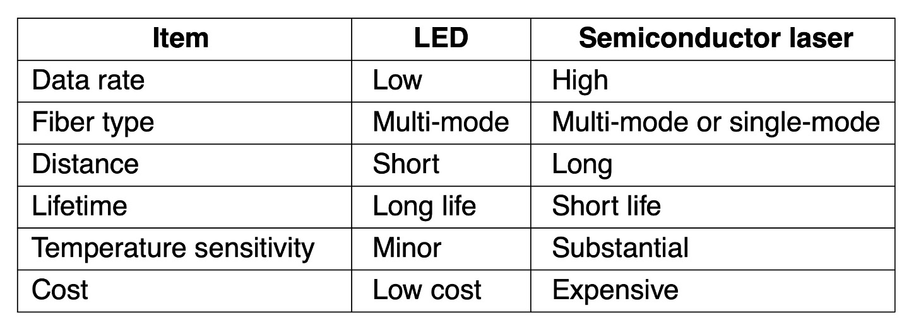

Ch2: **<u>1. Persistent storage, twisted pairs, Coaxial cable, Power lines, Fiber optics, Comparison of fiber optics with copper wire.</u>** : **Persistent Storage:** Consists of magnetic or solid-state storage, Common way to transport data: Write to persistent storage, Physically transport the tape or disks to the destination machine, Read data back again; Cost effective for applications where a high data rate or cost per bit transported is the key factor; Never underestimate the bandwidth of a station wagon full of tapes hurtling down the highway. **Twisted Pairs**: A category 5e twisted pair consists of two insulated wires gently twisted together.  Four such pairs are typically grouped in a plastic sheath to protect the wires and keep them together. **Coaxial cable**: A coaxial cable consists of a stiff copper wire as the core, surrounded by an insulating material. The insulator is encased by a cylindrical conductor, often as a closely woven braided mesh. The outer conductor is covered in a protective plastic sheath. **Power lines**: Using power lines for networking is simple.  In this case, a TV and a receiver are plugged into the wall, which must be done anyway because they need power.  Then they can send and receive movies over the electrical wiring.**Fiber optics**: Allows essentially infinite bandwidth; Must consider costs: For installation over the last mile and to move bits; Uses: {Long-haul transmission in network backbones, High-speed LANs, High-speed Internet access}; Key components: Light source, transmission medium, and detector; Transmission system uses physics; Transmission of light through fiber: {Attenuation of light through glass: {Dependent on the wavelength of the light, Defined as the ratio of input to output signal power}}; Fiber cables: Similar to coax, except without the braid; Two kinds of signaling light sources: LEDs (Light Emitting Diodes), Semiconductor lasers. <u>**Comparison of fiber optics with copper wire**</u>: Fiber advantages over copper: {Handles higher bandwidth, Not affected by power surges, electromagnetic interference, power failures, corrosive chemicals, Thin and lightweight, Do not leak light, Difficult to tap}; Fiber disadvantage: {Less familiar technology that requires specific engineering skills, Fibers damaged easily by being bent too much} **<u>2: Electromagnetic spectrum, Frequency hopping spread spectrum, direct sequence spread spectrum</u>** 

Wireless Transmission: The electromagnetic spectrum: {Modulate wave amplitude, frequency, or phase}; Frequency hopping spread spectrum: {Transmitter hops from frequency to frequency hundreds of times per second}; Direct sequence spread spectrum: {Code sequence spreads data signal over wider frequency band}; Ultra-wideband communication: {Communication sends a series of low-energy rapid pulses, varying their carrier frequencies to communicate information}.**<u>3: Radio transmission, Light transmission</u>**: Radio transmission: {Omnidirectional waves, easy to generate, travel long distances, penetrate buildings}; Microwave transmission: {Directional waves requiring repeaters, do not penetrate buildings}; Infrared transmission{Unguided waves used for short-range communication, relatively directional, cheap, easy to build, do not penetrate solid walls}; Light transmission:{Unguided optical communication}. 4**<u>: Bandwidth, Baseband transmission, Passband transmission, FDM, TDM, CDM, WDM</u>**: **Bandwidth:** Bandwidth is often a limited resource. Solution: {Use more than two signaling levels, by using four voltages we can send 2 bits at once as a single symbol, Design works as long as the signal at the receiver is sufficiently strong to distinguish the four levels, Signal rate change is half the bit rate, so the needed bandwidth has been reduced}. **Multiplexing**: {Frequency Division Multiplexing: FDM (Frequency Division Multiplexing) takes advantage of passband transmission to share a channel. It divides the spectrum into frequency bands, with each user having exclusive possession of some band in which to send a signal. In this diagram, we see three voice-grade telephone channels multiplexed using FDM. Filters limit the usable bandwidth to roughly 3100 Hz per voice-grade channel. The excess bandwidth is called a guard band. It keeps the channels well separated. First, the voice channels are raised in frequency, each by a different amount. Then they can be combined because no two channels now occupy the same portion of the spectrum. Notice that even though there are gaps between the channels thanks to the guard bands, there is some overlap between adjacent channels., Time Division Multiplexing, Code Division Multiplexing, Wavelength Division Multiplexing} Pictures. **<u>5: Structure of the telephone system, Telephone modem, DSL, FTTX, Circuit switching, packet switching</u>**: The public Switched Telephone Network: {Structure of the Telephone System, The Local Loop: Telephone Modems, ADSL, and Fiber}; **Switching** : {Phone system principal parts:{Outside plant (outside switching offices), Inside plant (inside switching offices)}; Two different switching techniques: {Circuit switching: traditional telephone system, Packet switching: voice over IP technology}}. **<u>6: Cellular network concept, 1G, 2G, 3G, 4G, 5G</u>** : Provided analog voice; digital voice{Digital advantages: {Provides capacity gains by allowing voice signals to be digitized and compressed, Improves security by allowing voice and control signals to be encrypted, Deters fraud and eavesdropping, Enables new services such as text messaging}, and both digital voice and data (Internet, email, etc.), 4G technology adds capabilities { Physical layer transmission techniques and IP-based femtocells, 4G is based on packet switching only (no circuit switching)}, 5G being rolled out now: {Supports up to 20 Gbps transmissions and denser deployments, Focus on reducing network latency} respectively. **Common Concepts: Cells**: A geographic region is divided up into **cells,** allow for frequency reuse. At the center of each cell is a base station to which all the telephones in the cell transmit. The base station consists of a computer and transmitter/receiver connected to an antenna. In a small system, all the base stations are connected to a single device called an MSC (Mobile Switching Center) or MTSO (Mobile Telephone Switching Office). In a larger one, several MSCs may be needed, all of which are connected to a second-level MSC, and so on. **<u>7: Broadband Internet access over cable:HFC Networks;  Docsis:Provides information related to modern cable network architectures</u>**. **<u>8 GEO, MEO:Used for navigation systems , LEO</u>**: **Terrestrial Access Networks: Cable, Fiber, and ADSL**: Similarities:{Comparable service and comparable prices, Use fiber in the backbone}; Differences:{Last-mile access technology at the physical and link layers, Bandwidth consistency, Cable subscribers share the capacity of a single node, Maximum speeds, Availability, Security}; **Satellites Versus Terrestrial Networks**: Communication satellites niche markets: {Rapid deployments, Places where the terrestrial infrastructure is poorly developed, When broadcasting is essential, United States has some competing satellite-based Internet providers, Satellite Internet access seeing a growing interest:In-flight Internet access}

