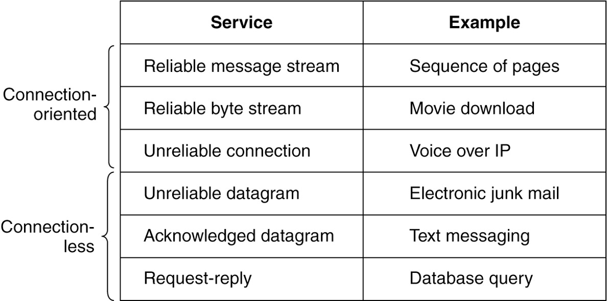

# Chapter 1 Introduction

## Chapter 1

### 1.1: Person to person communication, Electronic Commerce, The internet of things

#### 1.1.1 **Person to person communication(人和人之间的交流):** 

* Instant messaging

  即时消息

  * Allows two people to type messages at each other in real time 

    允许两个人实时向对方发送信息

* Twitter multi-persion messaging service  

  Twitter多人消息服务

  * Allows people to send short messages to their circle of friends or other followers or the whole word. 

    允许人们向他们的朋友圈或其他追随者或整个世界发送短信

* Social network applicants

  社交网络应用

  * Information flow driven by the relationships that people declare between each other.

    由人们之间声明的关系驱动的信息流

* Wiki content is a collaborative Web site the members of community edit.

  Wiki内容是一个由网站的成员进行社区编辑的协作式网站

#### 1.1.2 **Electronic Commerce**

* Online shopping and financial institution transactions follow client-server model

  网上购物和金融机构交易遵循客户-服务器模式

* Online auctions follow peer-to-peer model

  在线拍卖遵循点对点模式

  * Consumers act as buyers and sellers

    消费者既是买家又是卖家

  * Central server holds the database of products for sale

    中央服务器保存待售产品的数据库

| Tag  | Full name              | Example                                          |
| ---- | ---------------------- | ------------------------------------------------ |
| B2C  | Bussiness-to-consumer  | Ordering books online                            |
| B2B  | Bussiness-to-business  | Car manufacturer ordering tires from a supplier  |
| G2C  | Government-to-consumer | Government distributing tax forms electronically |
| C2C  | Consumer-to-consumer   | Auctioning second-hand products online           |
| P2P  | Peer-to-peer           | Music or file sharing: Skype                     |

Some forms of e-commerce have acquired little tags based on the fact that "to" and "2" are pronounced the same.

#### 1.1.3 The Internet of things 

* Ubiquitous computing

  无处不在的计算

  * Computing embedded in everyday life

    计算嵌入日常生活

  * Home security systems wired with door and window sensors

    装有门窗传感器的家庭安全系统

  * Sensors folded into a smart home monitor

    可折叠成智能家居监视器的传感器

  * Smart refrigerators

    智能冰箱

* IoT (Internet of Things) 

  IoT(物联网)

  * Sensing and communication take place over the Internet

    传感和通信通过互联网进行

  * Poised to connect every electronic device to the Internet

    准备将所有电子设备连接到互联网

* Power-line networks

  电源网络

  * Send information throughout the house over the electric wires

    通过电线将信息传送到整个房子

  

### 1.3: PAN, LAN, MAN, WAN

#### 1.3.1 PAN

PANs (Personal Area Networks) let devices communicate over the range of a person. Bluetooth is a short-range wireless network used to connect components without wires.

PANs (个人区域网络) 让设备在一个人的范围内进行通信。蓝牙(Bluetooth)是一种短距离无线网络，用于在没有电线的情况下连接组件。

### 1.3.2 LAN

The configuration on the left represents a wireless 802.11 network. The configuration on the right represents a wired switched Ethernet network.

左边的配置表示无线802.11网络。右边的配置代表一个有线交换式以太网.

#### 1.3.3 MAN

A MAN (metropolitan area network) where both television signals and the Internet are being fed into the centralized cable head-end (or cable modem termination system) for subsequent distribution to people’s homes.

城域网一种城域网，电视信号和因特网都被送入集中的电缆头端(或电缆调制解调器终端系统)，以便随后分配到人们的家中.

#### 1.3.4 WAN

This wide area network illustrates how hosts in Perth, Brisbane, and Melbourne can communicate using leased lines.

这个广域网展示了珀斯、布里斯班和墨尔本的主机如何使用租用线路进行通信.

This wide area network illustrates how hosts in Perth, Brisbane, and Melbourne can communicate via the Internet.

这个广域网展示了珀斯、布里斯班和墨尔本的主机如何通过互联网进行通信。

By using Internet connectivity instead of leasing dedicated transmission lines to connect offices, the wide area network (WAN) connections can be made between the offices as virtual links using the underlying capacity of the Internet.

通过使用因特网连接而不是租用专用传输线路来连接办公室，广域网(WAN)连接可以在办公室之间作为虚拟链路使用因特网的基础能力。

This wide area network illustrates how hosts in Perth, Brisbane, and Melbourne can communicate via an ISP.

这个广域网展示了珀斯、布里斯班和墨尔本的主机如何通过ISP进行通信。

By using a network that is operated by a commercial Internet service provider (ISP), the wide area network (WAN) connections can be made between the offices. This type of set-up may help reduce performance degradation issues that may be seen when connecting over the Internet.

通过使用由商业互联网服务提供商(ISP)运营的网络，可以在办公室之间建立广域网(WAN)连接。这种类型的设置可能有助于减少连接互联网时可能出现的性能下降问题。

### 1.4: ARPANET, NSFNET, Mobile Network Architecture

#### 1.4.1 ARPANET

The original ARPANET software was split into two parts: subnet and host. The subnet software consisted of the IMP end of the host-IMP connection, the IMP-IMP protocol, and a source IMP to destination IMP protocol designed to improve reliability.

最初的ARPANET软件被分成两个部分:子网和主机。子网软件由主机-IMP连接的IMP端、IMP-IMP协议和旨在提高可靠性的源IMP到目的IMP协议组成.

Growth of the number of nodes on ARPANET. (a) December 1969. (b) July 1970. (c) March 1971. (d) April 1972. (e) September 1972.

#### 1.4.2 NSFNET

NSFNET was a backbone network designed to be a successor to the ARPANET that would be open to all university research groups, allowing them to communicate without having to contract with the Department of Defense.

NSFNET是一个骨干网络，旨在成为阿帕网的继承者，该网络将向所有大学研究小组开放，允许他们不必与国防部签订合同就可以进行交流。

#### 1.4.3 Mobile Network Architecture

The architecture of the mobile phone network has several parts.

移动电话网络的体系结构由几个部分组成.

When a user moves out of the range of one cellular base station and into the range of another one, the flow of data must be re-routed from the old to the new cell base station.

当用户移动出一个蜂窝基站的范围，进入另一个蜂窝基站的范围时，数据流必须从旧的蜂窝基站重新路由到新的蜂窝基站.

* Packet switching comes from the Internet community

  分组交换起源于Internet社区

  * Connectionless networks

    无连接网络

  * Every packet is routed independently

    每个分组都是独立路由的

  * If some routers go down during a session, no harm will be done as long as the system can dynamically reconfigure itself 

    如果某些路由器在会话期间发生故障，只要系统能够动态地重新配置自己，就不会造成任何损害

* Circuit switching comes from telephone companies

  电路交换来自电话公司

  * Connection-oriented networks

    面向连接的网络

  * Caller must dial the called party’s number and wait for a connection before talking or sending data

    在通话或发送数据之前，主叫方必须拨打被叫号码并等待连接

  * Route maintained until call is terminated

    路由保持，直到呼叫终止

  * Can support quality of service more easily

    能否更容易地支持服务质量

* First-generation mobile phone systems

  第一代移动电话系统

  * Transmitted voice calls as continuously varying (analog) signals

    传输的语音呼叫为连续变化的(模拟)信号

  * AMPS (Advanced Mobile Phone System)

    AMPS(高级移动电话系统)

* Second-generation (2G) mobile phone systems 

  第二代(2G)移动电话系统

  * Transmitted voice calls in digital form to increase capacity, improve security, and offer text messaging

    以数字形式传输语音通话，以增加容量，提高安全性，并提供文本信息

  * GSM (Global System for Mobile communications) 

    全球移动通信系统

* Third generation (3G) offer digital voice and broadband digital data services

  第三代(3G)提供数字语音和宽带数字数据服务

* Spectrum scarcity led to today’s cellular network design

  频谱稀缺导致了今天的蜂窝网络设计

To manage the radio interference between users, the coverage area is divided into cells. 

为管理用户间的无线电干扰，将覆盖区域划分为小区。

* 4G

  * Later 4G known as LTE (Long Term Evolution) technology

    后来的4G被称为LTE(长期演进)技术

  * Offers faster speeds

    提供更快的速度

  * Emerged in the late 2000s

    出现于2000年代末

  * Quickly became the predominant mode of mobile Internet access in the late 2000s

    在2000年代末迅速成为移动互联网访问的主要模式

  * Outpacing competitors like 802.16 (WiMiMax)

    超越802.16 (WiMiMax)等竞争对手

* 5G technologies are promising faster speeds

  5G技术有望实现更快的速度

  * Up to 10 Gbps

    高达10 Gbps

  * Set for large-scale deployment in the early 2020s

    将在本世纪20年代初大规模部署

* Main distinction: frequency spectrum they rely on

  主要区别:它们所依赖的频谱

### 1.5: Design goals, Connections and reliability

#### 1.5.1 Design goals

* Reliability 可靠性

  * Make a network operate correctly even though it is comprised of a collection of components that are themselves unreliable

    使网络正确地运行，即使它是由一组本身不可靠的组件组成的

    * Error detection finds errors in received information

      错误检测发现接收到的信息存在错误

    * Error correction corrects a message by recovering the possibly incorrect bits

      错误纠正通过恢复可能不正确的位来纠正消息
  
  * Find a working path through a network using routing

    使用路由找到通过网络的工作路径

    * Routing allows network to automatically make the decision

      路由允许网络自动做出决策

* Resource allocation 资源分配

  * Scalable designs continue to work well when network gets large

    当网络变得越来越大时，可扩展的设计仍然可以很好地工作

  * Statistical multiplexing: sharing based on the statistics of demand

    统计复用:根据需求的统计进行共享

* An allocation problem that occurs at every level

  每个层次上都存在的分配问题

  * Keeping a fast sender from swamping a slow receiver with data

    避免快速的发送端用数据淹没慢速的接收端

  * Use flow control

    使用流程控制

* Congestion problem

  拥塞问题

  * Occurs when too many computers want to send too much traffic, and the network cannot deliver it all

    当太多计算机想要发送太多流量，而网络无法全部传输时发生

* Quality of service reconciles competing demands

  服务质量协调相互竞争的需求

* Evolvability 可发展性

  * Design issue concerns the evolution of the network

    设计问题涉及网络的演化

  * Over time, networks grow larger and new designs emerge that need to be connected to the existing network

    随着时间的推移，网络变得越来越大，新的设计需要连接到现有的网络

  * Use protocol layering structuring mechanism to support change by dividing the overall problem and hiding implementation details

    通过划分整体问题并隐藏实现细节，使用协议分层结构机制来支持更改

  * Use addressing or naming mechanism to identify the senders and receivers involved in a particular message

    使用寻址或命名机制来识别特定消息中涉及的发送者和接收者

  * Different network technologies often have different limitations

    不同的网络技术通常有不同的局限性

  * Overall topic is called internetworking

    总体主题是“网络互联”

* Security

  * Confidentiality mechanisms defend against eavesdropping on communications

    保密机制可以防止通信被窃听

  * Authentication mechanisms prevent someone from impersonating someone else

    身份验证机制可以防止冒充他人

  * Integrity mechanisms prevent surreptitious changes to messages

    完整性机制可以防止对消息的秘密更改

#### 1.5.2 Connections and Reliability

* Connection-oriented service 

  面向连接的服务

  * Modeled after the telephone system

    模仿电话系统

  * Service user first establishes a connection, uses the connection, and then releases the connection

    服务用户首先建立连接，使用连接，然后释放连接

  * Can conduct a negotiation about the parameters to be used

    可以协商要使用的参数

* Connectionless service

  无连接服务

  * Modeled after the postal system

    模仿邮政系统

  * Packet is a message at the network layer

    包是网络层的消息

  * Store-and-forward switching: intermediate nodes receive a message in full before sending it on to the next node

    存储转发交换:中间节点在将消息发送给下一个节点之前完整地接收消息

  * Cut-through switching: transmission of a message at a node starts before it is completely received by the node

    直通切换(Cut-through switching):在消息被节点完全接收之前，该节点就开始传输消息

  * Datagram service: Unreliable (not acknowledged) connectionless service

    数据报服务:不可靠(未得到确认)的无连接服务

* Reliability characterizes connection-oriented and connectionless services

  可靠性是面向连接和无连接服务的特征

Six common connection-oriented and connectionless services.

六种常见的面向连接和无连接服务.

### 1.6: OSI reference model, TCP/IP reference model, critique of the both models

* The OSI Reference Model

  OSI参考模型

* The TCP/IP Reference Model

   TCP/IP参考模型

  * The Link Layer 

    链接层

  * The Internet Layer

    互联网层

  * The Transport Layer

    传输层

  * The Application Layer

    应用层

* A critique of the OSI model and protocols

  OSI模型和协议的评论

* Critique of the TCP/IP reference model and protocols

  TCP/IP参考模型和协议的评论

* The model used in this book

  本书中使用的模型

#### 1.6.1 OSI reference model

* Principles for the seven layers

  这7层的原则

  * Layers created for different abstractions

    为不同的抽象创建层

  * Each layer performs well-defined function

    每一层都执行定义良好的功能

  * Function of layer chosen with definition of international standard protocols in mind

    选择层的功能时考虑到国际标准协议的定义

  * Minimize information flow across interfaces between boundaries

    最小化边界之间的信息流动

  * Number of layers should be optimum

    层数应该是最优的

* Three concepts central to the OSI model:

  OSI模型的三个核心概念

  * Services 服务
  * Interfaces 接口
  * Protocols 协议

The OSI model has seven layers.

OSI模型有7层.

#### 1.6.2 TCP/IP reference model

* The Link Layer

  链接层

  * Lowest layer in the model

    模型的最底层

  * Describes what links must do to meet the needs of this connectionless internet layer

    描述了链路必须做什么才能满足无连接的internet层的需求

* The Internet Layer

  互联网层

  * Permits hosts to inject packets into any network and have them travel independently to the destination

    允许主机向任何网络注入数据包，并让它们独立地到达目的地

  * Defines an official packet format and protocol called IP (Internet Protocol)

    定义了一种称为IP (Internet protocol)的官方数据包格式和协议

  * Defines a companion protocol called ICMP (Internet Control Message Protocol) that helps IP function

    定义了一个名为ICMP (Internet Control Message protocol)的伴生协议，帮助实现IP功能

* The Transport Layer

  传输层

  * The layer above the internet layer in the TCP/IP model

    TCP/IP模型中高于internet层的一层

  * Uses two end-to-end transport protocols

    使用两个端到端传输协议

* TCP (Transmission Control Protocol)

  TCP(传输控制协议)

* UDP (User Datagram Protocol)

  UDP(用户数据报协议)

* The Application Layer

  应用层

  * Contains all the higher-level protocols

    包含所有高级协议

The TCP/IP layers loosely align with the OSI model.

TCP/IP层松散地与OSI模型保持一致.

The relation of IP, TCP, and UDP protocols are illustrated. We will study these.

述了IP、TCP和UDP协议之间的关系。我们会研究这些.

#### 1.6.3 critique of the both models

* Bad timing

  糟糕的时机

  * Competing TCP/IP protocols were already in widespread use

    相互竞争的TCP/IP协议已经被广泛使用

* Bad design

  糟糕的设计

  * Both the model and the protocols are flawed

    模型和协议都有缺陷

* Bad implementations

  糟糕的实现

  * Initial implementations were huge, unwieldy, and slow

    最初的实现是巨大的，笨重的，缓慢的

* Bad politics

  糟糕的政治

  * Widely thought to be the creature of the European telecommunication ministries, the European Community, and later the U.S. Government

    被广泛认为是欧洲电信部门、欧洲共同体以及后来的美国政府的产物

It is essential that the standards be written in the trough in between the two ‘‘elephants.’’ If they are written too early (before the research results are well established), the subject may still be poorly understood; the result is a bad standard. If they are written too late, so many companies may have already made major investments in different ways of doing things that the standards are effectively ignored. If the interval between the two elephants is very short (because everyone is in a hurry to get started), the people developing the standards may get crushed.

重要的是，这些标准应该写在两个“大象”之间的槽中。“如果他们写得太早(在研究结果得到充分确立之前)，这个主题可能仍然不被理解;结果是一个糟糕的标准。如果制定得太晚，那么许多公司可能已经在不同的做事方式上进行了大量投资，而这些标准实际上被忽略了。如果两头大象之间的时间间隔很短(因为每个人都急于开始)，开发标准的人可能会感到崩溃。

* Model does not clearly distinguish the concepts of services, interfaces, and protocols

  Model没有明确区分服务、接口和协议的概念

* Model is not at all general

  Model一点也不通用

  * Poorly suited to describing any other protocol stack

    不适合描述任何其他协议栈

* The link layer is not really a layer at all in the normal sense of the term

  链接层根本不是通常意义上的层

* Model does not distinguish between the physical and data link layers

  Model不区分物理层和数据链路层

* Other protocol implementations were distributed free

  其他协议实现是免费发布的

### 1.8: Policy, legal and social issues

政策、法律和社会问题

* Online speech

  在线演讲

  * Communications Decency Act protects some platforms from federal criminal prosecution

    《通信体面法》保护一些平台免受联邦刑事起诉

  * DMCA takedown notices (after the Digital Millennium Copyright Act) threaten legal action

    DMCA下架通知(在Digital Millennium Copyright Act之后)威胁要采取法律行动

* Net neutrality

  网络中立性

  * ISPs should provide equal quality of service to a given type of application traffic, regardless of who is sending that content

    无论谁发送内容，isp都应该为给定类型的应用流量提供同等质量的服务

  * No blocking, no throttling, no paid prioritization, transparency

    无阻塞，无节流，无付费优先级，透明

  * Does not prevent an ISP from prioritizing any traffic

    不阻止ISP对任何流量进行优先级设置

  * Zero rating: ISP might charge its subscribers according to data usage but grant an exemption for a particular service

    零费率:ISP可能会根据用户的数据使用情况收取费用，但对特定服务给予豁免

* Online speech

  在线演讲

  * Communications Decency Act protects some platforms from federal criminal prosecution

    《通信体面法》保护一些平台免受联邦刑事起诉

  * DMCA takedown notices (after the Digital Millennium Copyright Act) threaten legal action

    DMCA下架通知(在Digital Millennium Copyright Act之后)威胁要采取法律行动

* Security

  安全

  * DDoS (Distributed Denial of Service) attack

    DDoS(分布式拒绝服务)攻击

  * Botnets

    僵尸网络

  * Spam email

    垃圾邮件

  * Phishing

    钓鱼

* Privacy

  隐私

  * Profiling and tracking users by collecting data about their network behavior over time

    通过收集用户一段时间内的网络行为数据来分析和跟踪用户

  * Storing cookies in Web browser

    在浏览器中存储cookie

  * Browser fingerprinting

    浏览器指纹

  * Mobile services location privacy

    移动服务位置隐私

* Disinformation

  造谣

  * Ill-considered, misleading, or downright wrong information

    欠考虑的、误导性的或完全错误的信息

  * Fake news

    假新闻

  * Challenges

    挑战

    * How does one define disinformation in the first place?

      首先如何定义虚假信息?

    * Can disinformation be reliably detected?

      可以可靠地检测虚假信息吗?

    * What should a network or platform operator do about it once it is detected

      一旦检测到它，网络或平台运营商应该做什么

