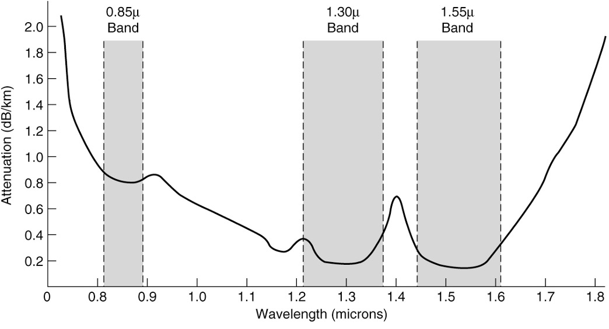
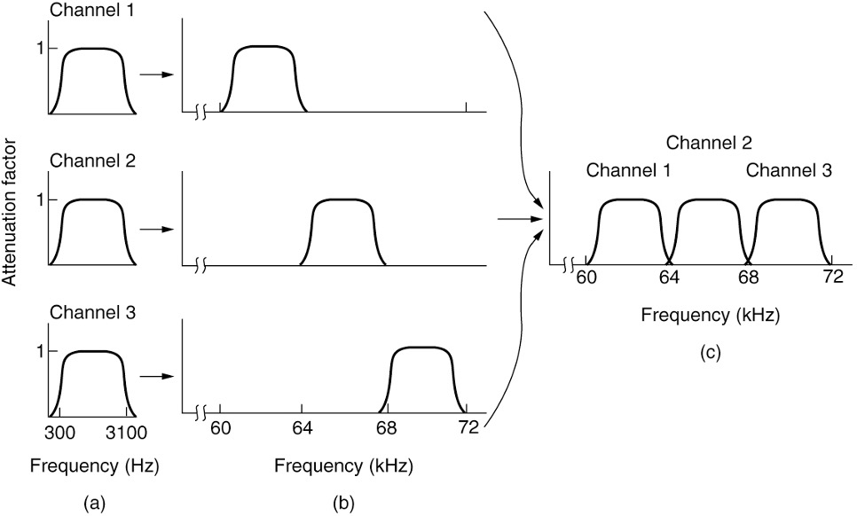
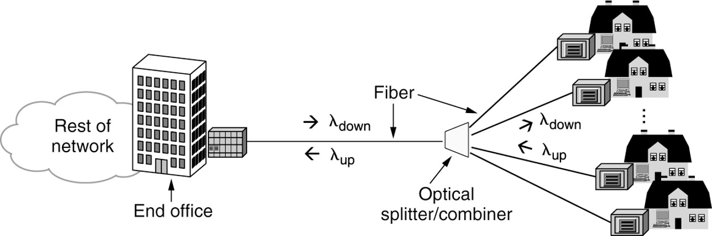

#Chapter 2 The Physical Layer

## Chapter 2 The Physical Layer

### 2.1 Persistent storage, twisted pairs, Coaxial cable, Power lines, Fiber optics, Comparison of fiber optics with copper wire

#### 2.1.1 Persistent Storage

* Consists of magnetic or solid-state storage

  由磁性或固态存储器组成

* Common way to transport data

  传输数据的常用方法

  * Write to persistent storage

    写入持久存储

  * Physically transport the tape or disks to the destination machine

    物理地将磁带或磁盘传输到目标机器

  * Read data back again

    再次读取数据

* Cost effective for applications where a high data rate or cost per bit transported is the key factor

  对于高数据速率或每比特传输成本是关键因素的应用程序而言，成本效益是关键

* Never underestimate the bandwidth of a station wagon full of tapes hurtling down the highway

  永远不要低估一辆满载磁带的旅行车在高速公路上飞驰的带宽. 

#### 2.1.2 **Twisted Pairs**


A category 5e twisted pair consists of two insulated wires gently twisted together.  Four such pairs are typically grouped in a plastic sheath to protect the wires and keep them together. 

5e类双绞线由两根绝缘电线轻轻绞合而成。四对这样的电线通常被组合在一个塑料护套中，以保护电线并使它们保持在一起。

#### 2.1.3 Coaxial cable 


A coaxial cable consists of a stiff copper wire as the core, surrounded by an insulating material. The insulator is encased by a cylindrical conductor, often as a closely woven braided mesh. The outer conductor is covered in a protective plastic sheath.

同轴电缆由一根硬铜线作为芯线，周围环绕一层绝缘材料。绝缘体由圆柱形导体包裹，通常是紧密编织的编织网。外导体被一层塑料护套所覆盖。

#### 2.1.4 Power lines 


Using power lines for networking is simple.  In this case, a TV and a receiver are plugged into the wall, which must be done anyway because they need power.  Then they can send and receive movies over the electrical wiring.

使用电力线进行网络连接很简单。在这种情况下，电视和接收器插在墙上，无论如何都必须这样做，因为它们需要电力。然后他们可以通过电线发送和接收电影。


#### 2.1.5 Fiber optics

* Allows essentially infinite bandwidth

  允许无限带宽

* Must consider costs

  必须考虑成本

  * For installation over the last mile and to move bits

    用于安装最后一英里和移动位

* Uses

  * Long-haul transmission in network backbones

    网络骨干网中的长距离传输

  * High-speed LANs

    高速局域网

  * High-speed Internet access

    高速互联网接入

* Key components

  关键部件

  * Light source, transmission medium, and detector

    光源、传输介质和探测器

* Transmission system uses physics

  传输系统使用物理原理


Figure (a) illustrates a light ray inside a silica fiber impinging on the air/silica boundary at different angles. Figure (b) illustrates light trapped by total internal reflection.

图(a)说明了硅光纤内的光线以不同角度撞击空气/硅边界。图(b)说明了被全内反射捕获的光。


* Transmission of light through fiber

  通过光纤传输光

  * Attenuation of light through glass

    光通过玻璃的衰减

    * Dependent on the wavelength of the light 

      依赖于光的波长

    * Defined as the ratio of input to output signal power

      定义为输入输出信号功率之比

* Fiber cables

  光纤

  * Similar to coax, except without the braid

    类似于coax，只是没有辫子

* Two kinds of signaling light sources

  两种信号光源

  * LEDs (Light Emitting Diodes)

    led(发光二极管)

  * Semiconductor lasers

    半导体激光器



Attenuation of light through fiber in the infrared region is measured in units of decibels (dB) per linear kilometer of fiber. 

光在红外区域通过光纤的衰减是以每直线千米光纤的分贝(dB)为单位来测量的。


Views of a fiber cable

光纤的外观


A comparison of semiconductor diodes and LEDs as light sources.

半导体二极管和发光二极管作为光源的比较。

#### ==2.1.6 Comparison of fiber optics with copper wire==

* Fiber advantages over copper

  光纤优于铜

  * Handles higher bandwidth

    处理更高的带宽

  * Not affected by power surges, electromagnetic interference, power failures, corrosive chemicals

    不受电涌、电磁干扰、电源故障、腐蚀性化学品影响

  * Thin and lightweight

    轻薄

  * Do not leak light

    不要漏光

  * Difficult to tap

    难以点击

* Fiber disadvantage

  纤维的缺点

  * Less familiar technology that requires specific engineering skills 

    不太熟悉的技术，需要特定的工程技能

  * Fibers damaged easily by being bent too much

    过度弯曲容易损坏纤维

### 2.2: Electromagnetic spectrum, Frequency hopping spread spectrum, direct sequence spread spectrum

Wireless Transmission:

* The electromagnetic spectrum 

  电磁频谱

  * Modulate wave amplitude, frequency, or phase

    调制波的振幅、频率或相位

* Frequency hopping spread spectrum

  跳频扩频

  * Transmitter hops from frequency to frequency hundreds of times per second

    发射机每秒从一个频率跳到另一个频率数百次

* Direct sequence spread spectrum

  直接序列扩频

  * Code sequence spreads data signal over wider frequency band

    码序列将数据信号扩展到更宽的频带

* Ultra-wideband communication

  超宽频通讯

  * Communication sends a series of low-energy rapid pulses, varying their carrier frequencies to communicate information

    通信发送一系列低能量的快速脉冲，改变它们的载波频率来通信信息


#### 2.2.1 The Electromagnetic Spectrum 


The electromagnetic spectrum and its uses for communication.

电磁频谱及其通信用途

#### 2.2.2 Direct Sequence Spread Spectrum 


Direct sequence spread spectrum uses a code sequence to spread the data signal over a wider frequency band. 

直接序列扩频使用码序列将数据信号扩展到更宽的频带。

> 技术（FHSS）的工作原理。
>
> 假设有一个时间轴表示通信的时间，从左到右。在这个时间轴上，我们有一组频率通道，表示为频率1、频率2、频率3等等。现在让我们模拟A单位和B单位之间的FHSS通信：
>
> ```lua
> luaCopy code
> 时间轴： |------|------|------|------|------|------|------|------|------|------|------
> 频率通道：|  1  |  2  |  3  |  1  |  2  |  3  |  1  |  2  |  3  |  1  |  2  |
> ```
>
> - 在第一个时间段，A单位选择频率1进行通信，B单位在相同的时间段上设置为接收频率1。
> - 在下一个时间段，A单位切换到频率2，B单位也调整到频率2。
> - 然后，在接下来的时间段，A单位跳到频率3，B单位也在同一时间段上设置为频率3。
> - 这个过程一直循环，按照预定的频率序列，A单位和B单位始终知道彼此在哪个频率上进行通信。
>
> 这种频率跳跃的过程发生得非常迅速，以至于对于外部观察者来说，很难跟踪或干扰通信。这就是FHSS技术的工作原理，通过不断地在不同频率之间跳跃，提高了通信的安全性和抗干扰性.

> 假设有两台无线设备，A和B，它们要在一个拥挤的无线网络环境中进行通信。为了提高通信的可靠性和抗干扰性，它们采用了DSSS技术。
>
> 1. **数据扩展：** 设备A要传输一串二进制数据，例如10101010。为了使用DSSS，它会使用一个扩频码来将这些数据进行扩展。假设扩频码是11001100。设备A将原始数据与扩频码进行按位异或运算，得到扩展后的数据：10101010 ⊕ 11001100 = 01100110。
> 2. **发送端：** 设备A将扩展后的数据01100110传输到设备B。在传输过程中，这个扩展后的数据信号占用了更宽的频谱带宽。
> 3. **接收端：** 设备B知道与设备A使用的扩频码相对应的码，并使用相同的码来解扩接收到的信号。在这个例子中，设备B使用相同的扩频码11001100来解扩接收到的信号01100110。解扩后的数据为01100110 ⊕ 11001100 = 10101010，与设备A最初发送的数据完全相同。
>
> 这个过程说明了DSSS技术的工作原理。通过使用扩频码来扩展数据信号，通信设备可以提高通信的抗干扰性，因为信号在更宽的频谱带宽上分散，对于窄带干扰和噪声更具抵抗力。这种技术在无线通信中被广泛应用，特别是在Wi-Fi网络中，以提高数据传输的可靠性和性能。

> 超宽带通信（Ultra-Wideband Communication，UWB）是一种无线通信技术，它使用非常宽的频谱带宽来传输数据。相比于传统的无线通信技术，UWB信号具有极高的带宽，允许以非常短的脉冲（时间很短的信号）来传输信息。这种特性使得UWB在短距离、高数据速率、定位精度和抗干扰性等方面具有独特的优势。
>
> 以下是一个简单的示例，说明超宽带通信的应用：
>
> **实时定位系统：** 假设你使用UWB技术来构建一个实时定位系统，例如用于室内导航或物品跟踪。在这个系统中，你安装了一组UWB基站或节点，这些基站会发射极短脉冲的UWB信号，这些脉冲信号在时间上非常短暂，但在频率上非常宽广。
>
> - **标签设备：** 你的目标设备是一个UWB标签，例如一部装有UWB芯片的智能手机或物品跟踪器。这个标签设备会接收来自各个UWB基站的脉冲信号，并记录每个信号到达的时间。
> - **定位计算：** 通过测量来自不同基站的脉冲信号的到达时间差，标签设备可以计算出自己相对于这些基站的距离。这些距离信息可以用来三角定位，确定标签设备的精确位置。由于UWB信号的极高时间分辨率，定位精度非常高，通常可以达到数厘米的级别。
> - **实时追踪：** 标签设备不断地接收来自基站的UWB信号，因此可以实时跟踪自己的位置，并在室内环境中实现高精度的定位。这在室内导航、仓储管理、智能家居和虚拟现实等应用中非常有用。
>
> 总之，超宽带通信是一种利用极高带宽的信号进行数据传输和定位的技术。它具有高数据速率、高定位精度和强抗干扰性等特点，可以应用于各种领域，包括定位、通信、雷达、物品跟踪和无线传感器网络等。

### 2.3: Radio transmission, Light transmission

* Radio transmission

  无线电传输

  * Omnidirectional waves, easy to generate, travel long distances, penetrate buildings

    全向波，容易产生，传播距离远，穿透建筑物

* Microwave transmission

  微波传输

  * Directional waves requiring repeaters, do not penetrate buildings

    定向波需要中继器，不能穿透建筑物

* Infrared transmission

  红外传输

  * Unguided waves used for short-range communication, relatively directional, cheap, easy to build, do not penetrate solid walls

    非导波用于短程通信，相对定向，便宜，易于建造，不穿透坚固的墙壁

* Light transmission

  光传输

  * Unguided optical communication

    无制导光通信


#### 2.3.1 Radio transmission


In the VLF, LF, and MF bands, radio waves follow the curvature of the earth. In the HF band, they bounce off the ionosphere.

在VLF、LF和MF波段，无线电波沿着地球的曲率运动。在高频波段，它们在电离层反弹。


#### 2.3.2 Light transmission


Convection currents can interfere with laser communication systems. A bidirectional system with two lasers is pictured here.

对流会干扰激光通信系统。一个双向系统有两个激光器在这里被描绘。


### 2.4: Bandwidth, Baseband transmission, Passband transmission, FDM, TDM, CDM, WDM

### 2.4.1 Bandwidth

* Bandwidth means different things to electrical engineers and to computer scientists. 

  带宽对于电子工程师和计算机科学家来说意味着不同的东西。

* To electrical engineers, (analog) bandwidth is a quantity measured in Hz. The hertz is equivalent to one cycle per second.

  对电气工程师来说，(模拟)带宽是一个以Hz测量的量。赫兹等于每秒一个周期。

* To computer scientists, (digital) bandwidth is the maximum data rate of a channel, a quantity measured in bits/sec. 

  对计算机科学家来说，(数字)带宽是信道的最大数据速率，以比特/秒来衡量。

* That data rate is the end result of using the analog bandwidth of a physical channel for digital transmission, and the two are related

  数据速率是使用物理信道的模拟带宽进行数字传输的最终结果，两者是相关的

  

* Bandwidth is often a limited resource

  带宽通常是一种有限的资源

* Solution

  * Use more than two signaling levels

    使用两个以上的信号级别

  * By using four voltages we can send 2 bits at once as a single symbol

    通过使用四种电压，我们可以一次发送两个比特作为一个符号

  * Design works as long as the signal at the receiver is sufficiently strong to distinguish the four levels

    只要接收器的信号足够强，可以区分这四个等级，设计就可以工作

  * Signal rate change is half the bit rate, so the needed bandwidth has been reduced

    信号速率的变化是比特率的一半，因此所需的带宽也减少了

#### 2.4.2 Baseband transmission


Line codes: (a) Bits, (b) NRZ, (c) NRZI, (d) Manchester, (e) Bipolar or AMI.

线路码:(a)比特，(b) NRZ， (c) NRZI， (d)曼彻斯特，(e)双极或AMI。


#### 2.4.3 Passband Transmission


(a) A binary signal. (b) Amplitude shift keying. (c) Frequency shift keying. (d) Phase shift keying.

(a)二进制信号。(b)幅度键控。(c)频移键控。(d)相移键控。

当我们讨论数字或模拟通信时，Baseband transmission（基带传输）和 Passband transmission（通带传输）是两种主要的信号传输方式。以下是它们之间的主要区别的详细介绍：

1. **定义**:
   - **基带传输 (Baseband transmission)**: 这是当信号的频率范围从0 Hz开始并扩展到最大频率，例如f_max的传输。基带信号是没有进行频率转移的原始信号。
   - **通带传输 (Passband transmission)**: 在这种传输中，基带信号被移至另一个频率范围，称为通带或载波频率范围。这是通过使用载波信号和调制技术完成的。
2. **传输介质**:
   - **基带传输**: 通常使用双绞线，如Ethernet。
   - **通带传输**: 通常使用无线通信、光纤或同轴电缆。
3. **带宽**:
   - **基带传输**: 使用的是整个可用带宽，而不是分隔为多个通道。
   - **通带传输**: 只使用特定的带宽范围，允许多个通道在相同的物理介质上同时传输。
4. **调制**:
   - **基带传输**: 不需要调制和解调进程。
   - **通带传输**: 需要调制技术将信号移至特定的频率范围，然后在接收端需要解调。
5. **应用**:
   - **基带传输**: 通常用于局域网(LAN)中的数字数据传输。
   - **通带传输**: 用于广域网(WAN)，如电话系统、无线通信和电视广播。
6. **干扰和噪音**:
   - **基带传输**: 更容易受到干扰。
   - **通带传输**: 由于调制，它可以更有效地抵抗干扰和噪音。
7. **距离**:
   - **基带传输**: 由于衰减，适用于较短的距离。
   - **通带传输**: 可以覆盖更长的距离。

总的来说，基带传输和通带传输都有其优点和缺点，选择哪种方式取决于特定的应用和需求.

#### 2.4.4 Multiplexing

复用

* Frequency Division Multiplexing

  频分复用

* Time Division Multiplexing

  时分多路复用

* Code Division Multiplexing

  代码分复用

* Wavelength Division Multiplexing

  波分复用


##### 2.4.4.1 Frequency Division Multiplexing



(a) The original bandwidths. (b) The bandwidths raised in frequency. (c) The multiplexed channel.

(a)原始带宽。(b)频带增加。(c)多路复用信道。


##### 2.4.4.2 Time Division Multiplexing


Time Division Multiplexing (TDM)

时分复用

1. **Inputs**: Three separate data inputs are labeled as 1, 2, and 3. These represent different data sources that need to be transmitted over a single communication channel.**Round-robin TDM multiplexer**: This device takes the three data sources and combines them into a single data stream. It does this in a round-robin fashion, meaning it takes turns selecting from each data source. As indicated in the image, the sequence it follows is 2, 1, 3.**Output Sequence**: The multiplexer's output is a combined data stream that sequences data from each source in the order 2, 1, 3. This sequence repeats over time, allowing each data source to get an equal opportunity to transmit its data.**Guard Time**: In between each set of data slots, there is a brief period called the guard time. This is a small interval used to prevent overlap or interference between data slots. It ensures that there's a clear separation between data from different sources. The diagram also indicates an unused slot at the end (represented by a crossed-out box). This could imply that there was no data available from any source at that time, or it could represent a damaged or lost slot.

##### 2.4.4.3 Code Division Multiplexing


(a) Chip sequences for four stations. (b) Signals the sequences represent. (c) Six examples of transmissions. (d) Recovery of station C’s signal.

(a)四个台站的芯片序列。(b)表示序列。(c)六个传输实例。(d)恢复C站的信号。


##### 2.4.4.4 Wavelength Division Multiplexing


Wavelength division multiplexing

波分复用


### 2.5 Structure of the telephone system, Telephone modem, DSL, FTTX, Circuit switching, packet switching

The public Switched Telephone Network

公用交换电话网

* Structure of the Telephone System

  电话系统结构

* The Local Loop: Telephone Modems, ADSL, and Fiber
  
  本地环路:电话调制解调器、ADSL和光纤
  
  * Telephone modems
  
    电话调制解调器


#### 2.5.1 Structure of the telephone system


(a) Fully interconnected network.  (b) Centralized switch.  (c) Two-level hierarchy.

(a)全互联网络。(b)集中式切换。(c)两级等级。


A typical circuit route for a long-distance call

长途电话的典型线路

Telephone System components: 

* Local loops (analog twisted pairs between end offices and local houses and businesses).

  本地环路(末端办公室与本地房屋和企业之间的模拟双绞线)

* Trunks (very high-bandwidth digital fiber-optic links connecting the switching offices).

  中继(连接交换局的高带宽数字光纤链路)。

* Switching offices (where calls are moved from one trunk to another either electrically or optically).

  交换局(将呼叫从一个干线转移到另一个干线，无论是电还是光)。


The local loop: Local Telephone Modems, ADSL, and Fiber

##### 2.5.1.1 Telephone Modems


A device that converts between a stream of digital bits and an analog signal that represents the bits is called a **modem.** The use of both analog and digital transmission for a computer-to-computer call. Conversion is done by the modems and codecs.

在数字比特流和表示比特流的模拟信号之间进行转换的设备称为调制解调器。

使用模拟和数字两种传输方式进行计算机对计算机的呼叫。转换由调制解调器和编解码器完成。

**Computer**: The user's computing device.**Modem**: Converts the computer's digital signals into analog signals for transmission over analog phone lines, and vice versa.**Local loop (analog)**: The phone line from the user's home to the local telephone exchange. Typically analog.**Codec**: A device that converts analog signals into digital signals and vice versa.**End office**: The local telephone exchange.**Trunk (digital, fiber)**: High-capacity digital communication lines, often fiber-optic.**Digital line & Analog line**: Types of communication lines connecting to ISPs.**ISP 1 & ISP 2**: Internet Service Providers, the companies that provide internet connectivity to users.

##### 2.5.1.2 Digital Subscriber Lines (DSL)


A typical ADSL equipment configuration. 

典型的ADSL设备配置。

1. **Telephone company end office**: Where the customer's line is connected and where voice and data services are processed.**Voice switch**: Directs voice calls to the appropriate destination.**Codec**: Converts voice signals between digital and analog.**Splitter**: Separates voice (telephone) and data (internet) signals.**DSLAM (Digital Subscriber Line Access Multiplexer)**: Aggregates multiple customer ADSL connections and connects them to the ISP.**To ISP**: The connection from the DSLAM to the Internet Service Provider.**Telephone line**: The physical line that connects the customer's house to the telephone company's end office.**NID (Network Interface Device)**: The point where the external line enters the customer's premises.**Splitter at home**: Similar to the splitter in the end office, it separates voice and data signals.**Telephone**: The device for voice communication.**ADSL modem**: Converts data signals between the DSL format on the telephone line and the Ethernet format used by computers. **Ethernet**: A type of local area network used to connect devices in close proximity.**Computer**: The user's device to access the internet.

##### 2.5.1.3 Fiber To The X (FTTX)



Passive optical network for Fiber To The Home.

无源光网络用于光纤到家庭。


#### 2.5.2 Switching 

* Phone system principal parts

  电话系统主要部件

  * Outside plant (outside switching offices)

    工厂外(交换室外)

  * Inside plant (inside switching offices)

    厂房内(开关室内)

* Two different switching techniques

  两种不同的切换技术

  * Circuit switching: traditional telephone system

    电路交换:传统的电话系统

  * Packet switching: voice over IP technology

    分组交换:voip技术


##### 2.5.2.1 Circuit switching


(a) Circuit switching. (b) Packet switching.

(a)电路切换。(b)分组交换。


##### 2.5.2.2 Packet switching

 

A comparison of circuit-switched and packet-switched networks.

电路交换和分组交换网络的比较。


### 2.6: Cellular network concept, 1G, 2G, 3G, 4G, 5G

#### 2.6.1 Cellular networks

* Mobile phone distinct generations

  手机有不同的世代

* The initial three generations: 1G, 2G, 3G

  最初的三代:1G、2G、3G

  * Provided **analog** voice, **digital** voice, and **both** digital voice and data (Internet, email, etc.) respectively

    提供**模拟**语音，**数字**语音，以及**同时提供**数字语音和数据(互联网，电子邮件等)

* 4G technology adds capabilities

  4G技术增加了功能

  * Physical layer transmission techniques and IP-based femtocells

    物理层传输技术和基于ip的家庭基站

  * 4G is based on **packet switching** only (no circuit switching)

    4G仅基于**分组交换**(没有电路交换)

* 5G being rolled out now

  5G正在推出

  * Supports up to 20 Gbps transmissions and denser deployments

    支持高达20 Gbps的传输和更密集的部署

  * Focus on reducing network latency

    专注于减少网络延迟


**Common Concepts: Cells**

A geographic region is divided up into **cells,** allow for frequency reuse

一个地理区域被划分为**单元格**，允许频率重用


(a) Frequencies are not reused in adjacent cells. (b) To add more users, smaller cells can be used.

(a)相邻小区不重复使用频率。(b)为了增加更多的用户，可以使用更小的小区。


**Common Concepts: Cells**

**常见概念:单元格**

At the center of each cell is a base station to which all the telephones in the cell transmit. 

在每个小区的中心是一个基站，小区里所有的电话都向它传输。

The base station consists of a computer and transmitter/receiver connected to an antenna. 

基站由一台计算机和连接到天线的发射机/接收机组成。

In a small system, all the base stations are connected to a single device called an **MSC** (**Mobile Switching Center**) or **MTSO** (**Mobile Telephone Switching Office**). 

在一个小型系统中，所有基站都连接到一个叫做**MSC**(**移动交换中心**)或**MTSO**(**移动电话交换办公室**)的设备上。

In a larger one, several MSCs may be needed, all of which are connected to a second-level MSC, and so on. 

在一个更大的系统中，可能需要多个MSC，所有这些MSC都连接到一个二级MSC，以此类推。


#### 2.6.2 **First-Generation (1G) Technology: Analog Voice**

* 1946 push to talk systems

  1946 push to talk系统

* 1960 IMTS (Improved Mobile Telephone System)

  1960年IMTS(改进的移动电话系统)

  * Two frequencies: one for sending, one for receiving

    两个频率:一个用于发送，一个用于接收

* 1983 AMPS (Advanced Mobile Phone System)

  1983 AMPS(高级移动电话系统)

  * Analog mobile phone system

    模拟手机系统

  * Cells are typically 10 to 20 km across

    电池的直径通常为10到20公里

  * Used FDM to separate channels

    使用FDM分离通道


**Call Management**

* Outgoing calls

  呼出电话

  * Phone switched on, number entered, CALL button hit

    手机开机，号码输入，呼叫按钮按下

  * Phone transmits called number and its own identity on the access channel

    手机在接入信道上传输被叫号码和自己的身份

  * Base informs the MSC and MSC looks for a channel for the call

    Base通知MSC, MSC寻找呼叫的通道  MSC(Mobile Switching Center)

* Incoming calls

  来电

  * Idle phones continuously listen to the paging channel to detect messages directed at them

    闲置的电话会持续监听寻呼频道，以侦测发给他们的讯息

  * Packet sent to base station in the current cell as a broadcast on the paging channel

    通过寻呼信道以广播形式发送到当前小区基站的数据包

  * The called phone responds on the access channel

    被呼叫的电话在接入通道上响应

  * Called phone switches to channel and starts ringing sound

    被呼叫的电话切换到频道并开始响起铃声


#### 2.6.3 **Second-Generation (2G) Technology: Digital Voice**

第二代(2G)技术:数字语音

* Digital advantages

  数字优势

  * Provides capacity gains by allowing voice signals to be digitized and compressed

    通过允许语音信号被数字化和压缩来提供容量增益

  * Improves security by allowing voice and control signals to be encrypted

    通过允许语音和控制信号加密来提高安全性

  * Deters fraud and eavesdropping

    阻止欺诈和窃听

  * Enables new services such as text messaging

    启用新的服务，如短信

* Three systems developed

  开发了三个系统

  * D-AMPS (Digital Advanced Mobile Phone System)

    D-AMPS(数字先进移动电话系统)

  * GSM (Global System for Mobile communications)

    GSM(全球移动通信系统)

  * CDMA (Code Division Multiple Access)

    CDMA(码分多址)


**GSM: The Global System for Mobile Communications (1 of 3)**


GSM mobile network architecture.

GSM移动网络体系结构


#### 2.6.4 Third-Generation (3G) Technology: Digital Voice and Data


Soft handoff (a) before, (b) during, and (c) after.

软切换(a)前，(b)中，(c)后。


#### 2.6.5 Fourth-Generation (4G) Technology: Packet Switching

**第四代(4G)技术:分组交换**

* Also called IMT Advanced

  也叫IMT Advanced

* Based completely on packet-switched technology

  完全基于分组交换技术

* EPC (Evolved Packet Core) allows packet switching

  EPC(演化包核心)允许分组交换

  * Carries both voice and data in IP packets

    在IP包中携带语音和数据

  * Voice over IP (VoIP) network with resources allocated using the statistical multiplexing approaches 

    VoIP (voice over IP)网络，使用统计复用方法进行资源分配

  * The EPC must manage resources in such a way that voice quality remains high in the face of network resources that are shared among many users

    EPC必须以这样一种方式管理资源，即在面对许多用户共享的网络资源时，语音质量仍然很高

    

#### 2.6.6 Fifth-Generation (5G) Technology

* Two main factors

  两个主要因素

  * Higher data rates and lower latency than 4G technologies

    比4G技术更高的数据速率和更低的延迟

* Technology used to increase network capacity

  用于增加网络容量的技术

  * Ultra-densification and offloading

    超致密和卸载

  * Increased bandwidth

    增加带宽

  * Increased spectral efficiency through advances in massive MIMO (Multiple-Input Multiple-Output) technology

    通过大规模MIMO(多输入多输出)技术的进步提高频谱效率

* Network slicing feature

  网络切片特性

  * Lets cellular carriers create multiple virtual networks on top of the same shared physical infrastructure

    让蜂窝运营商在相同的共享物理基础设施之上创建多个虚拟网络

  * Can devote network portions to specific customer use cases

    能否将网络部分用于特定的客户用例


### 2.7: Broadband Internet access over cable, Docsis

**Cable Networks**

* Cable networks

  有线网络

  * Will factor heavily into future broadband access networks

    将严重影响未来的宽带接入网络

* Many people nowadays get their television, telephone, and Internet service over cable

  现在许多人通过有线电视、电话和互联网服务

* 2018 DOCSIS standard

  2018年DOCSIS标准

  * Provides information related to modern cable network architectures

    提供与现代电缆网络架构相关的信息


#### 2.7.1 **Broadband Internet Access Over Cable: HFC Networks**

通过有线宽带互联网接入:HFC网络


(a) Hybrid Fiber-Coax cable network.  (b) The fixed phone system.

(a)光纤-同轴电缆混合网络。(b)固定电话系统。


Frequency allocation in a typical cable TV system used for Internet access

用于因特网接入的典型有线电视系统中的频率分配

这个图展示了一个典型的有线电视 (CATV) 频谱分配。在这个分配中，频率被划分为上行 (Upstream) 和下行 (Downstream) 频率，以支持双向通信。这种双向通信对于提供互联网访问和其他交互式服务是必要的。

**上行数据 (Upstream data):** 这个范围从5 MHz到42 MHz。这是用户设备（如调制解调器或数字盒）发送数据回到服务提供商的频率范围。这些频率一般用于互联网上传、请求频道更改等。

**TV 和 FM:** 在42 MHz到88 MHz的范围内，通常是为模拟电视和FM无线电广播保留的。随着数字化的进程，这块频段现在可能被用于其他目的或被再分配。

**TV:** 从88 MHz到550 MHz是传统的有线电视频道。这是一系列标准定义的频道，可以用于模拟或数字电视广播.

**下行数据 (Downstream data):** 这个范围从550 MHz到750 MHz。这是服务提供商发送数据到用户设备的频率范围。这些频率一般用于互联网下载、流媒体、视频点播等。
整个频谱从上行数据开始，到下行数据结束。上行数据频率比较低，这是因为低频信号在同轴电缆中的衰减较小，而下行数据通常使用更高的频率，因为大部分的数据流量（如视频流、网页内容等）都是从服务提供商传送到用户。

总之，这个图给我们提供了有线电视系统中如何分配频率的一个概览，其中包括了用于上行和下行数据传输的频率，以及传统的电视广播频率。


#### 2.7.2 DOCSIS

* DOCSIS (Data Over Cable Service Interface Specification) 3.1 latest version

  DOCSIS(电缆数据服务接口规范)3.1最新版本

  * Introduced Orthogonal Frequency Division Multiplexing (OFDM)

    引入正交频分复用(OFDM)

  * Introduced wider channel bandwidth and higher efficiency

    引入更宽的信道带宽和更高的效率

  * Enabled over 1 Gbps of downstream capacity per home

    每个家庭的下行容量超过1gbps

* Extensions to DOCSIS 3.1

  扩展到DOCSIS 3.1

  * Full Duplex operation (2017) and DOCSIS Low Latency (2018)

    全双工操作(2017)和DOCSIS低延迟(2018)

* Cable Internet subscribers require a DOCSIS cable modem

  有线互联网用户需要DOCSIS电缆调制解调器

* Modem-to-home network interface: Ethernet connection

  调制解调器到家庭网络接口:以太网连接


**Resource Sharing in DOCSIS Networks**


Typical details of the upstream and downstream channels in North America.

北美上游和下游河道的典型细节


### 2.8: GEO, MEO, LEO

**Communication Satellites**


Communication satellites and some of their properties, including altitude above the earth, round-trip delay time, and number of satellites needed for global coverage.

通信卫星及其一些特性，包括离地球的高度、往返延迟时间和全球覆盖所需的卫星数量。

#### 2.8.1 **Geostationary Satellites** 


VSATs using a hub.

使用集线器的VSATs. 小型卫星地面站（Very Small Aperture Terminal）


#### 2.8.2 **Medium-Earth Orbit Satellites**

**中地球轨道卫星**

* MEO (Medium-Earth Orbit) satellites

  * Found at lower altitudes - between the two Van Allen belts

    发现于较低的海拔——两个范艾伦辐射带之间

  * Drift slowly in longitude (6 hours to circle the earth)

    沿经度缓慢漂移(绕地球6小时)

  * Must be tracked as they move through the sky

    当它们在天空中移动时必须被追踪

  * Have a smaller footprint on the ground

    在地面上的足迹更小

  * Require less powerful transmitters to reach them

    不需要太强大的发射器就能找到他们

* Used for navigation systems 

  用于导航系统


#### 2.8.3 **Low-Earth Orbit Satellites** 

低地球轨道卫星


The Iridium satellites form six necklaces around the earth.

铱卫星围绕地球形成六条项链。


(a) Relaying in space. (b) Relaying on the ground.

(a)空间中继。(b)地面转播。


**Terrestrial Access Networks: Cable, Fiber, and ADSL**

* Similarities

  * Comparable service and comparable prices

    同类服务和同类价格

  * Use fiber in the backbone

    在backbone中使用fiber

* Differences

  * Last-mile access technology at the physical and link layers

    物理和链路层的最后一公里访问技术

  * Bandwidth consistency

    带宽一致性

  * Cable subscribers share the capacity of a single node

    电缆用户共享单个节点的容量

  * Maximum speeds

    最大速度

  * Availability

    可用性

  * Security

    安全


**Satellites Versus Terrestrial Networks**

**卫星与地面网络**

* Communication satellites niche markets

  通信卫星利基市场

  * Rapid deployments

    快速部署

  * Places where the terrestrial infrastructure is poorly developed

    地面基础设施欠发达的地方

  * When broadcasting is essential

    当广播很重要的时候

* United States has some competing satellite-based Internet providers

  美国有一些与之竞争的卫星网络提供商

* Satellite Internet access seeing a growing interest

  卫星互联网接入的兴趣越来越大

  * In-flight Internet access

    机上上网