# Chapter 3 The Data Link Layer

### 3.1 Services Provided to the Network Layer, Framing (Byte count Flag bytes with byte stuffing, Flag bits with bit stuffing, Physical layer coding violations), Error control, Flow control.

**Data Link Layer Design Issues** 

数据链路层设计问题 

* Network layer services

  网络层服务

* Framing

  框架

* Error control

  错误控制

* Flow control

  流程控制

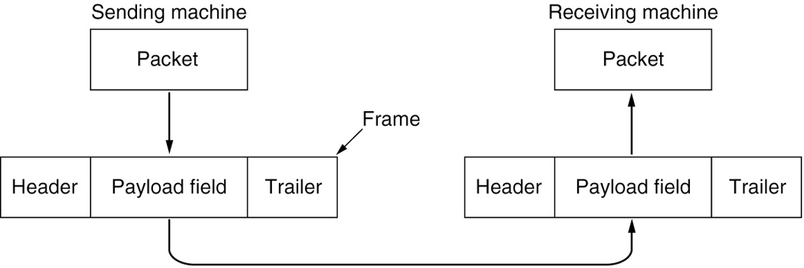

Relationship between packets and frames

报文和帧之间的关系

**Data Link Later Functions**

* Providing a well-defined service interface to the network layer.

  为网络层提供定义良好的服务接口

* Framing sequences of bytes as self-contained segments.

  将字节序列分帧为自包含的段

* Detecting and correcting transmission errors.

  检测并纠正传输错误

* Regulating the flow of data so that slow receivers are not swamped by fast senders.

  调节数据流量，使速度慢的接收端不会被速度快的发送端淹没。

### 3.1.1 Services Provided to The Network Layer

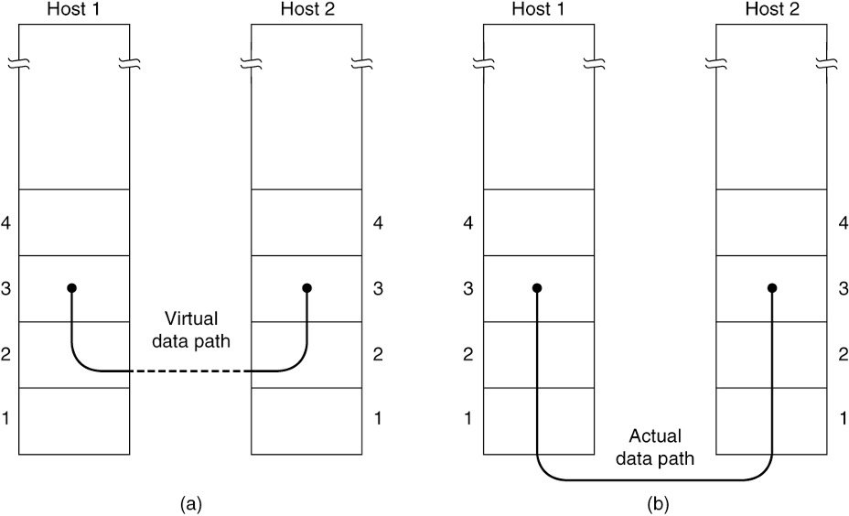

 (a) Virtual communication. (b) Actual communication.

(a)虚拟通信 (b)实际通讯

* Actual services vary from protocol to protocol

  实际的服务因协议而异

* Three possible services

  三种可能的服务

  * Unacknowledged connectionless service

    未经确认的无连接服务

  * Acknowledged connectionless service

    确认无连接服务

  * Acknowledged connection-oriented service

    公认的面向连接的服务

### 3.1.2 Framing (Byte count Flag bytes with byte stuffing, Flag bits with bit stuffing, Physical layer coding violations)

* Framing methods 

  帧方法

  * Byte count 字节计数
  * Flag bytes with byte stuffing 字节填充标志字节
  * Flag bits with bit stuffing 标记位填充
  * Physical layer coding violations 违反物理层编码规则


A byte stream. (a) Without errors. (b) With one error.

字节流. (a)没有错误. (b)有一个错误.


(a) A frame delimited by flag bytes. (b) Four examples of byte sequences before and after byte stuffing.

(a)以标志字节分隔的帧。(b)字节填充前后的四个字节序列示例。


Bit stuffing. (a) The original data. (b) The data as they appear on the line. (c) The data as they are stored in the receiver’s memory after destuffing.

填料.(a)原始数据.(b)直线上显示的数据.(c)解压缩后存储在接收方存储器中的数据. 


#### 3.1.3 **Error Control**

* Ensuring all frames are eventually delivered:

  确保最终交付所有帧:

  * To the network layer at the destination

    发送到目标端的网络层

  * In the proper order

    按正确的顺序

* Ensures reliable, connection-oriented service

  确保可靠的、面向连接的服务

* Requires acknowledgement frames and timers

  需要确认帧和定时器

#### 3.1.4 Flow control

* Controlling the sending of transmission frames at a faster pace than they can be accepted

  控制传输帧的发送速度快于它们可以接受的速度

* Feedback-based flow control

  基于反馈的流量控制

  * Receiver sends back information to the sender giving it permission to send more data

    接收方将信息返回给发送方，并允许其发送更多数据

  * Or receiver tells the sender how the receiver is doing

    或者接收者告诉发送者自己在做什么

* Rate-based flow control

  基于速率的流量控制

  * Protocol has a built-in mechanism

    协议有一个内置的机制

  * Mechanism limits the rate at which senders may transmit data

    机制限制了发送端传输数据的速率

  * No feedback from the receiver is necessary

    不需要接收者的反馈

### 3.2 Error-Correcting Codes: (Hamming codes, Binary convolutional codes, Reed-Solomon codes, Low-Density Parity Check codes), Error-Detecting Codes: (Parity, Checksums, Cyclic Redundancy Checks)

**Error Detection and Correction**

* Error-correcting codes 

  纠错编码

  * Referred to as FEC (Forward Error Correction)

    称为FEC(前向纠错)

  * Include enough redundant information to enable the receiver to deduce what the transmitted data must have been

    包含足够的冗余信息，使接收方能够推断出传输的数据必须是什么

* Error-detecting codes

  错误检测码

  * Include only enough redundancy to allow the receiver to deduce that an error has occurred (but not which error) and have it request a retransmission

    只包含足够多的冗余，让接收端推断出发生了错误(但不知道是哪个错误)，并请求重传

* Key consideration is the type of errors likely to occur

  关键要考虑的是可能发生的错误类型

#### 3.2.1 Error-Correcting Codes

* Hamming codes

  汉明码

* Binary convolutional codes

  二进制卷积码

* Reed-Solomon codes

* Low-Density Parity Check codes

  低密度奇偶校验码

##### 3.2.1.1 Hamming Codes

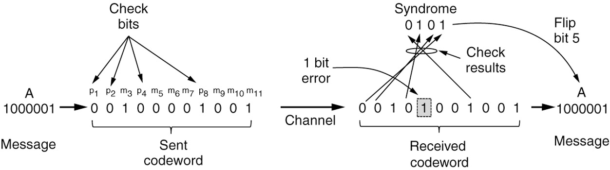

Example of an (11, 7) Hamming code correcting a single-bit error

纠正单个比特错误的(11,7)汉明码示例

Sent codeword: **0** **0** 1 **0** 0 0 0 **1** 0 0 1

(11, 7) means 11 numbers, 7 data number, 11-7= 4 check bit

2^0 =1 

2^1 =2

2^2 = 4

2^3 = 8

means p1, p2, p4, p8 is check bit. 0 0 0 1


Received codeword: **0** **0** 1 **0** 1 0 0 **1** 0 0 1

check bit : 0 0 0 1

check position: $2^{i-1}$

for the p1 check position: 

|             | ==0== | ==0== | 1    | ==0== | 1    | 0    | 0    | ==1== | 0    | 0    | 1    |
| ----------- | ----- | ----- | ---- | ----- | ---- | ---- | ---- | ----- | ---- | ---- | ---- |
| $2^{1-1}=1$ | p1    |       | d1   |       | d1   |      | d1   |       | d1   |      | d1   |
| $2^{2-1}=2$ |       | p2    | d2   |       |      | d2   | d2   |       |      | d2   | d2   |
| $2^{3-1}=4$ |       |       |      | p3    | d3   | d3   | d3   |       |      |      |      |
| $2^{4-1}=8$ |       |       |      |       |      |      |      | p4    | d4   | d4   | d4   |

$ 1 \oplus 1 \oplus 0 \oplus 0 \oplus 1 = 1$

$1 0 0 01$ =0

100 = 1

001 = 1

所以检验位为: 1011

0001

p1, p4 

4+1=5

所以和第5为有关.


##### 3.2.1.2 Binary convolutional codes


The NASA binary convolutional code used in 802.11

802.11中使用的NASA二进制卷积码

The encoder has memory!

编码器有内存!


##### 3.2.1.3 Reed-Solomon codes

* Reed-Solomon codes

  * Linear block codes

    线性分组码

  * Often systematic

    通常是系统化的

  * Codes are based on the fact that every n degree polynomial is uniquely determined by n + 1 points

    代码基于这样一个事实:每个n次多项式都是由n + 1个点唯一确定的


##### 3.2.1.4 LDPC (Low-Density Parity Check) codes

* LDPC (Low-Density Parity Check) codes

  LDPC(低密度奇偶校验)码

  * Linear block codes

    线性分组码

  * Each output bit is formed from only a fraction of the input bits

    每个输出位仅由输入位的一小部分组成

  * Practical for large block sizes

    适用于大数据块

  * Have excellent error-correction abilities that outperform many other codes

    具有优秀的纠错能力，优于许多其他代码


#### 3.2.2 Error-Detecting Code

* Linear, systematic block codes

  线性, 系统分组码

  * Parity

    奇偶校验

  * Checksums

    校验和

  * Cyclic Redundancy Checks (CRCs)
  
    循环冗余检查(CRCs)


##### 3.2.2.1 Parity

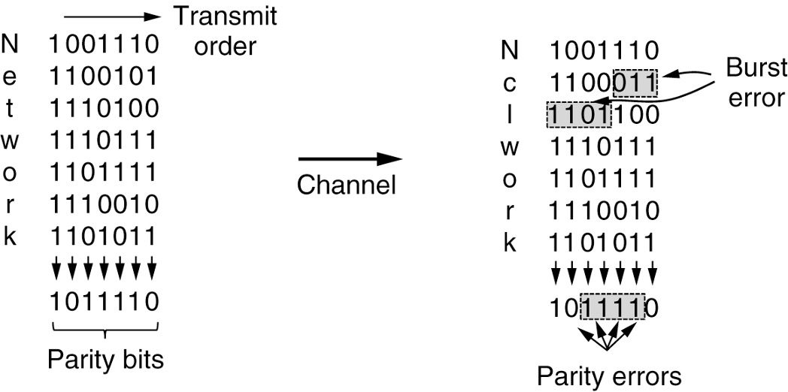

Interleaving of parity bits to detect a burst error

奇偶校验位的交错以检测突发错误


##### 3.2.2.2 Checksums

* The word “checksum” is often used to mean a group of check bits associated with a message, regardless of how the bits are calculated. 

  “校验和”这个词通常用来表示与一条消息相关的一组校验位，无论这些位是如何计算的

* A group of parity bits is one example of a checksum. 

  一组奇偶校验位就是校验和的一个例子。

* Stronger checksums based on a running sum of the data bits of the message. 

  基于消息数据位的运行和的更强的校验和。

* The checksum is usually placed at the end of the message, as the complement of the sum function. 

  校验和通常放在消息的末尾，作为sum函数的补码。


##### 3.2.2.3 Cyclic Redundancy Checks (CRCs)

* A third and stronger kind of error-detecting code is in widespread use at the link layer: the CRC (Cyclic Redundancy Check), also known as a polynomial code.

  第三种更强的错误检测码在链路层广泛使用:CRC(循环冗余检查)，也称为多项式码。

* Polynomial codes are based upon treating bit strings as representations of polynomials with coefficients of 0 and 1 only.

  多项式码是基于将位串视为系数仅为0和1的多项式的表示。

假设有一个8位的二进制数字 11010011，并且我们使用一个简化的CRC算法，它只是计算数字中的1的数量。在这种情况下，数字中有5个1。所以，我们将5（在二进制中为101）添加到该数字的末尾，得到11010011101作为带有CRC的数据。

当接收机收到数据时，它会做同样的计算，计算数字中1的数量。如果计算的数量与CRC值匹配，接收机就知道没有错误。如果不匹配，接收机知道数据在传输过程中已被修改。

需要注意的是，这只是一个简化的示例。真正的CRC算法涉及更复杂的多项式运算，并为各种应用提供了不同的标准。 

### 3.3 Three simplex link-layer protocols: (Utopia: No Flow Control or Error Correction, Adding Flow Control: Stop-and-Wait, Adding Error Correction: Sequence Numbers and ARQ).

**Elementary Data Link Protocols**

* Assumptions underly the communication model

  通信模型下的假设

* Three simplex link-layer protocols

  三个单工链路层协议

  * Utopia: No Flow Control or Error Correction

    乌托邦:没有流量控制或错误纠正

  * Adding Flow Control: Stop-and-Wait

    添加流量控制:停止-等待

  * Adding Error Correction: Sequence Numbers and ARQ

    增加错误纠正:序列号和ARQ


**Initial Simplifying Assumptions** 

**初始化假设**

* Independent processes

  独立进程

  * Physical, data link, and network layers are independent

    物理层、数据链路层和网络层是独立的

  * Communicate by passing messages back and forth

    通过来回传递消息进行沟通

* Unidirectional communication

  单向通信

  * Machines use a reliable, connection-oriented service

    机器使用可靠的、面向连接的服务

* Reliable machines and processes

  可靠的机器和流程

  * Machines do not crash

    机器不会崩溃

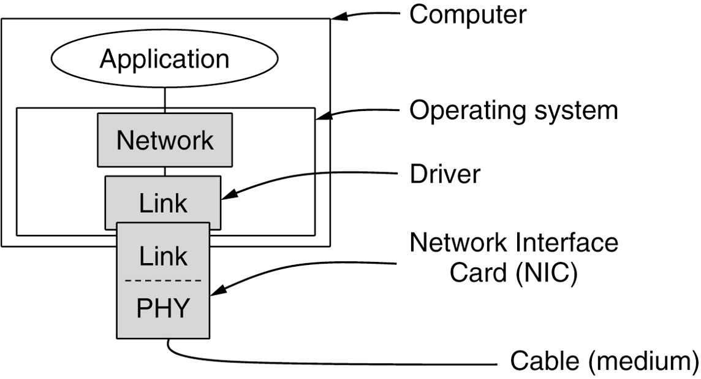

Implementation of the physical, data link, and network layers

物理、数据链路和网络层的实现


**Basic Transmission And Receipt** 

```c
#define MAX_PKT 4 /* determines packet size in bytes */
typedef enum {false, true} boolean;  /* boolean type */
typedef unsigned int seq_nr; /* sequence or ack numbers */
/* 定义了一个名为seq_nr的新类型，用于序列号或确认号。由于是unsigned int，它只能取非负整数值 */
typedef struct {
  unsigned char data[MAX_PKT];
} packet;      /* packet definition */ 

typedef enum {
  data,           
  ack,
  nak,
} frame_kind;      /* frame_kind definition */
/* 它可以有三个值：data、ack或nak，分别表示帧的类型：数据帧、确认帧或否认帧 */

typedef struct{
  frame_kind kind; /* frames are transported in this layer */
  seq_nr seq; 		 /* sequence number */
  seq_nr ack; 		 /* acknowledgement number */
  packet info; 		 /* the network layer packet */
} frame;
/* 结构frame是一个更复杂的数据类型，其中包括：
frame_kind kind;: 一个字段，用于指定帧的类型。
seq_nr seq; 和 seq_nr ack;: 用于存储序列号和确认号的字段。
packet info;: 此字段将包含实际数据（类型为packet）
*/

/* wait for an event to happen; return its type in event. */
void wait_for_event_type *event);

/* Fetch a packet from the network layer for transmission on the channel */
void from_network_layer(packet *p);

/* Deliver information from an inbound frame to the network layer. */
void to_network_layer(packet *p);

/* Go get an inbound frame from the physical layer and copy it to r. */
void from_physical_layer(frame *r);

/* Pass the frame to the physical layer for transmission. */
void to_physical_layer(frame *s);

/* Start the clock running and enable the timeout event. */
void start_timer(seq_nr k);

/* Stop the clock and disable the timeout event. */
void stop_timer(seq_nr k);

/* Start an auxiliary timer and enable the ack_timeout event */
void start_ack_timer(void);

/* Stop the auxiliary timer and disable the ack_timeout event. */
void stop_ack_timer(void);
/*  定时器相关函数 (start_timer, stop_timer, start_ack_timer, stop_ack_timer) 管理定时器，这用于检测丢失的帧或确认信号，并确定何时重新传输 */

/* Allow the network layer from causing a network_layer_ready events. */
void disable_network_layer(void);
/* 此函数禁用网络层的事件，可能是为了防止它发送更多数据，直到可以这样做为止 */

/* Macro inc is expanded in-line: Increment k circularly. */
#define inc(k) if (k < MAX_SEQ) k = k + 1; else k = 0
/* 这是一个提供循环递增的宏。如果k小于MAX_SEQ（在提供的代码中似乎缺少这个值），则增加k，否则将k重置为0 
这个宏的设计是为了实现循环递增。在某些网络协议中，序列号在达到最大值后会回绕到零，从而形成一个循环。这种设计可以帮助限制序列号的大小并避免溢出。
考虑以下场景：如果我们有一个很小的序列号范围，例如0到3，表示为MAX_SEQ=3。当序列号为3时，下一个序列号应该是0，而不是4。这个宏正是为了实现这种循环递增。
让我们详细解释这个宏：
if (k < MAX_SEQ) k = k + 1;: 这个条件检查k是否小于MAX_SEQ。如果是，那么k就增加1。
else k = 0;: 如果k已经达到了MAX_SEQ，那么它就会被重置为0。
所以，当我们在代码中使用这个宏，它会根据当前的k值进行递增，如果k超过了MAX_SEQ，它会回绕到0。
*/
```

这些是基本停-等数据链路层协议的基础。此协议通常用于网络通信，以确保数据完整性并管理发送者和接收者之间的流控.


#### 3.3.1 **Simplex Link-Layer Protocols **

**单工链路层协议**

* Utopia: No Flow Control or Error Correction

  乌托邦:没有流量控制或错误纠正

* Adding Flow Control: Stop-and-Wait

  添加流量控制:停止-等待

* Adding Error Correction: Sequence Numbers and ARQ

  增加错误纠正:序列号和ARQ


##### 3.3.1.1 Utopia: No Flow Control or Error Correction

```c
/* Protocol 1 (utopia) provides for data transmission in one direction only, from sender to receiver. The communication channel is assumed to be error free, and the receiver is assumed to be able to process all the input infinitely fast.
Consequently, the sender just sits in a loop pumping data out onto the line as fast as it can. */

typedef enum {frame_arrival} event_type;
/*定义了一个新的事件类型，只有一个可能的事件：帧到达 (frame_arrival)*/
#include "protocol.h"
void sender1(void){
  frame s; /* buffer for an outbound frame */ /* 创建一个名为s的帧，用于存放要发送的数据*/
  packet buffer; /* buffer for an outbound packet */
  /* 创建一个名为buffer的数据包，用于从网络层获取数据 */
 	
  while (true) {
    from_network_layer(&buffer);  /* go get something to send */
    s.info = buffer;     /* copy it into s for transmission */
    to_physical_layer(&s);   /* send it on its way */
  } /* tomorrow, and tomorrow, and tomorrow,
  	Creeps in this petty pace from day to day
  	To the last syllable of recorded time;
  	- Macbeth, V, v */
  /*明天，明天，明天，
		以这种微不足道的步伐日复一日地前进
		直到记录时间的最后一个音节;
- Macbeth, V, V */
}

void receiver1(void){
  frame r; /* 创建一个名为r的帧，用于存放接收到的数据 */
  event_type event;     /* filled in by wait, but not used here */
  
  while (true){
    wait_for_event(&event); /* only possibility is frame_arrival */
    /* 等待事件发生。在这个协议中，唯一可能发生的事件是帧的到达 (frame_arrival) */ 
    from_physical_layer(&r); /* go get the inbound frame */
    to_network_layer(&r.info); /* pass the data to the network layer */
  }
}

/* 这个协议的基本思路是：发送方不断地从网络层获取数据并发送到物理层，而接收方则不断地从物理层获取数据并传递给网络层。因为这是一个理想的、无错误的协议，所以它没有进行错误检测或确认机制. */
```


##### 3.3.1.2 Adding Flow Control: Stop-and-Wait

```c
/* Protocol 2 (stop-and-wait) also provides for a one-directional flow of data from sender to receiver. The communicaiton channel is once again assumed to be error free, as in protocal 1. However, this time, the receiver has only a finite buffer capacity and a finite processing speed, so the protocol must explicitly prevent the sender from flooding the receiver with data faster than it can be handled. */

typedef enum {frame_arrival} event_type;
/* 定义了一个新的事件类型，只有一个可能的事件：帧到达 (frame_arrival) */
#include "protocol.h"
void sender2(void)
{
  frame s; /* buffer for an outbound frame */
  packet buffer; /* buffer for an outbound packet */
  event_type event; /* frame_arrival is the only possibility */
  
  while (true){
    from_network_layer(&buffer); /* go get something to send */
    s.info = buffer; /* copy it into s for transmission */
    to_physical_layer(&s); /* bye bye litte frame */
    wait_for_event(&event); /* do not proceed until given the go ahead */
    /* 发送方等待事件，这里唯一可能的事件是 frame_arrival，表示发送方收到了接收方的确认帧 */
  }
}

void receiver2(void){
  frame r, s; /* buffers for frames */
  /* 定义了接收帧r、发送帧s和事件类型event */
  event_type event; /* frame_arrival is the only possibility */
  /* 等待事件发生。在这个协议中，唯一可能发生的事件是帧的到达 (frame_arrival)。*/
  while (true){
    wait_for_event(&event); /* only possibility is frame_arrival */
    from_physical_layer(&r); /* go get the inbound frame */
    to_network_layer(&r.info); /* pass the data to the network layer */
    to_physical_layer(&s); /* send a dummy frame to awaken sender */
    /* 接收方向物理层发送一个哑帧 s 以唤醒发送方。
   接收方在收到一个帧并将数据传递到网络层后，会立即向发送方发送一个哑帧，即使这个哑帧没有包含任何数据。发送方在收到这个哑帧后将开始发送下一个数据帧。这是一个简单版本的stop-and-wait协议，用于防止发送方以超过接收方处理能力的速度发送数据. 
    */ 
  }
}
```


##### 3.3.1.3 Adding Error Correction: Sequence Numbers and ARQ)

```c
/* Protocol 3 (par) allows unidirectional data flow over an unreliable channel */
#define MAX_SEQ 1 /* must be 1 for protocol 3 */
typedef enum {
  frame_arrival, cksum_err, timeout
} event_type;
/* 定义了三种可能的事件：帧到达、校验和错误和超时。*/
#include "protocol.h"

void sender3(void){
  seq_nr next_frame_to_send;   /* seq number of next outgoing frame */
  /* next_frame_to_send的变量来跟踪下一个要发送的帧的序列号 */
  frame s;    /* scratch variable */
  packet buffer; /* buffer for an outbound packet */
  event_type event;
  /* 发送方初始化 next_frame_to_send */
  next_frame_to_send = 0; /* initialize outbound sequence numbers */
  from_network_layer(&buffer); /* fetch first packet */
  while (true){
    s.info = buffer; /* construct a frame for transmission */ /* 将数据包 buffer 构建到帧 s 中以进行传输 */
    s.seq = next_frame_to_send; /* insert sequence number in frame */ /* 并插入序列号 */
    to_physical_layer(&s); /* send it on its way */
    start_timer(s.seq); /* if answer takes too long, time out */
    wait_for_event(&event); /* frame_arrival, cksum_err, timeout */
    if (event == frame_arrival){
      /* 如果事件为frame_arrival，发送方从物理层获取确认帧，并检查确认序列号是否与发送的帧匹配。如果匹配，发送方知道其帧已被成功接收，并从网络层获取下一个要发送的数据包 */
      from_physical_layer(&s);     /* get the acknowledgement */
      if (s.ack == next_frame_to_send){
        from_network_layer(&buffer); /* get the next one to send */
        inc(next_frame_to_send);  /* invert next_frame_to_send */
        /*使用inc宏来翻转next_frame_to_send的值，以保证交替发送带有序列号0和1的帧*/
      }
    }
  }
}

void receiver3(void){
  seq_nr frame_expected;
  frame r, s;
  event_type event;
  
  frame_expected = 0; /* 接收方初始化 frame_expected */
  while (true){
    wait_for_event(&event); /* possibilities: frame_arrival, cksum_err */
    if (event == frame_arrival){
      /* A valid frame has arrived. */
      from_physical_layer(&r);
      if (r.seq == frame_expected){
        /* This is what we have been waiting for. */
        /* 当帧到达时，接收方检查该帧的序列号是否与frame_expected匹配。如果匹配，接收方知道这是它正在等待的*/
        to_network_layer(&r.info); /* pass the data to the network layer */
        inc(frame_expected); /* next time expect the other sequence nr */
      }
      s.ack = 1 - frame_expected; /* tell which frame is being acked */
      to_physical_layer(&s); /* only the ack field is ues */
    }
  }
}
```

### 例子：

1. **开始**:
   - A 的 `next_frame_to_send` = 0
   - B 的 `frame_expected` = 0
2. A 从其网络层获取一个数据包 "Hello" 并打包成帧。帧的内容为 `seq = 0, info = "Hello"`。然后 A 将这个帧发送给 B。
3. A 启动计时器等待 B 的确认。
4. B 收到了序列号为 0 的帧，检查帧的序列号，发现它和 `frame_expected` 匹配，所以 B 知道这是它正在等待的帧。
5. B 提取 "Hello" 并将其传递给其网络层。
6. B 的 `frame_expected` 通过 `inc` 函数翻转为 1。
7. B 发送一个确认帧给 A。确认帧的内容为 `ack = 1`，告诉 A，帧 0 已被成功接收。
8. A 收到这个确认帧，停止计时器。然后检查确认号 `ack`，它是 1，这意味着帧 0 已经被 B 成功接收。
9. A 的 `next_frame_to_send` 翻转为 1。
10. A 现在准备发送下一个数据包，重复上述过程，但这次使用序列号 1。

这个过程持续进行，A 和 B 不断地在 0 和 1 之间翻转它们的序列号。这确保了即使通道不可靠，数据也可以可靠地从 A 传输到 B，因为如果 B 没有确认一个帧，A 会重新发送它。


### 3.4 Piggybacking, three bidirectional sliding window protocols: (One-bit sliding window, go-back-n, selective repeat)

**Improving Efficiency**

* Need bidirectional data transmission

  需要双向数据传输

* Link layer efficiency improvement

  链路层效率提升

  * Send multiple frames simultaneously before receiving an acknowledgement

    在收到确认之前同时发送多个帧


#### 3.4.1 Bidirectional Transmission, Multiple Frames in Flight

* Bidirectional transmission: piggybacking

  双向传输:捎带

  * Use the same link for data in both directions

    在两个方向上使用相同的链接

  * Interleave data and control frames on the same link

    在同一个链接上交织数据帧和控制帧

  * Temporarily delay outgoing acknowledgements so they can be hooked onto the next outgoing data frame

    暂时延迟传出的确认，以便它们可以连接到下一个传出的数据帧

* Piggybacking advantages

  利用优势

  * A better use of the available channel bandwidth

    更好地利用可用信道带宽

  * Lighter processing load at the receiver

    较轻的处理负荷

* Piggybacking issue

  捎带问题

  * Determining time data link layer waits for a packet to piggyback the acknowledgement

    确定链路层等待数据包承载确认的时间

* Three bidirectional sliding window protocols

  三个双向滑动窗口协议

  * One-bit sliding window, go-back-n, selective repeat

    1位滑动窗口，回退n，选择性重复

* Consider any instant of time

  考虑任何时刻

  * Sender maintains a set of sequence numbers corresponding to frames it is permitted to send

    发送端维护一组与它允许发送的帧相对应的序列号

  * Frames are said to fall within the sending window

    帧被认为位于发送窗口内

  * Receiver maintains a receiving window corresponding to the set of frames it is permitted to accept

    接收器维护一个与允许接收的帧集合相对应的接收窗口

* Differ among themselves in terms of efficiency, complexity, and buffer requirements

  它们在效率、复杂性和缓存需求方面有所不同


大小为1的滑动窗口，具有3位的序列号。最初(a)。(b)在发送第一帧之后。(c)在接收到第一帧之后。(d)在收到第一次确认后。


##### 3.4.1.1 One-bit sliding window

Examples: A 1-bit sliding window protocol

```c
/* Protocol 4 (sliding window) is bidirectional and is more robust than protocol 3. */
#define MAX_SEQ 1 /* must be 1 for protocol 4 */
typedef enum {frame_arrival, cksum_err, timeout} event_type;
#include "protocol.h"

void protocol4 (void)
{
  seq_nr next_frame_to_send; /* 0 or 1 only */
  seq_nr frame_expected; /* 0 or 1 only */
  frame r, s; /* scratch variables */
  packet buffer; /* current packet being sent */
  event_type event;
  
  /* 两个序列号都被初始化为0 */
  next_frame_to_send = 0; /* next frame on the outbound stream */
  frame_expected = 0; /* number of frame arriving frame expected */
  
  /* 发送逻辑 */
  from_network_layer(&buffer); /* fetch a packet from the network layer */
  /* 从网络层获取数据包 */
  s.info = buffer; /* prepare to send the initial frame */
  /* 将数据包放入帧s */
  s.seq = next_frame_to_send; /* insert sequence number into frame */
  /* 将next_frame_to_send作为帧的序列号 */
  s.ack = 1 - frame_expected; /* piggybacked ack */
  /* 使用1 - frame_expected作为piggybacked ack，因为这表示接收方最后成功接收的帧的序列号 */
  to_physical_layer(&s);  /* transmit the frame */
  start_timer(s.seq);  /* start the timer running */
  
  /* 接受逻辑 */
  while (true){
    wait_for_event(&event); /* could be: frame_arrival, cksum_err, timeout */
    /* 等待事件，可能的事件有：frame_arrival、cksum_err、timeout */
    if (event == frame_arrival) { /* a frame has arrived undamaged */
      from_physical_layer(&r); /* go get it */
      
      if (r.seq == frame_expected){
        /* Handle inbound frame stream. */
        to_network_layer(&r.info); /* pass packet to network layer */
        inc(frame_expected); /* invert sequence number expected next */
      }
      
      if (r.ack == next_frame_to_send) { /* handle outbound frame stream. */
      	from_network_layer(&buffer); /* fetch new packet from network layer */
        inc(next_frame_to_send); /* invert sender's sequence number */
      }
    }
    
    s.info = buffer; /* construct outbound frame */
    s.seq = next_frame_to_send; /* insert sequence number into it */
    s.ack = 1 - frame_expected; /* seq number of last received frame */
    to_physical_layer(&s); /* transmit a frame */
    start_timer(s.seq); /* start the timer running */
  }
}

/* 这个协议是双向的，意味着在同一个物理通道上，数据可以从发送方传到接收方，同时确认可以从接收方传回发送方。
使用了piggybacking技术，意味着确认信息被附加在数据帧上，而不是作为单独的帧发送。
MAX_SEQ设置为1，这简化了协议，因为只有两个可能的序列号：0和1。但这也限制了同时在传输中的未确认帧的数量。*/
```

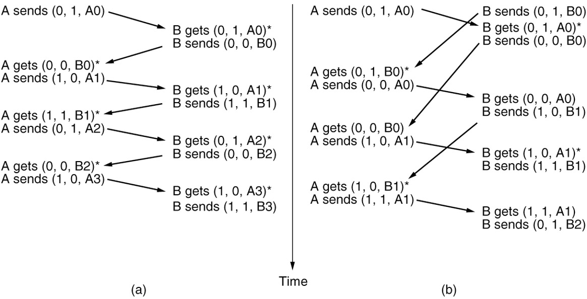

Two scenarios for protocol 4. (a) Normal case. (b) Abnormal case. The notation is (seq, ack,  packet number). An asterisk indicates where a network layer accepts a packet.

协议4有两种场景。a)正常情况。(b)异常情况。符号为(seq, ack, packet number)。星号表示网络层接收分组的位置。


https://www.bilibili.com/video/BV1bP4y1T78P/?spm_id_from=333.337.search-card.all.click&vd_source=73e7d2c4251a7c9000b22d21b70f5635


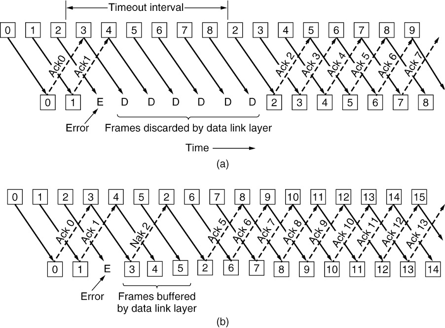

Pipelining and error recovery. Effect of an error when (a) receiver’s window size is 1 and (b) receiver’s window size is large.

流水线和错误恢复。当(a)接收机窗口大小为1和(b)接收机窗口大小较大时的误差影响。


#### 3.4.1.2 go-back-n

```c
/* Protocol 5 (Go-back-n) allows multiple outstanding frames. The sender may transmit up to MAX_SEQ frames without waiting for an ack. In addition, unlike the previous protocols, the network layer causes a network_layer_ready event when there is a packet to send */
/*协议5 (Go-back-n)允许多个未完成的帧。发送端可以发送最多MAX_SEQ帧而无需等待ack。此外，与前面的协议不同，网络层在有分组要发送时，会引发network_layer_ready事件。*/
#define MAX_SEQ 7 /* should be 2^n -1 */
typedef enum {
  frame_arrival, 
  cksum_err,       /* 检查和错误 */
  timeout, network_layer_ready
} event_type;
#include "protocol.h" /* 引入协议相关的头文件 */

/* 检查一个序列号是否在两个给定的序列号之间（循环计数）*/
static boolean between(seq_nr a, seq_nr b, seq_nr c){
  /* Return true if (a <= b < c circularly; false otherwise. */
  if (((a <= b) && (b < c)) || ((c < a) && (a <= b)) || ((b < c) && (c < a)))
    return(true);
  else
    return (false);
}

/* send_data函数：构建并发送数据帧 */
static void send_data(seq_nr frame_nr, seq_nr frame_expected, packet buffer[]){
  /* Construct and send a data frame */
  frame s; /* scratch variable */
  
  s.info = buffer[frame_nr];  /* insert packet into frame */
  s.seq = frame_nr;    /* insert sequence number into frame */
  s.ack = (frame_expected + MAX_SEQ) % (MAX_SEQ + 1); /* piggyback ack */
}

void protocol5(void){
  seq_nr next_frame_to_send; /* MAX_SEQ > 1; used for outbound stream */
  seq_nr ack_expected; /* next frame expected on inbound stream */
  frame r; /* scratch variable */
  packet buffer[MAX_SEQ+1]; /* buffers for the outbound stream */
  /* 定义一个缓冲区来存储即将发送的数据包 */
  seq_nr nbuffered; /* # output buffers currently in use */
  /* 这表示当前在缓冲区中已缓存的帧的数量 */
  seq_nr i; /* used to index into the buffer array */
  /* 用于在后面的循环中作为索引 */
  event_type event;
  
  enable_network_layer(); /* allow network_layer_ready events */
  ack_expected = 0; /* next frame goint out */
  frame_expected = 0; /* number of frame expected inbound */
  nbuffered = 0; /* initially no packets are buffered */
  
  while (true){
    wait_for_event(&event);    /* four possibilities: see event_type above */
    /* 使用wait_for_event函数等待上述四种事件之一 frame_arrival, cksum_err, timeout, network_layer_ready */
    switch(event){
      case network_layer_ready: /* the network layer has a packet to send */
        /* Accept, save, and transmit a new frame. */
        /* 将新数据包存入缓冲区，增加缓冲数量，然后发送数据帧，并更新下一个要发送的帧的序列号 */
        from_network_layer(&buffer[next_frame_to_send]); /* fetch new packet */
        nbuffered = nbuffered + 1; /* expand the sender's window */
        send_data(next_frame_to_send, frame_expected, buffer); /* transmit the frame */
        inc(next_frame_to_send); /* advance sender's upper window edge */
        break;
      case frame_arrival: /* a data or control frame has arrived */
        from_physical_layer(&r); /* get incoming frame from physical layer */
        /* 如果帧的序列号是预期的，将其数据部分传递给网络层，并更新期望的帧号 */
        if (r.seq == frame_expected){
          /* Frames are accepted only in order */
          to_network_layer(&r.info);    /* pass packet to network layer */
          inc(frame_expeted); /* advance lower edge of receiver's window */
        }
        
        /* 对于piggyback的确认，如果其值在期望的确认号和待发送的帧号之间，则停止该帧的计时器，并更新期望的确认号 */
        /* Ack n implies n-1, n-2, etc, Check for this. */
        while (between(ack_expected, r.ack, next_frame_to_send)){
          /* Handle piggybacked ack. */
          nbuffered = nbuffered - 1; /* one frame fewer buffered */
          stop_timer(ack_expected);  /* frame arrived intact; stop timer */
          inc(ack_expected); /* contract sender's window */
        }
        break;
      case cksum_err: break; /* just ignore bad frames */
      case timeout: /* trouble; retransmit all outstanding frames */
        next_frame_to_send = ack_expected; /* start retransmitting her */
        for (i = 1; i <= nbuffered; i++){
          send_data(next_frame_to_send, frame_expected, buffer); /* resend frame */
          inc(next_frame_to_sedn); /* prepare to send the next one */
        }
    }
    /* 基于当前缓冲的帧数量，决定是否启用或禁用网络层 */
    if (nbuffered < MAX_SEQ)
      enable_network_layer();
    else
      disable_network_layer();
  }
}
/* 这个协议是基于滑动窗口协议的变种，其主要目的是在不可靠的通信环境中实现可靠的数据传输 */
```

A sliding window protocol using go-back-n.


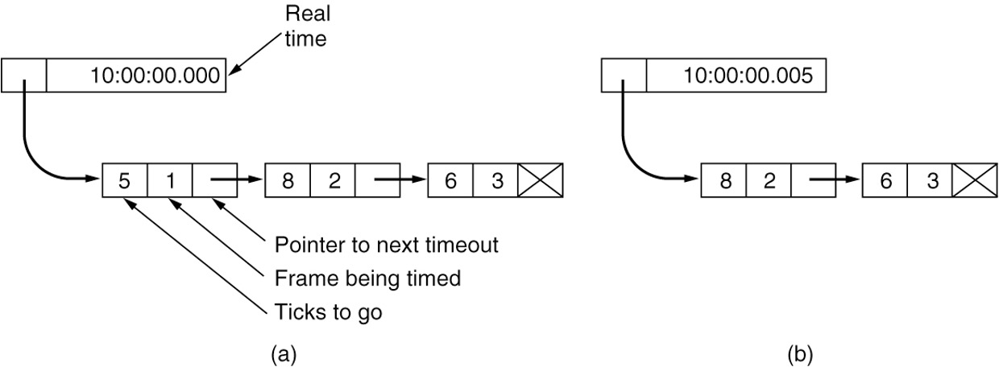

Simulation of multiple timers in software.  (a) The queued timeouts.  (b) The situation after the first timeout has expired.

软件中多个定时器的模拟。(a)排队超时。(b)第一次超时后的情况。

这个图显示了一个网络通讯中的定时器队列的工作原理。具体来说，它描述了如何跟踪多个定时器以确定何时需要对特定的帧进行超时处理。让我们详细解释每个部分：

 (a) Real time: 这是一个时间戳，显示为10:00:00.000。它表示当前的实际时间. 下面的结构是一个链表，代表当前正在被跟踪的帧及其超时时间. 每个方框代表一个正在被跟踪的帧的定时器. 
5 1：其中，“5”是到下一个超时之前的剩余时间，或者说是"Ticks to go". "1"是正在被计时的帧的编号，或者说是"Frame being timed"。
8 2: 与上面类似，"8"是到下一个超时之前的剩余时间。"2"是正在被计时的帧的编号.
6 3: "6"是到该帧超时之前的剩余时间。"3"是帧编号。
箭头表示链表的方向，它显示了哪个定时器会首先超时. Pointer to next timeout: 这个箭头指向的是下一个将要超时的定时器。

(b) Real time: 这是一个稍晚的时间戳，显示为10:00:00.005。只过了0.005秒. 链表结构表示，帧"1"已经超时了，因此已从链表中移除。现在，8 2变成了链表的第一个元素，表示这是下一个将要超时的帧。

6 3: 与图(a)中的定义相同。

总体来说，这个图显示了如何在一个系统中跟踪多个帧的超时，以及如何更新这些超时，特别是当一个帧超时时。这种方法可以确保系统及时地识别并处理超时的帧，从而确保数据传输的可靠性。


##### 3.4.1.3 selective repeat

```c
/* Protocol 6 (Selective repeat) accepts frames out of order but passes packets to the network layer in order. Associated with each outstanding freme is a timer. When the timer expires, only that frame is retransmitted, not all the outstanding frames, as in protocol 5. */
/*协议6(选择性重复)接收乱序的帧，但将分组按顺序传递到网络层。与每个未完成的帧相关联的是一个计时器。当定时器到期时，只重传该帧，而不是协议5中所有未完成的帧。*/
#define MAX_SEQ 7		    /* should be 2^n-1   */ /* 这是序列号的最大值 */
#define NR_BUFS((MAX_SEQ + 1)/2)   /* 这是滑动窗口的大小。它是序列号最大值的一半加一 */
typedef enum{
  frame_arraival, 
  cksum_err,
  timeout,
  network_layer_ready,
  ack_timeout
} event_type;
/* 表示可能发生的五种事件类型 */

#include "protocol.h"
boolean no_nak = true; /*no nak has been sent yet*/ 
seq_nr oldest_frame = MAX_SEQ + 1; /*initial value is only for the simulator*/
/* 记录最老的未确认帧的序列号 */

static boolean between(seq_nr a, seq_nr b, seq_nr c){
  /*Same as between in protocol 5, but shorter and more obscure.*/ 
  return ((a <= b) && (b < c)) || ((c < a) && (a <= b)) || ((b < c) && (c < a)); 
}

/* 构造并发送数据帧、确认帧或NAK帧 */
static void send frame(frame_kind fk, seq_nr frame_nr, seq_nr frame_expected, packet buffer[]){
  /*Construct and send a data, ack, or nak frame.*/
  frame s; /*scratch var iable*/ 
  s.kind = fk; /*kind == data, ack, or nak*/
  /* 创建一个名为 s 的帧，并设置它的类型为函数参数 fk */
  /* 如果帧类型是数据帧，则从缓冲区中获取数据 */
  if (fk == data) {
    s.info = buffer[frame_nr % NR_BUFS];
  }
  s.seq = frame_nr ; /*only meaningful for data frames*/
  /* 设置帧的序列号为函数参数 frame_nr */
  s.ack = (frame_expected + MAX_SEQ) % (MAX_SEQ + 1);
  /* 设置帧的确认序列号 */
  if (fk == nak) {
    no_nak = false; /*one nak per frame, please*/
  }
  to_physical_layer(&s); /*transmit the frame*/
  
  /* 如果帧类型是数据帧，启动与该帧相关联的定时器，并停止确认定时器 */
  if (fk == data) {
    start_timer(frame_nr % NR_BUFS); 
    stop_ack_timer(); /*no need for separate ack frame*/ 
  }
}

/* 主要的函数，它执行协议6的逻辑 */
void protocol6(void) { 
  seq_nr ack_expected; /*lower edge of sender’s window*/ 
  /* 表示发送方期望收到的下一个ACK的序列号 */
  seq_nr next_frame_to_send; /*upper edge of sender’s window + 1*/ 
  seq_nr frame_expected; /*lower edge of receiver’s window*/ 
  seq_nr too_far; /*upper edge of receiver’s window + 1*/ 
  /* 表示接收方窗口的上界，即最远的可以接收的帧的序列号*/
  int i; /*index into buffer pool*/  /* 用作循环索引 */
  frame r; /*scratch var iable*/ /* 用来从物理层接收帧 */
  packet out_buf[NR_BUFS]; /*buffers for the outbound stream*/ 
  /* 存储待发送的数据包 */
  
  packet in_buf[NR_BUFS]; /*buffers for the inbound stream*/ 
  /* 存储已接收的数据包 */
  
  boolean arrived[NR_BUFS]; /*inbound bit map*/ 
  /* 标记哪些序列号的帧已经到达 */
  
  seq_nr nbuffered; /*how many output buffers currently used*/ 
  /* 表示当前使用的输出缓冲区的数量 */
  
  event_type event; 
  enable_network_layer(); /*initialize*/ 
  /* 允许网络层开始发送数据 */
  
  ack_expected = 0; /*next ack expected on the inbound stream*/ 
  next_frame_to_send = 0; /*number of next outgoing frame*/ 
  /* 设置第一个要发送的帧的序列号为0 */
  frame_expected = 0; 
  /* 设置期望收到的第一个帧的序列号为0 */
  too_far = NR_BUFS; 
  /* 设置可以接收的最远的帧的序列号 */
  nbuffered = 0; /*initially no packets are buffered*/ 
  for (i = 0; i < NR BUFS; i++) arrived[i] = false; 
  /* 初始化 arrived 数组：设置所有序列号的帧都尚未到达 */
  while (true) { 
    wait_for_event(&event); /*five possibilities: see event type above*/
    /* 这个函数会暂停执行，直到有某个事件发生，如新的数据包到达或一个计时器到期 */
    switch(event) { 
      case network_layer_ready: /*accept, save , and transmit a new frame*/ 
        nbuffered = nbuffered + 1; /*expand the window*/ 
        /* 增加nbuffered的值，表示现在有更多的数据要发送 */
        from_network_layer(&out_buf[next_frame_to_send % NR_BUFS]); /*fetch new packet*/ 
        send_frame(data, next_frame_to_send, frame_expected, out_buf);/*transmit the frame*/ 
        inc(next_frame_to_send); /*advance upper window edge*/ 
        break; 
      case frame_arrival: /*a data or control frame has arrived*/ 
        /* 以下的代码处理到达的帧，检查其是否损坏、是否是期望的帧，以及是否需要发送ACK或NAK */
        from_physical_layer(&r); /*fetch incoming frame from physical layer*/ 
        if (r.kind == data) { /* 检查这是否是一个数据帧 */
          /*An undamaged frame has arrived.*/ 
          if ((r.seq != frame_expected) && no_nak) 
            send_frame(nak, 0, frame_expected, out_buf); 
          else start_ack_timer(); 
          if (between(frame_expected,r.seq,too_far) && (arrived[r.seq%NR_BUFS]==false)) { 						/*Frames may be accepted in any order.*/ 
            arrived[r.seq % NR_BUFS] = true; /*mark buffer as full*/ 
            /* 将对应的缓存标记为已满 */
            in_buf[r.seq % NR_BUFS] = r.info; /*insert data into buffer*/ 
            /* 将数据插入到缓冲区中 */
            while (arrived[frame_expected % NR_BUFS]) { 
           		/* 检查预期帧是否已经到达 */
              /*Pass frames and advance window.*/ 
              to_network_layer(&in_buf[frame_expected % NR_BUFS]); 
              /* 将帧传递给网络层 */
              no_nak = true; 
              /* 设置没有NAK标记 */
              arrived[frame_expected % NR_BUFS] = false; 
              /* 将对应的缓存标记为已空 */
              inc(frame_expected); /*advance lower edge of receiver’s window*/ 
              /* 增加接收者窗口的下边界 */
              inc(too_far); /*advance upper edge of receiver’s window*/ 
              /* 增加接收者窗口的上边界 */
              start_ack_timer(); /*to see if a separate ack is needed*/ 
              /* 启动一个ACK定时器，以检查是否需要单独的ACK */ 
            } 
          } 
        } 
        if((r.kind==nak) && between(ack_expected,(r.ack+1)%(MAX SEQ+1),next_frame_to_ send)) send_frame(data, (r.ack+1) % (MAX_SEQ + 1), frame_expected, out_buf); 
        /* 如果收到的是一个NAK，并且它在发送窗口的范围内，那么发送下一个帧 */
        while (between(ack_expected, r.ack, next_frame_to_send)) { 
          /* 检查接收到的ack是否在发送窗口的范围内*/
          nbuffered = nbuffered - 1; /* handle piggybacked ack */ 
          /* 减少缓存的帧数 */
          stop_timer(ack_expected % NR_BUFS); /*frame arrived intact*/ 
          /* 停止对应的定时器，因为帧已经完整地到达 */
          inc(ack_expected); /*advance lower edge of sender’s window*/ 
          /* 增加发送窗口的下边界 */
        } break; 
     
      case cksum_err :  /* 检测到校验和错误 */
        if (no_nak) send_frame(nak, 0, frame_expected, out_buf); /*damaged frame*/ 
        /* 如果没有发送NAK，那么发送一个NAK帧 */
        break; 
        
      case timeout: send_frame(data, oldest_frame, frame_expected, out_buf); /*we timed out*/ /* 当某个帧的定时器到期（超时）时, 重新发送最旧的帧 */
        break; 
      case ack_timeout: /* 当ACK的定时器到期时 */
        send_frame(ack,0,frame_expected, out_buf); /*ack timer expired; send ack*/ 
        /* 发送一个ACK帧 */
    } if (nbuffered < NR_BUFS) 
      enable_network_layer(); 
    else 
      disable networ k layer(); 
  } 
}
```

设想一个邮局，这个邮局要处理从各地寄来的信件。这些信件可能按任意顺序到达，但每封信上都有一个独特的序列号，代表这封信应该是何时到达的。

1. `from_physical_layer(&r);`：这就像邮局的员工从一个箱子里拿出一封信。
2. `if (r.kind == data) {`：这检查信是否是普通信件（而不是一条提醒或其他类型的信息）。
3. `if ((r.seq != frame_expected) && no_nak)`：如果信的序列号不是员工预期的，并且员工没有收到过关于这封信的投诉（即之前没有发送NAK），那么员工会发送一个投诉（NAK），表明这封信的序列号与预期的不符。
4. `if (between(frame_expected,r.seq,too_far) && (arrived[r.seq%NR_BUFS]==false))`：员工会检查信件的序列号是否在预期的范围内，并确保他们还没有处理过这封信。
5. `arrived[r.seq % NR_BUFS] = true;` 和 `in_buf[r.seq % NR_BUFS] = r.info;`：员工将信放入一个文件夹中，并在一个清单上标记这封信已经处理。
6. `while (arrived[frame_expected % NR_BUFS]) {`：员工会继续检查是否有连续的信件（按照序列号）已经到达并处理。例如，如果他们期待序列号为5的信，然后6、7、8也都已经到达，那么他们会按顺序处理所有这些信。
7. `if((r.kind==nak) && between(ack_expected,(r.ack+1)%(MAX_SEQ+1),next_frame_to_send))`：如果收到的是一个投诉（NAK）并且这个投诉是关于一个他们认为已经发送的信，那么他们会重新发送那封信。
8. `while (between(ack_expected, r.ack, next_frame_to_send)) {`：这是关于已发送但尚未收到确认的信件。员工会检查每一封已发送的信直到他们收到确认。


A sliding window protocol using selective repeat. 

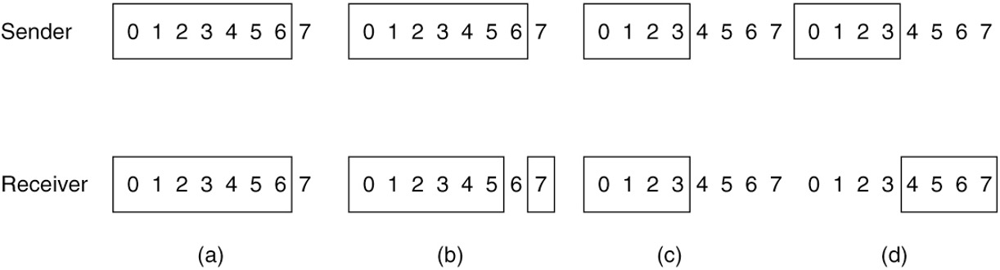

(a) Initial situation with a window of size 7.  (b) After 7 frames have been sent and received but not acknowledged.  (c) Initial situation with a window size of 4.  (d) After 4 frames have been sent and received but not acknowledged.

(a)窗口大小为7的初始情况。(b)在发送和接收了7帧但没有得到确认之后。(c)窗口大小为4的初始情况。(d)在发送和接收了4帧但没有得到确认后。

1. **(a) 初始情况，窗口大小为7**
   - 这个子图显示了发送方和接收方都准备好开始传输和接收最多7个帧的情况。
   - 此时，任何帧都尚未发送。
2. **(b) 已经发送和接收了7个帧，但尚未收到确认**
   - 发送方已发送全部7个帧，但由于没有收到确认，它的窗口不能滑动或移动。
   - 接收方已接收这7个帧，但尚未发送确认。
3. **(c) 初始情况，窗口大小为4**
   - 与(a)子图类似，但滑动窗口的大小更小，仅为4。
   - 此时，任何帧都尚未发送。
4. **(d) 已经发送和接收了4个帧，但尚未收到确认**
   - 发送方已发送全部4个帧，但由于没有收到确认，它的窗口不能滑动或移动。
   - 接收方已接收这4个帧，但尚未发送确认。

总的来说，这些图展示了滑动窗口协议中窗口大小的影响，以及在帧被发送和接收但未被确认时窗口的状态.


### 3.5 Packet over SONET, ADSL

**Data Link Protocols in Practice**

* Packet over SONET
* ADSL (Asymmetric Digital Subscriber Loop)


#### 3.5.1 **Packet over SONET** 


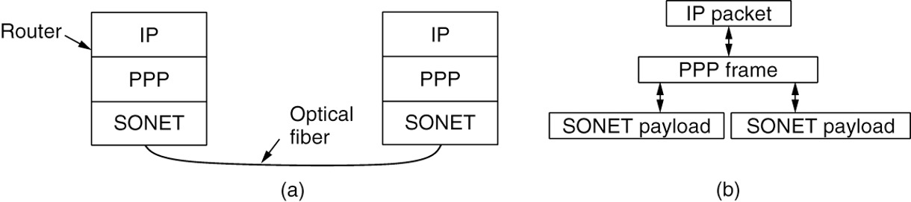

Packet over SONET. (a) A protocol stack. (b) Frame relationships.

数据包通过SONET。(a)协议栈。(b)框架关系.

**图 (a)**

1. **Router**: 这是数据的来源。路由器负责生成或转发IP数据包。
2. **IP**: 这代表了IP数据包。数据在此层次上是以IP格式存在的。
3. **PPP**: IP数据包被PPP(Point-to-Point Protocol)封装。这样，原始的IP数据可以被正确地传输并在接收端被正确地解析。
4. **SONET**: 封装后的PPP帧进一步被封装成SONET帧。SONET层定义了如何在光纤网络上传输数据。
5. **Optical fiber**: 光纤是物理媒介，SONET帧在其上进行传输。

**图 (b)**

这部分展示了数据是如何被逐层封装的：

1. **IP packet**: 这是数据的最原始形式，通常来自应用或上层协议。
2. **PPP frame**: IP数据包被封装成PPP帧。这为数据提供了必要的头部信息，使其可以在接收端被正确解析。
3. **SONET payload**: PPP帧成为SONET帧的负载。SONET头部和其他必要信息被添加到PPP帧周围，形成完整的SONET帧。

这两部分图都强调了数据在从源到目的地的传输过程中如何被逐层封装和解封装的过程.


**Packet over SONET (PoS)** 是一种在SONET和SDH网络上发送数据包的技术。首先，我们需要理解SONET和SDH是什么。

**SONET (Synchronous Optical Network)** 和 **SDH (Synchronous Digital Hierarchy)** 是国际标准的光纤传输框架，用于确保数字传输系统的互通性。它们提供了高速网络交通的同步，允许多个数字数据流被整合到一起并在高速光纤链路上进行传输。

传统上，SONET/SDH被设计用于传输声音，使用时间分隔多路复用技术。但随着时间的发展，有了需求要在这些网络上发送数据包，特别是IP数据包。这就是Packet over SONET (PoS) 出现的原因

以下是有关Packet over SONET的一些关键点：

1. **封装**：PoS使用PPP (Point-to-Point Protocol) 来封装IP数据包，然后再将这些数据包传输到SONET/SDH帧中。
2. **高速度**：由于SONET/SDH提供了非常高的传输速度，PoS允许数据包在高达10 Gbps或更高的速度上进行传输。
3. **效率**：PoS为数据网络提供了一种高效的传输机制，因为它直接在光纤上发送数据包，无需额外的时分复用或电路交换设备。
4. **低延迟**：相较于其他技术，PoS提供了较低的传输延迟。
5. **可靠性**：利用SONET/SDH的保护和恢复机制，PoS提供了高度的网络可靠性。
6. **互操作性**：由于基于标准的SONET/SDH，PoS设备可以与传统的SONET/SDH设备互操作。

尽管Packet over SONET在某些高速网络应用中仍然很受欢迎，但随着以太网技术和其他光纤传输技术的发展，它的重要性已经逐渐减少。不过，在某些专用网络和长距离连接中，PoS仍然是一个有价值的解决方案。


##### 3.5.1.2 **PPP (Point-to-Point Protocol) features**

一个用于两点间直接连接的数据链路层协议

* Separate packets, error detection

  分离数据包，错误检测

  PPP帧包含一个CRC (Cyclic Redundancy Check) 字段，用于错误检测

* Link Control Protocol (LCP)

  链路控制协议(LCP)

  PPP使用LCP (Link Control Protocol) 来建立、配置和测试数据链路连接

* Network Control Protocol (NCP)

  网络控制协议(NCP)

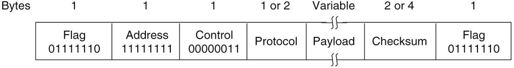

这个图示展示了PPP (Point-to-Point Protocol) 的数据帧结构。让我们逐一解释每个部分：

1. **Flag（标志）**：每个PPP帧都以一个标志字节开始和结束，它的值是`01111110`。这是帧的界定标志，用于指示帧的开始和结束。
2. **Address（地址）**：这个字段通常设置为`11111111`，表示广播地址。因为PPP通常是点对点的连接，所以这个字段的值基本上是固定的。
3. **Control（控制）**：这个字段通常设置为`00000011`。它是用于简单的流控制的。
4. **Protocol（协议）**：这是一个1或2字节的字段，表示PPP负载的类型。例如，IP数据会有一个特定的协议编号，而其他类型的数据（如IPX或AppleTalk）会有不同的编号。
5. **Payload（负载）**：这是帧中实际的数据内容。它的长度是可变的，取决于正在传输的数据的大小。
6. **Checksum（校验和）**：这是一个2或4字节的字段，用于错误检测。发送端在发送帧之前计算校验和，并将其包含在帧中。接收端收到帧后，也会进行相同的计算，并与帧中的值进行比较，以确定帧是否在传输过程中出错。

这个数据帧结构是PPP在数据链路层上的表示。PPP是为了在直接连接的两个节点之间建立数据链路连接而设计的，通常在电话线、光纤或无线连接上使用。PPP帧结构确保了数据的正确传输，并为上层网络协议（如IP）提供了一个标准的接口.


State diagram for bringing a PPP link up and down

PPP链路的状态图

The diagram depicts the stages of a Point-to-Point Protocol (PPP) connection's lifecycle, detailing how it transitions between different states. Let me walk you through the flow:

1. **DEAD**: This is the starting state where no active carrier is detected on the connection. The PPP connection starts here.

   这是起始状态，连接上没有检测到活跃的载波。PPP连接从这里开始.

2. **Carrier detected**: When a carrier is detected, it means that a physical connection is established, and the PPP moves to the next state.

   当检测到一个载波时，这意味着已经建立了一个物理连接，并且PPP会移动到下一个状态.

3. **ESTABLISH**: In this state, both sides are trying to establish a PPP connection by agreeing upon the connection parameters or options.

   在这个状态中，双方都试图通过同意连接参数或选项来建立PPP连接. 

4. **Both sides agree on options**: Once both sides have agreed on the connection parameters, the PPP moves to the authentication phase.

   一旦双方都同意了连接参数，PPP就会进入身份验证阶段.

5. **AUTHENTICATE**: During this state, the two sides are involved in authenticating each other. This can be done using various authentication protocols like PAP, CHAP, etc.

   在这个状态中，双方都在进行身份验证。这可以使用各种身份验证协议完成，如PAP、CHAP等

6. **Authentication successful**: On successful authentication, the PPP moves to the network state.

   身份验证成功后，PPP会进入网络状态

7. **NETWORK**: This is the state where the actual data transfer occurs. At this phase, the Network Control Protocols (NCPs) are also negotiated and configured for the various network layer protocols (like IP).

   这是实际数据传输发生的状态。在此阶段，还会为各种网络层协议（如IP）协商并配置网络控制协议（NCP)

8. **NCP configuration**: This is related to the configuration of the different network layer protocols.

   这与配置不同的网络层协议有关.

9. **OPEN**: The PPP connection is established, and both sides can exchange data.

   PPP连接已建立，双方可以交换数据

10. **TERMINATE**: If there's any issue or if either side wishes to close the connection, it transitions to this state. From here, the connection can either be re-established or be closed.

    如果有任何问题或者任何一方希望关闭连接，它会转移到这个状态。从这里，连接可以重新建立或关闭

11. **Done**: Once the purpose of the connection is accomplished, it goes to this stage.

    一旦完成连接的目的，它会进入这个阶段

12. **Carrier dropped**: If the physical connection is lost or the carrier is dropped, the PPP transitions back to the DEAD state.

    如果物理连接丢失或载波被丢弃，PPP会回到DEAD状态

13. **Failed**: If there are issues during the establishment or authentication processes, the connection will go into a failed state, eventually leading it to terminate.

    如果在建立或身份验证过程中有问题，连接会进入失败状态，最终导致它终止

This lifecycle ensures that the PPP connection is established securely and both sides agree upon the connection parameters, ensuring efficient data transfer between them.

这个生命周期确保PPP连接安全地建立，并且双方都同意连接参数，确保它们之间有效地传输数据


#### 3.5.2 ADSL

ADSL（Asymmetric Digital Subscriber Line）是一种数字用户线技术，它提供了高速互联网接入通过现有的电话线。以下是ADSL的主要特点和相关信息：

1. **非对称**：这是“非对称”这个词的来源，它意味着下载速度（从互联网到用户）和上传速度（从用户到互联网）是不同的。通常，下载速度比上传速度快得多，因为大多数用户的网络活动更多地涉及下载。
2. **电话线使用**：ADSL使用现有的电话线提供高速互联网接入，这意味着没有必要为宽带接入安装新的线路。
3. **频分复用**：ADSL通过使用电话线上不同的频率来同时传输语音和数据，从而实现了与普通电话服务的共存。
4. **距离敏感**：ADSL的性能受到用户与中央局（ISP的本地设施）之间距离的影响。用户离中央局越近，可获得的速度就越快。
5. **持续连接**：与拨号互联网接入不同，ADSL提供了一个持续的、永不中断的连接。
6. **速度**：不同的ADSL技术和计划提供了不同的下载和上传速度。最常见的ADSL版本可以提供高达8 Mbps的下载速度和1 Mbps的上传速度，但实际速度可能会根据提供商、使用的技术和其他因素而有所不同。
7. **ADSL变种**：随着技术的发展，出现了一些ADSL的变种，如ADSL2、ADSL2+等，这些变种提供了更高的速度和其他增强功能。

ADSL是DSL技术的一个子集，DSL还包括其他技术，如SDSL（对称数字用户线）和VDSL（非常高速数字用户线）。

总的来说，ADSL为家庭用户和小型企业提供了一种相对便宜且高速的互联网接入方法，特别是在其他宽带解决方案不可用或过于昂贵的地方。


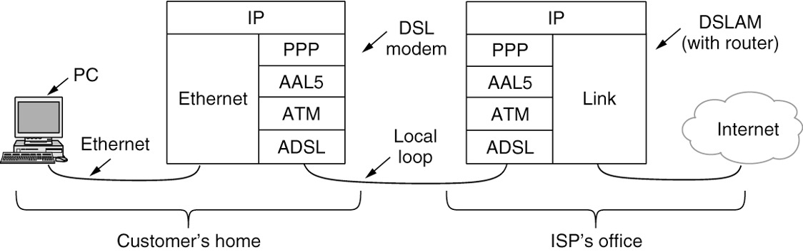


这个图展示了在ADSL（Asymmetric Digital Subscriber Line，非对称数字用户线路）环境中，从用户的家中到互联网服务提供商（ISP）办公室的数据传输过程。

1. **客户家中**：
   - **PC**：个人电脑，通常通过以太网（Ethernet）连接到DSL调制解调器。
   - **DSL调制解调器**：此设备将PC上的以太网数据转换为适合在电话线上传输的ADSL信号。转换过程中，数据首先被封装为PPP（Point-to-Point Protocol，点对点协议）格式，然后进一步封装到AAL5和ATM（Asynchronous Transfer Mode，异步传输模式）中。
2. **本地回路（Local loop）**：是指从客户家中到ISP办公室的物理连接，通常由电话线组成。
3. **ISP的办公室**：
   - **DSLAM**（Digital Subscriber Line Access Multiplexer，数字用户线接入复用器）：它接收来自多个用户的DSL信号，并将这些信号转换为更高速度的互联网连接。DSLAM中有一个路由器功能，将数据重新封装为IP格式并发送到互联网上。
   - **链接**：这里的链接表示从DSLAM到更大的网络（如互联网）的连接。

总体上，图展示了数据从PC，通过DSL调制解调器，传输到ISP办公室的DSLAM，然后进入互联网的流程。


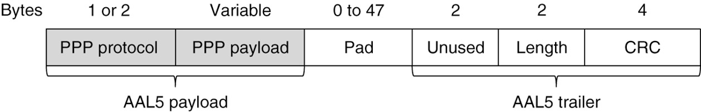


AAL5 frame carrying PPP data

承载PPP数据的AAL5帧

这个图表展示了PPP（Point-to-Point Protocol）在AAL5（ATM Adaptation Layer 5）上的封装结构。

1. **AAL5 payload**：此部分包含了PPP的数据。
   - **PPP protocol**（1或2个字节）：此字段标识PPP载荷中的协议类型。
   - **PPP payload**（可变长度）：此部分包含实际的PPP数据。
2. **AAL5 trailer**：此部分是AAL5帧的尾部，包含以下字段：
   - **Pad**（0到47个字节）：由于ATM单元（cell）的长度是固定的，所以可能需要一些填充字节来确保AAL5帧的长度是ATM单元长度的整数倍。
   - **Unused**（2个字节）：未使用的字段。
   - **Length**（2个字节）：此字段表示AAL5载荷的长度，即PPP数据的长度。
   - **CRC**（4个字节）：循环冗余检查，用于错误检测。

这种封装允许PPP数据在ATM网络上进行传输，而ATM网络使用AAL5作为其自适应层来支持不同类型的服务和数据流。


#### 3.5.3 Data Over Cable Service Interface Specification (DOCSIS)

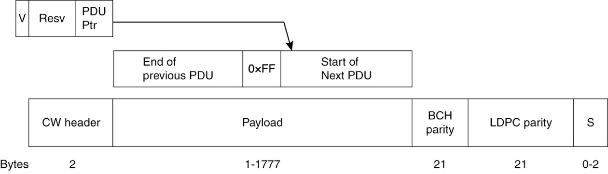

DOCSIS Frame to codeword mapping

DOCSIS 框架到码字的映射

这个图示代表了数字通信中的协议数据单元（PDU）结构及其伴随的纠错机制。以下是具体的解析：

1. **V, Resv, PDU Ptr**：这部分似乎表示某种头部或控制信息。"V" 可能表示版本或有效位，"Resv" 通常代表预留位，而 "PDU Ptr" 很可能代表PDU指针，可能用于指示新PDU的开始或将分段的PDU连接起来。
2. **End of previous PDU to Start of Next PDU**：这表示该系统允许PDU的链接或排序。0xFF 可能被用作分隔符或标记来表示一个PDU的结束和下一个PDU的开始之间的边界。
3. **CW header**：这是码字头。它用于包含关于随后的码字的元数据或控制信息。
4. **Payload**：这是正在传输的主数据，其大小可以从1到1777字节，如所示。
5. **BCH parity**：BCH（Bose，Chaudhuri和Hocquenghem）是用于检测和纠正数字通信中的错误的纠错码。"parity" 数据是添加到原始数据的额外位，允许检测和纠正错误。
6. **LDPC parity**：LDPC代表低密度奇偶校验码。像BCH一样，它是一种纠错码，但它的工作方式不同，特别是在高信噪比的场景中，它以其效率而著称。
7. **S**：这可能是一个间隔符、同步位或其他类型的控制信息。其大小在0到2字节之间变化。

通过添加冗余（通过BCH和LDPC奇偶校验位）以及明确地指出数据的一个单位结束和下一个开始的位置（使用PDU指针和0xFF分隔符），这种结构确保数据可以通过可能的嘈杂信道可靠地传输。


Data Over Cable Service Interface Specification (DOCSIS) 是一个国际标准，它定义了在现有的电缆电视系统上提供高速互联网接入的技术要求。

以下是关于DOCSIS的一些关键点：

1. **背景**：随着互联网的普及，有需要在现有的基础设施上提供高速互联网服务。电缆电视网络，由于其覆盖广泛和高容量，成为了一个理想的选择。
2. **目的**：DOCSIS为电缆运营商提供了一个标准化的方法，使他们能够在其现有的电缆电视系统上提供宽带互联网接入服务。
3. **版本**：DOCSIS已经经历了多个版本的迭代，包括DOCSIS 1.0、1.1、2.0、3.0和3.1。每个版本都在速度、效率和功能上进行了改进。例如，DOCSIS 3.0引入了通道绑定技术，大大提高了上下行速度；而DOCSIS 3.1进一步增加了速度，并引入了更高效的调制技术。
4. **组件**：一个基本的DOCSIS系统包括一个Cable Modem Termination System (CMTS) 设备，位于电缆运营商的设施中，以及用户家中的电缆调制解调器。
5. **特点**：
   - **速度**：随着DOCSIS版本的增加，支持的互联网速度也在增加。例如，DOCSIS 3.1可以支持多达10 Gbps的下行速度和1-2 Gbps的上行速度。
   - **兼容性**：新版本的DOCSIS通常向下兼容旧版本的设备。
   - **频谱效率**：DOCSIS技术允许电缆运营商在同一条电缆上同时提供电视和互联网服务，而不会互相干扰。
6. **全球应用**：DOCSIS在全球范围内被许多电缆运营商采用，为数亿用户提供宽带互联网接入。

总之，DOCSIS是电缆行业为了满足高速互联网接入需求而发展起来的一套关键技术标准。随着技术的进步，DOCSIS将继续为用户提供更快、更可靠的互联网服务.
