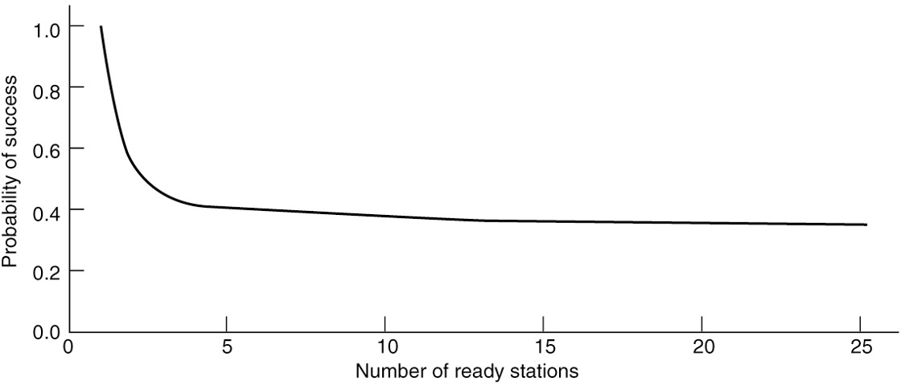
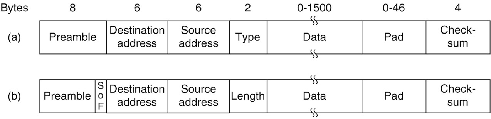
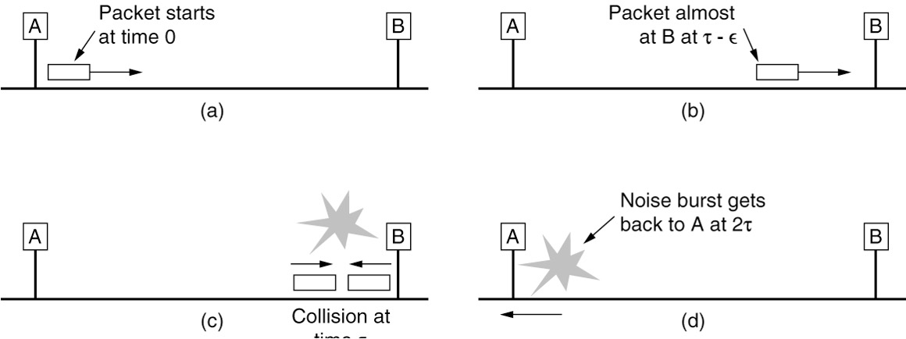

# Chapter 4 The Medium Access Control Sublayer

> Many link-layer communications protocols that we studied in Chap. 3 rely on a broadcast communication medium to transmit data. Any such protocol requires additional mechanisms to allow multiple senders to efficiently and fairly share the broadcast medium. This chapter introduces the se protocols.
>
> In any broadcast network, the key issue involves determining who gets to use the channel when there is competition for it. For example, consider a conference call in which six people, on six different telephones, are all connected so that each one can hear and talk to everyone else. It is very likely that when one of them stops speaking, two or more will start talking at once, leading to chaos. In a face-to-face meeting, chaos is often avoided by a second external channel. For example, at a meeting, people raise their hands to request permission to speak. When only a single channel is available, it is much harder to determine who should go next. Many protocols for solving the problem are known. They form the contents of this chapter. In the literature, broadcast channels are sometimes referred to as multiaccess channels or random access channels.
>
> Th protocols used to determine who goes next on a multiaccess channel belong to a sublayer of the data link layer called the MAC (Medium Access Control) sublayer. The MAC sublayer is especially important in LANS, particularly wireless ones because wireless is naturally a broadcast channel. Some aspects of a WAN (e.g., a direct interconnect) are point-to-point; others (e.g., the shared access network in a cable ISP) are shared and also rely on the MAC layer to facilitate sharing. Because multiaccess channels and LANs are so closely related, in this chapter we will discuss LANs in general, including a few issues that are not strictly part of the MAC sublayer. The main subject here will be control of the channel.
>
> Technically, the MAC sublayer is the bottom part of the data link layer, so logically we should have studied it before examining all the point-to-point protocols in Chap. 3. Nevertheless, for most people , it is easier to understand protocols involving multiple parties after two-party protocols are well understood. For that reason we have deviated slightly from a strict bottom-up order of presentation.

**Medium Access Control**

* In any broadcast network, the key issue involves determining who gets to use the channel when there is competition for it.

  在任何广播网络中，关键问题都涉及在存在竞争时确定谁将使用该频道。

* The protocols used to determine who goes next on a multiaccess channel belong to a sublayer of the data link layer called the **MAC** (**Medium Access Control**) sublayer. 

  用于确定谁下一个访问多址信道的协议属于数据链路层的子层，称为**MAC**(**媒体访问控制**)子层

* Especially important in LANs, particularly wireless ones because wireless is naturally a broadcast 

  channel.

  在局域网中尤其重要，尤其是无线局域网，因为无线天然就是一个广播信道 

## 4.1 **The Channel Allocation Problem**

> 本章的主题是如何在竞争用户之间分配单个广播信道. 信道可以是一个地理区域内的一部分无线频谱, 也可以是连接着多个节点的单根电缆或者光纤, 这都无关紧要. 在这两种情况下, 信道把每个用户与所有其他用户连接在一起, 任何正在使用信道的用户和其他也想使用该信道的用户会互相干扰.

通道分配问题

* Static channel allocation

  静态信道分配

* Assumptions for dynamic channel allocation

  动态信道分配的假设

### ==4.1.1 **Static Channel Allocation**==

* Static allocation
  
  静态分配
  
  * Poor fit to computer systems with extremely bursty data traffic 
  
    不适合具有爆炸性数据流量的计算机系统
  
  * Performance affected when peak traffic to mean traffic ratios are 1000:1
  
    高峰流量与平均流量之比为1000:1时对性能的影响
  
  * Most channels will be idle most of the time
  
    大多数频道大部分时间都是空闲的
  
* Dynamic allocation tries to resolve static allocation problems

  动态分配试图解决静态分配问题

### ==4.1.2 **Assumptions for Dynamic Channel Allocation**==

* Independent traffic

  流量独立

* Single channel

  单信道

* Observable collisions

  冲突可观察

* Continuous or slotted time

  时间连续或分槽

* Carrier sense or no carrier sense

  载波帧听或不听

## 4.2 MULTIPLE ACCESS PROTOCOLS

* ALOHA
* Carrier Sense Multiple Access
* Collision-free protocols
* Limited-contention protocols
* Wireless LAN protocols

### ==4.2.1 ALOHA==

* Pure ALOHA: send the frame when ready, resend if the frame is destroyed

  纯ALOHA:在准备好时发送帧，如果帧被销毁则重新发送

* Slotted ALOHA: required to wait to send a frame for the beginning of the next slot

  时隙ALOHA:需要等待发送帧以开始下一个时隙

In pure ALOHA, frames are transmitted at completely arbitrary times.

在纯ALOHA中，帧在完全任意时间传输

>上图给出了一个ALOHA系统中帧的框架结构. 我们使所有具有同样的长度, 因为对于ALOHA系统, 采用统一长度的帧比长度可变的帧更能达到最大的吞吐量. 
>
>无论何时, 只要两个帧在相同时间试图占用信道, 冲突就会发生, 并且两帧都会被破坏. 如果新帧的第一位与几乎快传完的前一帧的最后一位重叠, 则这两帧都将被彻底毁坏(即具有不正确的校验和), 稍后都必须被重传. 校验和不可能(也不应该)区分出是完全损坏还是局部差错. 坏了就是坏了.

Vulnerable period for the shaded frame

阴影帧的易受冲突周期

> 如上图所示. 假设发送一帧所需的时间为$t$. 如果其他用户在$t_0 ~ t_0 + t$ 之间生成了一帧, 则该帧的结尾部分将与阴影帧的开始部分发生冲突. 实际上, 阴影帧的命运在它的第一位被发出去之前就已经注定了. 但是, 由于在纯ALOHA中, 站在传输之前并不去侦听信道, 所以, 它无法知道是否有其他的帧已经在使用信道上了.

Throughput versus offered traffic for ALOHA systems

ALOHA系统的吞吐量与提供的流量

> 最大的吞吐量出现在当G = 0.5时, S=$1/2e$, 大约等于0.184. 换句话说, 我们可以希望的最好的信道利用率为18%. 这个结果并不令人鼓舞, 但是对于这种任何人都可以随意发送的传输方式, 要想要达到100%的成功率几乎是不可能的.

> ### 纯ALOHA的数字例子
>
> 设想一个小型无线网络，共有5个用户（设备），每个用户随机在任意时间尝试发送数据。我们将时间划分为单位时间段，比如1到10。在纯ALOHA中，这些用户可能在如下的时间尝试发送数据：
>
> - 用户1：时间3
> - 用户2：时间3
> - 用户3：时间5
> - 用户4：时间6
> - 用户5：时间3
>
> 在这个例子中，用户1、2和5在同一时间（时间3）尝试发送数据，导致了碰撞。由于纯ALOHA没有时间限制，用户可以在任何时间尝试发送数据，但如果多个用户同时尝试，就会发生碰撞。在碰撞后，这些用户需要等待一个随机的时间再次尝试发送。
>
> ### 时隙ALOHA的数字例子
>
> 现在，考虑同样的网络，但使用时隙ALOHA协议。在时隙ALOHA中，时间被划分为同样的单位时间段，但用户只能在每个时间段的开始发送数据。同样的用户可能会在如下的时间尝试发送数据：
>
> - 用户1：时间2
> - 用户2：时间4
> - 用户3：时间4
> - 用户4：时间6
> - 用户5：时间8
>
> 在这个例子中，用户2和3在同一时间（时间4）尝试发送数据，导致碰撞。但由于时隙ALOHA限制了发送时间，总体上发生碰撞的概率较低。
>
> ### 比较
>
> 在“纯ALOHA”的数字例子中，由于用户可以在任何时间发送数据，碰撞的几率较高。而在“时隙ALOHA”的数字例子中，由于用户被限制在特定的时间段内发送数据，这减少了多个用户同时发送数据的几率，从而减少了碰撞，提高了整体的网络效率。

### ==4.2.2 Carrier Sense Multiple Access Protocols==

>  如果在一个协议中, 站监听是否存在载波(即是否有传输), 并据此采取相应的动作, 则这样的协议称为载波侦听协议(carrier sense protocol). 

* Persistent and non-persistent CSMA

  持久和非持久CSMA

  * 1-persistent CSMA: If the channel is idle, the stations sends its data. Otherwise, the station just waits until it becomes idle.

     1-持久CSMA:如果信道空闲，站点发送其数据。否则，空间站将一直等待，直到它变为空闲状态

  * Nonpersistent CSMA: If the channel is busy, the station does not continually sense it for the purpose of seizing it immediately.

    非持久CSMA:如果信道繁忙，工作站不会持续感知它，以便立即捕获它

  * p-persistent CSMA: If the channel is idle, it transmits with a probability *p*. With a probability , it defers until the next slot.

    p-持续CSMA:如果信道空闲，它以*p*的概率传输。按照一定的概率，它会推迟到下一个位置

* CSMA with collision detection

  带有碰撞检测的CSMA

  * Known as CSMA/CD (CSMA with Collision Detection)

    称为CSMA/CD(带有碰撞检测的CSMA)

  * Quickly detect the collision and abruptly stop transmitting

    快速检测碰撞并突然停止传输

  * Basis of the classic Ethernet LA

    经典以太网LAN的基础

#### 4.2.2.1 **Persistent and Nonpersistent CSMA**

Comparison of the channel utilization versus load for various random access protocols.

不同随机访问协议的信道使用率与负载比较

> 上图显示了3个协议以及纯ALOHA和分槽ALOHA的可计算吞吐量和负载之间的关系.

#### ==4.2.3 **Collision-Free Protocols**==

* Bit-map protocol

  位图协议

  * Basic bit-map method

    基本的位图方法

  * Reservation protocols

    预留协议

* Token passing

  令牌传递

  * Token bus

    令牌总线

* Binary countdown

  二进制倒计时

  * As soon as a station sees that a high-order bit position that is 0 in its address has been overwritten with a 1, it gives up

    一旦站点看到其地址中的高阶位0被1覆盖，它就放弃

#### ==4.2.3.1 **A Bit-Map Protocol**==

The basic bit-map protocol

> 该无冲突协议采用了基本位图法(basic bit-map protocol), 每个竞争期正好包含N个槽. 如果0号站有一帧数据要发送, 则它在第0个槽中传送1位. 在这个槽中不允许其他站发送. 不管0号站做了什么, 1号站有机会在1号槽中传送1位, 但是只有当它有帧在排队等待时才这样做. 一般地, j号站通过在j号槽中插入1位来声明自己有帧要发送. 当所有N个槽都经过后, 每个站都知道了哪些站希望传送数据. 这时候, 它们便按照数字顺序开始传送数据了.
>
> 由于每个站都同意下一个是谁传输, 所以永远也不会发生冲突. 当最后一个就绪站传送完它的帧后, 这是所有站都很容易检测到的时间, 于是, 另一个N位竞争期又开始了. 如果一个站在它对应的位槽刚刚经过就准备好了要发送的数据, 那它就非常不幸, 只能保持沉默; 直到每个站都获得了发送数据的机会, 新的位图再次到来, 它才能通过位槽表明自己有传输的意愿.

#### ==4.2.3.2 **Token Passing**==

> 令牌传递 
>
> 位图协议的实质是让每个站以预定义的顺序轮流发送一帧. 完成同样事情的另一种方法是通过传递一个称为令牌(token)的短消息, 该令牌同样也是以预定义的顺序从一个站传到下一站. 令牌代表了发送权限. 如果站有个等待传输的帧队列, 当它接收到令牌就可以发送帧, 然后再把令牌传递到下一站. 如果它没有排队的帧要传, 则它只是简单的把令牌传递下去.

Token ring

>在令牌环(token ring) 协议中, 网络的拓扑结构被用来定义站的发送顺序. 所有站连接成一个单环结构, 一个站一次连接到下一个站. 因此令牌传递到下一站只是单纯地从一个方向上接收令牌和在另一个方向上发送令牌, 如上图所示. 帧也按令牌方向传输. 这样, 它们将绕着环循环, 到达任何一个目标站. 然而, 为了阻止帧陷入无限循环(像令牌一样), 一些站必须将它们从换上取下来. 这个站或许是最初发送帧的原始站, 在帧经历了一个完整的环游后将它取下来, 或者是帧的指定接收站.

> Token ring vs Bit-Map: 两者的一个细微差别在于, 因为在周期中所有的位置是均等的, 所以不存在偏向低编号或者高编号一说. 对于令牌环, 么个站在协议采取下一步动作之前只将令牌尽可能发送给它的邻居. 在协议前进到下一步之前不需要将每个令牌传播给全部站.

#### 4.2.3.3 ==Binary Countdown==

The binary countdown protocol. A dash indicates silence.

> 为了避免冲突, 必须使用一条仲裁规则: 一个站只要看到自己的地址位中的0值未知被改写成了1, 则它必须放弃竞争. 如果站0010, 0100, 1001和1010都试图要获得信道, 在第一时间中, 这些站分别传送0,0,1和1. 它们被OR在一起, 得到1. 站0010,0100看到了1, 它们立即明白有高序的站也在竞争信道, 所以它们泛起这一轮的竞争. 二站1001和1010则继续竞争信道.
>
> 接下来的位为0, 于是两者继续竞争; 再接下来的位为1, 所以站1001放弃. 最后的胜者是1010, 因为它有最高的地址. 在赢得了竞争后, 它现在可以传输一帧, 之后又开始新一轮竞争. 该协议由上图所示. 该协议具有这样一种特性, 高序站的优先级比低序站的优先级高, 这可能是好事, 也可能是坏事, 取决于上下文.

### 4.2.4 **Limited-Contention Protocols** 

**有限竞争协议**

* Combines the best properties of the contention and collision-free protocols

  结合了冲突和无冲突协议的最佳特性

* Limited-contention protocol
  
  有限竞争协议
  
  * Use contention at low load to provide low delay
  
    在低负载时使用竞争来提供低延迟
  
  * Used a collision-free technique at high load to provide good channel efficiency
  
    在高负载下使用无碰撞技术以提供良好的信道效率
  
  * Asymmetric protocols
  
    非对称协议
  
* The adaptive tree-walk protocol

  自适应树游走协议

Acquisition probability for a symmetric contention channel 

对称竞争信道的捕获概率

> 从图可以明显看到, 只要减少参与竞争的站数量, 则站获得信道的概率就会增加. 有限竞争协议正是这样做的. 它们首先将u哦所有的站划分成组 (这些组不必是两两不相交的). 只有0号组的成员才允许竞争0号时间槽是空闲的, 或者发生了冲突, 则1号组的成员竞争1号时间槽, 以此类推. 通过适当的分组办法, 可以减少每个时间槽中的竞争数量, 从而使得每个时间槽中的行为接近图的左侧.

#### 4.2.4.1 ==**The Adaptive Tree-Walk Protocol**==

The tree for eight stations

包含8个站的树

至于该算法的计算版本, 很自然地把站看作是二叉树的叶节点, 如图所示, 在一次成功传送之后的第一个竞争槽, 即0号槽中, 允许所有的站禅师获取信道. 如果它们之中的某一个获得了信道, 则很好; 如果发生了冲突, 则在1号槽中, 只有位于树中2号节点之下的那些站才可以参与竞争. 如果其中的某个站获得了信道, 则在该站发送完一帧之后的那个槽被保留给位于节点3下面的那些站. 另一方面, 如果节点2下面的两个或者多个站都要传输数据, 则在1号槽中就会发生冲突, 此时, 下一个槽, 即2号槽就由位于节点4下面的站来竞争.

> 假设站点C和站点G同时尝试发送数据:
>
> 首先在根节点(1)检测到冲突, 接下来, 协议检测左子树(2). 由于C在这个子树中, 会检测到冲突. G不在这个子树, 所以它不会影响左子树的检测结果.
>
> **进一步遍历子树**：协议接着检测节点4和节点5。因为C位于节点5下，节点4不会检测到冲突，而节点5会检测到冲突。
>
> **确定冲突站点**：
>
> 最后，协议检测节点5下的叶子节点（站点C和站点D）。在这一步中，只有站点C试图发送数据，因此没有冲突。现在，站点C可以发送数据。
>
> **继续检测右子树**：
>
> - 一旦站点C发送完毕，协议重新从根节点开始检测，这次转向右子树（节点3）。
> - 然后，它将继续检测节点6和节点7，最终确定节点7下的站点G可以发送数据。

### ==4.2.5 **Wireless LAN Protocols**== 

无限局域网协议

A wireless LAN. (a) *A* and *C* are hidden terminals when transmitting to *B*. (b) *B* and *C* are exposed terminals when transmitting to *A* and *D*.

无线局域网。(a)传输到*B*时，a和C是隐藏终端。(b)当传输到*A*和*D*时， b 和C是暴露终端。

> 使用无线LAN的一种单纯想法式尝试使用CSMA: 每个站侦听是否有其他站在传输, 并且只有当没有其他站在传输数据时它才传输. 这种方法的麻烦在于协议并未考虑无线传输特性, 因为这里的冲突发生在接收方, 而不是发送方. 为了看清楚问题的实质, 考虑上图所示的4个无线站的情形. 对于我们的问题描述来说, 这些无线站到底时基站还是笔记本电脑无关紧要. 无线电的覆盖范围时这样的: A和B都在对方范围内, 可能潜在地相互之间有干扰; C也可以潜在地干扰到B和D, 但不会干扰A.
>
> 首先考虑当A和C向B传送数据时的情形, 如(a)所示. 如果A开始发送, 然后C立即进行监听介质, 它将不会听到A的传输, 因为A在它的覆盖范围之外. 因此C错误地得出结论: 它可以向B传送数据. 如果C传送数据, 将在B处产生冲突, 从而扰乱A发来的帧. (我们假设没有类似CDMA的编码模式可以提供多信道传输, 因此冲突会扰乱信号, 从而破坏两个帧) 我们需要一个MAC协议, 它能防止这种冲突的发生, 因为冲突将导致带宽的浪费. 由于竞争者离得太远而导致站无法检测到潜在的竞争者, 这个问题称为隐藏终端问题(hidden station problem).
>
> 另一种不同的情形: B向A传送数据, 同时C想给D发送数据, 如(b)所示. 如果C侦听介质, 它会听到有一个传输正在进行, 从而会错误地得出结论: 它不能向D发送数据(图中的虚线表示). 事实上, C所听到的传输只会搞坏B和C之间区域的接受, 但是, 两个接收方都不在这个危险区域. 我们需要一个MAC协议, 它能防止此类延迟传输的发生. 这个问题称为暴露终端问题. 

The basic idea behind it is for the sender to stimulate the receiver into outputting a short frame, so stations nearby can detect this transmission and avoid transmitting for the duration of the upcoming (large) data frame.

> 它背后的基本思想是，发送端刺激接收端输出一个短帧，以便附近的站点可以检测到这种传输，并在即将到来的(大)数据帧期间避免传输。

The MACA protocol. (a) *A* sending an RTS to *B*. (b) *B* responding with a CTS to *A*.

> MACA协议。(a) a 向B发送RTS。(b)  b 对 a进行CTS响应。

> 能处理无线LAN这些问题的一个早期且有影响力的协议是冲突避免多路访问(MACA, Multiple Access with Collision Avoidance). MACA的基本思想是发送方刺激接收方输出一个短帧, 以便其附近的站能检测到该次传输, 从而避免在接下去进行的(较大)数据帧传输中也发送数据. 这项技术被用来替代波侦听.
>
> 上图说明了MACA协议, 现在考虑A如何向B发送一帧. A首先给B发送一个RTS(Request To Send) 帧. 如图(a)所示, 这个短帧(30字节)包含了随后将要发送的数据帧的长度; 然后,  B用一个CTS(Clear to Send) 作为应答, 如(b)所示. 此CTS帧也包含了数据长度(从RTS帧中复制过来). A在收到了CTS帧之后便开始传输.
>
> 如果其他站也听到了这些帧, 如果一个站听到了RTS帧, 那么它一定离A很近, 它必须保持沉默, 至少等待足够长的时间以便在无冲突情况下CTS被返回给A. 如果一个站听到了CTS, 则它一定离B很近, 在接下来的数据传送过程中它必须一直保持沉默, 只要检查CTS帧, 该站就可以知道数据帧的长度(即数据传输要持续多久).
>
> 上图中, C落在A的范围内, 但不在B的范围内. 因此, 它听到了A发出的RTS, 但是没有听到B发出的CTS. 只要它没有干扰CTS, 那么在数据帧传送过程中, 它可以自由地发送任何信息. 相反, D落在B的范围内, 但不在A的范围内. 它听不到RTS帧, 但是听到了CTS帧. 只要听到了CTS帧, 这意味着它与一个将要接受数据帧的站离得很近; 所以, 它就延缓发送任何信息直到那个帧如期传送完毕. 站E听到了这两条控制消息, 与D一样在数据帧完成之前它必须保持安静.

## 4.3 **Ethernet**

以太网

* Classic Ethernet physical layer

  经典的以太网物理层

* Classic Ethernet MAC sublayer protocol
  
  经典以太网MAC子层协议
  
  * CSMA/CD with binary exponential backoff
  
    具有二进制指数回退的CSMA/CD
  
* Ethernet performance

  以太网性能

* Switched Ethernet

  交换式以太网

* Fast Ethernet

  快速以太网

* Classic Ethernet physical layer

  经典的以太网物理层

* Classic Ethernet MAC sublayer protocol
  
  经典以太网MAC子层协议
  
  * CSMA/CD with binary exponential backoff
  
    具有二进制指数回退的CSMA/CD
  
* Ethernet performance

  以太网性能

* Switched Ethernet

  交换式以太网

* Fast Ethernet

  快速以太网

* The story of Ethernet starts about the same time as that of **ALOHA**, when a student named **Bob** Metcalfe got his bachelor’s degree at M.I.T. and then started his Ph.D. at Harvard.

  以太网的故事与**ALOHA**的故事几乎是在同一时期开始的，当时有一个名叫**Bob**的学生在麻省理工学院获得了学士学位，然后在哈佛大学获得了博士学位。

* He became so interested in it that, he decided to spend the summer in **Hawaii** working with **Abramson** before starting work at **PARC** (Palo Alto Research Center).

  他对此非常感兴趣，决定在进入**PARC**(帕洛阿尔托研究中心)工作之前，去**夏威夷**和**Abramson**一起工作

* Using his knowledge of Abramson’s work, he, together with his colleague **David** Boggs, designed and implemented the first **local area network** (Metcalfe and Boggs, 1976).

  利用他对Abramson工作的了解，他和他的同事**David** Boggs，设计并实现了第一个**局域网** (Metcalfe and Boggs, 1976)

* It used a single long, thick **coaxial** cable and ran at **3** Mbps.

  它使用一根又长又粗的**同轴**电缆，以**3** Mbps的速度运行。

### ==4.3.1 **Classic Ethernet Physical Layer**==

* The first variety, popularly called **thick Ethernet,** resembled a yellow garden hose, with markings every 2.5 meters to show where to attach computers. 

  第一个产品, 俗称粗以太网, 用类似黄色的花园用软管连接着所有的计算机, 在电缆的每2.5米处有个标记, 这个标记就是连接着计算机的位置(802.3 标准实际上并没有要求电缆是黄色, 但它确实建议用黄色)

* It was succeeded by **thin Ethernet,** which bent more easily and made connections using industry-standard BNC connectors. 

  它的继任者是细以太网, 电缆比粗以太网柔软, 更加易于弯曲, 并且使用了工业标准BNC接头. 

* Thin Ethernet was much **cheaper and easier** to install, but it could run for only **185** meters per segment (instead of **500** m with thick Ethernet), each of which could handle only **30** machines (instead of **100**).

  细以太网更便宜也更容易安装, 但它单段电缆仅185米 (而不是粗以太网的500米)长, 且每段电缆只能处理30台计算机(而不是100台).

* To allow larger networks, multiple cables can be connected by **repeaters**.

  为了允许建设更大的网络, 可以用中继器(repeater)把多条电缆连接起来. 中继器是一个物理层设备, 它能接收,放大(即再生)并在两个方向上重发信号. 

### ==4.3.2 **Classic Ethernet MAC Sublayer Protocol**== 

Frame formats. (a) Ethernet (DIX). (b) IEEE 802.3.

* First comes a *Preamble* of 8 bytes, each containing the bit pattern 10101010 (with the exception of the last byte, in which the last 2 bits are set to 11). 

  第一个是8字节的*前导*，每个包含位模式10101010(除了最后一个字节，最后两个比特位设置为11)。

* Sending to a group of stations is called **multicasting**. The special address consisting of all 1 bits is reserved for **broadcasting**.

  发送到一组站点称为**多播**。由全部1比特组成的特殊地址被保留用于**广播**

* An interesting feature of station source addresses is that they are globally unique, assigned centrally by IEEE

  站点源地址的一个有趣特性是，它们是全球唯一的，由IEEE集中分配

* If the data portion of a frame is less than 46 bytes, the **Pad** field is used to fill out the frame to the minimum size.

  如果帧的数据部分小于46字节，则使用**Pad**字段将帧填充到最小大小

Collision detection can take as long as 2*t*.

Another (and more important) reason for having a minimum length frame is to **prevent a station from completing the transmission** of a short frame before the first bit has even reached the far end of the cable, where it may collide with another frame. 

> 碰撞检测可能需要2*t*时间。
>
> 使用最小帧长度的另一个(更重要的)原因是，在第一个比特到达电缆远端之前，**防止站点完成**短帧的传输，因为它可能会与另一个帧发生冲突。

> 上图, 在0时刻, 位于电缆一端的站A发出一帧. 假设该帧到达另一端的传播时间为t. 正好在该帧到达另一端之前的某一时刻(即, 在t-e时刻), 位于最远处的站B开始传送数据. 当B检测到它所接收到的信号比它发送的信号更强时, 它知道已经发生了冲突, 所以放弃了自己传送, 并且产生一个48位的突发噪声以警告所有其他站. 换句话说, 它阻塞了以太电缆, 以确保发送方不会漏检这次冲突. 大约在2t后, 发送方看到了突发噪声, 并且页放弃了自己的传送. 然后它等待一段随机的时间, 再次重试.

### ==4.3.3 **Ethernet Performance**==

Efficiency of Ethernet at 10 Mbps with 512-bit slot times

> 上图给出了利用等式$信道效率=\frac{1}{1+2BLe/eF}$, 在$2t=51.2$ 微妙以及10Mbps数据速率的情况下, 信道效率与就绪站数之间的关系. 对于64字节的时间槽时间, 64字节的帧并不是最有效的, 这并不奇怪. 另一方面, 当帧长度为1024字节, 以及每个竞争间隔趋近于e个64字节时间槽时, 竞争期为174字节长, 效率为85%. 这个结果比分槽ALOHA的37%利用率要好得多.

### ==4.3.4 **Switched Ethernet**==

交换式以太网 

(a) Hub. (b) Switch.

* The wires were **telephone company twisted pairs**, since most office buildings were already wired this way and normally plenty of spares were available. 

  电线是**电话公司的双绞线**，因为大多数办公大楼已经用这种方式连接，通常有大量的备用电线。

* This reuse was a win, but it did **reduce the maximum cable run** from the hub to 100 meters (200 meters if high-quality Category 5 twisted pairs were used). 

  这种重用是一种胜利，但它确实**将最大电缆长度**从集线器减少到100米(如果使用高质量的5类双绞线，则为200米)。

* Adding or removing a station is simpler in this configuration, and cable breaks can be detected easily. 

  在这种配置中，添加或删除一个站点更简单，并且可以很容易地检测到电缆断裂。

> 以太网的发展很快, 从单根长电缆的典型以太网结构开始演变. 单根电缆存在的问题, 比如找出断裂或者松动位置等与连接相关的问题, 趋势人们开发出一种不同类型的布线模式. 在这种模式中, 每个站都有一条专用癫痫连接到一个中央集线器. 集线器只是在电气上简单地连接所有连接线, 就像把它们焊接在一起. 这种配置如(a) 所示.
>
> 为了可以处理不断增长的负载: 即交换式以太网. 这种系统的核心是一个交换机(switch), 它包含一块连接所有端口的高速背板, 如(b)所示.

An Ethernet switch

以太网交换机

> 上图, 右上角的端口并没有连接一台计算机, 而是连到一个12口的集线器. 当帧到达集线器, 它们按通常的方式竞争以太网, 包括冲突和二进制指数后退. 竞争成功的帧被传到集线器, 继而到达交换机, 在那里得到的处理就想任何其他输入帧一样. 交换机不知道它们是经过竞争才到这里的. 一旦进入交换机, 它们就被发送到高速背板上的正确出线.也有可能正确目的地是连接到集线器的一根线, 在这种情况下, 帧早已经被交付给目标机器, 因此交换机就把它丢弃.

> 从外面看, 交换机很像集线器. 它们都是一个盒子, 通常拥有4~48个端口, 每个端口都有一个标准的RJ-45连接器用来连接双绞线电缆. 每根电缆把交换机或者集线器与一台计算机连接. 如上图所示. 
>
> 交换机具有集线器同样的优点. 通过简单的插入或者拔出电缆就能完成增加或者删除一台机器, 而且由于片状电缆或者端口通常只影响到一台机器, 因此大多数错误都很容易被发现. 

* When a switch port receives an Ethernet frame from a station, the switch checks the Ethernet addresses to see which port the frame is destined for. 

  当一个交换机端口从一个站点接收到一个以太网帧时，交换机检查以太网地址以确定帧的目的地端口。

* The switch then forwards the frame over its high-speed backplane to the destination port.

  然后交换机通过其高速背板将帧转发到目的端口。

* The destination port then transmits the frame on the wire so that it reaches the intended station.

  然后，目标端口在线路上传输帧，以便它到达预期的站点。

* In a hub, all stations are in the same **collision domain**. They must use the CSMA/CD algorithm to schedule their transmissions. 

  在一个集线器中，所有站点都在同一个**碰撞域**中。它们必须使用CSMA/CD算法来调度它们的传输。

* In a switch, each port is its own **independent collision domain**. Collisions are now impossible, and CSMA/CD is not needed.

  在交换机中，每个端口都是自己的**独立碰撞域**。现在不可能发生冲突，也不需要CSMA/CD。

* A switch improves performance over a hub in **two** ways. First, since there are **no collisions**, the capacity is used more efficiently. Second, and more importantly, with a switch multiple frames can be sent **simultaneously** (by different stations).

  交换机通过**两种**方式提高集线器的性能。首先，由于**没有冲突**，容量的使用效率更高。其次，也是更重要的，通过交换机可以**同时**(由不同的站点)发送多个帧。

  (这也是交换机的性能优于集线器的两方面原因).

  

### ==4.3.5 **Fast Ethernet**==

快速以太网

The original fast Ethernet cabling

最初的快速以太线缆

The basic idea behind fast Ethernet was simple: keep all the old frame formats, interfaces, and procedural rules, but reduce the bit time from 100 nsec to 10 nsec.

快速以太网的基本思想非常简单: 保留原来的帧格式, 接口和过程规则, 只是将比特时间从100纳米降低到10纳秒.

### ==4.3.6 **Gigabit Ethernet**== 

千兆以太网

Like fast Ethernet, all configurations of gigabit Ethernet use point-to-point links. 

与快速以太网一样, 千兆以太网使用点到点链路. 

(a) A two-station Ethernet. (b) A multistation Ethernet.

> 最简单的配置, 如(a) 所示, 两台计算机直接相连. 然而, 较常见的情况下, 使用一个交换机或集线器连接多台计算机, 和额外的交换机或集线器, 如(b)所示. 在这两种配置下, 每根单独的以太网电缆上正好有两个设备, 一个也不多一个也不少.

Gigabit Ethernet cabling

千兆以太网线缆

> 千兆以太网既支持铜线, 也支持光纤, 如上图所示.

### ==4.3.7 **10-Gigabit Ethernet**==

万兆以太网

10-Gigabit Ethernet cabling

万兆以太网布线

**Small home office** 

**Your turn**

Design a network for SMU networking lab using ethernet. 

Concern

1. How many devices?
2. Area of the room?
3. How many hub or switch?
4. How many router?
5. What kind of cable?
6. Anything else?

## 4.4 **Wireless LANs**

* 802.11 architecture and protocol stack

* 802.11 physical layer

* 802.11 MAC sublayer protocol

* 802.11 frame structure

* Services

### ==4.4.1 **The 802.11 Architecture and Protocol Stack**==

> 802.11 网络的使用模式有两种. 最普遍使用的把客户端(比如笔记本电脑和智能手机客户端), 连接到另一个网络(比如公司内联网或Internet). 这种模式如?(a).

802.11 architecture. (a) Infrastructure mode. (b) Ad-hoc mode.

In **infrastructure** mode, each client is associated with an **AP** (**Access Point**) that is in turn connected to the other network. The client sends and receives its packets via the AP. Several access points may be connected together, typically by a wired network called a **distribution system.**

在有架构模式下, 每个客户和接收数据包都要通过AP进行. 几个接入点可通过一个称为分布式系统的有线网络连接在一起, 形成一个扩展的802.11网络. 

> 另一种模式如(b)所示, 是一种功能自组织网络. 这种模式下的网络由一组相互关联的计算机组成, 它们相互之间可以直接向对方发送帧. 这里没有接入点. 由于Internet接入是无线的杀手级应用, 自组织网络并没有那么受欢迎.

Part of the 802.11 protocol stack

802.11协议栈的组成部分

> 客户端和AP的协议栈相同. 物理层对应于OSI的物理层, 但所有的802协议的数据链路层分为两个或更多个子层. 在802.11中, 介质访问控制(MAC, Medium Access Control)子层决定如何分配信道, 也就是说下一个谁可以发送. 在它上方的是逻辑链路控制(LLC, Logical Link Control) 子层, 它的工作是隐藏802系列协议之间的差异, 使它们在网络层看来并无差别.

### ==4.4.3 **The 802.11 MAC Sublayer Protocol**==

Sending a frame with CSMA/CA

> 上图给出了一个发送帧的时序例子. A站首先发出一个帧. 当A发送时, B站和C站准备就绪发送. 它们看到信道正忙, 便等待它变成空闲. 不久, A收到一个确认, 信道进入空闲状态. 然而, 不是两个站都发出一帧从而立即产生冲突, 而是B站和C站都执行后退算法. C站选择了一个较短的后退时间, 因而先获得发送权. B站侦听到C在使用信道时暂停自己的倒计时, 并在C收到确认之后立即恢复倒计时. 一旦B完成了后退, 立即发送自己的帧.

> 第二个问题在于不同站的传输范围可能有所不同. 有线环境下, 系统被设计成让所有站都可以听到对方. 在射频传播的复杂环境下, 这种状况并不适用于无线站. 因此, 类似前面提到的隐藏终端等问题就会出现.

(a) The hidden terminal problem. (b) The exposed terminal problem.

> (a) 再次说明了隐藏终端问题. 因为不是所有的站都在彼此的无线电广播范围内, 因此蜂窝中一部分正在进行的传输无法被同一蜂窝中的其他地方收听到. 在这个例子中, C站正在给B站发送. 如果A站侦听通道, 它将听不到任何东西, 因而错误地认为它可以开始给B站传输了. 显然, 这一决定将导致冲突的发生.

> 相反的情况是暴露终端问题, (b). B想要给C发送, 所以它会去侦听信道. 当B听到信道上有帧在传送, 它便错误地认为可能无法发送到C, 即使事实上A或许在给D(未显示)传输. 显然, 这个决定浪费了一次传输机会.

With virtual sensing, each station keeps a logical record of when the channel is in use by tracking the **NAV** (**Network Allocation Vector**).

使用虚拟感知，每个站点通过跟踪**导航**(**网络分配向量**)来保持信道何时使用的逻辑记录。

Virtual channel sensing using CSMA/CA

使用CSMA/CA 的虚拟信道侦听

> 可选的RTS/CTS机制使用NAV来防止隐藏终端在同一时间发送. 该机制如上图所示. A想给B发送, C是A范围内的一个站(也有可能在B的范围内, 但这并不重要). D在B范围内, 但不在A的范围内.
>
> 该协议开始于当A决定向B发送数据时. A首先给B发送一个RTS帧, 请求对方允许自己发送一个帧给它. 如果B接收到这个请求, 它就以CTS帧作为应答, 表明信道被清除可以发送. 一旦收到CTS帧, A就发送数据帧, 并启动一个ACK计时器. 当正确的数据帧到达后, B用一个ACK帧回复A, 完成此次交流. 如果A的ACK计时器超时前, ACK没有返回, 则可视为发生了一个冲突, 经过一次后退整个协议重新开始运行.
>
> 从C和D的角度来看这次数据交流. C在A的范围内, 因此它可能会收到RTS帧. 如果收到了, 它就意识到很快有人要发送数据. 从RTS请求帧提供的信息, 可以估算出数据序列将需要传多长时间, 包括最后的ACK. 因此, 它才去了有利于所有人的做法, 停止传输任何东西, 直到此次数据交换完成. 它通过更新自己的NAV记录表明信道正忙, 如图所示. D无法听到RTS, 但它确实听到了CTS, 所以它也更新自己的NAV. 请注意, NAV信号是不传输的, 它们只是由站内部使用, 提醒自己保留一定时间内的安静.

> 尽管RTS/CTS在理论上听起来不错, 但它却落入那些已被证明在实践中几乎没有价值的设计之列. 首先, 它对短帧(替代RTS发送)或AP(按照定义, 大家都能彼此听到) 一点好处都没有. 对于其他情况, 该机制只会降低操作速度.

> 802.11用一个巧妙的机制来提供这种服务质量, 它作为一组扩展于2005年被引入的, 标准命名为802.11e. 它扩展了CSMA/CA, 并且仔细定义帧之间的各种实践间隔. 一帧发出去后, 需要保持一段特定时间的空闲以便检查信道不再被用, 然后任何站才可以发送帧. 这里的关键就在于不同类型的帧确定不同的时间间隔.

Interframe spacing in 802.11

802.11 中的帧间间隔

> 5个时间间隔如图所示. 常规的数据帧之间的间隔称为DCF帧间隔(DIFS, DCF InterFrame Spacing). 任何站都可以在介质空闲DIFS后尝试抓取信道发送一个新帧. 采用通常的竞争规则, 如果发生冲突或许还需要二进制指数后退. 最短的间隔是短帧间间隔(SIFS, Short InterFrame Spacing). 它允许一次对话的各方具有优先抓住信道的机会. 例子包括让接收方发送ACK, 注入RTS和CTS的其他控制帧序列, 或者让发送方突发一些列段. 发送方只需要等待SIFS即可发送下一段, 这样做是为了阻止一次数据交流中间被其他站横插一帧.
>
> 两个仲裁帧间空间(AIFS, Arbitration InterFrame Space) 间隔显示了两个不同优先级的例子. 短的时间间隔AIFS1小于DIFS, 但比SIFS长. 它被AP用来把语音或比其他高优先级流量移到行头. AP将等待一段较短的时间间隔, 然后发送语音流量, 这样语音流量得以在常规流量移到行头. AP将等待一段较短的时间间隔, 然后发送语音流量, 这样语音流量得以在常规流量之前发送出去. 较长的时间间隔AIFS4比DIFS还打, 用它来发送可以延迟到常规流量优先发送的机会. 完善的服务质量机制定义了四种不同的优先级别,分别具有不同的后退参数和不同的空闲参数.

### ==4.4.4 **The 802.11 Frame Structure**==

Format of the 802.11 data frame

> 首先是帧控制(Frame Control) 字段. 它本身有11个子字段, 其中第一个子字段是协议版本(Protocol Version) , 正是有了这个字段, 将来可以在用一个蜂窝内同时运行协议的不同版本. 
>
> 接下来是类型(Type)字段(比如数据帧, 控制帧或者管理帧) 和子类型(Subtype)字段比如RTS或者CTS.去往DS((To DS)和来自DS(From DS)标志位分别表明该帧是发送到或者来自于AP连接的网络,该网络称为分布式系统. 更多段(More fragment)标志位意味着后面还有更多的段. 重传(Retry)标志位表明这是以前发送的某一帧的重传. 电源管理(Power management)标志位指明发送方进入节能模式. 更多数据(More data) 标志位表明发送方还有更多的帧需要发送给接收方. 受保护的(Protected Frame)标志位指明该帧的帧题已经被加密. 最后顺序(Order)标志位告诉接收方高层希望严格按照顺序来处理帧序列.

### ==4.4.5 **Services**==

* Association and data delivery

  关联和数据传递

* Security and privacy

  安全和隐私

* Prioritization and power control 

  优先级和权力控制

## 4.5 **Bluetooth**

* Bluetooth architecture
* Bluetooth applications
* Bluetooth protocol stack
* Bluetooth radio layer
* Bluetooth link layers
* Bluetooth frame structure
* Bluetooth 5

### ==4.5.1 **Bluetooth Architecture**==

Two piconets can be connected to form a scatternet

两个微微网可以连接起来形成散列网

The basic unit of a Bluetooth system is a **piconet**, which consists of a controller node and up to seven active worker nodes within a distance of 10 meters. An interconnected collection of piconets is called a **scatternet**.

蓝牙系统的基本单元是**微网**，它由一个控制节点和10米内多达7个活动的工作节点组成。一个相互连接的微微网集合被称为**分散网**。

> 如上图所示, 在同一个大房间中可以同时存在多个微网, 它们甚至可以通过一个桥节点连接起来, 该桥节点必须加入多个微网. 一组相互连接的微网称为一个散网.

### ==4.5.3 **The Bluetooth Protocol Stack**==

The Bluetooth protocol architecture

蓝牙协议体系结构

* The **link control (or baseband)** layer includes elements of the physical layer. It deals with how the controller controls time slots and how these slots are grouped into frames. 

  **链接控制(或基带)**层包括物理层的元素。它处理控制器如何控制时隙以及如何将这些时隙分组为帧。

* The **link** **manager** handles the establishment of logical channels between devices, including power management, pairing and encryption, and quality of service. 

  **link** **manager**处理设备之间逻辑通道的建立，包括电源管理、配对和加密以及服务质量。

* **L2CAP** (**Logical Link Control Adaptation Protocol**) frames variable-length messages and provides reliability if needed.

  **L2CAP**(**逻辑链路控制适配协议**)帧可变长消息，并在需要时提供可靠性。

### ==4.5.6 **The Bluetooth Frame Structure**== 

Typical Bluetooth data frame at (a) basic and (b) enhanced data rates.

典型的蓝牙数据帧在(a)基本和(b)增强的数据速率。

It begins with an **access code** that usually **identifies the controller** so that workers within radio range of two controllers can tell which traffic is for them. Next comes a 54-bit **header** containing **typical MAC sublayer fields**. If the frame is sent at the basic rate, the data field comes next.

它以一个**访问码**开始，通常**标识控制器**，以便两个控制器的无线电范围内的工作人员可以知道哪些流量是属于他们的。接下来是一个54位的**header**，其中包含**典型的MAC子层字段**。如果帧以基本速率发送，接下来就是data字段。

> 地址(Addr)字段标识了该帧的接收目标, 指向8个活跃设备中的某一个. 类型(Type)字段标识了帧的类型(ACL, SCO, 轮询或者空), 数据字段中所使用的纠错码类型, 以及该帧的时间槽长度. F(Flow)流标志位由从节点设置, 当它缓冲区为满不能再接受任何数据时, 利用该比特来声明不能接受数据的事实. 这是流量控制的基本形式. A(Acknowledegement) 确认标志指明在一帧中捎带了一个ACK. S(Sequence) 序列被用于帧的编号, 以便接收方检测重传帧. 协议采用停-等式控制机制, 因此1位序号就够了. 然后是8比特的头校验和CRC. 整个18位的头重复3次, 由此构成了上图的54位的头. 在接收方, 一个简单的电路检查这3份副本中的每一位. 如果3份副本都相同, 则该位被接受; 如果不相同, 则少数服从多数. 因此, 54位的容量被用来发送10位头. 这种做法的原因在于, 要想在一个噪声环境中用廉价的, 计算能力弱的低功耗(2.5毫瓦)设备可靠地发送数据, 大量的冗余是必需的. 

### ==4.5.7 **Bluetooth 5**==

* Support for Internet of Things devices

  支持物联网设备

* Speed increased from 1 Mbps to 2 Mbps

  速度从1 Mbps提升到2 Mbps

* Message size has gone up from 31 bytes to 255 bytes

  消息大小从31字节增加到255字节

* Range indoors has gone up from 10 m to 40 m

  室内距离从10米增加到40米

* Power requirements have been reduced slightly

  功耗略有降低

* Slightly better security

  更好的安全性

## ==4.6 **DOCSIS**==

### ==4.6.1 Overview==

概述

* MAC sublayer performs channel allocation, configuration of quality of service, unique forwarding model

  MAC子层执行信道分配，配置服务质量，独特的转发模型

* Uses a standard MAC frame format

  使用标准的MAC帧格式

### ==4.6.2 Ranging==

* Cable modem transmits a ranging request

  电缆调制解调器发送测距请求

* CMTS (headend) determines the network delay to the cable modem and performs necessary power adjustment

  CMTS(头端)确定到电缆调制解调器的网络延迟，并执行必要的功率调整

### ==4.6.3 Channel bandwidth allocation==

信道带宽分配

* Service flows

  服务流程

* Request-grant process and low-latency DOCSIS

  请求授权过程和低延迟的DOCSIS

> 这部分内容详细介绍了DOCSIS技术的几个关键组成部分和操作过程：
>
> #### 4.6.1 概述
>
> 1. **MAC子层**：在DOCSIS标准中，MAC（媒体访问控制）子层负责多个关键任务，包括：
>    - **信道分配**：确定哪个设备可以在何时使用网络的哪个部分。
>    - **服务质量配置**：设置网络流量的优先级，确保重要的数据流（如实时视频）获得所需的带宽和低延迟。
>    - **独特的转发模型**：定义了数据如何在网络中转发，可能涉及了数据如何在多个调制解调器或不同服务流之间传递的规则。
> 2. **标准MAC帧格式**：这意味着所有的DOCSIS设备使用一个统一的数据包格式来沟通，这样可以确保不同制造商生产的设备能够互相兼容。
>
> #### 4.6.2 测距
>
> 1. **测距请求**：电缆调制解调器向CMTS（电缆调制解调器终端系统，通常位于有线电视公司的中心办公室或数据中心）发送一个请求，开始测距过程。
> 2. **网络延迟和功率调整**：CMTS接收到测距请求后，计算信号从CMTS到调制解调器的传播时间（网络延迟），并据此调整发送给调制解调器的信号功率，以确保信号质量和网络的高效运行。
>
> #### 4.6.3 信道带宽分配
>
> 1. **服务流程**：在DOCSIS中，服务流程是指从ISP到用户设备（或反过来）的一系列数据传输活动。这些流程可以根据数据的类型（如视频流、文件下载等）和服务质量要求进行调整。
> 2. **请求授权过程**：这是一个机制，调制解调器向CMTS请求发送数据的权限。CMTS会根据网络条件、服务质量要求等因素批准请求，并分配带宽。
> 3. **低延迟DOCSIS**：这是DOCSIS的一个版本或特性，专门设计用来减少数据传输的延迟，非常适合对时延敏感的应用，比如在线游戏或视频会议。
>
> 这些组件和过程共同工作，使得DOCSIS能够在同轴电缆基础上提供高速、高效、可靠的互联网接入服务。

## 4.7 **Data Link Layer Switching**

* Uses of bridges

  桥接器的用途

* Learning bridges

  学习桥梁

* Spanning tree bridges

  生成树桥接器

* Repeaters, hubs, bridges, switches, routers, and gateways

  中继器、集线器、网桥、交换机、路由器和网关

* Virtual LANs

  虚拟局域网

  * The IEEE 802.1Q standard

    IEEE 802.1Q标准

### ==4.7.2 **Learning Bridges**== 

> 两个局域网桥接在一起的拓扑结构分两种情况

(a) Bridge connecting two multidrop LANs. (b) Bridges (and a hub) connecting seven point-to-point stations.

> 在做左侧, 两个多点局域网, 比如经典以太网通过一个特殊的站连接在一起, 这个站就是同属于两个局域网的网桥. 在右侧, 局域网用点到点电缆连接在一起, 包括一个集线器. 网桥是站和集线器都能与之相连的设备. 如果LAN技术是以太网, 则网桥就是广为人知的以太网交换机.
>
> 网桥开发之时正是经典以太网被广泛使用之际, 所以它们常常表现为具有多点电缆的拓扑结构, 如(a)所示. 然而, 今天遇到的拓扑结构都由点到点线缆和交换机组成. 网桥在两种设置下以相同的方式工作. 所有附在网桥同一端口的站都属于同一个冲突域, 该冲突域和其他端口的冲突域是不同. 如果存在多个站, 例如传统的以太网, 集线器或半双工链路, 那么帧的发送需要用到CSMA/CD协议.
>
> 然而, 在如何构建桥接局域网上, 两种情况还是有区别的. 为了桥接多点局域网, 网桥的加入犹如在每个多点局域网上增加了一个新站, 如(a). 为了桥接点到点局域网, 要么集线器连到网桥, 或者最好换成网桥以便提高性能. (b)显示出了一个集线器外, 其余都用网桥替代了.

> 网桥（Bridge）和集线器（Hub）是两种用于连接网络设备的硬件，但它们在工作原理和功能上有显著差异。
>
> 1. **基本功能**：
>    - **集线器**：集线器是一种基本的网络设备，工作在OSI模型的物理层。它仅仅作为一个信号的中继器，将接收到的信号复制并发送到所有其他端口。集线器不会处理或检查通过其传输的数据。
>    - **网桥**：网桥工作在OSI模型的数据链路层。它不仅转发数据，还能检查数据包的MAC地址，并根据这些地址决定是否以及到哪里转发这些数据包。网桥可以将两个或多个网络段连接起来，同时还能过滤流量，减少不必要的数据传输。
> 2. **数据处理**：
>    - **集线器**：由于集线器将数据广播到所有端口，因此它不能有效地管理网络流量，可能会导致数据包冲突和网络拥堵。
>    - **网桥**：网桥通过检查每个数据包的目的地地址，只向需要接收该数据的段发送数据，这样可以减少网络拥堵并提高效率。
> 3. **网络分割和碰撞域**：
>    - **集线器**：在集线器中，所有设备都位于同一个碰撞域中。这意味着如果两个设备同时发送数据，数据包可能会发生冲突。
>    - **网桥**：网桥可以将一个网络分割成多个碰撞域，每个端口或网络段形成一个独立的碰撞域。这减少了碰撞的可能性，提高了网络的可靠性和性能。
> 4. **适用场景**：
>    - **集线器**：集线器由于其成本较低和配置简单，通常用于小型或预算有限的网络环境。
>    - **网桥**：网桥更适用于较大的网络，需要有效管理网络流量和连接多个网络段的场景。
>
> 总的来说，网桥比集线器提供了更高的性能和更好的网络流量管理能力。随着技术的发展，交换机（一种更高级的网桥）在现代网络中取代了传统的网桥和集线器，因为它们提供更高的效率和更多的功能。

Protocol processing at a bridge

> 考虑(a)的配置, 其中局域网都是以太网. 现在站A给站D发送一帧. 该帧将穿过一个网桥. 如上图所示, 数据包来自一个更高的层次, 下降进入以太网MAC层. 它获取一个以太网头(还有一个尾, 图中没有显示) 组成传输单元. 该单元被传到物理层, 通过电缆传播, 然后被网桥接收.
>
> 在网桥中, 帧从物理层往上传给以太网的MAC层. 相比普通站协议栈里的以太网MAC层, 网桥的这一层扩伸了处理功能. 它把帧传递给中继(relay)模块, 该模块仍属于MAC层. 网桥的中继功能仅仅使用了以太网的MAC头来确定如何处理帧. 在这种情况下, 它把帧传递给通往站D的那个端口的以太网MAC层, 然后帧继续向前传输.

> 一般情况下, 在给定层上中继时可以重写该层的头. VLAN就提供了这样的一个例子. 在任何情况下, 网桥都不能查看帧的内部, 以及了解帧携带的是否是一个IP数据包; 这与网桥的处理毫不相干, 而且违反了协议分层原则. 还应该注意到, 一个具有K个端口的网桥将有k个MAC和物理层实例. 在上述简单例子中k值为2

###==4.7.3 **Spanning-Tree Bridges**== 

Bridges with two parallel links

> 为了提高可靠性, 网桥之间可以使用冗余链路. 上图所示的例子中, 在一对网桥之间并行设置了两条链路. 这种设计可确保一条链路坏掉后, 网络不会被分成两组计算机, 使得它们之间无法通信. 然而, 这种冗余引入了额外的问题, 因为它生成了拓扑环路. 这些问题可以上图说明. 考虑如果A给以前没有观察到的某个站发帧, 这个帧将会如何被处理. 每个网桥遵循着常规的处理规则: 对于未知目的地的帧, 泛洪该帧到所有其他端口. 把从A到达网桥B1的帧称为F0. 网桥吧这个帧的副本发送到所有其他端口(出了它来的那个端口). 我们只考虑连接B1到B2的网桥端口(虽然帧还将发送到其他端口). 因为有两条链路从B1连到B2, 因此F0的两个副本将到达B2. 它们显示为图中的F1和F2. 
>
> 很快, 网桥B2接收到这些帧. 然而, B2不知道(也无法知道)这些帧是同一个帧的副本, 它把它们当作两个前后到达的不同帧来处理. 因此网桥B2将F1副本发送到所有其他端口, 同样把F2的副本发送到所有其他端口. 由此产生了F3和F4, 这两个帧又沿着两条链路发送回网桥B1. 然后B1看到两个未知目的地址的新帧, 同样复制它们后泛洪. 这个循环将会无限进行下去.

> 这个难题的解决途径是让网桥相互之间通信, 然后用一棵可以到达每个网桥的生成树覆盖实际的拓扑结构. 实际上, 在构造一个虚拟的无环拓扑结构是实际拓扑结构的一个子集.

**Spanning-Tree Bridges**

A spanning tree connecting five bridges. The dashed lines are links that are not part of the spanning tree.

一棵连接5座网桥的生成树. 虚线表示不属于生成树的链路

> 上图看到5个网桥互联在一起, 同时还有站与这些网桥连接. 每个站只与一个网桥相连. 在网桥之间有一些冗余连接, 因此如果这些链路都用, 帧就有可能沿着环路转发. 可以将这种拓扑结构抽象成一个图, 网桥为节点. 点到点的链路是边. 通过去掉一些链路(图中用虚线表示), 整个图即被简化为一棵生成树, 按照定义这树上没有环路. 利用这课生成树, 从每个站到每个其他站恰好只有一条路径. 一旦网桥同意这课生成树, 则站之间的所有转发都将沿着这课树进行. 由于从每个源到每个目标都只有唯一一条路径可走, 所以不可能产生环路.

### ==4.7.4 **Repeaters, Hubs, Bridges, Switches, Routers, and Gateways**==

中继器/集线器/网桥/交换机/路由器和网关

(a) Which device is in which layer. (b) Frames, packets, and headers.

> 理解这些设备的关键是它们运行在不同的层次上, 如(a)所示. 之所以存在不同层的问题, 是因为不同的设备使用不同的信息来决定如何交换. 在典型场景中, 用户生成某些数据, 然后将这些数据发送给一台远程的机器. 这些数据先被传递给传输层, 传输层会加上一个头(比如TCP头), 然后将结果单元往下传递给网络层. 网络层也会加上一个头, 形成一个网络层数据包(比如, 形成一个IP包). 在(b)中, 我们看到, 灰色阴影中的IP分组. 然后, 该分组再往下到达数据链路层, 数据链路层加上它自己的头和校验和(CRC), 并将结果帧交给物理层传送出去, 比如, 通过一个LAN传送出去.
>
> 物理层:
>
> 现在考察交换设备, 并了解它们与数据包和帧的关系. 在最底层, 即物理层中, 可以看到有中继器. 中继器是模拟设备, 主要用来处理自己所连的线缆上的信号. 在一个线缆上出现的信号被清理, 放大, 然后再被放到一个线缆上. 中继器并不理解帧,数据包或帧头, 它们只知道把比特编码成电压的符号. 例如, 在经典以太网中, 为了将电缆的长度最大长度从500米扩展到2500米, 以太网允许最多使用4个中继器来增强信号. 
>
> 接下来看集线器. 集线器有许多输入线路, 它将这些输入线路连接在一起. 从任何一条线路上到达的帧都被发送到所有其他的线路上. 如果两帧同时到达, 它们将会冲突, 就好像它们在同一根通州电缆上遇到后发生碰撞一样. 连接到同一个集线器上的所有线路必须以同样的速度运行. 集线器与中继器不同, 它们(通常)不会放大入境信号, 并且可以有多个输入线路, 但是, 两者之间的差别并不大. 与中继器一样, 集线器也是物理层设备, 因而它不会检查链路层地址, 也不以任何方式使用该地址.
>
> 数据链路层:
>
> 上移到数据链路层, 在那里看到有网桥和交换机. 网桥连接两个或多个局域网. 跟集线器一样, 一个现代网桥有多个端口, 通常具有4~48条某种类型的输入线. 与集线器不同的是网桥的每个端口被隔离成它自己一个冲突域; 如果端口是全双工的点到点线路, 则需要用到CSMA/CD算法. 当到达一帧时, 网桥从帧头提取出帧的目的地址, 并用该地址查询一张应该把帧发往哪里去的表. 对于以太网, 地址是48为的目标地址. 网桥只把帧输出到所需要的端口, 在同一时间可转发多个帧.
>
> Network layer:
>
> 到路由器, 它完全不同于前面提到的设备. 当一个数据包进入到路由器时, 帧头和帧尾剥掉, 帧的有效载荷字段中(b的阴影部分)的数据包被传给路由软件. 路由软件利用数据包的头信息来选择输出线路. 对于一个IP数据包, 包头将包含一个32位(IPv4)或者128位(IPv6)地址, 而不是48为IEEE 802地址. 该路由软件看不到帧地址, 甚至不知道数据包来自哪个LAN或哪条点到点线路.
>
> Transport Layer:
>
> 它们将两台使用了不同面向连接传输协议的计算机连接起来. 例如, 一台计算机使用了面向连接的TCP/IP协议, 另一台计算机使用了一个不同的面向连接传输协议--SCTP, 现在它们需要通话. 于是, 传输网关将数据包从一个连接复制到另一个连接上, 并且根据需要对数据包重新进行格式化.
>
> Application Layer:
>
> 应用网关能理解数据的格式和内容, 并且可以将消息从一种格式转换为另一种格式. 例如, 电子邮件网关可以将Internet邮件转译为移动电话的SMS消息. 与“交换机”一样, 术语“网关”也是一个通用术语. 它是指一个运行在较高层次的转发进程.

### ==4.7.5 **Virtual LANs**== 

A building with centralized wiring using hubs and a switch 

> 随着20世纪90年代双绞线和集线器的出现, 办公楼被重新布线(以相当昂贵的代价), 去掉了所有的黄色庭院软管, 从每个办公室到中心接线柜之间安装了许多双绞线. 通常中心接线柜位于每个走廊的尽头或者在一个中心机房内; 布线结构如上图所示. 

> 为了响应用户对灵活性的需求, 网络提供商开始考虑用软件方式对大楼重新进行布线. 结果得到的概念称为虚拟LAN(VLAN, Virtual LAN). IEEE 802委员会已经将VLAN标准化, 而且现在已经被许多组织采纳.
>
> VLAN基于VLAN感知(VLAN-aware)交换机. 为了搭建一个基于VLAN的网络, 网络管理员首先要确定共有多少个VLAN, 哪些计算机位于哪个VLAN, 每个VLAN叫什么名称. 通常VLAN用颜色来命名(非正式的), 因为这样做之后就有可能打印出一张色彩斑斓的图来显示机器的物理布局, 其中红色LAN中的成员用红色表示, 绿色LAN中的成员用绿色表示, 以此类推. 按照这种方式, 在单个视图中可以同时显示局域网的物理布局和逻辑布局.

Two VLANs, gray and white, on a bridged LAN

> 如上图所示, 桥接LAN, 其中9台机器属于G(灰色) VLAN, 5台机器属于W(白色) VLAN. 位于灰色VLAN中的机器可以分散在两个交换机上, 包括通过一个集线器连到交换机上的两台机器. 为了使VLAN正常地运行, 网桥必须建立配置表. 这些配置表指明了通过哪些端口可以访问到哪些VLAN. 当一帧到来时, 比如说来自灰色VLAN, 那么这帧必须被转发到所有标记为G的端口. 这一条规则对于网桥不知道目的地未知的普通流量(即单播)以及组播和广播流量都适用. 注意, 一个端口可以标记为多种VLAN颜色.
>
> 作为一个例子, 假设插入在图B1的一个灰色站给一个以前没有观察到的站发送一帧. 网桥B1将接受此帧, 发现它来自于灰色VLAN都一台机器, 因此它在所有标有G的端口上泛洪帧(除了入境端口). 该帧将被发送到连在B1上的其他五个站, 以及通过链路再发送到预知相连的B2; 在网桥B2上, 帧同样被转发给标有G的所有端口; 这样帧被进一步发到灰色站和集线器(集线器再将帧转交个它的所有站). 集线器有两个标签, 因为它连着分属于两个VLAN的机器. 帧不会被发送到标记不是G的其他端口, 因为网桥知道通过这些端口(非G)到不了灰色VLAN上的机器.
>
> 在我们的例子中, 帧从网桥B1发送到网桥B2, 因为有灰色VLAN上的机器与B2连接. 再来考察白色VLAN, 我们可以看到网桥B2连到网桥B1的端口没有被标记W, 这意味着白色VLAN上的帧将不会从网桥B2转发到网桥B1. 这种行为是正确的, 因为没有白色VLAN上的机器被连接到B1.

#### 4.8.5.1 **The IEEE 802.1Q Standard** 

The 802.3 (legacy) and 802.1Q Ethernet frame formats

> 现在我们来看802.1Q帧的格式. 如图所示, 唯一的变化是加入了一对2字节字段. 第一个2字节是VLAN协议标识符(VLAN protocol ID), 它的值总是0x8100. 由于这个数值大于1500, 因此, 所有的以太网卡都会将他解释成类型(type), 而不是长度(length). 对于这样的帧传统网卡做什么处理都没有意义, 因为这样的帧是不会被发送给传统网卡的.
>
> 第二个2字节包含三个子字段. 最主要的是VLAN标识符(VLAN identifier)字段, 它占用低12位. 这正是整个事情的关键所在--帧属于哪种颜色的VLAN. 3比特的优先级(Priority)字段与VLAN根本没有关系; 但是, 由于修改以太网头是10年才会发生一次的事情, 而且这次事件花了三年时间, 涉及上百人, 因此为什么在做这件事情的时候不引入一些好的特性呢? 这个字段是的交换设备有可能从时间敏感流量种进一步区分出硬实时流量与软实时流量,以及在以太网上提供更好的服务质量. 以太网上的话音通行就需要服务质量保证(不过, 公平地来讲, IP有个类似的字段已经存在了四分之一世界, 但是几乎没有人使用它).
>
> 最后一个字段, 规范格式指示器(CFI, Canonical Format Indiicator) 应该称为企业自我指示器(CEI, Corporate Ego Indicator). 它最初的意图是用来指明MAC地址种比特的次序(little-endian还是big-endian), 但是, 在其他争论中这种用法渐渐被遗忘了. 现在, 这个比特用来指明有效载荷中是否包含一个冻干了的802.5帧. 它希望通过以太网可以使得两个相隔遥远的802.5局域网用户进行通信, 尽管消息需要以太网来承载. 当然, 这整个设想同样跟VLAN一点关系也没有. 但是, 标准委员会的政治学与常规的政治学也没有什么不同; 如果你赞成我提出的比特, 那么我也会给你的比特投票.