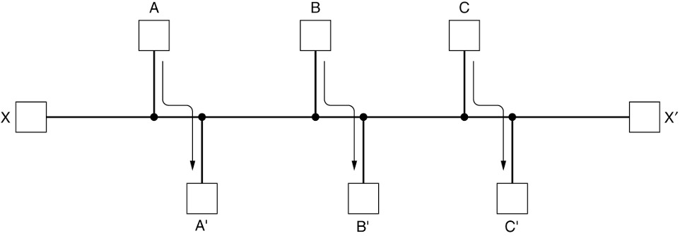
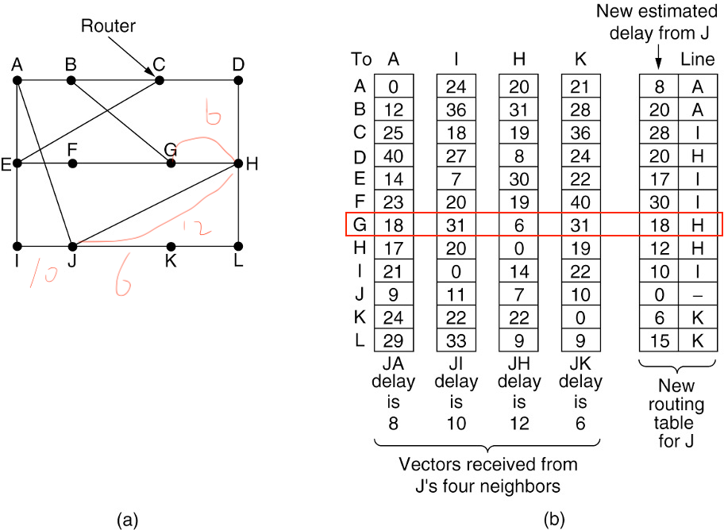
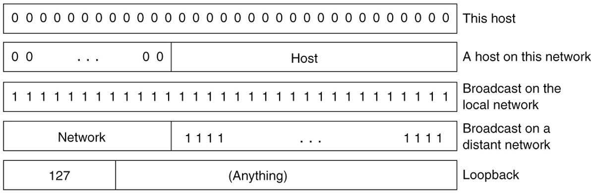

# Chapter 5 The Network Layer 

The network layer is concerned with getting packets from the source all the way to the destination. Getting to the destination may require making many hops at intermediate routers along the way. This function clearly contrasts with that of the data link layer, which has the more modest goal of just moving frames from one end of a (virtual) "wire" to the other. Thus, the network layer is the lowest layer that deal with end-to-end transmission.

To achieve its goals, the network layer must learn about the topology(拓扑结构) of the network (i.e., the set of all router and links) and compute appropriate paths through it, even for large networks. It must also take care when choosing routes to avoid overloading some of the communication lines and routers while leaving other idle. Finally, when the source and destination are in different independently operated networks, sometimes called autonomous(自治) systems, new challenges arise, such as coordinating traffic flows across multiple networks and managing network utilization. These problems are typically handled at the network layer; network operators are often tasked with dealing with these challenges manually. Conventionally, network operators had to reconfigure the network layer manually, through low-level configuration. More recently, however, the advent of software-defined networking and programmable hardware has made it possible to configure the network layer from higher-level software programs, and even to redefine the functions of the network layer entirely. In this chapter, we will study all these issues and illustrate them, focusing in particular on the Internet and its network layer protocol, IP (Internet Protocol).


## 5.1 **Network Layer Design Issues**

* Store-and-forward packet switching

  存储转发分组交换

* Services provided to the transport layer

  提供给传输层的服务

* Implementation of connectionless service

  无连接服务的实现

* Implementation of connection-oriented service

  实现面向连接的服务

* Comparison of virtual-circuit and datagram networks

  虚电路网络和数据报网络的比较


### ==5.1.1 Store-and-Forward Packet Switching==


* A host with a packet to send transmits it to the nearest router.

  主机将数据包发送到最近的路由器。

* The packet is stored there until it has fully arrived, and the link has finished its processing by verifying the checksum. 

  分组被存储在那里，直到它完全到达，并且链路通过验证校验和完成其处理。

* Then it is forwarded to the next router along the path until it reaches the destination host, where it is delivered. 

  然后它沿着路径被转发到下一个路由器，直到它到达目标主机，在那里它被交付。

* This mechanism is **store-and-forward packet switching**

  这种机制是存储转发分组交换


### 5.1.2 ==**Services Provided to the Transport Layer**==

提供给传输层的服务

* Services independent of router technology

  独立于路由器技术的服务

* Transport layer shielded from number, type, topology of routers

  传输层屏蔽的数量，类型，路由器的拓扑结构

* Network addresses available to transport layer use uniform numbering plan

  传输层可用的网络地址使用统一编号计划

  * Even across LANs and WANs

    甚至跨越局域网和广域网


**Battle between two warring factions**

* One camp (represented by the Internet community) argues that the routers’ job is moving packets around and nothing else. This viewpoint leads to the conclusion that the network service should be connectionless.

  一个阵营(以互联网社区为代表)认为路由器的工作是移动数据包，而不是其他。由此得出网络服务应该是无连接的结论

* The other camp (represented by the telephone companies) argues that the network should provide a reliable, connection-oriented service.

  另一个阵营(以电话公司为代表)认为网络应该提供可靠的、面向连接的服务


**Connectionless VS Connection Oriented**

Connectionless service:

无连接服务

* packets are injected into the network individually 

  分组分别注入到网络中

* Routed independently of each other

  彼此独立路由

* No advance setup is needed 

  不需要额外的设置

* The packets are frequently called **datagrams**

  分组通常称为**数据报**

* The network is called a **datagram network** 

  这种网络被称为**数据报网络**


Connection-oriented service:

* A path is established from the source router to destination router. This connection is called a **VC** (**Virtual Circuit**) 

  建立一条从源路由器到目标路由器的路径。这种连接称为**VC**(**虚电路**)

* The network is called a **virtual-circuit network**

  这种网络称为**虚电路网络**


### 5.1.3 ==**Implementation of Connectionless Service**==


* Suppose that the process **P1** has a long message for **P2**.

  假设进程**P1**有一条发送给**P2**的长消息

* It hands the message to the transport layer, with instructions to deliver it to process *P2* on host **H2**. The transport layer code runs on **H1**, typically within the operating system.

  它将消息交给传输层，并指示将其传递给主机**H2**上的**P2**进程。传输层代码运行在**H1**上，通常在操作系统中

* Let us assume for this example that the message is four times longer than the maximum packet size, so the network layer has to break it into four packets, 1, 2, 3, and 4

  在这个例子中，我们假设消息的长度是最大分组长度的4倍，因此网络层必须将其分成4个分组:1、2、3、4

If c break, it will take another line

> 用某种点到点协议(比如PPP) 将这些数据包依次发送给路由器A. 到这里, ISP讲消息的传输任务接管过来. 每一台路由器都有一个内部表, 它指明了针对每一个可能的目标地址应该将数据包送到哪儿里去. 每个表项由两部分数据组成: 目标地址和通往目标地址所使用的处境线路. 当然, 只能使用直接连接的线路. 例如, 图中, A只有两条出境线路--分别通向B和C, 所以每个入境数据包必须被转发给这两台路由器之一, 即使它最终目标地址是其他某一台路由器. A的初始路由表如图中标示的“初始化”(initially).
>
> 


### ==5.1.4 **Implementation of Connection-Oriented Service**==

> 对于面向连接的服务, 我们需要一个虚电路网络. 当建立一个连接时, 从源机器到目标机器之间的一条路径就被当作这个连接的一部分确定了下来, 并且保存在这些中间路由器的表中. 所有需要在这个连接上通过的流量, 都使用这条路径, 这与电话系统的工作方式完全一致. 当连接被释放之后, 虚电路也随之消失. 在面向连接的服务中, 每个数据包包含一个标识符, 指明了它属于哪一条虚电路.


**Virtual-Circuit Network**

* Here, host **H1** has established **connection** **1** with host **H2**. 

  在这里，主机**H1**已经与主机**H2**建立了**连接** **1**

* This connection is remembered as the first entry in each of the routing tables. 

  该连接作为每个路由表中的第一项被记住

* The first line of **A’s** table says that if a packet bearing connection identifier 1 comes in from *H1*, it is to be sent to router **C** and given connection **identifier 1**. 

  **A **表的第一行表示，如果一个连接标识符1的数据包来自*H1*，它将被发送到路由器**C**，并且给定连接标识符1

* Similarly, the first entry at **C** routes the packet to **E**, also with connection **identifier 1**.

  类似地，**C**处的第一项将数据包路由到**E**，同样使用连接**标识符1**

packet save in  Connectionless

>现在我们来考虑如果H3也希望与H2建立连接则情形会怎么样. H3选择连接标识符1 (因为是它发起连接, 而且这是它唯一的连接), 并且告诉网络要建立虚电路. 因此路由表增加了第二行. 请注意这里有一个冲突, 因为, 尽管A很容易区分出标识连接1的数据包是来自H1还是来自H3, 但是, C无法区分它们. 基于这个原因, A给第二个连接的出境流量分配一个不同的连接标识符. 这种避免冲突的做法说明了为什么路由器需要具备替换出境数据包中连接标识符的能力.
>
>在有些上下文中, 这个过程称为标签交换(label switching). 一种面向连接的网络服务, 例子是多协议标签交换(MPLS, MultiProtocol Label Switching), 它主要被用在Internet的ISP网络, IP数据包被一个有20位连接标识或标签的MPLS头包裹着. MPLS往往对客户端是隐藏的, 客户看不到这些标签, ISP用它来为超大流量建立长期的连接; 但是, 当服务质量变得很重要而且还需要协助其他ISP完成流量管理任务时, MPLS的作用越来越突出.

###==5.1.5 **Comparison of Virtual-Circuit and Datagram Networks**==


## ==5.2 Routing Algorithms in a Single Network==
> 网络层的主要功能是将数据包从源机器路由到目标机器. 在大多数网络中, 数据包需要经过多跳(hop)才能到达目的地. 唯一一个值得指出的例外是广播网络, 但即使在广播网络中, 如果源机器和目标不在同一个网络段中时, 路由仍然是一个问题. 选择路由的算法以及这些算法所用的数据结构是网络层设计的最主要内容.

* Optimality principle

* Shortest path algorithm

* Distance vector routing

* Link state routing
* Optimality principle
* Shortest path algorithm
* Distance vector routing
* Link state routing


* The **routing algorithm** is that part of the network layer software responsible for deciding which output line an incoming packet should be transmitted on.

  路由算法是网络层软件的一部分，负责决定传入的分组应该在哪一行输出上传输。

* Properties are desirable in a routing algorithm: **correctness, simplicity, robustness, stability, fairness, and efficiency.**

  路由算法应具有正确性、简洁性、鲁棒性、稳定性、公平性和高效性。

  >robustness: 它描述的是一个系统、模型或方法在面对各种干扰、误差或不确定性时仍然能够保持其正常或预期的功能和性能
  >
  >公平性和有效性听起来显然是理所应当的--肯定不会有人反对这两种特性. 但是, 事实证明它们往往是两个相互矛盾的目标. 如下图所示

* **Nonadaptive algorithms** do not base their routing decisions on any measurements or estimates of the current topology and traffic. Known as **Static** Routing.

  非自适应算法的路由决策并不基于对当前拓扑和流量的测量或估计。称为静态路由。

* **Adaptive algorithms**, in contrast, change their routing decisions to reflect changes in the topology, and sometimes changes in the traffic as well. Known as **Dynamic** Routing.

  与此相反，自适应算法通过改变路由决策来反映拓扑结构的变化，有时也会反映流量的变化。这就是动态路由。



Network with a conflict between fairness and efficiency.

公平性和效率产生冲图的网络

> 假设在A和A‘之间, B和B'之间以及C和C'之间有足够的流量使得水平的链路达到饱和. 为了使总流量达到最大, X和X'之间的流量应该完全被切断. 不幸的是, X和X‘ 可能看不到这一点. 很显然, 在全局效率和单个连接的公平性之间必须有一种折中的处理办法.
>
> 路由算法可以分成两大类: 非自适应算法和自适应算法.


### ==5.2.1 **The Optimality Principle**==

**最优化原则**


(a) A network. (b) A sink tree for router *B*.


* One can make a general statement about optimal routes without regard to network topology or traffic. This statement is known as the **optimality principle.**

  人们可以在不考虑网络拓扑或流量的情况下对最优路由做出一般性的陈述。这句话被称为**最优化原则**

* ==As a direct consequence of the optimality principle, the set of optimal routes from all sources to a given destination form a tree rooted at the destination. Such a tree is called a **sink tree.**==

  作为最优原则的直接结果，从所有源到给定目的地的最优路线集合形成了一棵以目的地为根的树。这样的树被称为**sink树**

  > 图中的距离度量是跳数. 所有路由算法的目标是为所有路由器找到这样的汇集树, 并根据汇集树来转发数据包.

* Note that a sink tree is **not necessarily unique**; other trees with the same path lengths may exist. 

  注意，sink树**不一定是唯一的**;可能存在具有相同路径长度的其他树

* If we allow all of the possible paths to be chosen, the tree becomes a more general structure called a **DAG** (**Directed Acyclic Graph**).

  如果我们允许选择所有可能的路径，树就变成了一种更通用的结构，称为**DAG**(**有向无环图**)


### ==5.2.2 Shortest Path Algorithm==

> 给定一个完整的网络识图, 这项技术可以用来计算最优路径. 这些路径是那些我们希望分布式路由算法发现的, 即使不是全部路由器都知道网络的所有细节.


The first six steps used in computing the shortest path from *A* to *D*. The arrows indicate the working node.

计算从*A*到*D*最短路径的前6步。箭头表示工作节点。

> 基本想法是构造一张网络图, 图中的每个节点代表一个路由器, 每条边代表一条通信线路或者链路. 为了选择一对给定路由器之间的路由, 算法只需要在图中找出它们之间的最短路径.

>(a): 加权无向图, 这里的权值代表了一种度量, 比如说距离. 我们现在要找从A到D的最短路径. 开始时, 将节点A标记为永久, 在图中用一个实心圆表示; 然后我们依次检查每一个与A(工作节点)相邻的节点, 并且用它们与A之间的距离重新进行标记. 为了可以重构出最终路径, 每当一个节点被重新标记时, 也要标记出这次探测动作的出发节点(即前一个节点).
>
>(b): 在检查了每一个与A相邻的节点之后, 我们检查整个图中全部具有暂时性标记的节点, 并且使得其中具有最小标记的那个节点成为永久性的. 这个节点就变成新的工作节点. 从B开始, 检查所有与B相邻的节点. 对于每一个与B相邻的节点, 如果节点B上的标记加上从B到该节点的距离小于该节点原来的标记, 说明我们找到了一条更短的路径, 所以需要重新标记该节点. 在检查了所有与工作节点相邻的节点, 并且可能时修改了暂时性标记之后, 算法需要对整个图进行搜索, 找到具有最小标记值的暂时性节点. 这个节点的标记将变成永久性, 并且成为下一轮的工作节点.
>
>(c): 此时, 把E变成永久性节点. 假设存在一条比ABE还要短的路径, 比如说AXYZE (对某个X和Y), 则有两种可能性: 节点Z已经是永久性的, 或者它还没有变成永久性节点. 如果Z是永久性的, 则E已经被探测过了(当Z变成永久性节点之后的下一轮探测), 所以路径AXYZE不会逃脱我们的搜索范围, 因而它不可能是一条最短路径.
>
>现在考虑Z仍然是暂时性标记的情形. 如果节点Z上的标记大于或者等于E上的标记, 则AXYZE不可能是一条比ABE更短的路径; 如果Z上的标记小于E上的标记, 则应该首先是Z而不是E变成永久性节点, 允许从Z探测E.
>
>
>
>

```c
#define MAX NODES 1024 /*maximum number of nodes*/ 
#define INFINITY 1000000000 /*a number larger than every maximum path*/ 
int n, dist[MAX NODES][MAX NODES]; /*dist[i][j] is the distance from i to j*/ 
void shortest path(int s, int t, int path[]) 
{ str uct state { /*the path being wor ked on*/ 
  int predecessor; /*previous node*/ 
  int length; /*length from source to this node*/ 
  enum {permanent, tentative} label; /*label state*/ 
} state[MAX NODES]; 
 int i, k, min; 
 struct state*p; 
 
 for (p = &state[0]; p < &state[n]; p++) { /*initialize state*/ 
   p->predecessor = ?1; 
   p->length = INFINITY; 
   p->label = tentative; 
 } 
 state[t].length = 0; state[t].label = permanent; 
 k = t; /*k is the initial wor king node*/ 
 do { /*Is there a better path from k?*/ 
   for (i = 0; i < n; i++) /*this graph has n nodes*/ 
     if (dist[k][i] != 0 && state[i].label == tentative) { 
       if (state[k].length + dist[k][i] < state[i].length) { 
         state[i].predecessor = k; state[i].length = state[k].length + dist[k][i]; 
       } 
     } 
   /*Find the tentatively labeled node with the smallest label.*/ 
   k = 0; min = INFINITY; 
   for (i = 0; i < n; i++) 
     if (state[i].label == tentative && state[i].length < min) { 
       min = state[i].length; 
       k = i; 
     } state[k].label = permanent; 
 } while (k != s); 
 
 /*Copy the path into the output array.*/ 
 i = 0; k = s; 
 do {path[i++] = k; k = state[k].predecessor; } while (k >= 0); 
}
```

Dijkstra’s algorithm to compute the shortest path through a graph.


### Question 

* What is the major difference between datagram network and virtual-circuit network?
* What is a sink tree?


### ==5.2.4 Distance Vector Routing==

> 计算机网络通常使用动态路由算法. 虽然动态路由算法比较复杂, 但由于这些算法能找到当前网络拓扑中的最短路径, 因此更加有效. 两个动态算法最为流行, 即距离矢量路由算法和链路状态路由算法.




(a)  A network. (b) Input from *A*, *I*, *H*, *K*, and the new routing table for *J*.

* A **distance vector routing** algorithm AKA **Bellman-Ford** routing algorithm operates by having each router maintain a table (i.e., a vector) giving the best-known distance to each destination and which link to use to get there.

  **距离向量路由**算法又称**Bellman-Ford**路由算法，通过让每个路由器维护一个表(即向量)来操作，该表给出了到每个目的地的最知名距离以及使用哪条链路到达目的地。

* **Drawback**: Although it converges to the correct answer, it may do **so** **slowly**

  缺点:虽然它收敛到正确答案，但速度可能很慢.

>(a) 显示了一个网络, (b) 的前4列显示了J从邻居路由器接收到的延迟矢量. A声称它到B有12毫秒的延迟, 到C有25秒的延迟, 到D有40毫秒的延迟, 等等. 假定J已经测量和估计了它到邻居A, I, H和K的延迟分别为8, 10, 12, 6毫秒. 
>
>现在考虑J如何计算它到路由器G的新路径. 它知道在8毫秒之内可以达到A, 并且A声称可以在18毫秒内到达G, 所以J知道, 如果它将那些目标地址为G的数据包转发给A的话, 那么到G的延迟为26毫秒. (18+8 = 26). 类似地, 它计算出经过I, H和K到达G的延迟分别为41(即31+10), 18 (即6+12) 和 37 (即31+6)毫秒. 在这些计算得出的距离值中, 最好的结果是18, 所以在J的路由表中, 对应于G的表项中的延迟值为18毫秒, 所用的路径是经过H的那条. 对于所有其他的目标地址执行同样的计算过程, 最后得到的新路由表如图中最后一列所示.

JG:

JA G: 8 + 18 = 26       

JI G: 10 +31 = 41

JH G: 12 + 6 = 18

JK G: 6 + 31 = 37


### ==5.2.5 **Link State Routing**==

链路状态路由

> 1979年以前ARPANET一直使用距离矢量路由算法, 而在此之后则改为使用链路状态路由算法. 导致距离适量算法退位的主要问题在于, 当网络拓扑结构发生变化后距离矢量路由算法需要太长时间才能收敛到稳定状态(由于无穷计数问题). 因此, 距离矢量路由算法被一个全新的算法所替代, 该算法称为link state routing. 

The idea behind link state routing is fairly simple and can be stated as five parts.

链路状态路由算法的设计思想非常简单, 可以用五个部分加以描述

* Discover neighbors, learn network addresses

  发现邻居，学习网络地址

* Set distance/cost metric to each neighbor

  为每个邻居设置距离/成本指标

* Construct packet telling all it has learned

  构造一个包，把它学到的所有东西都告诉我们

* Send packet to, receive packets from other routers

  向其他路由器发送数据包，从其他路由器接收数据包

* Compute shortest path to every other router

  计算到每个其他路由器的最短路径


#### 5.2.5.1 Learning about the Neighbors

* When a router is booted, its first task is to learn who its neighbors are.  It accomplishes this goal by sending a special HELLO packet on each point-to-point line.

  当一个路由器启动时，它的第一个任务是了解它的邻居是谁。它通过在每个点对点行上发送一个特殊的HELLO包来实现这一目标。

* The router on the other end is expected to send back a reply giving its name.  These names must be globally unique.

  线路另一端的路由器应该返回一个应答说明自己是谁。这些名称必须是全局唯一的。


(a) Nine routers and a broadcast LAN. 

 9个路由器和一个广播局域网

> (a) 显示了一个广播LAN直接与三个路由器A,C和F连接的情形. 如图所示, 每个路由器都连接到一个或者多个其他的路由器上.

(b) A graph model of (a). Here, we have introduced a new, artificial node, *N*, to which *A*, *C*, and *F* are connected.

(A)的图模型。在这里，我们引入了一个新的人工节点*N*， *A*、*C*和*F*都连接到它。

> 广播LAN为连接到其上的任何一对路由器提供了彼此的连通性. 然而, 把LAN建模成许多个点到点链路会增大拓扑结构, 从而导致浪费消息. 模拟局域网的一个更好方法来是把它看作一个节点
>
> 如图(b) 所示, 在这里, 我们引入了一个新的人造节点N, 它与A, C和F连接. LAN上的指定路由器(designed router) 被选中替代N运行路由协议. 事实上, 从LAN上的A到C是可能的, 这里用路径ANC表示这条路径.


#### 5.2.5.2 **Building Link State Packets**

> 构造链路状态包
>
> 一旦收集到了所需要的交换信息, 每个路由器的下一步工作是构建一个包含所有这些信息的数据包.


(a) A network.  

> (a)显示了一个网络实例, 每条线路上标出了延迟信息. 

(b) The link state packets for this network.

> (b) 这6个路由器所对应的链路状态数据包

* The packet starts with the **identity** of the sender, followed by a **sequence** **number** and **age** and a list of **neighbors**. The **cost** to each neighbor is also given. 

  数据包以发送者的**身份**开始，接下来是**序列** **编号**、**年龄**和**邻居**列表。同时也给出了每个邻居的**开销**。

* The hard part is determining **when** to build packets. One possibility is to build them **periodically**, at regular intervals. Another possibility when some specific **event** **occurs**, such as a line or neighbor going down or coming back up again or changing its properties.

  难点在于确定**何时**构建数据包。一种可能是**定期**地构建它们，以固定的时间间隔。另一种可能是当某些特定的**事件发生**时，例如当一条线路断掉或者一个邻居节点停机时, 或当它们重新恢复运行时, 或当它们的特性发生了一定变化时.

* **Drawback**: Not only is router **memory** consumed by ever-increasing tables, but more **CPU** **time** is needed to scan them, and more **bandwidth** is needed to send status reports about them. 

  **缺点**:不断增长的表不仅消耗了路由器的**内存**，还需要更多的**CPU** **时间**来扫描它们，以及需要更多的**带宽**来发送关于它们的状态报告。


Send data to everywhere, much faster than before.


### ==5.2.6 Hierarchical Routing within a Network==

层级路由

>  随着网络规模的增长, 路由器的路由表也成比例地增长. 不断增长的路由表不仅消耗路由器内存, 而且还需要更多的CPU时间来扫描路由表以及更多的带宽来发送有关的状态报告. 当网络增长到一定时可能会达到某种程度, 此时每个路由器不太可能再为其他每一个路由器维护一个表项. 所以, 路由不得不分层次进行, 就好像电话网络中的做法那样.

* When hierarchical routing is used, the routers are divided into what we will call **regions** or **areas**. 

  当使用分层路由时，路由器被划分为我们称之为**区域**或**区域**的部分。

* **Drawback**: There is a penalty to be paid: **increased** **path** **length**. For example, the best route from *1A* to *5C* is via region 2, but with hierarchical routing all traffic to region 5 goes via region 3, because that is better for most destinations in region 5.

  缺点:有一个惩罚需要付出:增加路径长度。例如，从1A到5C的最佳路径是通过区域2，但在分层路由中，所有到区域5的流量都要通过区域3，因为这对区域5中的大多数目的地更有利。

e.g. If 1A $\rightarrow$ 5C then it can read from Hierarchical table 1A -> 1C -> ... -> 5C


> 上图是一个两级层级的定量分析例子, 其中包含了5个区域. 路由器1A的完整路由表有17个表项, 如(b)所示. 如果采用分级路由, 则路由表(c)所示, 所有针对本区域内的路由器表项都跟原先一样; 但是, 所有到其他区域的路由都被压缩到了单个路由器中. 因此, 所有到区域2的流量都要经过1B-2A线路, 其余的远程流量都要经过1C-3B线路. 层次路由使得路由器1A的路由表长度从17项降低为7项. 随着区域数与每个区域中路由器数量之比值的增加, 节省下来的表空间也随之增加. 


### 5.2.7 ==Broadcast Routing==

> 在有些应用中, 主机需要给其他多个或者全部主机发送消息. 例如, 用于发布天气预报, 股市行情最新报告或者现场直播节目等服务, 它们的最佳工作方式是将消息广播给所有的机器, 然后让那些感兴趣的机器读取数据. 同时给全部目标地址发送一个数据包称为广播(broadcasting).


* Sending a packet to all destinations simultaneously is called **broadcasting**. 

  同时向所有目的地发送一个分组称为**广播**。

* The principal **advantage** of reverse path forwarding is that it is **efficient** while being **easy** to implement. 

  反向路径转发的主要**优势**是它**高效**，同时**易于**实现。

* It sends the broadcast packet over each link only **once** in each direction, just as in flooding, yet it requires only that routers know how to reach all destinations, without needing to remember sequence numbers (or use other mechanisms to stop the flood) or list all destinations.

  它在每个方向上只在每条链路上发送**一次**广播包，就像泛洪一样，但它只要求路由器知道如何到达所有目的地，而不需要记住序列号(或使用其他机制来阻止泛洪)或列出所有目的地。

* **Drawback**: Each router must have knowledge of some spanning tree.

  **缺点**:每个路由器必须了解一些生成树。


Reverse path forwarding. (a) A network. (b) Sink tree for router *I*. (c) The tree built by reverse path forwarding from I.

反向路径转发。(a)网络。(b)路由器I的Sink树(c)由I反向路径转发所建立的树。

>图(a) 部分吓屎了一个网络, 图(b)部分显示了该网络中路由器I的一棵汇集树, 图(c)部分显示了逆向路径算法是如何工作的. 在第一跳, I 发送数据包个F, H, J和N, 如果树中第二行所示. 这些数据包中的每一个都是在通向I地首选路径(假定首选的路径都沿着汇集树) 到来的, 这点用字母外面加一个圆圈来表示. 在第二跳, 共产生了8个数据包, 其中, 在第一跳接收到数据包的路由器各产生2个数据包. 结果, 所有这个8个数据包都到达了以前没有访问过的路由器, 其中5个是沿着首选线路到来的. 在第三跳所产生的6个数据包中, 只有3个是沿首选路径(在C, E 和K)到来的, 其他的都是重复数据包. 在经过五跳和24个数据包以后, 广播过程终止. 相比之下, 如果完全沿着汇集树的话, 只需要4跳和14个数据包.

> Spanning tree:  是网络的一个子集, 它包含所有的路由器, 但是没有任何环路. 汇集树是生成树的一种. 如果每个路由器都知道它的哪些路线属于生成树, 那么, 它就可以将一个入境广播数据包复制到除了该数据包到来的那条线路之外的所有生成树线路上. 这种方法可最佳使用带宽, 并且所生成的数据包也绝对是完成这项任务所需的最少数量. 例如 (b)sink tree就被当作生成树, 广播的数据包的副本最少, 只有14个. 


### ==5.2.8 Multicast Routing==

组播路由

> 有些应用, 比如多人游戏或者体育赛事视频直播到几个观看点, 这样的应用将数据包发送给多个接收者. 除非组的规模很小, 否则给每个接收者单独发不同的数据包的代价很昂贵. 另一方面, 如果在一个由百万节点组成的网络中有一个由1000个机器组成的组, 采用广播技术发送数据包显然也是一种浪费, 因为大多数接收者对广播的消息并不感兴趣(甚至最糟糕的是他们虽然感兴趣), 但不应该看到这些消息. 因此, 我们需要有一种办法能够给明确定义的组发送消息, 这样组的成员数量虽然很多, 但相比整个网络规模却很小.

* Sending a message to such a group is called **multicasting**, and the routing algorithm used is called **multicast routing**.

  将消息发送到这样的组称为**组播**，使用的路由算法称为**组播路由**。

* The solution is to **prune** the broadcast spanning tree by removing links that do not lead to members. The result is an **efficient** **multicast spanning tree.** 

  解决方案是通过删除不指向成员的链接来**剪枝**广播生成树。结果是一个**高效的组播生成树**. 

* **Drawback**: One potential disadvantage is that it is **lots of work** for routers, especially for very big networks.

  **缺点**:一个潜在的缺点是路由器要做**大量的工作**，特别是对于大型网络。


(a) A network. (b) A spanning tree for the leftmost router. (c) A multicast tree for group 1. (d) A multicast tree for group 2.

>如图(a)网络, 其中有两个组: 组1和组2. 有些路由器连接的主机属于其中的一个组或同时属于两个组, 如图所示, 最左边的路由器的一棵生成树如(b)所示. 此树可用于广播, 对于组播来说则过度了, 这从下面显示的两个修剪版本可见一斑. 如图(c)中, 所有不通往组1成员的主机的链路已被删除, 结果是一个棵针对最左边路由器发送到组1的生成树. 数据包的转发只能沿着这棵树进行; 可见这比广播树有效, 因为这里只有7条链路而不是10条链路. 图(d)显示了一棵针对组2修剪后的组播生成树. 相比广播树它也更加有效, 此时只有这5条链路. 这个例子表明, 不同的组播组有不同的生成树.


* An alternative design uses **core-based trees** to compute a single spanning tree for the group. All of the routers agree on a root (called the **core**) and build the tree by sending a packet from each member to the root. The tree is the union of the paths traced by these packets. Here, to send to the group 1, a sender sends a packet to the core. When the packet reaches the core, it is forwarded down the tree.

  另一种设计是使用**基于核心的树**来为组计算单个生成树。所有的路由器都同意一个根(称为**核心**)，并通过从每个成员发送数据包到根来构建树。树是这些分组跟踪的路径的并集。在这里，为了发送给组1，发送者向核心发送一个数据包。当数据包到达核心时，它将沿着树向下转发。


(a) Core-based tree for group 1. (b) Sending to group 1.

> (a) 显示了一棵组1的核心树. 为了把数据包发送到这个组, 发送者把数据发送给核心; 当数据包到达核心后, 它再被沿着树往下转发. (b) 显示了网络右侧一个发送者的组播过程. 作为性能优化的一种措施, 发往该组的数据包并不需要先发送到核心然后再开始组播. 一旦数据包到达树, 它便沿着树向上转发给根, 但同时沿着树转发到其他分枝. 这种情况由(b)中的右上角发送者显示.
>
> 对于所有的组播源使用同一棵共享树是无法达到最优的. 例如, (b)中, 从网络右侧的发送者到达右上方的组成员通过核心要三跳, 如果直接发送或许不需要三跳. 共享树的低效率取决于核心和发送者的位置, 把核心设置在所有发送者的中间往往是一种合理的做法. 如果只有一个发送者, 比如视频流传输到一个组, 那么将发送者作为i核心是最优的.


### ==5.2.9 Anycast Routing==

> 目前为止, 已经学习了三种数据包传递模型: 源给单个目标节点发送(成为单播), 给所有目标节点发送(称为广播) 以及给一组目标节点发送(称为组播). 实际上, 还有另一种称为选播(Anycast)的传递模型有时也非常有用.

* In anycast, a packet is delivered to the **nearest** member of a group. Schemes that find these paths are called **anycast routing**.

  在anycast中，数据包被发送到组中**最近**的成员。找到这些路径的方案称为**任播路由**。

* Suppose we want to anycast to the members of group 1. They will all be given the address “1,” instead of different addresses. **Distance vector routing** will distribute vectors as usual, and nodes will choose the shortest path to destination 1. This will result in nodes sending to the nearest instance of destination 1.

  假设我们想anycast组1的成员。他们的地址都是“1”，而不是不同的地址。**距离向量路由**将像往常一样分发向量，节点将选择到目的地1的最短路径。这将导致节点发送到目的地1的最近实例。
  
  
  
  > (a) 显示了选播路由. 此过程之所以能正常工作时因为路由协议并没有意识到目的地有多个实例. 也就是说, 它认为节点1的实例都是同一个节点, 如(b) 所示的拓扑结构. 
  
  ???


## 5.3 Traffic Management at the Network Layer

> (一部分)网络中存在太多的数据包导致数据包被延迟和丢失, 从而降低了传输性能, 这种情况称为congestion(拥塞). 网络层和传输层共同承担着处理拥塞的责任. 由于拥塞发生在网络内, 正是网络层直接经历着拥塞, 而且必须由它最终确定如何处理过载的数据包. 然而, 控制拥塞的最有效方法是减少传输层注入网络的负载. 这就需要网络层和传输层共同努力协同工作. 在这一章中, 将着眼于拥塞控制在网络层方面的处理; 在第6章, 我们将通过覆盖拥塞控制在传输方面的出来来结束拥塞控制主题.

* The need for traffic management: congestion

  交通管理的需要:拥堵

* Approaches to traffic management
  
  交通管理的途径
  
  * Traffic-aware routing
  
    流量感知路由
  
  * Admission control
  
    准入控制
  
  * Load shedding
  
    卸载
  
  * Traffic shaping
  
    流量整形
  
  * Active queue management
  
    主动队列管理
  
  * Random early detection
  
    随机早期检测
  
  * Choke packets
  
    阻塞数据包
  
  * Explicit congestion notification
  
    明确的拥塞通知
  
  * Hop-by-hop backpressure
  
    逐跳背压

### ==5.3.1 The Need for Traffic Management: Congestion==

**Traffic Management, Congestion control and Flow Control**

==**Traffic management** or engineering has to do with making sure the network is able to **carry the offered traffic**; it can be performed by devices in the network, or by the senders of traffic (often through mechanisms in the transport protocol, which are often referred to as congestion control).== 

**流量管理**或工程负责确保网络能够**承载提供的流量**;它可以由网络中的设备执行，也可以由流量的发送方执行(通常通过传输协议中的机制，通常称为拥塞控制)。

**Congestion management and control** concerns the **behavior** of all the **hosts and routers**.

**拥塞管理和控制**涉及所有**主机和路由器**的**行为**。

==**Flow control** relates to the traffic between a particular sender and a particular receiver and is generally concerned with making sure that the sender is **not transmitting data faster than the receiver can process** it.==

**流量控制**与特定发送端和特定接收端之间的流量有关，通常关心的是确保发送端**传输数据的速度不会超过接收端处理数据的速度**。


**Congestion**

交通堵塞


Performance drops significantly in the presence of congestion: packet loss rates increase, and latency also increases as router queues fill with packets.

当出现拥塞时，性能会显著下降:丢包率会增加，而且随着路由器队列被包填满，延迟也会增加。

> 该图描绘了拥塞的发生. 当主机发送到网络的数据包数量在其承载能力范围之内时, 送达的数据包数与发送的数据包成正比例增长. 如果发送量增加了两倍, 则送达量也增加了两倍. 然而, 随着负载接近承载能力, 偶尔突发的流量填满了路由器内部的缓冲区, 因而某些数据包会丢失. 这些丢失的数据包消耗了部分容量, 因此, 送达的数据包数量低于理想曲线. 网络现在开始拥挤了.


### 5.3.2 Approaches to Traffic Management

> 拥塞控制的途径
>
> 拥塞的出现意味着负载(暂时) 大于资源(在网路的一部分)可以处理的能力. 很自然人们能想到两个解决方案: 增加资源或减少负载. 如下图所示, 这些解决方案通常应用在不同的时间尺度上, 要么预先避免拥堵, 要么一旦发生拥堵随之做出反应.


Timescales of approaches to traffic and congestion management

交通及拥挤管理方法的时间表

> traffic-aware-routing: 流量感知的路由. 例如: 通过改变最短路径的权重可更改数据包路由, 以便使流量远离频繁使用的路径. 一些本地广播电台有直升机围绕着城市上空飞来飞去, 及时报告城市道路拥堵情况, 帮助它们的移动听众路由它们的数据包(汽车)热点地区. 这称为流量感知的路由(traffic-aware routing). 把流量拆分到多个路径也是有用的.
>
> admission control: 有的时候不可能增加容量. 那么对抗拥塞的唯一的办法就是降低负载. 在一个虚电路网络中, 如果新的连接将导致网络变得拥堵不堪, 那么就应该拒绝这种新连接的建立. 这种控制称为准入控制(admission control).
>
> load shedding: 负载脱落. 当一切努力都失败, 网络不得不丢弃它无法传递的数据包. 这种方法的通用名称时负载脱落(load shedding). 

* If there is a **low-bandwidth** link on the path along which most traffic is directed, congestion is likely.

  如果路径上有一条**低带宽**链路，大多数流量都是沿着这条链路传输的，那么就很可能发生拥塞。

* The most **straightforward** way to avoid congestion is to build a network that is **provisioned** for the traffic load that it must carry.

  避免拥塞最**直接**的方法是构建一个为其必须承载的流量负载**准备**的网络。

* More often, **links and routers** that are regularly heavily utilized are upgraded at the earliest opportunity. This is called **provisioning** and happens on a time scale of months, driven by **long-term** traffic trends.

  更常见的情况是，经常被大量使用的**链接和路由器**会尽早升级。这被称为**供应**，由**长期**流量趋势驱动，以月为时间尺度发生。
  
  

#### ==5.3.2.1 Traffic-Aware Routing==

流量感知路由


A network in which the East and West parts are connected by two links.

由两个链接连接东西两部分的网络

>  这里网络被分为东部和西部, 这两部分通过链路CF和EI相连. 假设东西之间的大部分流量使用链路CF, 因此, 这个链路符合超重因而延迟增大. 如果把排队延迟加入到计算最短路径的权重中, 那么链路EI将变得更具吸引力. 当新的路由表被安装好之后, 大部分东西方的流量现在改走链路EI, 由此增加了此链路的负载. 因此, 在下一次路由更新时, CF将成为最短路径. 结果, 路由表可能会剧烈地摇摆不定, 从而导致不稳定的路由和许多潜在的问题.

* The **goal** in taking **load** into account when computing routes is to shift traffic away from hotspots that will be the first places in the network to experience **congestion**.

  在计算路由时考虑**负载**的**目标**是将流量从网络中第一个出现**拥塞**的热点地区转移出去。

* Set the **link weight** to be a function of the (fixed**) link bandwidth and propagation delay** plus the (variable) measured **load or average queueing delay**. Least-weight paths will then favor paths that are more lightly loaded, all else being equal.

  将**链路权重**设置为(固定的)链路带宽和传播延迟**加上(可变的)测量的负载或平均排队延迟**的函数。在其他条件相同的情况下，权重最小的路径会优先选择负载更轻的路径

* **Disadvantage**: Routing tables may **oscillate** wildly, leading to erratic routing and many potential problems.

  **缺点**:路由表可能会剧烈**振荡**，导致路由不稳定和许多潜在问题。

When you very busy data to send, you will use this.


#### ==5.3.2.2 Admission Control==

* One technique that is widely used in **virtual-circuit networks** to keep congestion at bay is **admission control**. The idea is simple: **do not set up a new virtual** circuit unless the network can carry the added traffic without becoming congested.

  在**虚电路网络**中广泛使用的一种防止拥塞的技术是**准入控制**。这个想法很简单:**不要建立新的虚拟电路**，除非网络能够在不造成拥塞的情况下承载新增的流量。

* **Admission** control can be **combined** with **traffic-aware** routing by considering routes around traffic hotspots as part of the setup procedure. 

  通过将围绕流量热点的路由作为设置过程的一部分，**准入**控制可以与**流量感知**路由**结合**。


(a) A congested network. (b) The portion of the network that is not congested. A virtual circuit from *A* to *B* is also shown.

(a)网络拥塞。(b)网络中未拥塞的部分。给出了从*A*到*B*的虚电路。

> (a) 所示, 这里显示的两台路由器已经被堵塞.
>
> (b) 所示, 去掉拥塞的路由器和它们所有的线路. 图中的虚线显示了一条可能的虚电路路径, 它避开了拥塞的路由器.


#### ==5.3.2.3 Load Shedding==

负载脱落

* When none of the above methods make the congestion disappear, routers can bring out the heavy artillery: **load shedding**. This is a fancy way of saying that when routers are being inundated by packets that they cannot handle, they just **throw them away**.

  如果上述方法都无法消除拥塞，路由器就会拿出重炮:**减载**。这是一种奇特的说法，当路由器被它们无法处理的数据包淹没时，它们只是**扔掉它们**。

* The key question for a router drowning in packets is which packets to drop. For a **file transfer**, an **old** packet is worth more than a new one. In contrast, for **real-time media**, a **new** packet is worth more than an old one. 

  路由器淹没在数据包中的关键问题是丢弃哪些数据包。对于**文件传输**来说，**旧的**数据包比新的更有价值。相比之下，对于**实时媒体**，一个**新**数据包比一个旧的包更有价值。

* The former policy (old is better than new) is often called **wine** and the latter (new is better than old) is often called **milk** because most people prefer new milk over old milk and old wine over new wine.

  前一种策略(旧的比新的好)通常被称为**葡萄酒**，后一种策略(新的比旧的好)通常被称为**牛奶**，因为大多数人喜欢新牛奶而不是旧牛奶，喜欢旧酒而不是新酒。


#### ==5.3.2.4 Traffic Shaping== 

流量整形

**Traffic shaping** is a technique for regulating the **average rate and burstiness** of a flow of data that enters the network. The goal is to allow applications to transmit a wide variety of traffic that suits their needs. When a flow is set up, the user and the network (i.e., the customer and the provider) agree on a certain traffic pattern (i.e., shape) for that flow. In effect, the customer says to the provider “My transmission pattern will look like this; can you handle it?”

**流量整形**是一种用于调节进入网络的数据流的**平均速率和突发性**的技术。其目标是允许应用程序传输满足其需求的各种流量。当一个流建立起来时，用户和网络(即客户和提供商)就该流的某种流量模式(即形状)达成一致。实际上，客户对供应商说:“我的传输模式将看起来像这样;你能应付吗?”


(a) Shaping packets. (b) A leaky bucket. (c) A token bucket.

> 漏桶算法和令牌桶流量. 方法略有不同, 但效果基本均等. 请想象这样一个桶, 它的底部有一个小洞, 如(b)所示, 无论流入漏桶的水的速率多大, 只要漏桶中还有水, 那么水流出桶的速率是个恒定速率R; 如果桶内没有水, 则留出桶的速率降为0. 此外, 一旦桶内的水达到桶的容量B, 任何额外进入桶的水都会沿着桶册分流, 最终流失.
>
> 漏桶可以应用到注入网络的数据包上, 对其进行整形和监管, 如(a)所示. 概念上, 每个主机在连接到网络的接口中包含了一个漏桶. 为了向网络发送数据包, 必须有可能往漏桶中灌入更多的水. 如果漏桶满时来了一个数据包, 那么该数据包必须排入队列等漏桶空出来时再接纳, 或者被丢弃. 前一种策略作为操作系统的一部分可用在对主机进入网络的流量实施整形; 后一种策略可用在服务提供商的网络接口, 通过硬件对进入网络的流量实施监管. 称为漏桶算法(leaky bucket algorithm).
>
> 一个形式不同但效果相当的方法是把网络接口个想象成一个漏桶, 正在往里灌水, 如(c)所示, 水龙头速率为R. 水桶容量为B(跟以前一样). 现在, 为了发送一个数据包, 我们必须能够从桶内掏出水或令牌, 俗称为内容(而不是往桶里注水). 桶内只可累积固定数量的令牌, 即B, 不可能有更多的令牌; 如果桶是空的, 我们必须等更多的令牌到达才能发送另一个数据包. 该算法称为令牌桶算法(token bucket algorithm).

b: sender 

c: receiver -> for the next layer.


> 
>
> (a) Traffic from a host. Output shaped by a token bucket of rate 200 Mbps and capacity (b) 9600 KB and (c) 0 KB. Token bucket level for shaping with rate 200 Mbps and capacity (d) 16,000 KB, (e) 9600 KB, and (f) 0 KB. 
>
> (a)来自主机的流量。令牌桶的输出速率为200mbps，容量(b)为9600kb， (c)为0kb。令牌桶级别的整形速率200 Mbps和容量(d) 16000 KB， (e) 9600 KB， (f) 0 KB。
>
> > 漏桶和令牌桶限制了一个流的长期速率, 但允许其短期突发某个最高调节长度, 不会改变延迟也不会受到任何人为的拖延. 大量的突发数据将被一个漏桶流量整形器惊醒平滑处理, 以便减少网络拥塞.
> >
> > 如上图所示, 假设一个计算机能够产生1000Mbps的数据(125MB/s), 而且该网络的第一条链路也是以这个速度运行. 主机生成的流量模式如图(a)所示. 这种模式就是突发性的, 每秒的平均速率超过200Mbps, 即使该主机以峰值1000Mbps的速率发送16000KB突发数据.
> >
> > 现在假设路由器可以在很短时间间隔内接收峰值速率的数据, 直到缓冲区填满为止. 缓冲区大小为9600KB, 远远小于突发流量. 在很长时间内, 路由器的最佳工作速率不能超过200Mbps(比方说, 因为这是给予客户的全部带宽). 这里的含义是如果以这种模式发送流量, 其中有一些可能被网络丢弃, 因为它不适合路由器的缓冲区.
> >
> > 为了避免数据包丢失, 我们可以在主机端用一个令牌桶对其流量进行整形. 如果我们使用速率R为200Mbps, 容量B为9600KB, 则流量属于网络能够处理的范围. 令牌桶的输出显示如图(b)所示. 主机可以1000Mbps全速发送一小段时间, 直到它耗尽桶的容量; 然后, 它必须把发送速率削减到200Mbps, 直到突发数据被发送出去. 其效果是把突发分散在一段时间内, 因为突发量太大无法一次都处理完. 该令牌桶的水平如图(e)所示. 开始的时候它是全速率发送, 很快被突发耗尽; 当它到达零时, 只能以填满缓冲区的速率发送新的数据包; 此时, 不可能再有突发, 直到桶恢复. 没有流量发送时桶被慢慢填满, 当以填充速度发送时保持当前的水平.
> >
> > 也可以把流量整形成更少的突发. 图(c)给出了一个以R=200Mbps和容量为0的令牌桶输出. 这是一个极端的案件, 流量被完全平滑了: 不允许任何突发, 并且流量以一个稳定速率进入网络. 对应的桶水平如(f)所示, 桶的水平总是空的. 主机上的流量排队等待输出到网络, 并且一旦允许总有一个数据包在等待发送.
> >
> > 最后图(d)给出了一个R=200Mbps, 容量B=16000KB 令牌桶的水平. 这是最小的令牌桶, 通过它的流量不会被改变. 这个桶可被网络路由器用来监管主机发送的流量. 
>


#### ==5.3.2.5 Explicit Congestion Notification==

显式拥塞通知

Instead of generating additional packets to warn of congestion, a router can **tag** any packet it forwards (by setting **a bit in the packet’s header**) to signal that it is experiencing congestion. When the network delivers the packet, the **destination** can note that there is congestion and inform the sender when it sends a **reply** packet. The sender can then throttle its transmissions. This design is called **ECN** (**Explicit Congestion Notification**)

路由器可以**标记**它转发的任何数据包(通过设置**数据包头中的一个比特位**)，来表示它正在发生拥塞，而不是生成额外的数据包来警告拥塞。当网络发送数据包时，**目的地**可以注意到拥塞，并在发送**应答**数据包时通知发送方。然后，发送者可以限制其传输。这种设计被称为**ECN**(**显式拥塞通知**)


Explicit congestion notification

显示拥塞通知

> 如图所示, 如果它们通过的任何一个路由器正在经历着拥挤, 该路由器在转发数据包时将其标记为经历拥塞; 然后接收方在它的下一个应答数据包里回显该标志作为显式拥塞信号.这显示为图中的一条虚线, 它表明在IP层以上(如在TCP). 发送方必须紧踩油门控制传输, 如同采用抑制包的情况.


#### ==5.3.2.6 Hop-by-Hop Backpressure==

> 当网络速度很高或者距离很远时, 由于传播延迟的缘故, 拥塞信号发出后到它产生作用这期间又有许多新的数据包已经被注入到网络. 


(a) A choke packet that affects only the source. (b) A choke packet that affects each hop it passes through.

(a)只影响源的阻塞分组。(b)阻塞包，影响它通过的每一跳

> 请考虑这样的情形: 旧金山的一台主机 如图中的路由器A, 正在给纽约的一台主机(路由器D) 发送数据, 速度为OC-3的155Mbps. 如果纽约的主机现在用完了缓冲空间, 它将花40毫秒的时间才能将抑制包发回给旧金山主机, 告诉它降低传输速度. 如果采用ECN指示, 则需要更长的时间, 因为抑制消息通过接收方传递. 抑制包的传播过程如(a)中第2, 3, 4所示. 在这40毫秒期间, A又给D发送了6.2Mb的数据. 及时旧金山的主机立刻停机, 传输管道里的6.2Mb数据也将连续倾入网络, 而且网络必须要对它们进行处理. 只有在图(a)的第7个图中, 纽约的路由器才会注意到数据包减慢了.

An **alternative** approach is to have the choke packet **take effect at every hop** it passes through, as shown in the sequence of **(b)**. Here, as soon as the choke packet reaches *F*, *F* is required to reduce the flow to *D*. Doing so will require *F* to devote more buffers to the connection, since the source is still sending away at full blast, but it gives *D* immediate relief.

一种**替代**方法是让阻塞包**在它通过的每一跳生效**，如**(b)**序列所示。在这里，只要抑制包到达F, 则F必须按照要求减慢发给D的数据包流. 这样做的结果是要求F为D的数据包流分配更多的缓冲区, 因为源主机仍然在全速发送数据, 但是F这么做却让D立刻得到缓解.

> 在下一步, 抑制包到达E, 它告诉E减慢给F的数据包流. 这一行动给E的缓冲区带来更大需求, 但是却让F立即得到缓解. 最后, 抑制包到达A, 数据包流才真的减慢下来.

The net effect of this hop-by-hop scheme is to provide **quick relief** at the point of congestion, at the price of using up more **buffers** upstream.

这种逐跳方案的最终效果是在拥塞点提供**快速缓解**，代价是在上游消耗更多的**缓冲区**。


## Questions for you

* What is the difference among Traffic Management, Congestion control and Flow Control?
* What is congestion?
* What is Traffic aware routing? Disadvantage?
* How admission control works?
* What is load shedding? Which packets to drop?
* How traffic shaping works?
* What is explicit congestion notification?
* How hop-by-hop backpressure works?


## 5.4 QUALITY OF SERVICE AND APPLICATION QOE

> 在上一节考查的技术主要用来减少拥塞并提高网络性能. 然而, 存在一些应用(和客户), 它们对网络的性能保障有很强的需求, 而不仅仅只是"在当前情况下尽力而为". 特别是多媒体应用往往需要具备最小延迟和最大吞吐量条件才能正常工作. 在本节中, 继续网络性能研究, 但现在更加注重如何提供与应用需求相匹配的服务质量. 这是一个Internet 正在经历长期变革改进的领域.


### ==5.4.1 Application QoS Requirements==

* A stream of packets from a source to a destination is called a **flow.**

  从源到目的的数据包流称为**流**

* The needs of each flow can be characterized by four primary parameters: **bandwidth, delay, jitter, and loss**.

  每个流的需求可以通过四个主要参数来表征:**带宽、延迟、抖动和丢失**。

* Together, these **four** determine the **QoS** (**Quality of Service**) the flow requires.

  这**四个**决定了流需要的**QoS**(**服务质量**)。


Stringency of applications’ quality-of-service requirements

应用程序服务质量需求的严格程度

> 上图列出了几种常见的应用和它们分别对网络质量的严格要求. 请注意, 网络需求小于应用需求, 在这种情况下, 应用程序可以改善由网络提供的服务. 特别是, 网络并不需要为可靠的文件传输真正做到无丢失, 也不需要为音频和视频的播放传递具有相同延迟的数据包. 丢失部分可以通过重传来修复, 一些抖动可以通过接收端缓冲数据包来平滑. 然而, 如果网络提供的带宽太少或者延迟太大, 则无论应用程序做什么都无法补救这种情况.


### ==5.4.2 Overprovisioning==

过度配置

* Helps to provide good quality of service

  帮助提供高质量的服务

  * Ensure the network has the capacity for all traffic

    确保网络有所有流量的容量

  * Expensive solution

    昂贵的解决方案

* Network issues to address for quality of service

  服务质量方面需要解决的网络问题

  * Addressing applications needs

    满足应用需求

  * Regulating traffic entering the network

    管理进入网络的流量

  * Reserving resources at routers to guarantee performance
  
    在路由器上预留资源以保证性能
  
  * Safely accepting more traffic
  
    安全接收更多流量

 

### ==5.4.3 **Packet Scheduling**==

包调度

* Algorithms that allocate router resources among the packets of a flow and between competing flows are called **packet scheduling algorithms**.

  在同一个流的数据包之间以及在竞争流之间分配路由器资源的算法称为(数据)包调度算法.

* Router resources reserved for different flows

  为不同的流可以预约的潜在资源有以下3种

  * Bandwidth
  * Buffer space
  * CPU cycles

* Algorithms
  * First-In First-Out (FIFO) scheduling
  * Fair queueing
  * Weighted fair queueing


#### ==5.4.3.1 **First-In First-Out (FIFO) scheduling**==

* Each router buffers packets in a queue for each output line until they can be sent.

  每个路由器在队列中为每一行输出缓冲数据包，直到它们可以被发送.

* They are sent in the same order that they arrived. 

  它们发送的顺序与到达的顺序相同.

* This algorithm is known as **FIFO** (**First-In First-Out**), or equivalently **FCFS** (**First-Come First-Served**).

  这种算法被称为**FIFO** (**First-In First-Out**)，或者等价于**FCFS**(**先到先得**).

* **Disadvantage**: Processing packets in the order of their arrival means that the aggressive sender can hog most of the capacity of the routers its packets traverse, starving the other flows and reducing their quality of service.

   **缺点**:按数据包到达的顺序处理意味着攻击性的发送端会占用其数据包所经过路由器的大部分容量，使其他流挨饿，从而降低服务质量。


#### ==5.4.3.2 **Fair Queueing**== 


* The essence of this algorithm is that **routers** have **separate** **queues**, one for **each** **flow** for a given output line. 

  此算法的本质是**路由器**具有**独立的队列**，一个队列对应于给定输出行的**每个流**。

* When the line becomes idle, the router scans the queues **round robin**. 

  当线路空闲时，路由器扫描队列**循环**

* In this way, with *n* hosts competing for the output line, each host gets to send one out of every *n* packets. 

  这样，*n*台主机竞争输出行，每个主机可以从每*n*个数据包中发送一个

* It is **fair** in the sense that all flows get to send packets at the **same** **rate**. Sending more packets will not improve this rate.

  这是**公平**的，因为所有流都可以以**相同的速率**发送数据包。发送更多的数据包不会提高这个速率

* **Disadvantage**: it gives more bandwidth to hosts that use large packets than to hosts that use small packets.

  **缺点**:它为使用大数据包的主机提供了比使用小数据包的主机更多的带宽


#### ==5.4.3.3 **Improved Fair Queueing**==

> 把原来的“数据包接数据包”的循环方式改成“字节接字节”的循环方式. 


* Round robin is done in such a way as to simulate a **byte-by-byte** round robin, instead of a packet-by-packet round robin. 

  循环的方式模拟了**逐字节**的循环，而不是逐包的循环

* The trick is to **compute a virtual time** that is the number of the round at which each packet would finish being sent. Each round drains **a** **byte** from all of the queues that have data to send. The packets are then **sorted** in order of their **finishing** **times** and sent in that order.

  技巧是**计算一个虚拟时间**，即每个数据包发送完成的轮数。每一轮都会从所有有数据要发送的队列中消耗**字节**。然后，这些数据包将按照它们**完成次的顺序排序**，并按此顺序发送。

* The relative sending order is A, B, F, D, even though F arrived after D

  相对的发送顺序是A, B, F, D，尽管F在D之后到达

  > (b)的表, 考查最上面两个队列的前两个数据包(即AF, BDH), 数据包的到达顺序是A, B, D和F. 数据包A在第0轮循环到达, 长度为8个字节, 因此其完成时间是第8轮; 同样, 数据包B的完成时间为11; 当数据包B在发送时数据包D到达, 因此它的完成时间要从B结束时开始算9字节循环, 最终完成时间为20. 类似地, F的完成时间为16.
  >
  > 

* **Disadvantage**: It gives all hosts the same priority.

  **缺点**:它赋予所有主机相同的优先级。

> 该图显示了该算法以及该算法的一个例子, 例子给出了分别属于三个流的数据包到达和完成时间. 如果一个数据包的长度为L, 它的完成时间恰好是启动之后的第L轮循环. 启动时间要么是前一个数据包的完成时间, 或者是数据包的到达时间(如果它到达时队列为空).


#### ==5.4.3.4 **Weighted Fair Queueing**==

* In many situations, it is desirable to give, for example, video servers more bandwidth than, say, file servers. 

  在许多情况下，我们希望给视频服务器比文件服务器更多的带宽。

* This is easily possible by giving the video server two or more bytes per round. This modified algorithm is called **WFQ** (**Weighted Fair Queueing**). 

  每轮给视频服务器两个或更多字节是很容易实现的。这种改进的算法称为**WFQ**(**加权公平排队**)。


(a) Weighted Fair Queueing. (b) Finishing times for the packets.


## ==5.5 **Internetworking**==

### 5.5.1 Internetworks: An Overview

网络互联

* When two or more networks are connected, they form an **internetwork**, or more simply an **internet**.

  当两个或多个网络连接时，它们就形成了**互联网络**，或者更简单地说，就是**互联网**

* How networks differ

  网络有何不同

* Connecting heterogeneous networks

  连接异构网络

* Connecting endpoints across heterogeneous networks

  跨异构网络连接端点

* Supporting different packet sizes: packet fragmentation

  支持不同的数据包大小:数据包分片

> Internet: 表示和其他互联网或者连接在一起的网络区别开来. 纳入所有这些网络的目的是使得任何一种网络的用户都可以和其他种类的网络用户沟通.


### ==5.5.2 **How Networks Differ**==

网络如何不同


### Question for you

* FIFO
* Fair Queueing 
* Improved Fair Queueing 
* Weighted Fair Queueing 


###  ==5.5.3 Connecting Heterogeneous Networks==


(a) A packet crossing different networks. (b) Network and link layer protocol processing.

(a)跨越不同网络的数据包. (b)网络和链路层协议处理.

> (a) 一个由802.11, MPLS和以太网网络组成的互谅网络. 假设源主机在802.11网络上, 要给以太网上的目标机器发送数据包. 由于这两个网络技术不同, 而且它们又被另一类型的网络(MPLS)隔离, 因此在网络之间的边界需要做一些额外的处理. 
>
> (b) 源端接受来自传输层的数据, 并生成一个带有公共网络层的头, 这个例子中采用的是IP协议. 网络层的头包含了最终的接收方地址, 这个地址被用来确定数据包应该通过第一个路由器的地址. 在路由器, 数据包从帧的数据字段中被提取出来, 802.11帧头被丢弃; 现在路由器检查数据包中的IP地址, 并查询其路由表; 根绝这个地址, 路由器决定将数据包发送到第二个人路由器. 对于路径中的这部分, 路由器必须建立一条到第二个路由器的MPLS虚电路, 并且必须用MPLS报头封装该数据包. 在远端, MPLS头被丢弃, 并在此检查网络地址, 以便寻找下一跳网络层. 这下一跳就是目标网络本身. 由于数据包太长无法通过以太网发送, 它被拆分成为两部分. 每一部分被放入以太网帧的数据字段, 并被发送到目的地的以太网地址. 在接收方, 剥掉每个帧的以太网帧头, 将帧的数据内容重新组合. 至此, 数据包终于到达了它的目的地.
>
> MPLS (MultiProtocol Label Switching)

* Because different **networks** may, in general, have different forms of **addressing**, the packet carries a network layer address that can identify any host across the three networks. 

  因为不同的**网络**通常有不同形式的**寻址**，所以数据包携带的网络层地址可以识别三个网络中的任何主机

* Once the packet has traveled along the **virtual circuit**, it will reach the **Ethernet** network. 

  一旦分组通过了**虚拟电路**，它将到达**以太网**网络

  > 802.11提供了无连接服务, 但MPLS提供了面向连接的服务. 这意味着, 必须建立一条穿过该网络的虚电路. 只要数据包沿此虚电路传输, 就能到达以太网网络. (第一个网络边界)

* The packet may be **too** **large** to be carried, since 802.11 can work with larger frames than Ethernet. 

  数据包可能**太大**而无法携带，因为802.11可以支持比以太网更大的帧 (第二个网络边界)

* To handle this problem, the packet is divided into **fragments**, and each fragment is sent separately. When the fragments reach the destination, they are **reassembled**.

  为了处理这个问题，数据包被分成**分片(fragment) **，每个分片被单独发送。当片段到达目的地时，它们会被**重新组装**.


### ==5.5.4 Connecting Endpoints Across Heterogeneous Networks==

跨异构网络连接端点

> 处理两个不同网络相互连接时的一般情况超级困难. 然而, 却存在一种最常见的甚至可管理不同网络协议的情形. 这种情形就是源主机和目标主机所在网络的类型完全相同, 但他们中间却隔着一个不同类型的网络. 举例来说, 请考虑一家跨国银行, 它在巴黎有一个IPv6网, 在伦敦也有一个IPv6网, 但是连接巴黎和伦敦办事处的却是IPv4 Internet, 下图显示了这样的情形.


> IPv4 can also put inside the IPv6.

* A common special case is where the source and destination hosts are on the same type of network, but there is a different network in between.

  一个常见的特殊情况是源主机和目标主机在同一类型的网络上，但两者之间有不同的网络.

* The solution to this problem is a technique called **tunneling**. 

  解决这个问题的方法是**隧道(tunneling) **

* To send an IP packet to a host in the London office, a host in the Paris office constructs the packet containing an IPv6 address in London and sends it to the multiprotocol router that connects the Paris IPv6 network to the IPv4 Internet.

  要向伦敦办事处的主机发送一个IP包，巴黎办事处的主机构造一个包含伦敦IPv6地址的包，并将其发送给连接巴黎IPv6网络和IPv4互联网的多协议路由器

* When this in between router gets the IPv6 packet, the **router puts the (IPv6) packet inside a (IPv4)** packet. When this wrapped packet arrives, the London router removes the original IPv6 packet and sends it onward to the destination host.

  当处于两者之间的路由器获得IPv6数据包时，**路由器将(IPv6)数据包放入(IPv4)数据包中**。当这个包装好的分组到达时，伦敦路由器删除原始的IPv6分组，并将其发送到目的地主机.


An **analogy** may make tunneling clearer. Consider a person driving her car from **Paris to London**. Within France, the car moves under its **own power**, but when it hits the English Channel, it is loaded onto a **high-speed train** and transported to England through the Chunnel (cars are not permitted to drive through the Chunnel). Effectively, the car is being carried as freight. At the far end, the car is let loose on the English roads and once again continues to move under its **own power**. Tunneling of packets through a foreign network works the same way.

一个**类比**可能会让隧道更清晰。假设一个人开车从**巴黎到伦敦**。在法国境内，汽车靠**自己的动力**行驶，但当它到达英吉利海峡时，它会被装上**高速列车**，通过英吉利海峡运送到英国(汽车不允许通过英吉利海峡)。实际上，汽车是作为货物运输的。在远端，汽车被释放在英国的道路上，并再次在**自己的动力**下继续移动。通过外部网络建立数据包隧道的工作方式与此相同。


###==5.5.6 Supporting Different Packet Sizes: Packet Fragmentation==


(a) Transparent fragmentation. (b) Non transparent fragmentation.

(a)透明碎片。(b)非透明碎片

* Transparent fragmentation is straightforward but has some **problems (??)**.

  透明分片是直接的，但有一些**问题(??)**。

  > 首先, 出口路由器必须知道什么时候它已经接收到了全部的段, 所以每个分段中必须提供一个计数字段或者一个“数据包结束”标志位. 其次, 由于所有的数据包必须经过同一个出口路由器才能进行重组, 因此路由受到了限制. 由于不允许有些段沿着一条路径到达最终目标, 而另一些段沿着一条不相交路径到达最终目标, 所以, 可能会损失一些性能. 更为重要的是, 路由器可能不得不做大量的工作. 如果不是所有段都已到达, 它还需要缓冲到达的段, 并且决定何时丢弃这些段. 某些工作可能纯粹是一种浪费, 因为当一个数据包需要通过一系列的小数据包网络时, 需要多次被分段和重组.

* The main **advantage** of nontransparent fragmentation is that it requires routers to do less work.

  非透明分片的主要**优点**是它需要路由器做更少的工作.

  > 缺点呢?
  >
  > 某些链路上运载的段的头或许是没必要的. 但真正的问题首先还是因为段的存在, 因此开销可能比透明分段高. 

>(a) 在这种方法中, 当一个超大数据包到达$G_1$, 该路由器将它分割成多个段; 每个段都发向同样的出口路由器$G_2$ , 在这里这些段被重新组合起来. 按照这种方法, 任何一个数据包通过这样的小数据包网络都是透明的. 后续的网络根本感觉不到曾经发生过分段.
>
>(b) 避免在任何一个中间路由器上重新组合分段. 一旦一个数据包已经被分段, 则每个段都被当作原始的数据包一样对待. 路由器传递这些段的情形如图(b)所示, 重组过程只在目标主机上进行.

## ==5.6 Software-Defined Networking==

### 5.6.1 Overview


Control and data plane separation in SDN

SDN控制与数据平面分离

One of the main concepts driving SDN was to recognize that the **control plane**, the software and logic that **select routes and decide** what to do with forwarding traffic, runs in software and can operate completely separately from the **data plane**, the hardware-based technology that is responsible for actually **performing lookups on packets and deciding** what to do with them.

驱动SDN的主要概念之一是认识到**控制平面**，即**选择路由并决定**如何转发流量的软件和逻辑，可以在软件中运行，并且可以完全独立于**数据平面**，基于硬件的技术负责实际**执行数据包查找并决定**如何处理它们。


## ==5.7 **The Network Layer in the Internet**==

* ==Top 10 principles==

  * Make sure it works

    确保它能正常工作

  * Keep it simple

    保持简单

  * Make clear choices

    做出明确的选择

  * Exploit modularity

    利用模块化

  * Expect heterogeneity

    期望异构性

  * Avoid static options and parameters

    避免使用静态选项和参数

  * Look for a good design; it need not be perfect

    寻找好的设计;它不必是完美的

  * Be strict when sending and tolerant when receiving

    发送时严格，接收时宽容

  * Think about scalability

    考虑可扩展性

  * Consider performance and cost

    考虑性能和成本

* In the network layer, the Internet can be viewed as a **collection of networks or Autonomous Systems (ASes)** that are interconnected. There is no real structure, but several major **backbones** exist.

  在网络层，互联网可以被视为相互连接的**网络或自治系统的集合**。它没有真正的结构，但存在几个主要的**主干**

* The biggest of these backbones, to which everyone else connects to reach the rest of the Internet, are called **Tier 1 networks**. Attached to the backbones are **ISPs** (Internet Service Providers) that provide Internet access to homes and businesses, **data** **centers** and colocation facilities full of server machines, and regional (mid-level) networks. 

  其中最大的骨干被称为**一级网络**，每个人都可以通过它连接到互联网的其他部分。连接到骨干网的是**isp**(互联网服务提供商)，为家庭和企业提供互联网接入，**数据中心**和充满服务器机器的托管设施，以及区域(中级)网络。

* The glue that holds the whole Internet together is the network layer protocol, **IP** (**Internet Protocol**). Unlike almost all older network layer protocols, IP was designed from the beginning with internetworking in mind.

  将整个互联网粘合在一起的是网络层协议，即**IP** (**Internet protocol **)。与几乎所有旧的网络层协议不同，IP从设计之初就考虑到了互联.


The Internet is an interconnected collection of many networks

> 上图给出了一个准分层组织的轮廓图: 家庭网路上的一个主机要穿越四个网络和大量IP路由器, 才能到达位于公司网络上的目标主机. 这种情况在实际中并不罕见, 而且还有很多更长的路径. 在Internet上存在着很多冗余连接, 骨干网和ISP在多个位置相互连接. 这意味着两个主机之间存在着许多可能的路径. 决定使用哪些路径正是IP路由协议的任务.
>
> 将整个Inernet粘合在一起的正式网络层协议, 即IP, Internet Protocol. 与大多数老式网络协议层不同的是, IP协议在设计之初就把网络互联作为目标. 应该这样看待网络层: IP的任务是提供一种尽力而为(best-effort)把数据包从源端传输到接受方的方法(即不提供任何保证), 无须考虑这些机器是否在同一个网络, 也不必关心它们之间是否还有其他网络.
>
> Internet 中的通信过程是这样的. 传输层获取数据流, 并且将数据流拆分成段, 以便作为IP数据包发送. 理论上, 每个数据包最多可容纳64KB, 但实际上, 数据包通常不超过1500个字节 (因而它们正好可被放到一个以太网帧中). IP路由器转发每个数据包穿过Internet, 沿着一条路径把数据包从一个路由器转发到下一个路由器, 直到数据包到达目的地. 在接收方, 网络层将数据交给传输层, 再由传输层交给接收进程. 当所有的数据段最终都抵达目标机器, 它们被网络层重新组装还原成最初的数据报; 然后该数据报被网络层传输给传输层.


### ==5.7.1 The IP Version 4 Protocol==

> 开始学习Internet 网络层最恰当的方式是从IP数据本身的格式开始. 每个IP数据报包含两部分, 一个头和一个正文, 正文部分也称之为有效净荷. 头由一个20字节的定长部分和一个可选的变长部分组成. 


The IPv4 (Internet Protocol version 4) header

IPv4 (Internet Protocol version 4)首部

An IPv4 datagram consists of a **header part and a body** or payload part. The header has a 20-byte fixed part and a variable-length optional part. 

IPv4数据报由**首部部分和正文部分**或负载部分组成。首部有一个20字节的固定部分和一个可变长度的可选部分

> 0100 0101 00000000 00111100
>
> 0001001011001100 010 00000000000001
>
> 00110110 00000110 1101011010110101
>
> ....
>
> 大概长这样


>上图显示了Ip数据报的头格式. IP数据报头的传输从左到右并从上到下, Version字段的高序字节最先被传递出去(这就是“bgi-endian”网络字节序. 在little-endian字节序机器上, 比如Intel x86计算机, 在传输和接收时需要进行字节顺序的软件转换)
>
>Version: 字段激素路了数据报属于协议哪个版本. 版本4主宰着今天的Internet, 这也就是为什么我们从这里开始学习的真正原因. 在每个数据报开始包含版本信息, 使得版本之间的迁移过程可以持续很长一段时间. 事实上, IPv6, 即IP协议的下一个版本已经被定义十多年, 但它的部署却还刚刚开始不久. 当某个国家$2^{31}$人口中每个人都拥有一个台式PC, 一台笔记本电脑或者一个IP电话时, 最终将不得不使用IPv6. 
>
>IHL: 由于头的长度不固定, 所以头的IHL字段指明了头到底多长(以32位字长度为单位). IHL的最小值为5, 这表明头没有可选项. 该4位字段的最大值为15, 把头的长度限制为最大60字节, 因此选项(Options)字段最多为40字节. 对于某些选项, 比如记录一个数据包路径的选项, 40字节往往太小, 这使得这样的选项其实没有什么用处.
>
>Differentiated services: 区分服务字段时少数几个在意义上随着岁月(轻微)改变的字段之一. 该字段最初称为服务类型(Type of service). 它曾经并切仍然用来区分不同的服务种类. 
>
>Total length: 总长度字段包含了该数据报中的所有内容, 即头和数据. 最长长度是65535个字节. 
>
>Identification: 字段的用途是让目标主机确定一个新到达的分段属于哪一个数据报. 同一个数据报的所有段包含同样的标识值.
>
>接下来的两个1位字段与分段有关:
>
>DF: 代表Don‘t Fragment 标志位. 这是针对路由器的一条命令, 它不允许路由器分割该数据报. 最初, 该字段用来支持没有能力组装还原数据包的主机. 现在该字段可用在发现路径MTU过程中, 路径MTU是能经过路径而无须分段的最大数据包. 通过在发出的数据包中设置DF位, 发送方知道这个数据包要么完整地到达目的, 要么有个报错消息反馈回来.
>
>MF: 代表More Fragments标志位. 除了最后一个段以外, 其他所有的段都必须设置这一位. 它的用途是接收方可以知道什么时候一个数据报的所有分段都已经到达了.
>
>Fragment offset: 分段偏移量字段指明了该段在当前数据报中的位置. 除了数据报的最后一个段以外, 其他所有段的长度必须是8字节的倍数. 由于该字段有13位, 所以每个数据报最多有8192个段, 由此支持Total length 字段限制的最大数据报. Identification, MF 和 Fragment offset这3个字段协同工作.
>
>Time to live: 生存期是一个用于限制数据包生存期的计数器. 这里的计数单位最初设置为秒, 因此最大生存期为255秒. 在每一跳上该计数器必须被递减, 而且, 当数据报在一台路由器上排队时间较长时, 该计数器必须多倍递减, 而且, 当数据报在一台路由器上排队时间较长时, 该计数器必须多倍递减. 实际上, 它只是跳计数器, 当它递减到0时, 数据包就被丢弃, 并且路由器给数据包的源主机发回一个报警包. 此项特性可以避免数据包永远逗留在网络中, 有时候当路由表被破坏之后可能会发生这样的事情.
>
>Protocol: 当网络层组装完成一个完整的数据包之后, 它需要知道该如何对它进行处理. 协议(Protocol)字段指明了该将它交给哪个传输进程. TCP是一种可能, 但是UDP或者其他的协议也有可能. 协议的编号在整个Internet是全球统一的. RFC 1700中列出了以前的协议和其他分配的编号, 现在的协议编号包含在一个位于www.iana.org的在线数据库中.
>
>Header checksum: 由于头携带了诸如地址那样致命的信息, 因此它用自己的校验和加以保护, 即头校验和(Header checksum)字段. 校验算法的执行过程是这样的: 当数据库到达时, 所有的16位(半字)累加起来, 然后再取结果的补码. 该算法的目的是到达数据包的头校验和计算结果应该为0. 这样的校验的和对于检验数据包穿过网络时是否发生错误非常有用. 请注意, 在每一跳必须重新计算头校验和字段, 因为至少有个字段总是不断在改变(即生存字段), 但是采用一些技巧可以加速计算.
>
> Source address & Destination address: 字段表示源网络接口和目标网络接口的IP地址.
>
>Options: 选项字段的设计意图是提供一种途径, 允许后续版本协议包含一些原设计中没有出现的信息, 以便实验人员尝试新的想法, 避免为那些不常使用的信息分配头字段. 选项后面跟着1个字节的选项长度字段, 然后是一个或多个数据字节. 选项字段用来将整个选项长度填充到4字节的倍数. 最初设计时定了5个选项, 如下图所示.


Some of the IP options 


### 5.7.2 IP Addresses

> IPv4的一个明确特征是它的32位地址. Internet上的每台主机和每个路由器都有一个IP地址, 可用在IP数据包的Source address 和 Destination address字段. 重要的是要注意, 一个IP地址并不真正指向一台主机, 而是指向网络接口, 所以如果一台主机在两个网络上, 它必须有两个IP地址. 然而, 大多数主机都连在一个网络, 因而只有一个IP地址. 于此相反, 路由器有多个接口, 从而有多个IP地址. 
>
> >**IPv4地址**
> >IPv4地址是一个32位的数值，通常以点分十进制的形式表示，例如 192.168.1.1。这种表示方法将32位地址分为4个字节（每个字节8位），每个字节转换成十进制，然后用点隔开。
> >
> >**网络接口**
> >在IP网络中，IP地址实际上是分配给网络接口的，而不是计算机或主机本身。网络接口可以是物理的，如以太网端口，或者是逻辑的，如虚拟网络接口。
> >
> >**主机和IP地址**
> >如果一台计算机只连接到一个网络，它通常只有一个IP地址，这个地址与它的单个网络接口相关联。
> >如果一台计算机具有多个网络接口，例如一台服务器可能有一个公共面向Internet的接口和一个私有面向内部网络的接口，每个接口都会有自己的IP地址。这样，数据包就可以准确地被发送到和从正确的物理或逻辑接口传输。
> >
> >**路由器和IP地址**
> >路由器作为不同网络之间的桥梁，至少有两个IP地址，每个地址对应于它的一个网络接口。例如，家庭路由器通常有一个公网IP地址（由互联网服务提供商分配），以及一个私网IP地址（通常在 192.168.x.x 或 10.x.x.x 范围内），用于本地网络
> >
> >**IP地址的作用**
> >在IPv4数据包中，源地址和目的地址字段分别指示数据包的起点和终点。数据包在网络中的路由基于这些地址。
> >网络设备如路由器使用这些地址决定如何转发数据包，确保它们能够到达正确的目的地。
> >
> >**动态和静态IP地址**
> >主机可以被分配静态IP地址，这意味着它们一直保持不变。
> >或者，主机可能从一个动态主机配置协议(DHCP)服务器获得动态IP地址，这个地址可能会随着时间变化。

* Prefixes
  * A contiguous block of IP address space

* Subnets
* CIDR—Classless InterDomain Routing
* Classful and special addressing
* NAT—Network Address Translation


#### 5.7.2.1 Prefixes

> 与以太网地址不同的是IP地址具有层次性. 每个32位地址由高位的可变长网络和低位的主机两部分数据组成. 同一网络上(比如以太局域网)的所有主机, 其地址的网络值是相同的. 这意味着一个网络对应一块连续的IP地址空间, 这块地址空间就称为地址的prefixes.
>
> IP地址的书写方式是点分十进制表示法. 按此格式, 4个字节中的每个写成十进制, 取值范围从0到255. 例如32位十六进制地址`80D00297`写成 `128.208.2.151`前缀的书写给出了块的最低IP地址和块的大小. 块大小由网络部分的位数决定; 地址中主机部分的剩余位数可以有所变化. 这意味着, 块的大小必须是2的幂. 按照惯例, 网络地址的书写格式是前缀IP地址后跟一个斜线, 斜线后是网络部分的位长度. 在我们的例子中, 如果前缀包含$2^8$个地址, 所以留下了24位用于网络部分, 写成`128.208.0.0/24`.
>
> 因为前缀长度仅从IP地址无法推断出来, 路由协议必须把前缀携带给路由器. 有时候, 前缀很简单地由长度描述, 比如“/16”, 读音为“slash 16”. 前缀长度相当于网络部分中1的二进制掩码. 以这种格式书写时称为子网掩码(subnet mask), 它可以与一个IP地址进行AND操作, 以便提取出IP地址的网络部分. 在我们的例子中, 子网掩码为`255.255.255.0`.


> subnet mask 用于区分IP地址的网络部分和主机部分. 它是32位的值, 网络部分为1, 主机部分为0
>
> **子网掩码操作**：将子网掩码与IP地址进行逻辑AND操作可以提取出网络部分。在您的例子中，子网掩码`255.255.255.0`对应于二进制的`11111111.11111111.11111111.00000000`，这意味着前24位为网络部分
>
> eg:
>
> 对于十六进制地址`80D00297`，我们首先将其转换为点分十进制形式，然后应用子网掩码来确定网络部分。
>
> - 十六进制到点分十进制：
>
>   - `80` -> `128`
>   - `D0` -> `208`
>   - `02` -> `2`
>   - `97` -> `151`
>   - 因此，`80D00297` -> `128.208.2.151`
>
> - 应用子网掩码 `255.255.255.0`
>
>   ，也可以表示为 `/24`
>
>   - 网络地址（Network ID）：`128.208.2.0`
>
>   - 前缀表示法：`128.208.2.0/24`
>
>   - 表示这个子网从`128.208.2.0`到`128.208.2.255`，包含256个可能的地址
>
>     > host: 32-24 = 8 2^8 = 256


> Advantages: 前缀的主要优势是路由器仅仅根据地址的网络部分即可转发数据包, 只要每个网络上都有一个唯一的地址块. 对路由器来说网络地址的主机部分并不重要, 因为同一网络上的所有主机都在同一个方向, 只有当数据包达到它们的目的地网络后才被转发到正确的主机. 这样使得路由表远远小于按每个IP地址索引所需要的大小, 考虑到Internet的主机数量已接近十亿, 这对于每个路由器需要维护的路由表来说实在是太大了. 然而, 通过分层的方式路由器只需要保持约30万条前缀的路由.
>
> Advantages: The main advantage of prefixes is that routers can forward packets based solely on the network part of the address, as long as there is a unique address block on each network. The host part of the network address is not important to the router because all hosts on the same network are in the same direction and packets are forwarded to the correct host only after they reach their destination network. This makes the routing table much smaller than it would need to be indexed by each IP address, which is too large for each router to maintain, given that the number of hosts in the Internet is approaching a billion. However, by layering the router only needs to maintain routes for about 300 000 prefixes.
>
> Disadvantage: 
>
> 
>
> 1. 一个主机的IP地址取决于它位于网络上的位置. 以太网地址可用于世界上的任何地方, 但每个IP地址属于一个特定的网络, 路由器只能传递注定要到该网络上某个地址的数据包. 比如移动IP这个样的设计必须支持主机在网络之间移动, 但同时保持相同的IP地址
> 2. 层次结构浪费了地址, 除非精心管理地址空间. 如果给网络分配(太)大块的地址, 将有(很多)被分配掉但不会使用. 这种分配将没有多大意义, 如果有大量的地址空间, 这倒没什么关系. 然而, 二十年前人们就认识到Internet的巨大增长正迅速消耗着自由地址空间. IPv6就是地址短缺问题的解决方案, 但直到它被广泛部署, 否则分配IP地址都将面临巨大的压力, 所以必须有效使用地址.
>
> Disadvantage:
>
> 1. The IP address of a host depends on its location on the network. Ethernet addresses can be used anywhere in the world, but each IP address belongs to a specific network, and routers can only deliver packets destined for an address on that network. A design such as mobile IP must allow hosts to move from one network to another while maintaining the same IP address
> 2. Hierarchies waste address unless address space is carefully managed. If (too) large blocks of addresses are allocated to the network, (many) will be allocated but not used. This allocation will not make much sense, and this does not matter if there is a large amount of address space. However, it was recognized two decades ago that the enormous growth of the Internet was rapidly consuming free address space. IPv6 is a solution to the address shortage problem, but until it is widely deployed, there will be great pressure to allocate IP addresses, so addresses must be used efficiently.


#### 5.7.3.2 Subnets 

Not in Exam

> 子网
>
> 未来避免冲突, 网络地址的管理由一个称为Internet域名和地址分配机构(ICANN, Internet Corporation for Assigned Names and Number)的非营利性公司. ICANN一次把部分地址空间授权给各个区域机构, 这些机构再把IP地址发放给ISP和其他公司. 这就是一家公司获得一块IP地址的过程.
>
> eg. 用一所大学开始举例说明有关地址问题. $\frac{1}{6}$ 分配给计算机科学系, 供它以太网上的所有计算机使用; 一年后, 电机工程学系想上Internet, 不久艺术系紧跟其后. 这些系应该用什么IP地址? 另外申请一个地址块不仅远离学校, 而且可能既昂贵又不方便. 此外, 早已经分配获得的$\frac{1}{6}$足够60000台主机的地址. 这可能是为了将来有发展空间才申请的, 但至少现在还没有那个规模, 为同一所大学再分配另一块地址显然是一种浪费. 因此需要不同的地址组织.
>
> 问题的解决方案是, 在内部将一个网络块分成几个部分供多个内部网络使用, 但对外部世界仍然像单个网络一样, 就是所谓的子网划分(subnetting), 分割一个大型网络得到的一些系列网络得到的一系列结果网络(比如以太网) 称为子网(subnet). 


Splitting an IP prefix into separate networks with subnetting

> 上图显示了 一个$/16$ 地址空间被分割成几片. 这种分割并不要求均匀, 但每片必须对齐以便可以把较低的任何位用作地址的主机部分. 在这种情况下, 块的一半($/17$) 分配给了计算机科学, 四分之一又分给 了EE, 八分之一分给了Art. 剩余的八分之一未分配. 了解地址块如何分割的不同方式是看以二进制表示的结果前缀:
>
> CS: 10000000 11010000 1|xxxxxxx xxxxxxxx
>
> ​       128	    208            
>
> ​      32 - 16 = 16 
>
> ​      16-1 = 15 => 2^15 
>
> EE: 10000000 11010000 00|xxxxxx xxxxxxxx
>
> ​       16-2 = 14 => 2^14
>
> Art: 10000000 11010000 011|xxxxx xxxxxxxx
>
> ​       16-3 = 13 => 2^13
>
> 这里 `|` 表示子网号和主机部分的边界.


#### 5.7.3.3 **CIDR—Classless InterDomain Routing**

无类域间路由


A set of IP address assignments


Aggregation of IP prefixes


Longest matching prefix routing at the New York router


#### 5.7.3.4 **Classful and Special Addressing** 


IP address formats




Special IP addresses


#### 5.7.3.5 **NAT—Network Address Translation**


Placement and operation of a NAT box


### 5.7.3 IP Version 6

> 它采用128位地址, 在可预见的将来任何时间都不可能出现地址短缺这个问题. 但是, IPv6已经被证明其部署非常困难. 这是一个不同的网络层协议, 尽管和IPv4有许多相似之处, 但它并没有真正与IPv4实现互通. 此外, 公司和用户真的不知道为什么他们应该在任何情况下都要用IPv6. 其结果是虽然部署了IPv6, 但只有(估计1%)一小部分的Internet在使用, 而相应的Internet标准1998年就已经发布.

* The main IPv6 header

  主要的IPv6首部

* Extension headers

  扩展头文件

* Controversies

  争议

* IPv6 major goals
  
   IPv6的主要目标
  
  * Support billions of hosts
  
    支持数十亿台主机
  
  * Reduce routing table size
  
    减少路由表的大小
  
  * Simplify the protocol
  
    简化协议
  
  * Provide better security
  
    提供更好的安全性
  
  * Attention to type of service
  
    注意服务类型
  
  * Aid multicasting
  
    辅助多播
  
  * Roaming host without changing address
  
    无需更改地址即可漫游主机
  
  * Allow future protocol evolution
  
    允许未来协议的发展
  
  * Permit coexistence of old and new protocols for years
  
    许新旧协议共存多年


* IP version 6 improvements
  * Longer addresses than IPv4
  
    比IPv4更长的地址
  
  * Simplification of the header
  
    简化头
  
    > 它只包含7个字段(相比之下, IPv4有13个字段). 这一变化使得路由器可以更快地处理数据包, 从而提高了吞吐量, 并缩短延迟.
  
  * Better support for options
  
    更好的选项支持
  
    > 这一变化对于新的头来说是本质的, 因为以前那些必需的字段现在变成了可选; 而且选项的表达方式也有所不同, 这使得路由器可以非常简单地跳过那些与它无关的选项. 此特性也加快了数据包的处理速度.
  
  * Big advance is in security
  
    安全方面有很大的进步
  
  * Quality of service
  
    服务质量


#### 5.7.3.1 The Main IPv6 Header


The IPv6 fixed header (required)

> 对于Ipv6, 版本version总是4. 
>
> Differentiated services, 最初称为流量类别字段的用途主要区分数据包的服务类别, 这些数据包具有不同的实时传递需求. 它主要被用在服务质量的区分服务体系中, 使用方式与IPv4数据包的同名字段一样. 此外, 最低2位用来发送显示拥塞指示, 也与IPv4方式相同.
>
> **流标签(Flow label) 字段**为源端和接收方提供了一种建立伪连接的方式, 即源端和接收方把一组具有同样需求并希望得到网络同等对待的数据包打上标记. 例如, 从某台特定主机上一个进程到一台特定主机上一个进程之间的数据包流可能有严格的延迟要求, 因此需要预留带宽. 这是可以提前设置一个流(flow), 并分配一个标识符. 当一个流标签字段非0的数据包出现时, 所有的路由器都在自己的内部表中查找该流标签值, 看它要求哪一种特殊的待遇. 实际上, 这样的流是两种传输模型相结合的一种尝试: 数据报网络的灵活性和虚电路网络的保障性. 
>
> 有效载荷长度(Payload length) 字段指明了紧跟在图5-56中40个字节头之后还有多少字节数. 40字节的头不再像以前那样算作长度中的一部分了.
>
> Next header: 显示了IPv6的与众不同关键之处. IPv6头得以简化的原因在于它可以有额外的可选扩展头.该字段指明了当前头之后还有哪儿种扩展头(当前已经定义了6种扩展头), 如果有的话. 如果当前的头是最后一个IP头, 那么下一个头字段指定了该数据包将被传递给哪个传输协议处理(比如TCP, UDP).
>
> Hop limit: 跳数限制. 被用来避免出现数据包永垂不朽的情形. 实际上, 它与IPv4种的TTL(Time to live) 字段是一样的, 也就是说, 在每一跳上该字段中的值都要被路由器递减. 理论上, IPv4的TTL是一个以秒为单位的时间值, 但是所有的路由器都不按照时间值来操作, 所以在IPv6中将名字作了修改, 以便反映出它的实际用法.
>
> Source address 和 destination address:  固定16bytes 地址是最好的折中方案. 
>
> 为了便于书写16字节的地址, 一种新的标记法被设计了出来. 16个字节被分成8组来书写, 每一组4个16进制数字, 组之间用冒号隔开:
>
> ```
> 8000:0000:0000:0000:0123:4567:89AB:CDEF
> ```
>
> 由于许多地址的内部可能有很多个0, 所以, 三种优化方法获得授权. 第一, 在一个组内可以省略前导0, 因此0123可以写成123; 第二, 16个“0”构成的一个或多个组可以用一对冒号来代替, 因此, 上面的地址现在可以写成
>
> ```
> 8000::123:4567:89AB:CDEF
> ```
>
> 第三, IPv4地址现在可以写成一对冒号加上老式的点分十进制数, 例如:
>
> ```
> ::192.31.20.45
> ```


> Compared with IPv4: 
>
> 
>
> The IHL field is gone because IPv6 headers have a fixed length. The coprotocal is also removed, because the NextHeader specifies what should follow the last IP header (such as a UDP or TCP segment).
>
> All the fields related to segmentation have been removed. Because IPv6 implements fragmentation in a different way:
>
> Firstly, all ipv6-compliant hosts should be able to dynamically determine the packet length that will be used. When a host sends a very large IPv6 packet, if the router cannot forward such a large packet, it does not segment the packet, but returns an error message to the sending host. This message tells the host that all future packets sent to that destination address are to be segmented. It is much more efficient to have hosts send packets of appropriate size from the beginning than to have routers along the way dynamically segment each packet. The minimum packet length has also been increased from 579 to 1280 bytes to allow for 1024 bytes of data and many headers.
>
> Finally, the Checksum field has been dropped, because calculating the checksum would greatly degrade performance.
>
> 
>
> IHL 字段没有了, 因为IPv6头有固定的长度. 协protocal也拿掉了, 因为NextHeader指明了最后的IP头后面跟的是什么(比如UDP或者TCP段)
>
> 所有与分段有关的字段都被去掉了. 因为IPv6采用了另一种方式来实现分段:
>
> 首先, 所有遵从IPv6的主机都应该能够动态地确定将要使用的数据包长度. 当主机发送了一个非常大的IPv6数据包时, 如果路由器不能转发这么大的数据包, 它并不对该数据包进行分段, 而是向发送主机返回一条报错消息. 这条消息告诉主机, 所有将来发送给该目标地址的数据包都要分段. 让主机从一开始就发送大小合适的数据包, 比让沿途路由器动态地对每个数据包进行分段要有效得多. 而且最小数据包长度也从579节增加到1280字节, 以便允许1024字节的数据和许多个头.
>
> 最后, 校验和(Checksum)字段也被去掉了, 因为计算校验和会极大地降低性能. 


#### 5.7.3.2 Extension Headers 

> 有些省略掉的IPv4字段偶尔还会用, 所以, IPv6引入了(可选的)扩展头(Extension Header) 这一概念. 这些扩展头可以用来提供一些额外的信息, 但它们是以一种更有效的方式编码. 


IPv6 extension headers

> 目前定义了6种扩展头, 如上图所示. 每一种扩展头都是可选的, 但是如果有多个扩展头出现, 那么它们必须直接跟在固定头部的后面, 而且最好使用表中列出的顺序.


The hop-by-hop extension header for large datagrams (jumbograms)

> 逐跳头(hop-by-hop header) 用来存放沿途所有路由器必须要检查的信息. 到现在为止, 已经定义了一个选项: 支持超过64KB的数据报. 该头的格式如图5-58所示. 使用这种扩展头时, 固定头中的有效载荷长度(Payload length)字段设置为0.
>
> Next header: 与所有的扩展头一样, 逐跳扩展头的起始字节也指定了接下去是哪一种头. 该字节之后的字节指示了当前逐跳扩展头有多少个字节, 其中不包括起始的8个字节, 因为这8个字节是强制的. 所有的扩展头都是以这种方式开始的. 
>
> 接下去的两个字节的表明该选项定义了数据报的长度(代码194), 并且长度值以4字节计数. 最后4个字节给出了数据报的长度. 小于65535的长度值是不允许的, 第一台路由器将会丢弃这样的数据包, 并且返回一个ICMP错误消息. 使用这种扩展头的数据报称为巨型数据报(jumbogram), 对于那些必须要通过Internet传输千兆字节数据的超级计算机应用来说, 巨型数据报的使用非常重要.


The extension header for routing

> 路由扩展头列出了在通向目标的途中必须要经过的一台或者多台路由器. 它非常类似于IPv4的松散源路由. 在松散源路由机制中, 凡事列出来的地址, 必须要严格按照顺序被访问到, 但是这些地址中间也可以经过一些没有列出来的其他路由器. 路由头的格式如上图所示.
>
> 路由扩展头的前4个字节包含了4个单字节整数. 下一个头(Next header) 和扩展头长度(Header extension length) 字段如上面所述. 路由类型(Routing type)字段给出了该扩展头剩余部分的格式. 类型0表示在第一个字后面是一个保留的32位字, 然后是一定数量的IPv6地址. 将来根据需要还可以发明其他类型. 最后, 剩余段数(Segments left) 字段记录了在地址列表汇总还有多少个地址尚未被访问到. 每当一个地址被访问时, 该字段中的数值减一. 当它被减到0的时候, 该数据包就完全获得自由, 它不需要再遵循任何路由路径了. 通常到这个时候他离目标非常接近, 所以最佳路径也非常显然了.


### 5.7.4 **Internet Control Protocols**

* ICMP—The Internet Control Message Protocol
* ARP—The Address Resolution Protocol

* DHCP—The Dynamic Host Configuration Protocol


**ICMP—The Internet Control Message Protocol**


**ARP—The Address Resolution Protocol**


Two switched Ethernet LANs joined by a router 


### 5.7.5 **Label Switching and MPLS**


•MPLS (MultiProtocol Label Switching)

–Perilously close to circuit switching

–Adds a label in front of each packet

–Forwards based on the label (not the destination address)

–Forwarding can be done very quickly

•New MPLS header is added in front of the IP header


Transmitting a TCP segment using IP, MPLS, and PPP


Forwarding an IP packet through an MPLS network


## ==5.8 Policy at the Network Layer==

* Peering disputes

  关注争议

  * A breakdown in negotiations over paying for transit

    运输费用谈判破裂

* Traffic prioritization

  流量优先级

* Generally agreed upon bright-line rules

  一般同意明确的规则

  * No blocking

    无阻塞

  * No throttling

    无节流

  * No paid prioritization

    没有付费优先级

  * Disclosure of any prioritization practices

    披露任何优先级做法


### 5.7.3 IPv6

Topic:

* IPv6

* Subnet masking

Study at home.

