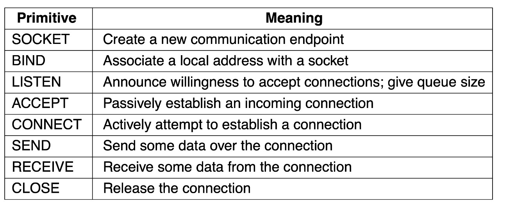
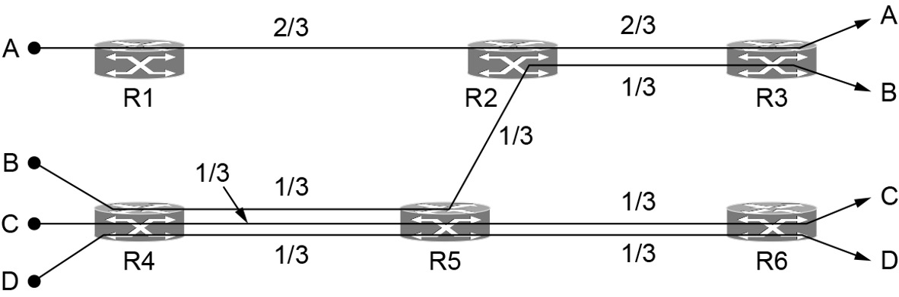
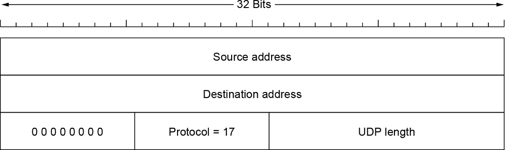
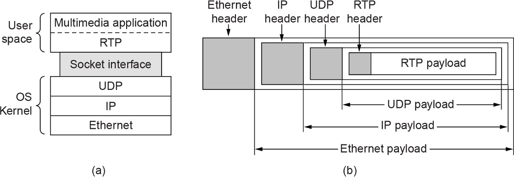

# Chapter 6 The Transport Layer

> Together with the network layer, the transport layer is the heart of the protocol hierarchy. The network layer provides end-to-end packet delivery using datagrams or virtual circuits. The transport layer builds on the network layer to provide data transport from a process on a source machine to a process on a destination machine with a desired level of reliability that is independent of the physical networks currently in use. It provides the abstractions that applications need to use the network. Without the transport layer, the whole concept of layered protocols would make little sense. In this chapter, we will study the transport layer in detail, including its services and choice of API design to tackle issues of reliability, connections and congestion control, protocols such as TCP and UDP, and performance.


## ==6.1 **The Transport Service**==

* Services provided to the upper layers

  提供给上层的服务

* Transport service primitives

  传输服务原语

* Berkeley sockets

   Berkeley sockets

* Example of socket programming: an Internet file server

  socket编程的例子:一个互联网文件服务器


### ==6.1.1 **Services Provided to the Upper Layers**==

* The **goal** of the transport layer is to provide **efficient, reliable, and cost-effective** data transmission service to its users, normally processes in the application layer. 

  传输层的目标是为用户提供高效、可靠、经济的数据传输业务，通常在应用层进行处理。

* The transport layer makes use of the services provided by the network layer. The **software and/or hardware** within the transport layer that does the work is called the **transport entity**.传输层利用网络层提供的服务。传输层中完成工作的**软件和/或硬件**称为**传输实体**。

* The transport entity can be **located** in the operating system **kernel**, in a **library** package bound into network applications, in a separate user process, or even on the network **interface** **card**.

  传输实体可以**位于**操作系统**内核**中，在绑定到网络应用程序的**库**包中，在单独的用户进程中，甚至在网络**接口卡**上。(前两种实现方式在Internet上最常见).


The network, transport, and application layers

>上图显示了网络层、传输层和应用层之间的(逻辑)关系. 与网络层提供面向连接和无连接两种服务一样, 传输的服务类型也分为两种. 面向连接的传输服务在许多方面与面向连接的网络服务类似, 两者的连接都要经历3个阶段: 连接建立、数据传输和连接释放. 在这两层上, 寻址和流量控制非常相像. 另外, 无连接的传输服务与无连接的网络服务也极为相似. 然而请注意, 在一个面向连接的网络服务之上提供无连接传输服务可能很困难. 因为为了发送单个数据包要建立一个连接、发送完毕后还要立即拆除这个连接, 效率实在是太低了.


**The Transport Service**

If the transport layer service is so similar to the network layer service, why are there two distinct layers? Why is one layer not adequate? 

如果传输层服务与网络层服务如此相似，为什么还要有两个不同的层呢?为什么只有一层还不够?

* The transport code runs entirely on the users’ machines, but the network layer largely runs on the routers, which are operated by the carrier (at least for a wide area network). 

  传输层代码完全运行在用户的机器上，但网络层主要运行在由运营商运营的路由器上(至少对于广域网而言)。


What happens if the network layer offers inadequate service? What if it frequently loses packets? What happens if routers crash from time to time?

如果网络层提供的服务不充分，会发生什么?如果频繁丢包怎么办?如果路由器时不时地崩溃会发生什么?

* The users have no real control over the network layer, so they cannot solve the problem of poor service by using better routers or putting more error handling in the data link layer because they don’t own the routers. The only possibility is to put on top of the network layer another layer that improves the quality of the service. 

  用户对网络层没有真正的控制权，因此他们无法通过使用更好的路由器或在数据链路层添加更多的错误处理来解决服务质量差的问题，因为他们没有路由器。唯一的可能是在网络层之上再加一层，以提高服务质量。


> 本质上, 由于传输层的存在, 使得传输服务有可能比网络服务更加可靠. 而且, 传输服务原语可以通过调用库程序来实现, 从而使得这些原语独立于网络服务原语. 不同网络上的网络服务原语可能有很大的差别 (比如, 无连接以太网服务可能完全不同于面向连接的WiMAX服务). 将网络服务隐藏在一组传输服务原语的背后, 带来的好处是, 一旦改变了网络服务, 只需要替换一组库程序即可: 新的库程序使用了不同的底层网络服务, 但是实现了同样的传输服务原语.
>
> 值得庆幸的是, 正是有了传输层, 应用程序员才可以按照一组标准的原语来编写代码, 并且程序可以运行在各种各样的网络上; 他们根本无须处理不同的网络接口, 也不用担心传输的可靠性. 如果所有实际的网络都完美无缺, 具有相同的服务原语, 并保证不会发生变化, 那么传输层或许就不再需要. 然而, 在现实世界中, 传输层承担了把上层与技术设计和各种缺陷隔离的关键作用.
>
> 基于这个原因, 许多人习惯于将网络分成两部分: 第1层至第4层为一部分, 第4层之上为另一部分. 下面的4层可以看作是传输服务的提供者(Transport service provider), 而上面的层次则可视为传输服务的用户(transport serveice user). 这种服务提供者与服务用户的区分对于协议层的设计有重要的影响, 同时也把传输层放到了一个关键位置, 因为它构成了可靠数据传输服务的提供者和用户两者之间的主要边界. 这就是应用层能看到传输层.


### ==6.1.2 **Transport Service Primitives**== 


> 上图显示了5个Primitives (原语). 这个传输接口是真正的赤裸裸, 但它给出了一个面向连接的传输接口应该完成的基本工作. 它允许应用程序建立并使用连接. 用完之后再释放连接, 对于许多应用来货这已经足够了.
>
> 为了看清楚这些primitives的可能用法, 请考虑一个应用, 它有一个服务器和多个远程客户.

* The server executes a **LISTEN** primitive, typically by calling a library procedure that makes a system call that blocks the server until a client turns up. 

  服务器执行**LISTEN**原语，通常通过调用一个库过程来进行系统调用，该调用会阻塞服务器，直到客户端出现。

* When a client wants to talk to the server, it executes a **CONNECT** primitive. The transport entity carries out this primitive by blocking the caller and sending a packet to the server. 

  当客户端想要与服务器通信时，它执行**CONNECT**原语。传输实体通过阻塞调用者并向服务器发送数据包来实现此原语。


Nesting of segments, packets, and frames

段、包和帧的嵌套

>  上图显示, 网络实体对数据包进行类似处理, 然后把数据包的有效载荷字段内容向上传递给传输实体.

* We will use the term **segment** for messages sent from transport entity to transport entity. 

  我们将使用术语**segment**表示从传输实体发送到传输实体的消息。

* **Segments** (exchanged by the transport layer) are contained in **packets** (which are exchanged by the network layer). In turn, these packets are contained in **frames** (exchanged by the data link layer).

  **段**(由传输层交换)包含在**包**(由网络层交换)中。反过来，这些分组包含在**帧**中(由数据链路层交换)。

* When a frame arrives, the data link layer processes the frame header and, if the destination address matches for local delivery, passes the contents of the frame payload field up to the network entity. The network entity similarly processes the packet header and then passes the contents of the packet payload up to the transport entity. 

  当有帧到达时，数据链路层处理帧首部，如果目的地址与本地地址匹配，则将帧有效载荷字段的内容传递给网络实体。网络实体类似地处理分组首部，然后将分组有效载荷的内容传递给传输实体。

> 再回到我们的客户机-服务器例子, 客户的CONNECT调用导致传输实体发送一个CONNECTION REQUEST段给服务器. 当该段到达服务器时, 传输实体检查服务器是否塞在LISTEN状态(即服务器对处理请求感兴趣). 如果是, 则解除服务器的阻塞, 并给客户送回一个CONNECTION ACCEPTED段. 当该段返回给客户机时, 客户机的阻塞也被解除, 于是连接被建立了起来.
>
> 现在双方可以通过SEND和RECEIVE原语交换数据. 在最简单的形式中, 任何一方都可以执行(阻塞的)RECEIVE原语, 等待另一方执行SEND原语. 当段到来时, 接收端被解除阻塞; 然后它可以对这个段进行处理, 并发送一个应答. 只要双方保持应该谁发送数据的次序, 这种方案就可以工作得很好.
>
> 请注意 , 在传输层上, 即使一个非常简单的单向数据交换过程也比网络层的交换过程复杂得多. 发送的每个数据包(最终)都要被确认. 携带控制段的数据包也要被确认, 无论是隐式方式还是显示方式. 这些确认由使用网络层协议的传输实体来管理, 并且它们对于传输用户是不可见的. 类似地, 传输实体需要关心计时器和重传. 这些机制对于传输用户全部是透明的. 对于传输用户而言, 连接就是一个可靠的比特管道: 一个用户在管道一段将比特塞进去, 这些比特就会神奇地出现在管道的另一端. 正是这种隐藏复杂性的能力才使得分层协议称为如此强大的工具.
>
> 当不再需要一个连接时必须将它释放, 以便释放两个传输实体内部的表空间. 中断连接有两种方式: 非对称的和对称的. 在非对称方式中, 任何一方都可以发出DISCONNECT 原语, 从而驱使它的传输实体将一个DISCONNECT段发送给远程的传输实体. 当该段到达另一端时, 连接就被释放了.
>
> 在对称方式中, 连接的两个方向彼此独立, 因此需要单独关闭每个方向. 当一方执行了DISCONNECT, 这意味着它没有更多数据需要发送, 但是它仍然愿意接受对方发送过来的数据. 在这种模式下, 只有当双方都执行了DISCONNECT原语, 一个连接才算真正被释放.


==**A simple connection management scheme**==

一个简单连接管理方案的状态图

A state diagram for a simple connection management scheme. Transitions labeled in italics are caused by packet arrivals. The **solid** lines show the **client’s** state sequence. The **dashed** lines show the **server’s** state sequence.

斜体标记的转换是由分组到达引起的。**实线**表示**客户端**的状态序列。**虚线**表示**服务器**的状态序列。

> 上图给出了使用这些简单原语建立和释放连接的状态图. 每个状态的迁移都是由某种事件触发的, 这些事件可能是本地的传输用户执行了一个原语, 或者是接收了一个数据包. 为了简化起见, 我们假设每个段单独确认; 还假设采用了对称的连接释放模型, 并且由客户先释放连接. 请注意, 这种模型相当不成熟, 后面我们在描述TCP如何工作时会考察更实际的模型.

### 6.1.3 **Berkeley Sockets** 

**Socket primitives** were first released as part of the Berkeley UNIX 4.2BSD software distribution in 1983. They quickly became popular. The primitives are now widely used for Internet programming on many operating systems.

**套接字原语**于1983年作为Berkeley UNIX 4.2BSD软件发行版的一部分首次发布。它们很快就流行起来。这些原语现在被广泛用于许多操作系统上的互联网编程。



The socket primitives for TCP

> 上图列出了一些原语. 粗略地说, 这些原语遵循我们第一个例子的模型, 但提供了更多的功能和灵活性. 
>
> 表中列出前4个原语由服务器按照顺序执行. SOCKET原语创建一个新的端点(end point),  并且在传输实体中为它分配相应的表空间. 此调用的参数说明了采用的地址格式、所需的服务类型(比如可靠的字节流), 以及所用的协议. SOCKET调用与对文件实施的OPEN调用工作方式一样.
>
> 新近创建的套接字没有网络地址. 通过BIND原语可以为socket分配地址. 一旦服务器已经将一个地址绑定到一个socket, 则远程客户就能够与它建立连接. 之所以不让SOCKET调用直接创建一个地址是因为有些进程对于它们的地址比较在意 (比如, 它们多年一直使用同样的地址, 所以每个人都知道它们的地址), 而其他的进程并不在乎.
>
> LISTEN: 的调用, 它为入境呼叫分配队列空间, 以便在多个客户同时发起连接请求时, 将这些入境的连接请求排入队列依次处理. 与我们第一个例子中的LISTEN 不同的是, socket中的Listen并不是一个阻塞调用
>
> 为了阻塞自己以便等待入境连接的到来, 服务器执行ACCEPT原语. 当一个请求连接的段到达时, 传输实体创建一个新的套接字并返回一个与其关联的文件描述符, 这个新套接字与原来的socket具有同样的属性; 然后服务器可以派生一个进程或者线程来处理这个新套接字上的连接, 而服务器自身又回到原来的套接字上等待下一个连接请求的到来. ACCEPT返回一个文件描述符, 服务器可以按照标准的方式对它进行读或者写操作, 就像访问文件一样.
>
> 现在我们来看客户端的情形. 同样地, 这里首先也必须使用SOCKET原语创建一个SOCKET, 但是因为客户端使用什么地址对服务器而言无所谓, 所以客户端不需要调用BIND原语. CONNECT原语阻塞调用方, 并主动发起建立连接过程. 当CONNECT调用完成(即接受到服务器发送过来的确认段), 客户进程被解除阻塞, 于是连接就被建立起来. 现在双方都可以使用SEND或者RECV, 在新建的全双工连接上发送或者接受数据. 如果SEND和RECV调用不要求特殊选项的话, 服务器或者客户也可以使用标准的UNIX系统调用READ和WRITE.
>
> 在socket模型中, 连接的释放是对称的. 当双方都执行了CLOSE原语之后, 连接就被释放了.


### 6.1.4 **An Example of Socket Programming: An Internet File Server** 

> 作为一个真实socket调用的基本事实例子, 如下代码所示的客户端和服务器代码. 这里我们有一个非常原始的Internet文件服务器, 和一个使用该服务器的客户实例. 这份代码有许多限制(后面讲会提到), 但原则上, 服务器代码可以编译成二进制代码, 并且可以运行在任何连接到Internet的UNIX系统上. 客户代码也可以编译, 并且可运行在Internet任何地方的其他UNIX机器上. 客户代码在执行的时候需要正确的参数, 以便获取服务器上的任何文件, 这些文件是服务器本身能够访问的. 文件被送到标准输出, 当然, 可以将标准输出重定向到某个文件或者一个管道.


```c
/* This is the server code */
/* 在开始处它包含一些标准的头文件, 其中最后3个头文件包含了一些主要的与INternet有关的定义和数据结构 */
#include <sys/types.h>
#include <string.h>
#include <stdio.h>
#include <stdlib.h>
#include <sys/fcntl.h>
#include <sys/socket.h>
#include <netinet/in.h>
#include <netdb.h>

/* 接下来是一个宏定义, 将SERVER_PORT 定义成8080. 这个数值是任意选取的 */
/* 1025 ~ 65535 之间的任何一个数值都可以正确地工作, 只要不被其他进程使用: 小于1024的数字为特权用户保留 */
#define SERVER_PORT 8080 						/* arbitrary, but client & server must agree */ 
/*接下来两行定义了两个用到的常数. 第一个常数决定了在文件传输过程中数据块的大小.*/
#define BUF_SEZE 4096							/* block transfer size */
/* 第二个常数决定了允许多少个连接请求在排队等待处理, 一旦连接请求到达这个数目以后, 后续到达的连接请求将被丢弃 */
#define QUEUE_SIZE 10							

int main(int argc, char *argv[]){
  /* 声明局部变量 */
  int s, b, l, fd, sa, bytes, on = 1;
  char buf[BUF_SIZE];								 /* buffer for outgoing file */
  /* 对一个用来存放服务器IP地址的数据结构进行初始化, 该数据结构很快被绑定到服务器的套接字中 */
  struct sockaddr_in channel;				 /* holds IP address */
  
  
  /* Build address structure to bind to socket. */
  /* memset调用将这个数据结构进行初始化为全0 */
  memset(&channel, 0, sizeof(channel));			/* zero channel */
  /* 紧随其后的3条赋值语句分别填充了该数据结构的3个字段*/
  channel.sin_family = AF_INET;
  channel.sin_addr.s_addr = htonl(INADDR_ANY);
  /* 该字段包含了服务器的端口 */
  channel.sin_port = htons(SERVER_PORT);
  /* 上述htonl 和 htons是必要的, 它们将参数中的值转换成一种标准格式, 所以该服务器的代码既可以运行在little-endian字节序的机器 (比如Intel x86)上, 也可以运行在big-endian字节序的机器 (比如SPARC)上 */
  
  /* Passive open. Wait for connection. */
  /* 接下来为服务器创建一个socket */
  s = socket(AF_INET, SOCK_STREAM, IPPROTO_TCP); /* create socket */
  /* 检查是否出错(由 s<0标示) */
  if (s < 0){
    printf("socket call failed0");
    exit(-1);
  }
  
  setsockopt(s, SOL_SOCKET, SO_REUSEADDR, (char *) &on, sizeof(on));
  b = bind(s, (struct sockaddr *) &channel, sizeof(channel));
  
  if (b < 0){
    printf("bind failed0");
    exit(-1);
  }
  
  /* Socket is now set up and bound. Wait for connection and process it. */
  while (1){
    sa = accept(s, 0, 0);            /* block for connection request */
    if (sa < 0){
      printf("accept failed0");
      exit(-1);
    }
    read(sa, buf, BUF_SIZE);         /* read file name from socket */
    
    /* Get and return the file */
    fd = open(buf, O_RDONLY);				 /* open the file to be sent back */
    if (fd < 0){
      prinft("open failed");
    }
    
    while (1){
      bytes = read(fd, but, BUF_SIZE); /* read from file */
      if (bytes <= 0){								 /* check for end of file */
        break;												 
      }
      write(sa, buf, bytes);					 /* write bytes to socket */
    }
    close(fd);												 /* close file */
    close(sa);												 /* close connection */
  } 
}
```


```c
/* This page contains a client program that can request a file from the server program 
* on the next page. The server responds by sending the whole life 
*/
/* client */

#include <sys/types.h>
#include <unistd.h>
#include <string.h>
#include <stdio.h>
#include <stdlib.h>
#include <sys/socket.h>
#include <netinet/in.h>
#include <netdb.h>

#define SERVER_PORT 8080      /* arbitray, but client & server must agree */
#define BUF_SIZE 4096 /* block transfer size */

int main(int argc, char * argv)
{
  int c, s, bytes;       /* buffer for incoming file */
  char buf[BUF_SIZE];    /* info about server */
  struct hostent*h;			 /* holds IP address */
  struct sockaddr_in channel; /* holds IP address */
  
  if (argc != 3){
    printf("Usage: client server-name file-name0");
    exit(-1);
  }
  
  h = gethostbyname(argv[1]);     /* look up host's IP address */
  
  if (!h){
    printf("gethostbyname failed to located %s0, argv[1]");
    exit(-1);
  }
  
  s = socket(PF_INET, SOCK_STREAM, IPPROTO_TCP);
  if (s < 0){
    printf("socket call failed0");
    exit(-1);
  }
  
  memset(&channel, 0, sizeof(channel));
  channel.sin_family=AF_INET;
  memcpy(&channel.sin_addr.s_addr, h->h_addr, h->h_lenght);
  channel.sin_port=htons(SERVER_PORT);
  c = connect(s, (struct sockaddr *) & channel, sizeof(channel));
  if (c < 0){
    printf("connect failed0");
    exit(-1);
  }
  
  /* Connection is now established. Send file name including 0 byte at end. */
  write(s, argv[2], strlen(argv[2])+1);
  
  /* Go get the file and write it to standard output. */
  while (1){
    bytes = read(s, but, BUF_SIZE);      /* read from socket */
    if (bytes <= 0){ 										 /* check for end of file */
      exit(0); 
    }          
    write(1, buf, bytes);                /* write to standard output */
  }
}

```


## ==6.2 **Elements of Transport Protocols**== 

* Addressing
* Error control and flow control
* Multiplexing
* Crash recovery


At the **data link** layer, two routers communicate directly via a **physical** channel, whether wired or wireless, whereas at the **transport** layer, this physical channel is replaced by the **entire** **network**. This difference has many important implications for the protocols.

> 在**数据链路**层，两个路由器通过一个**物理**通道(有线或无线)直接通信，而在**传输**层，这个物理通道被**整个** **网络**取代。这种差异对于协议设计有很大的影响. 

(a) Environment of the data link layer. (b) Environment of the transport layer.

> a)数据链路层环境。(b)传输层环境。

> 首先, 在点到点链路上, 无论是电缆或者光纤, 路由器不必指定它要与哪一台路由器进行通话--每条出境线路直接通向一台特定的路由器. 而在传输层, 必须显式地制定接收方的地址.
>
> 图(a), 在一条线路上建立一个连接的过程非常简单: 另一端总是在那里(除非它崩溃了才不在那里). 两边都不需要做很多事情. 即使在无线链路上, 建立过程也没有多大的不同, 只要发出的消息足够到达所有的其他接收方. 如果因发生错误而消息没有被确认, 可以再次重发. 而在传输层中, 初始的连接建立过程非常复杂. 


### 6.2.1 Addressing


TSAPs, NSAPs, and transport connections 

> 上图显示了NSAP、TSAP和传输连接的关系. 应用进程 (包括客户和服务器) 可以将自己关联到一个本地TSAP上, 以便与一个远程TSAP建立连接. 这些连接运行在每台主机的NSAP之上, 如上图所示. 在有些网络中, 每台计算机只有一个NSAP, 但是可能有多个传输端点共享此NSAP, 因此需要某种方法区分这些传输端点. 
>
> 使用传输连接的一种可能场景如下所述:
>
> (1) Host2上的邮件服务器进程将自己关联到TSAP 1522 上, 等待入境连接请求的到来. 至于进程如何将自己关联到TSAP上, 这超出了网络模型的范畴, 完全取决于本地操作系统. 例如, 用我们的LISTEN调用就可以做到这一点.
>
> (2) Host1上的应用进程希望发送一个邮件消息, 所以它把自己关联到TSAP1208上, 并且发出一个CONNECT请求. 该请求消息指定主机1上的TSAP1208作为源, Host2上的TSAP 1522 作为目标. 这个动作最终导致在应用进程和服务器之间建立一个连接.
>
> (3) 应用进程发送邮件消息
>
> (4) 作为响应, 邮件服务器表示它将传递该消息.
>
> (5) 传输连接被释放.
>
> 请注意, 在Host2上很可能还有其他的服务器被关联到其他的TSAP上, 它们也在等待经过同一个NSAP到达的入境连接请求.

* the transport addresses to which processes can listen for connection requests are called **ports**.

  进程可以监听连接请求的传输地址称为**端口**

* We will use the generic term **TSAP** (**Transport Service Access Point**) to mean a specific endpoint in the transport layer.

  我们将使用通用术语**TSAP**(**传输服务接入点**)来表示传输层中的特定端点

* The analogous endpoints in the network layer are called **NSAPs** (**Network Service Access Points**). IP addresses are examples of NSAPs.

  网络层中的类似端点称为**NSAPs** (**network Service Access Points**)。IP地址是NSAPs的例子


How a user process in host 1 establishes a connection with a mail server in host 2 via a process server

主机1中的用户进程如何通过进程服务器与主机2中的邮件服务器建立连接

* **Initial connection protocol:**  Instead of every conceivable server listening at a well-known TSAP, each machine that wishes to offer services to remote users has a special **process server** that acts as a proxy for less heavily used servers. 

  **初始连接协议**:不是所有可能的服务器都在一个知名的TSAP上监听，而是希望为远程用户提供服务的每台机器都有一个特殊的**process server**，它充当使用较少的服务器的代理

* It listens to a set of ports at the same time, waiting for a connection request. If no server is waiting for them, they get a connection to the process server.

  它同时监听一组端口，等待连接请求。如果没有服务器等待它们，它们将获得到流程服务器的连接。

* The new server does the requested work, while the process server goes back to listening for new requests,

  新服务器执行请求的工作，而流程服务器返回侦听新请求

> 一个服务的潜在用户发出一个连接请求, 并指定他们所需服务的TSAP地址. 如果该TSAP地址上没有服务器正等着, 则他们得到一条与进程服务器的连接. 如(a) 所示.
>
> 在获取入境请求后, 进程服务器派生出被请求的服务器, 允许该服务器继承与用户的现有连接. 新服务器完成要求的工作, 而进程服务器可回去继续监听新的连接要求, 如(b)所示. 这种方式只适用于服务器可按需创建的场合. 

 

### ==6.2.4 **Error Control and Flow Control**==

误差控制和流量控制

* Error control is ensuring that the data is delivered with the desired level of reliability, usually that all of the data is delivered without any errors. 

  误差控制是确保数据交付所需的可靠性水平, 通常所有的数据是没有任何错误

* Flow control is keeping a fast transmitter from overrunning a slow receiver.

  流量控制是防止快速的发送器超过缓慢的接收器。


* A frame carries an error-detecting code (e.g., a CRC or checksum) that is used to check if the information was correctly received.

  帧带有错误检测码(例如，CRC或校验和)，用于检查信息是否正确接收

* A frame carries a sequence number to identify itself and is retransmitted by the sender until it receives an acknowledgement of successful receipt from the receiver. This is called **ARQ** (**Automatic Repeat** **reQuest**).

  帧携带用于标识自身的序列号，由发送端重传，直到收到接收端成功接收的确认。这称为**ARQ**(**自动重复** **请求**)。

* There is a maximum number of frames that the sender will allow to be outstanding at any time, pausing if the receiver is not acknowledging frames quickly enough. If this maximum is one packet the protocol is called **stop-and-wait.** 

  发送端在任何时候允许未完成的帧数量有一个上限，如果接收端没有足够快地确认帧，则会暂停。如果这个最大值是一个数据包，则该协议被称为**停止-等待**

* The **sliding window** protocol combines these features and is also used to support bidirectional data transfer.

  **滑动窗口**协议结合了这些特性，也用于支持双向数据传输。


(a) Chained fixed-size buffers. (b) Chained variable-sized buffers. (c) One large circular buffer per connection.

(a)链式固定大小的缓冲区。(b)链式可变大小的缓冲区。(c)每个连接一个大的环形缓冲区。

> (a) 很自然的做法是将缓冲区组织成一个由大小统一的缓冲区构成的冲池, 每个缓冲区容纳一个段, 如(a)所示. 然而, 如果段长度的差异范围很大, 可能是一个请求Web网页的短数据包, 也可能是P2P文件传输中的大数据包, 那么, 用固定长度的缓冲区池就有问题. 如果将缓冲区设置成最大可能的段长, 那么当短数据包到来时就会很浪费空间; 如果将缓冲区设置成比最大的段要小, 则长的段就需要多个缓冲区, 从而带来额外的复杂性.
>
> (b) 这里的优点是能获得更好的内存利用率, 付出的代价是缓冲区的管理更加复杂.
>
> (c) 为每个连接使用一个大的循环缓冲区

Given that transport protocols generally use **larger sliding windows**, we will look at the issue of buffering data more carefully.

鉴于传输协议通常使用**更大的滑动窗口**，我们将更仔细地研究数据缓存的问题。


### ==6.2.5 **Multiplexing**==


(a) Multiplexing. (b) Inverse multiplexing.

(一)多路复用。(b)逆复用。

> 多路复用: (a) 所示, 4个独立的传输连接都使用了相同的网络连接(即IP地址)达到远程主机、
>
> (b) 若打开了k条网络连接, 则有效带宽可能会增长k个因子. 逆向多路复用的一个例子是流控制传输协议(SCTP, Stream Control Transmission Protocol) , 它可以把一条连接运行在多个网络接口上. 相反, TCP使用了个单个网络端点. 逆向多路复用也可以应用在链路层, 把几条并发运行的低速率链路当作一条高速率链路使用.

If only one network address is available on a host, all transport connections on that machine have to use it. When a segment comes in, some way is needed to tell which process to give it to. This situation, called **multiplexing**

如果一台主机上只有一个可用的网络地址，那么这台机器上的所有传输连接都必须使用它。当一个段进入时，需要某种方式来确定将它交给哪个进程。这种情况称为**多路复用**


A host has multiple network paths that it can use. If a user needs more bandwidth or more reliability than one of the network paths can provide, a way out is to have a connection that distributes the traffic among multiple network paths on a round-robin basis. This is called **inverse multiplexing**. 

一台主机可以使用多条网络路径。如果用户需要的带宽或可靠性超出了一条网络路径所能提供的范围，一种解决方法是建立一个连接，以轮询的方式在多条网络路径之间分配流量。这被称为**逆多路复用**。


### ==6.2.6 **Crash Recovery**==

崩溃恢复


Each client can be in one of two states: one segment outstanding, S1, or no segments outstanding, S0.

每个客户端可以处于以下两种状态之一:一个未完成段S1，或没有未完成段S0。

> 为了试图从原先的状态中恢复过来, 服务器可以给所有其他主机发送一个广播段, 宣告自己刚才崩溃了, 并要求它的客户们告知关于所有打开连接的状态信息. 
>
> 初看起来似乎很明显: 当客户知道服务器崩溃时, 当且仅当有一个未确认的段悬挂着时(即处于状态S1) 它才重传该段. 然而, 进一步探究这种天真的做法便会发现其中的困难.
>
> 例如: 服务器的传输实体首先发送一个确认, 然后在确认被发出以后再执行写操作, 把数据传给应用进程. 将一个段写到输出流和发送一个确认, 这是两件不能同时进行的独立事件. 如果在确认被发送出去之后, 但是在写操作完成之前服务器崩溃了, 那么客户将会接收到确认; 当服务器崩溃恢复之后发出的广播消息到来的时候, 该客户处于S0状态. 因此客户不会重传段, 因为它(不正确地) 认为段已经到达服务器了. 客户的这一决定将导致错失一个段.
>
> 如果只重新修改传输实体的程序, 让它先执行写操作再发送确认即可. 如果写操作已经完成, 但是在发送确认之前服务器崩溃了, 那么, 客户将处于状态S1中, 因此它会重传, 从而导致在服务器应用进程的数据流中出现一个未被检测出来的重复段.
>
> 无论如何编写客户和服务器程序的代码, 总是存在使协议无法正确恢复运行的情形. 服务器程序可以编成两种方式: 先发确认, 或者先写数据. 而客户程序可以编成四种不同方法: 总是重传最后一段、永远不重传最后一段、仅当在状态$S0$时才重传, 或者仅当在状态S1时才重传. 服务器和客户两者结合起来有8种操作组合, 但是正如我们将会看到的, 对于每一种组合都存在一些使协议失败的事件.

**Three** events are possible at the server: sending an acknowledgement (**A**), writing to the output process (**W**), and crashing (**C**). The three events can occur in **six** different orderings: *AC*(*W*), *AWC*, *C*(*AW*), C(*WA*), *WAC*, and *WC*(*A*), where the parentheses are used to indicate that neither *A* nor *W* can follow *C* (i.e., once it has crashed, it has crashed). All **eight** combinations of client and server strategies and the valid event sequences for each one. Notice that for each strategy there is some sequence of events that causes the protocol to fail. For example, if the client always retransmits, the *AWC* event will generate an undetected duplicate, even though the other two events work properly.

在服务器端可能发生三种事件:发送确认(**A**)、写入输出进程(**W**)和崩溃(**C**)。这三个事件可能以**六**种不同的顺序发生: *AC*(*W*)、*AWC*、*C*(*AW*)、C(*WA*)、*WAC*和*WC*(*A*)，其中的括号表示*A*和*W*都不能跟在*C*之后(即一旦它崩溃了，它就崩溃了)。客户端和服务器策略的所有**8 **组合以及每种策略的有效事件序列。请注意，对于每种策略，都有一些导致协议失败的事件序列。例如，如果客户端总是重传，*AWC*事件将产生一个未检测到的重复，即使其他两个事件正常工作。

>  “从第N层崩溃中的恢复工具只能由第N+1层完成” 并且仅当高层保留了问题发生钱的足够状态信息时才有可能恢复. 


## ==6.3 **Congestion Control**==

* If the transport entities on many machines send **too many packets** into the network **too quickly**, the network will become congested, with performance degraded as packets are delayed and lost. 

  如果许多机器上的传输实体**过快**向网络发送**太多的数据包**，网络将变得拥塞，由于数据包的延迟和丢失，性能会下降。

* Controlling congestion to avoid this problem is the **combined** **responsibility** of the network and transport layers. 

  通过控制拥塞来避免这个问题是网络层和传输层**结合的** **责任**

* Congestion occurs at **routers**, so it is detected at the **network** layer. However, congestion is ultimately caused by traffic sent into the network by the transport layer. 

  拥塞发生在**路由器**，所以它是在**网络**层检测到的。然而，拥塞最终是由传输层发送到网络的流量引起的。

* The only **effective** way to control congestion is for the transport protocols to send packets into the network more slowly.

  控制拥塞的唯一**有效**方法是让传输协议以更慢的速度向网络发送数据包。


### ==6.3.1 **Desirable Bandwidth Allocation**==

理想的带宽分配

#### 6.3.1.1 Efficiency and Power

效率和功率


(a) Goodput and (b) delay as a function of offered load.

(a)有效吞吐量和 (b)延迟作为提供负载的函数。

(a) As the load increases, **goodput initially increases** at the same rate, but as the load approaches the capacity, **goodput rises more gradually**. This **falloff** is because **bursts of traffic** can occasionally mount up and cause some **losses at buffers** inside the network. If the **transport** **protocol** is **poorly** **designed** and **retransmits** **packets** that have been **delayed** but not **lost**, the network can enter **congestion** **collapse**. In this state, senders are furiously sending packets, but increasingly little useful work is being accomplished.

(a) 随着负载的增加，**goodput最初以相同的速率增加**，但当负载接近容量时，**goodput增加得更缓慢**。这种**衰减**是因为**突发流量**偶尔会增加，并导致网络内部的**缓冲区损失**。如果**传输协议**是**错误的设计**，并且**重传了**已经**延迟**但没有**丢失**的**数据包，网络可能会进入拥塞崩溃**。在这种状态下，发送者正在疯狂地发送数据包，但却越来越少地完成有用的工作。

> (b)  给出了相应的延迟变化情况. 最初的延迟是固定的, 表示穿过整个网路的传播延迟. 随着负载接近网络容量, 延迟逐步上升, 开始上升速度比较缓慢, 然后骤然上升. 这也是因为突发流量在高负荷被堆积起来的缘故. 延迟实际上不可能真正达到无穷, 除非在一个路由器有无限大缓冲区的模块中. 相反, 数据包在经历了最大的缓冲延迟后被路由器丢弃.
>
> 对于实际吞吐量和延迟, 在拥塞出现时性能开始下降. 直观地说, 如果我们逐步加大分配的带宽, 将从网络获取最佳的性能, 直到延迟开始迅速攀升的那点. 而这一点恰好低于网络容量. 为了标识它, 提出了功率的度量, 其中
>
> 功率=负载/延迟


#### ==6.3.1.2 **Desirable Bandwidth Allocation:  Min-Max Fairness**==

最大-最小公平性



Max-min bandwidth allocation for four flows

> 在这个网络中存在4个流, 分别标识为A、B、C和D. 路由器之间的每条链路具有相同的容量, 用1个单位表示, 虽然在一般情况下链路的容量是不同的. 3个流竞争左下角位于路由器R4和R5之间的链路. 因此, 这些流中的每一个都得到1/3的链路容量. 其余的流, A与B竞争从路由器R2到R3的链路. 由于B已经分配得到 $1/3$, A得到剩余的$2/3$  链路容量. 请注意, 所有的其他链路都有空余容量. 但是这种空余容量不呢鞥给予任何其他流使用, 除非降低里另一个流的更低容量.  
>
> 例如: 如果把路由器R2和R3之间的带宽给B分配得多一些, 那必定要降低流A的容量. 这对于已经有更多带宽的流A来说是合理的. 然而, 流C或D(或两者)的容量必须减少才能给流B更多的带宽, 而这些流的带宽将小于B.


4个流的Max-min带宽分配

* The form of fairness that is often desired for network usage is **max-min fairness**. An allocation is max-min fair if the bandwidth given to one flow cannot be increased without decreasing the bandwidth given to another flow with an allocation that is no larger. 

  通常希望网络使用的公平性形式是**最大最小公平性**。如果分配给一个流的带宽不能增加，而不减少给另一个流的带宽，那么分配就是最大最小公平的。


* Each of the links between **routers** has the **same capacity**, taken to be **1 unit**, though in the general case the links will have different capacities. 

  **路由器**之间的每条链路都具有**相同的容量**，假设为**1单位**，尽管在一般情况下链路的容量不同。

* If **more of the bandwidth** on the link between *R2* and *R3* is given to flow **B**, there will be **less for flow** **A**. This is reasonable as flow *A* already has more bandwidth. However, the capacity of flow **C** **or** **D** **(or both) must be decreased** to give more bandwidth to *B*, and these flows will have less bandwidth than *B*. Thus, the allocation is max-min fair.

  如果*R2*和*R3*之间的链路上的**更多带宽**被分配给流**B**，则流**A**的带宽将**更少**。这是合理的，因为流*A*已经有了更多的带宽。然而，必须减少流**C** **或** **D** **(或两者都有)的容量，以给B**更多的带宽，而这些流的带宽将小于**B**。因此，分配是最大最小公平的。

  

  #### ==6.3.1.3 **Desirable Bandwidth Allocation: Convergence**==

  收敛

  

  Changing bandwidth allocation over time

  随时间改变带宽分配

  Because of the variation in demand, the ideal **operating point for the network varies** over time. A good congestion control algorithm should **rapidly converge** to the ideal operating point, and it should **track that point** as it changes over time. Initially, flow 1 has all of the bandwidth. One second later, flow 2 starts. It needs bandwidth as well. The allocation quickly changes to give each of these flows half the bandwidth. At 4 seconds, a third flow joins. However, this flow uses only 20% of the bandwidth, which is less than its fair share (which is a third). Flows 1 and 2 quickly adjust, dividing the available bandwidth to each have 40% of the bandwidth. At 9 seconds, the second flow leaves, and the third flow remains unchanged. The first flow quickly captures 80% of the bandwidth. 

  由于需求的变化，网络的理想**工作点**会随时间变化。一个好的拥塞控制算法应该快速收敛到理想的工作点，并随着时间的变化跟踪该点。最初，流1拥有所有带宽。一秒钟后，第二阶段开始。它也需要带宽。分配很快改变，给每个流一半的带宽。在4秒时，第三个流连接。然而，该流只占用20%的带宽，低于公平份额(1 / 3)。流1和流2快速调整，将可用带宽分配给各占40%的带宽。9秒时，第二个流离开，第三个流保持不变。第一个流快速捕获80%的带宽。

  

  ### ==6.3.2 **Regulating the Sending Rate**==

  调整发送速率


(a) A fast network feeding a low-capacity receiver. (b) A slow network feeding a high-capacity receiver

(a)提供低容量接收器的快速网络。(b)馈送高容量接收机的慢网络

In **[Fig (a)](https://plus.pearson.com/products/ea753305-d570-484b-8fab-9fcfce223768/pages/7b4d77f0-4bae-11ec-8c47-bd90946ce6ea.xhtml)**, we see a thick pipe leading to a small-capacity receiver. This is a flow-control limited situation. As long as the sender does not send more water than the bucket can contain, no water will be lost. 

在**[图(a)](https://plus.pearson.com/products/ea753305-d570-484b-8fab-9fcfce223768/pages/7b4d77f0-4bae-11ec-8c47-bd90946ce6ea.xhtml)**)中，我们看到一个厚管道通向一个小容量接收器。这是一种流量控制受限的情况。只要发送者发送的水不超过桶可以容纳的水，就不会有水流失。

In **[Fig (b)](https://plus.pearson.com/products/ea753305-d570-484b-8fab-9fcfce223768/pages/7b4d77f0-4bae-11ec-8c47-bd90946ce6ea.xhtml)**, the limiting factor is not the bucket capacity, but the internal carrying capacity of the network. If too much water comes in too fast, it will back up and some will be lost (in this case, by overflowing the funnel).

在**[Fig (b)](https://plus.pearson.com/products/ea753305-d570-484b-8fab-9fcfce223768/pages/7b4d77f0-4bae-11ec-8c47-bd90946ce6ea.xhtml)**)中，限制因素不是桶的容量，而是网络的内部承载能力。如果太多的水进入太快，它会倒流，一些会丢失(在这种情况下，通过溢出漏斗)。

The sending rate may be limited by two factors.

发送速率可能受到两个因素的限制。

* The first is **flow control**, in the case that there is insufficient buffering at the receiving end. 

  第一种是**流量控制**，在接收端缓冲区不足的情况下。

* The second is **congestion**, in the case that there is insufficient capacity in the network. 

  第二种是**拥塞**，指的是网络中没有足够的容量。


#### ==6.3.2.1 **Regulating the Sending Rate (AIMD)**==


Additive and multiplicative bandwidth adjustments

加性和乘性带宽调整


Chiu and Jain (1989) studied the case of binary congestion feedback and concluded that **AIMD** (**Additive Increase Multiplicative Decrease**) is the appropriate control law to arrive at the efficient and fair operating point. 

Chiu和Jain(1989)研究了二进制拥塞反馈的情况，认为**AIMD** (**Additive Increase Multiplicative Decrease**)是达到高效和公平运行点的合适控制律。

Consider what happens from some starting allocation if both user 1 and user 2 **additively increase** their respective bandwidths over time. Eventually, the **operating point crosses the efficiency line,** and both users receive a **congestion signal** from the network. At this stage, they must reduce their allocations. However, an additive decrease would simply cause them to oscillate along an additive line. Similarly, consider the case when both users **multiplicatively increase** their bandwidth over time until they receive a congestion signal. In **neither case** will the users converge to the optimal sending rates that are both **fair and efficient.** 

考虑一下，如果用户1和用户2都随着时间的推移**增加**各自的带宽，开始分配带宽时会发生什么。最终，**工作点跨越了效率线**，两个用户都会收到来自网络的**拥塞信号**。在这个阶段，他们必须减少分配。然而，加性减小只会使它们沿着加性线振荡。类似地，考虑这样的情况:随着时间的推移，两个用户都**成倍地增加**带宽，直到他们收到拥塞信号。在**这两种情况**下，用户都不会收敛到**公平且高效**的最佳发送速率

> 加法递减只会导致他们沿着递增线振荡. 这种行为将保持操作点接近效率线, 但它并不一定是公平的.


Additive Increase Multiplicative Decrease (AIMD) control law

加性增加乘性减少(AIMD)控制律

Now consider the case that the users **additively increase** their bandwidth allocations and then **multiplicatively decrease** them when congestion is signaled. This behavior is the **AIMD control law**. It can be seen that the path traced by this behavior does converge to the optimal point that is both **fair and efficient**. 

现在考虑这样的情况，用户**递增**他们的带宽分配，然后在拥塞信号出现时**减少**他们的带宽分配。这种行为就是**AIMD控制律**。可以看出，这种行为所跟踪的路径确实会收敛到**公平且高效**的最优点。


## 6.4 The internet transport protocols: UDP

> Internet的传输层有两个主要协议, 无连接和面向连接各一个, 两个协议互为补充. 无连接协议UDP, 它除了给应用程序提供发送数据包功能并允许它们在所需的层次之上架构自己的协议之外, 几乎没有做什么特别的事情. 面向连接的协议是TCP, 该协议几乎做了所有的事情. 它建立连接, 并通过重传机制增加了可靠性, 同时还进行流量控制和拥塞控制, 代表使用它的应用程序做了所有的一切.


### ==6.4.1 **Introduction to UDP**==

* The Internet has **two** main protocols in the transport layer, a connectionless protocol and a connection-oriented one. 

  互联网在传输层有**两种**主要协议，无连接协议和面向连接协议。

* The **==connectionless==** protocol is **UDP (User Datagram Protocol)**. 

  **无连接**协议是**UDP (User Datagram protocol，用户数据报协议)**

* It does almost nothing beyond sending packets between applications, letting applications build their own protocols on top as needed. 

  除了在应用程序之间发送数据包，它几乎没有做任何事情，让应用程序根据需要构建自己的协议。

* UDP provides a way for applications to send **encapsulated IP datagrams** without having to establish a connection.

  UDP为应用程序提供了一种无需建立连接就可以发送**封装IP数据报**的方法。


The UDP header

UDP报头

* The **source** **port** is primarily needed when a **reply** must be **sent** back to the source.

  当必须**发送**应答到源时，**源** **端口**是主要需要的

* By **copying** the **Source** **port** field from the incoming segment into the **Destination** **port** field of the outgoing segment, the process sending the reply can specify which process on the sending machine is to get it.

  通过将**源** **端口**字段从传入段**复制**到传出段的**目标** **端口**字段，发送答复的进程可以指定发送机器上的哪个进程获取答复。

* The **UDP length** field includes the **8-byte header and the data**.

  **UDP length**字段包括**8字节首部和数据**

* An **optional** **Checksum** is also provided for **extra** **reliability**. 

  一个**可选的**校验和**也提供了额外的可靠性**。

> checkSum is important

> 上图描述了头信息. 两个端口(port)分别用来表示源机器和目标机器内部的端点. 当一个UDP数据包到来时, 它的有效载荷被递交给与目标端口相关联的那个进程. 在调用了BIND原语或者其他某种类似的原语之后, 这种关联关系就建立起来, 正如TCP时已经看过的那样(UDP的绑定过程是一样的).  可以把端口看作应用程序租来接收数据包的邮箱. 
>
> 采用UDP而不是原始IP的主要价值在于增加了源端口和目标端口. 如果没有端口字段, 传输层将无从知道如何处理每个入境数据包; 而有了端口字段之后, 它就能把内嵌的段递交给正确的应用程序处理.
>
> 当接收端必须将一个应答返回给源端时, 源端口(Source Port) 字段则是必需的. 只是要将入境段中的源端口字段复制到出境段中的目标端口(Destination Port)字段,  接收端就指定了由发送端机器上的哪个进程来接收应答.
>
>  `UDP length`:  字段包含8个字节的头和数据两部分的总长度. 最小长度是8个字节, 刚好覆盖UDP头. 最大长度是65515字节, 恰好低于填满16比特的最大字节数, 而这是由IP数据包限制的.
>
> `UDP Checksum`: 字段还提供了额外的可靠性. 它校验头、数据和一个概念性的IP伪头. 执行校验和计算时, 校验和字段先被设置为零, 如果数据字段的长度是奇数则用零填充成偶字节. 校验和算法很简单, 先按16位字的补码相加求和, 然后再取总和的补码. 因此, 当接收端对整个段计算校验和时, 要包括UDP校验和字段, 正确的结果应该为0. 如果发送端没有计算校验和, 则将该字段值填为0, 因为补码计算结果可能碰巧真的是0, 则存储为全1. 然而, 关闭校验和计算不是明智之举, 除非数据传输的质量并不重要(例如, 数字化语音).


The Internet has **two** main protocols in the transport layer, a connectionless protocol and a connection-oriented one. The **connectionless** protocol is **UDP (User Datagram Protocol)**. It does almost nothing beyond sending packets between applications, letting applications build their own protocols on top as needed. UDP provides a way for applications to send **encapsulated IP datagrams** without having to establish a connection.

互联网在传输层有**两种**主要协议，无连接协议和面向连接的协议。**无连接**协议是**UDP (User Datagram protocol，用户数据报协议)**。除了在应用程序之间发送数据包外，它几乎什么都不做，让应用程序根据需要在上面构建自己的协议。UDP为应用程序提供了一种无需建立连接就可以发送**封装IP数据报**的方法。


**==IPv4** **Pseudoheader**==



The IPv4 pseudoheader included in the UDP checksum

UDP校验和包括了IPv4伪头

* The pseudoheader contains the **32-bit IPv4 addresses** of the source and destination machines, the **protocol number** for UDP (17), and the **byte** **count** for the UDP segment (including the header). It is different but analogous for IPv6. 

  伪首部包含源和目标计算机的**32位IPv4地址**，UDP(17)的**协议号**，UDP段的**字节** **计数**(包括首部)。它与IPv6不同，但也类似

* Including the **pseudoheader** **in the UDP checksum** computation helps **detect misdelivered packets**, but including it also violates the protocol hierarchy since the IP addresses in it belong to the IP layer, not to the UDP layer.

  在UDP校验和计算中包含**伪报头**有助于**检测误发送的数据包**，但包含它也违反了协议层次结构，因为其中的IP地址属于IP层，而不是UDP层。

> 它包含源机器和目标机器的32位IP地址、UDP的协议号(17) 以及UDP段(包括头)的字节计数. IPv6的伪头与其类似, 但有些许不同. 在UDP校验和计算中包含伪头将有助于检测出被错误递交的数据包, 但是传输层在计算校验和时需要地址的做法违反了协议分层原则, 因为IP地址属于IP层, 而不属于UDP层. TCP在计算校验和的时候也使用了同样的伪头.


### ==6.4.2 **Remote Procedure Call**==

* When a process on machine 1 calls a procedure on machine 2, the calling process on 1 is suspended and execution of the called procedure takes place on 2. 

  当机器1上的进程调用机器2上的过程时，调用机器1上的进程被挂起，被调用的过程在机器2上执行。

* Information can be transported from the **caller to the callee** in the parameters and can come back in the procedure result. 

  信息可以在参数中从**调用者传输到被调用者**，并可以在过程结果中返回。

* No message passing is visible to the application programmer. This technique is known as **RPC** (**Remote Procedure Call**) and has become the basis for many networking applications. 

  应用程序程序员看不到任何消息传递。这种技术被称为**RPC**(**远程过程调用**)，已经成为许多网络应用程序的基础。

* Traditionally, the **calling** procedure is known as the **client** and the **called** procedure is known as the **server**.

  传统上，**调用**过程被称为**客户端**，**被调用**过程被称为**服务器**。

* To call a remote procedure, the client program must be bound with a small library procedure, called the **client stub**, that represents the server procedure in the client’s address space. Similarly, the server is bound with a procedure called the **server stub**.

  要调用远程过程，客户端程序必须绑定一个称为**客户端存根**的小库过程，它在客户端地址空间中表示服务器过程。类似地，服务器与一个称为**服务器存根**的过程绑定。

* In terms of transport layer protocols, **UDP is a good base** on which to implement RPC.

  就传输层协议而言，**UDP是实现RPC的良好基础**。


Steps in making a remote procedure call. The stubs are shaded.

进行远程过程调用的步骤。树桩呈阴影

* **Step 1** is the client calling the client stub. This call is a local procedure call, with the parameters pushed onto the stack in the normal way. 

  **第1步**是客户端调用客户端存根。这个调用是一个本地过程调用，参数按常规方式压入栈中。

* **Step 2** is the client stub packing the parameters into a message and making a system call to send the message. Packing the parameters is called **marshaling**. 

   **第2步**是客户端存根，将参数打包到消息中，并进行系统调用以发送消息。打包参数称为**封送**。

* **Step 3** is the operating system sending the message from the client machine to the server machine. 

  **步骤3**是操作系统将消息从客户端发送到服务器。

* **Step 4** is the operating system passing the incoming packet to the server stub. 

  **第4步**是操作系统将传入的数据包传递到服务器存根。

* **Step 5** is the server stub calling the server procedure with the **unmarshaled** parameters. The reply traces the same path in the other direction.

  **第5步**是使用未编组的参数调用服务器过程的服务器存根。回复在另一个方向跟踪相同的路径


### ==6.4.3 **Real-Time Transport Protocols**== 



(a) The position of RTP in the protocol stack. (b) Packet nesting.

Client-server RPC is one area in which UDP is widely used. Another one is for real-time multimedia applications with ==**RTP** (**Real-time Transport Protocol**)==. RTP normally runs in user space over UDP **(in the operating system)**. 

客户-服务器RPC是UDP协议广泛应用的领域之一。另一个是实时多媒体应用RTP (real-time Transport Protocol，实时传输协议)。RTP通常通过UDP运行在用户空间(在操作系统中)。

The multimedia application consists of multiple audio, video, text, and possibly other streams. These are fed into the **RTP** library, which is in **user space** along with the application. This library multiplexes the streams and encodes them in ==**RTP packets**==, which it **stuffs into a socket**. On the operating system side of the socket, ==**UDP packets**== are generated to wrap the RTP packets and handed to IP for transmission over a link such as Ethernet. The reverse process happens at the receiver. 

多媒体应用由多个音频、视频、文本以及可能的其他流组成。这些数据被送入RTP库，该库与应用程序一起位于用户空间。这个库将流复用并编码成RTP分组，然后塞进套接字中。在套接字的操作系统端，生成UDP分组来包装RTP分组，然后交给IP，通过以太网等链路传输。相反的过程发生在接收端。

> 最终多媒体应用从RTP库函数接收到多媒体数据, 它负责播放所收到的媒体. 这种情况的协议栈如(a)所示.
>
> 数据包的嵌套封装情况如(b)所示.

> UDP is helping RTP to transmitting data.
>
> It can offer some security for hiding data.

> 这中设计的后果是很难说清楚RTP位于哪一层. 由于它运行在用户空间, 并且与应用程序链接, 所以它无疑看起来像是一个应用协议. 另一方面, 它又是一个具体应用无关的通用协议, 它仅仅提供了一些传输设施, 所以它看起来也像一个传输协议. 可能最恰当的描述是: 它是一个在应用层上实现的传输协议, 这就是为什么在本章涉及它的原因.


## ==6.5 **TCP** (Transmission Control Protocol)==

* **TCP** (**Transmission Control Protocol**) was specifically designed to provide a reliable end-to-end byte stream over an unreliable internetwork. 

  **TCP**(**传输控制协议**)是专门为在不可靠的互联网上提供可靠的端到端字节流而设计的。

* TCP is designed to **dynamically** **adapt** to properties of the internetwork and to be robust in the face of many kinds of failures.

   TCP被设计为**动态适应**互联网的特性，并在面对各种故障时具有鲁棒性。

* **TCP service** is obtained by both the sender and the receiver creating end points, called **sockets**. Each socket has a socket number (address) consisting of the IP address of the host and a 16-bit number local to that host, called a **port**.

  **TCP服务**由发送端和接收端通过创建端点获得，称为**套接字**。每个套接字都有一个套接字编号(地址)，由主机的IP地址和该主机本地的16位数字(称为**端口**)组成。

* For TCP service to be obtained, a connection must be explicitly established **between a socket on one machine and a socket on another machine**.

  为了获得TCP服务，**必须在一台机器上的套接字和另一台机器上的套接字之间显式地建立连接**。


The Internet Transport Protocols: TCP

* Introduction to TCP

* The TCP service model

* The TCP protocol

* The TCP segment header

* TCP connection establishment

* TCP connection release

* TCP connection management modeling

* TCP sliding window

* TCP timer management

* TCP congestion control

* TCP CUBIC


### ==6.5.2 **The TCP Service Model**== 

> TCP服务由发送端和接收端创建一种称为套接字(socket)的端点来获得, 正如6.1.3节中所讨论的那样. 每个套接字有一个套接字编号(地址), 该编号由主机的IP地址以及一个本地主机的16位数只组成的. 这个16位数值称为端口(port), 端口是TCP的TSAP名字. 为了获得TCP服务, 必须显式地在一台机器的套接字和另一台机器的套接字之间建立一个连接, 有关套接字的调用如下图所示

**==Well known ports==**


> 一个套接字有可能同时被用于多个连接. 换句话说, 两个或者多个连接可能种植于同一个套接字. 每个连接可以用两端的套接字标识符来标识, 即(socket1, socket2). TCP不使用虚电路号或者其他的标识符.
>
> 1024以下的端口号被保留, 只能用作由特权用户(比如UNIX系统的root) 启动的标准服务. 这些端口称为知名端口(well-known port).  例如, 如果一台机器上的任何一个进程希望检索邮件, 那么它可以连接到目标主机的143号端口与IMAP守护进程联系. 可以在www.iana.org上找到所有知端口的列表. 
>
> 1024~49151之间的其他端口可以痛殴IANA注册, 由非特权用户使用, 但是应用程序可以选择自己的端口号. 例如, BitTorrent对等文件共享应用(非正式的)使用了6881~6887端口号, 但也可以运行在其他端口号上.
>
> 让FTP守护进程在系统启动时关联到21号端口, 让SSH守护进程在系统启动时关联到22号端口等类似的做法是完全可能的. 然而, 这样做会使内存散乱在这些守护进程中, 而且大多数时间这些进程都是空闲的. 因此, 一般的做法是让一个守护进程同时关联到多个端口上, 然后等待针对这些端口的第一个入境连接. 这个特殊的守护进程在UNIX中称为inetd (Internet daemon). 当出现一个入境连接请求, inetd就派生出一个新的进程, 在这个进程中调用适当的守护程序, 然后由这个守护程序来处理连接请求. 按照这种方式, 除了inetd, 其他所有守护程序都只在确实有工作需要它们做时才被真正激活. inetd通过一个配置文件知道哪个端口应该使用哪个守护程序. 因此, 系统管理员可以这样配置系统使得比较忙的端口(比如80端口)使用永久守护程序, 而其他端口则让inetd来处理.


(a) Four 512-byte segments sent as separate IP datagrams. (b) The 2048 bytes of data delivered to the application in a single READ call.

4个512字节的分段作为独立的IP数据报发送。(b)在一次读取调用中传递给应用程序的2048字节的数据。


A TCP connection is a **byte stream**, not a message stream. Message boundaries are not preserved end to end. 

TCP连接是**字节流**，而不是消息流。消息边界不是端到端的。

For example, if the sending process does four 512-byte writes to a TCP stream, these data may be delivered to the receiving process as four 512-byte chunks, two 1024-byte chunks, one 2048-byte chunk, or some other way. There is no way for the receiver to detect the unit(s) in which the data were written, no matter how hard it tries.

> 例如，如果发送进程向TCP流写了4个512字节的数据，那么这些数据可能以4个512字节的块、2个1024字节的块、1个2048字节的块或其他方式交付给接收进程。无论接收端如何尝试，都无法检测到写入数据的单元。

> take box send box 

> 所有的TCP连接都是全双工的, 并且是点到点的. 所谓全双工, 意味着同时可在两个方向上传输数据; 而点到点则意味着每个连接恰好有两个端点. TCP 不支持组播或者广播传输模式.


### ==6.5.4 **The TCP Segment Header**==


The TCP header

**CWR** **and** **ECE** are used to signal **congestion**.

**CWR** **和** **ECE**用于表示**拥塞**

**URG** is set to 1 if the **Urgent pointer** is in use.

如果**紧急指针**正在使用，则**URG**设置为1

The **ACK** bit is set to 1 to indicate that the **Acknowledgement** *number* is valid.

将**ACK**位设置为1，以表示**确认**数字**是有效的**

The **RST** bit is used to abruptly **reset** a connection that has become confused due to a host crash.

**RST**位用于突然**重置**由于主机崩溃而变得混乱的连接

The **SYN** bit is used to **establish connections**.

**SYN**位用于**建立连接**

The **FIN** bit is used to **release a connection**.

**FIN**位用于**释放连接**

> Urgent > Push
>
> TCP 有个PUSH标志位概念, 由数据包携带的PUSH标志原意是让应用告诉TCP不要延迟传输.然而, 应用程序在发送数据时不能从字面上设置PUSH标志. 相反, 不同的操作系统已经演化出了不同的方案来加速传输(例如, 在window和linux的TCP_NODELAY).
>
> 有关Inernet的悠长历史, 有关TCP服务的一个有趣特性, 该特性还保留在协议中, 但很少被使用, 那就是紧急数据(urgent data)的处理. 当一个具有高级优先级数据的应用立即被处理时, 例如, 一个交互式用户键入Ctrl+C来中断一个已经开始运行的远程计算时, 发送端应用程序把一些控制信息放在数据流中, 并且把它连同URGENT标志一起交给TCP. 这一事件将导致TCP停止积累数据, 将该连接上已有的所有数据立即传输出去.


### ==6.5.5 TCP Connection Establishment==


(a) TCP connection establishment in the normal case. (b) Simultaneous connection establishment on both sides.

(a)正常情况下TCP连接建立。(b)双方同时建立连接。

> a: 如果某个进程正在该端口监听, 那么, TCP实体将入境的TCP段交给该进程处理. 该进程可以接受或者拒绝这个连接请求. 如果它接受, 则发送回一个确认段. 正常情况下, 发送的TCP段顺序如(a)所示. 请注意, SYN段只消耗了1个字节的序号空间, 所以它可被毫无异议地确认.
>
> 如果两台主机同时企图在一对套接字之间建立连接, 则事件序列如图(b)所示. 这些事件的结果恰好只建立了一个连接, 而不是两个, 因为所有的连接都是由它们的端点来标识的. 如果第一额请求产生了一个由(x,y)标识的连接, 第二个请求也建立了这样一个连接, 那么, 实际上只有一个表项, 即(x, y).


### ==6.5.7 TCP Connection Management Modeling==


The states used in the TCP connection management finite state machine

TCP连接管理有限状态机中使用的状态

> finite state machine


### ==6.5.11 **The Future of TCP**==

* TCP will continue to evolve

   TCP将继续发展

* TCP issues

   TCP问题

  * Does not provide transport semantics applications want

    不提供应用程序想要的传输语义

  * Application must deal with problems not solved by TCP

    应用程序必须处理TCP无法解决的问题

* Proposals providing a slightly different interface

  提供略有不同的界面的提案

* Must deal with “If it ain’t broke, don’t fix it’’ mentality

  必须处理“没坏就别修”的心态


### ==6.6.1 **Performance Problems in Computer Networks**==

* Temporary resource overloads

  临时资源过载

* Structural resource imbalance

  结构性资源不平衡

* Synchronous overloads

  同步重载

  * Broadcast storm from a bad segment

    从坏的分段广播风暴

  * Power returning after power failure

    断电后恢复电源

* Lack of system tuning

  缺乏系统调优

  * Low buffer space

    低缓存空间

  * Setting timeouts

    设置超时时间

  * Jitter

    抖动


### ==6.6.2 **Network Performance Measurement**==

* Access network throughput measurement

  接入网络吞吐量测量

  * Run speed test

    运行速度测试

* Measuring link access speed has become more challenging

  测量链路访问速度变得更具挑战性

* Speed is less relevant to network performance

  速度与网络性能的关系较小

  * Quality of experience or application performance more important

    体验质量或应用程序性能更重要


#### ==6.6.2.1 **Measuring Quality of Experience**==

现代网络性能测量

* Modern network performance measurement

  现代网络性能测量

  * Moving beyond simple speed tests

    超越简单的速度测试

  * Typically based on passive observation of network traffic

    通常基于对网络流量的被动观察

* User’s quality of experience

  用户体验质量

  * Measures person’s happiness with a service

    通过服务衡量人们的幸福感

  * A human consideration

    人性化的考虑

  * Might require human feedback

    可能需要人工反馈

* Future technique

  未来技术

  * Automatic estimation of user quality of experience

    自动估计用户体验质量

  * Based on passive measurement of features in network traffic

    基于网络流量特征的被动测量


**==Final Exam==**

You can skip one problem.


