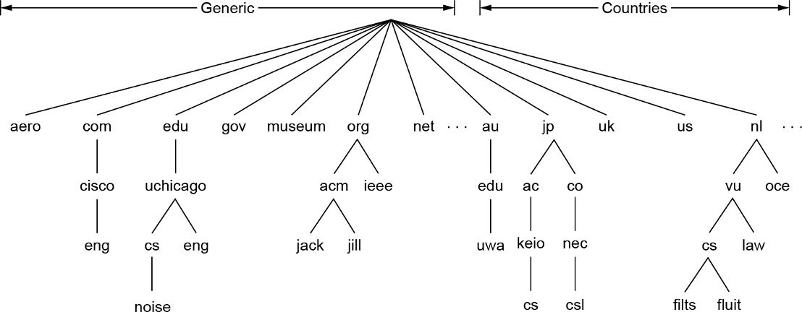
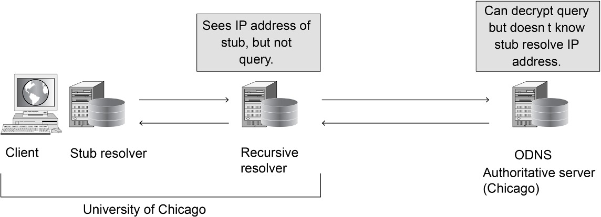
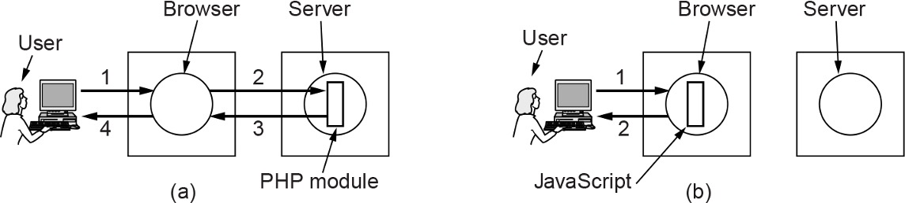

# Chapter 7 The Application Layer 

## 7.1 **The Domain Name System (DNS)**

* History and overview

  历史和概述

* The DNS lookup process

  DNS查找过程

* The DNS name space and hierarchy

  DNS名称空间和层次结构

* DNS queries and responses

  DNS查询和响应

* Name resolution

  名称解析

* Hands on with DNS

  开始使用DNS

* DNS privacy

  DNS隐私

* Contention over names

  名称的争论


An organization’s Web server could be referred to as **www.cs.uchicago.edu**, regardless of its IP address. Because the devices along a network path forward traffic to its destination based on IP address, these human-readable domain names must be converted to IP addresses; the **DNS** (**Domain Name System**) is the mechanism that does so.

一个组织的Web服务器可以被称为**www.cs.uchicago.edu**，不管它的IP地址是什么。由于网络路径上的设备基于IP地址转发流量，这些人类可读的域名必须转换为IP地址; **DNS**(**域名系统**)就是这样做的机制。


**History and Overview**

* ARPANET days

  阿帕网天

  * hosts.txt listed all computer names and their IP addresses

    hosts.txt列出所有计算机名及其IP地址

  * Hosts fetched the file nightly

    Hosts 每晚读取文件

  * Worked reasonably well for the time

    当时还算不错

* The Internet grew

  互联网的发展

  * The hosts.txt file grew to be large

    hosts.txt文件变大了

  * Needed central management to prevent host name conflicts

    需要集中管理，防止主机名冲突

* Domain Name System invented in 1983

  1983年发明的域名系统

  * Hierarchical naming scheme 

    分层命名方案

  * Distributed database system implements the naming scheme

    分布式数据库系统实现了命名方案

  * Maps host names to IP addresses

    —将主机名映射到IP地址


**The DNS Lookup Process**

* Stub resolver process to map a name onto an IP address

  将名称映射到IP地址的存根解析进程

  * Stub resolver sends a **query** containing the name to a **local DNS resolver**

    Stub解析器向**本地DNS解析器**发送包含域名的**query**

  * Local DNS resolver performs a **recursive lookup** for the name against a set of DNS resolvers

    本地DNS解析器对一组DNS解析器执行名称的**递归查找**

  * Local recursive resolver ultimately **returns the corresponding IP address** to the stub resolver

    本地递归解析器最终将**对应的IP地址**返回给存根解析器

  * Stub resolver passes the result to the **function** that issued the query in the first place

    存根解析器将结果传递给发出查询的**函数**

  * Query and response messages are sent as **UDP packets**

    查询和响应消息以**UDP报文**的形式发送

  * Program can use the IP address to communicate with the host corresponding to the DNS name that it had looked up

    程序可以使用IP地址与它所查找的DNS名称对应的主机进行通信


* All of the answers, including all the partial answers returned, are cached. In this way, if a computer at **cs.vu.nl** queries for **cs.uchicago.edu**, the answer is cached. 

  所有的答案，包括所有返回的部分答案，都被缓存。这样，如果一台计算机在**cs.vu.nl **查询**cs.uchicago.edu**，答案会被缓存

* If shortly thereafter, another host at **cs.vu.nl** also queries **cs.uchicago.edu**, the answer will already be known. 

  如果不久后，另一个主机在**cs.vu.nl **也会查询**cs.uchicago.edu**，答案是已知的。

* Even better, if a host queries for a different host in the same domain, say **noise.cs.uchicago.edu**, the query can be sent directly to the authoritative name server for **cs.uchicago.edu**.

  更好的是，如果一个主机查询同一个域名下的不同主机，例如**noise.cs.uchicago.edu**，查询可以直接发送到权威域名服务器**cs.uchicago.edu**

* Similarly, queries for other domains in **uchicago.edu** can start directly from the **uchicago.edu** name server. 

  类似地，在**uchicago.edu**中查询其他域名可以直接从**uchicago.edu**域名服务器开始。


### 7.1.1 **The DNS Name Space and Hierarchy**



A portion of the Internet domain name space 

Internet 域名空间的一部分.


The leaves of the tree represent domains that have no subdomains (but do contain machines, of course). A leaf domain may contain **a single host**, or it may represent a company and contain **thousands of hosts**.

树的叶子表示没有子域的域(但当然包含机器)。一个叶子域可以包含单个主机，也可以代表一家公司并包含数千台主机。

The top-level domains have several different types: **gTLD** (**generic** **Top Level** **Domain**), **ccTLD** (**country code Top Level Doman**), and others. 

顶级域名有几种不同的类型:gTLD(通用顶级域名)、ccTLD(国家代码顶级域名)和其他。


The original generic TLDs, as of 2010. As of 2020, there are more than 1,200 gTLDs

通用的顶级域名

* Getting a second-level domain, such as **name-of-company.com**, is easy. 

  获得二级域名很容易，例如**name-of-company.com**。

* The top-level domains are operated by companies called **registries**. They are appointed by ICANN. For example, the registry for *com* is Verisign. 

  顶级域名由称为**注册中心**的公司运营。他们是由ICANN任命的。例如，*com*的注册表是Verisign。

* One level down, **registrars** sell domain names directly to users. There are many of them and they compete on price and service. Common registrars include Domain.com, GoDaddy, and NameCheap.

  再往下一层，**注册商**直接向用户出售域名。有很多这样的公司，他们在价格和服务上竞争。常见的注册商包括Domain.com、GoDaddy和NameCheap。


The relationship between registries and registrars

登记处和登记人之间的关系


### 7.1.4 **DNS Queries and Responses** 

* DNS queries

  DNS查询

* Extensions and enhancements to DNS queries

  DNS查询的扩展和增强

* DNS responses and resource records

  DNS响应和资源记录

* Common record types

  常见的记录类型

* DNSSEC records

  DNSSEC记录

* DNS zones

  DNS区域


#### 7.1.2.1 **DNS Resource Record**

Every domain, whether it is a single host or a top-level domain, can have a set of **resource records** associated with it. These records are the DNS **database**. 

每个域名，无论是单个主机域名还是顶级域名，都可以有一组与之相关联的**资源记录**。这些记录就是DNS **数据库**。


A resource record is a **five-tuple**

资源记录是一个**五元组**

Domain_name  Time_to_live  Class  Type  Value 

Domain_name Time_to_live类类型值

* The **Domain_name** tells the domain to which this record applies.

  **Domain_name**表示该记录应用的域名。

* The **Time_to_live** field gives an indication of how stable the record is.

  **Time_to_live**字段表示记录的稳定程度。

* The third field of every resource record is the **Class**. For Internet information, it is always **IN**. For non-Internet information, other codes can be used, but in practice these are rarely seen.

  每个资源记录的第三个字段是**Class**。对于互联网信息，它总是**在**。对于非互联网信息，可以使用其他代码，但在实践中很少见到。

* The **Type** field tells what kind of record this is. 

  **Type**字段表示这是什么类型的记录。


主要的DNS资源记录类型

> SOA 记录给出了有关该名字服务器区域的主要信息源名称, 名字服务器管理员的电子邮件地址, 一个唯一的序号以及各种标志位和超值值.
>
> 最重要的记录类型是A(地址)记录, 它包含了某台主机一个网络接口的32位IP地址. 对应的AAAA, “quad A” 记录包含了一个128位的IPv6地址. 每台Internet主机必须至少有一个IP地址, 以便其他机器能与它进行通信. 某些主机有两个或多个网络接口, 在这种情况下, 它们就有两个或多个A或AAAA资源记录. 因此, 对于单个域名的查询可能获得多个地址.
>
> 最常用的记录类型是MX记录, 它指定了一台准备接受该特定域名电子邮件的主机的名字. 因为并非每台机器都做好了接受电子邮件的准备, 因此必须用一个记录作特别说明. 例如, 如果有人打算发送电子邮件给某个人, 比如bill@microsoft.com, 则发送主机必须找到在microsoft.com中愿意接受电子邮件的邮件服务器. MX记录就是用来提供这样的信息.
>
> 重要记录类型是NS记录. 它指明了一台用于所在域和子域的名字服务器. 这是一台拥有一份某域数据库副本的主机. 这条记录被用于域名查询处理. 
>
> CNAME记录允许创建别名. 例如, 如果一个人很熟悉Internet的常规命名规则, 他打算给MIT计算机科学系名叫paul的人发送邮件, 他就猜测此人的邮箱名是paul@cs.mit.edu. 实际上, 这个地址不正确, 因为MIT计算机科学系的域名是csail.mit.edu. 但是, MIT可以创建一条CNAME记录指向人和程序的正确方向, 为那些不知情的人提供一项服务. 类似下面这样的一条记录就可以完成此任务
>
> ```
> cs.mit.edu 86400 IN CHAME	csail.mit.edu
> ```
>
> 如同CNAME一样, PTR指向另一个名字. 但是CNAME只是一个宏定义(即可以用另一个串来替代一个串的机制), 而PTR与CNAME不同, 它是一种正规的DNS数据类型, 它的确切含义取决于所在的上下文. 实际上, PTR几乎总是被用来将一个名字与一个IP地址关联起来, 以便能够通过查询IP地址来获得对应机器的名字, 这种功能称为逆向查询.
>
> SRV是一个新的记录类型, 它把主机标识为域内的一种给定服务. 例如, cs.washington.edu的Web服务器可以标识成cockatoo.cs.washington.edu. 这个记录能产生MX记录, 并执行相同的任务, 但只适用于邮件服务器.
>
> SPF是一个新的记录类型. 它可以让一个域把邮件服务信息进行编码, 即域内哪台机器负责把邮件发送到Internet其余地方. 这条记录有助于接收机器检查邮件是否有效. 如果接收到的邮件来自一台通话本身躲躲闪闪的机器, 但域名记录说明邮件只能来自域外一台称为smtp的机器, 那么该邮件就是伪造的垃圾邮件.
>
> 列表的最后一行给出了TXT记录, 这是最初为了允许域以任意方式标识自己而提供的一种途径. 如今, 它们通常被编码成机器可读信息, 一般是SPF信息.
>
> 最后, 资源记录还包括Value字段, 该字段的值可以是一个数字, 一个域名或者一个ASCII字符串, 其语义取决于记录的类型. 


#### 7.1.2.2 **DNS Zones**


Part of the DNS name space divided into zones (which are circled)

按区域划分(圈起来的)部分DNS名字空间


**In theory** at least, a single name server could contain the entire DNS database and respond to all queries about it. **In practice**, this server would be so overloaded as to be useless. Furthermore, if it ever went down, the entire Internet would be crippled.

至少**在理论上**，一个单一的域名服务器可以包含整个DNS数据库并响应所有关于它的查询。**在实践中**，这个服务器会过载到无法使用。此外，如果它坏了，整个互联网都会瘫痪。


To avoid the problems associated with having only a single source of information, the DNS name space is divided into nonoverlapping **zones**.

为了避免与只有单一信息源相关的问题，DNS名称空间被划分为不重叠的**区域**。


#### 7.1.3.2 **Name Resolution**


Example of a resolver looking up a remote name in 10 steps

解析器用10步查找远程名称的示例


The process of looking up a name and finding an address is called **name resolution**. If there is no cached information about the domain available locally, the name server begins a remote query. 

查找名称和查找地址的过程称为**域名解析**。如果本地没有可用的域名缓存信息，名称服务器将开始远程查询。

> 第1步, 显示查询报文被发送到本地域名服务器. 查询中包含了被查询的域名, 类型(A) 和类(IN).
>
> 第2步: 通过请求其中之一的根域名服务器来启动域名层次结构顶部的查询. 这些域名服务器包含每个顶级域名的有关信息. 
>
> 根域名服务器不可能知道在UW的一台机器的地址, 可能还不知道UW的域名服务器. 但是, 它必须知道edu域的域名服务器, 因为cs.washingtong.edu属于edu域管辖下.
>
> 第3步: 它返回查询的答案, 其中包括了名字和IP地址
>
> 第4步: 本地域名服务器继续尽职地执行任务, 它将整个查询发给edu域名服务器(a.edu-servers.net). 
>
> 第5步: 该域名服务器返回UW的域名服务器. 
>
> 第6步: 本地域名服务器把查询发送给UW的域名服务器.
>
> 第7步: 如果被查询的域名是英语系, 则马上能找到答案, 因为UW域包括了英语系. 但是, 计算机科学系选择运行自己的域名服务器, 因此该查询返回的是UW计算机科学系的域名服务器和IP地址
>
> 第8步: 本地域名服务器查询UW计算机科学系的域名服务器
>
> 第9步: 这台服务器是cs.washington.edu的权威机构, 所以它必定有答案. 它返回最终的答案
>
> 第10步: 作为响应flits.cs.vu.nl转发的本地域名服务器. 至此, 查询的域名得到了解析.


```shell
➜  ~ dig @a.edu-servers.net robot.cs.washington.edu

; <<>> DiG 9.10.6 <<>> @a.edu-servers.net robot.cs.washington.edu
; (2 servers found)
;; global options: +cmd
;; Got answer:
;; ->>HEADER<<- opcode: QUERY, status: NOERROR, id: 65
;; flags: qr rd; QUERY: 1, ANSWER: 0, AUTHORITY: 3, ADDITIONAL: 7
;; WARNING: recursion requested but not available

;; OPT PSEUDOSECTION:
; EDNS: version: 0, flags:; udp: 4096
;; QUESTION SECTION:
;robot.cs.washington.edu.	IN	A

;; AUTHORITY SECTION:
washington.edu.		172800	IN	NS	marge.cac.washington.edu.
washington.edu.		172800	IN	NS	hanna.cac.washington.edu.
washington.edu.		172800	IN	NS	holly.s.uw.edu.

;; ADDITIONAL SECTION:
marge.cac.washington.edu. 172800 IN	A	140.142.5.13
marge.cac.washington.edu. 172800 IN	AAAA	2607:4000:200:43::13
hanna.cac.washington.edu. 172800 IN	A	140.142.5.5
hanna.cac.washington.edu. 172800 IN	AAAA	2607:4000:200:42::5
holly.s.uw.edu.		172800	IN	A	173.250.227.69
holly.s.uw.edu.		172800	IN	AAAA	2607:4000:301:1::69

;; Query time: 25 msec
;; SERVER: 2001:503:a83e::2:30#53(2001:503:a83e::2:30)
;; WHEN: Wed Nov 22 15:22:58 CST 2023
;; MSG SIZE  rcvd: 253

```

> 向`a.edu-servers.net`域名服务器发出一个针对robot.cs.washington.edu的查询, 并打印出查询结果. 这个结果显示了上面例子中第4步获得的信息, 你将了解到UW域名服务器的名字和IP地址.


### 7.1.7 **DNS Privacy**

The stub resolver encrypts the original query to the local recursive resolver, which in turn sends the encrypted query to an authoritative name serve that can decrypt and resolve the query, but does not know the identity or IP address of the stub resolver that initiated the query.

存根解析器将原始查询加密到本地递归解析器，然后本地递归解析器将加密查询发送到权威名称服务器，该服务器可以解密和解析查询，但不知道发起查询的存根解析器的身份或IP地址。



Oblivious DNS


## 7.2 Electronic Mail

* Architecture and services

  架构和服务

* The user agent

  用户代理

* Message formats

  消息格式

* Message transfer

  消息传输

* Final delivery

  最终交付


### 7.2.1 **Architecture and Services**


The architecture of the email system

> 电子邮件系统的体系结构如图所示, 它包括两类子系统: 用户代理(user agent) 和邮件传输代理(message transfer agent). 人们通过用户代理阅读和发送电子邮件; 邮件传输代理负责将用户邮件从源端移动到目的地. 把邮件传输代理非正式地称为邮件服务器. 
>
> 用户代理是一个程序, 用户通过它与电子邮件系统交互.

* The **user agent** is a program that provides a graphical interface, or sometimes a textand command-based interface that lets users interact with the email system. The act of sending new messages into the mail system is called **mail submission (step 1)**.

  **用户代理**是一个提供图形界面的程序，有时是一个基于文本和命令的界面，让用户与电子邮件系统进行交互。向邮件系统发送新消息的行为称为**邮件提交(步骤1)**。

* The **message transfer agents** are typically system processes. They run in the background on mail server machines and are intended to be always available. Their job is to automatically move email through the system from the originator to the recipient with **SMTP** (Simple Mail Transfer Protocol). This is the message **transfer step (step 2)**.

  **消息传输代理**通常是系统进程。它们在邮件服务器机器的后台运行，并且总是可用。他们的工作是通过**SMTP**(简单邮件传输协议)自动将电子邮件通过系统从发信人转移到收件人。这就是消息**传递步骤(第2步)**。

* Linking user and message transfer agents are the concepts of mailboxes and a standard format for email messages. **Mailboxes** store the email that is received for a user. 

  连接用户和消息传输代理是邮箱的概念，也是电子邮件消息的标准格式。**邮箱**存储用户收到的电子邮件。

* The retrieval of mail is the **final delivery (step 3).**

  邮件检索是**最终传递(第3步)**


**Architecture and Services**


Envelopes and messages. (a) Paper mail. (b) Electronic mail.

信封和消息 (a)纸质邮件 (b)电子邮件

The message inside the envelope consists of two separate parts: the **header** and the **body**. The header contains control information for the user agents. The body is entirely for the human recipient. 

信封内的消息由两个独立的部分组成:标题和正文。头包含用户代理的控制信息。身体完全是为人类接受者准备的。


### 7.2.2 **The User Agent**

> 用户代理是一个程序(有时也称为电子邮件阅读器), 


> 上图为用户代理接口的典型元素

There are many popular user agents, including Google Gmail, Microsoft Outlook, Mozilla Thunderbird, and Apple Mail. When a **user agent** is started, it will usually present a **summary of the messages** in the user’s mailbox. Often, the summary will have one line for each message in some sorted order. It highlights key fields of the message that are extracted from the message envelope or header.

有很多流行的用户代理，包括谷歌Gmail、Microsoft Outlook、Mozilla Thunderbird和Apple Mail。当**用户代理**启动时，它通常会显示用户邮箱中的**消息摘要**。通常，摘要中每条消息都有一行按某种顺序排列。它突出显示从消息信封或消息头中提取的消息的关键字段。


### 7.2.3 **Message Formats**

* RFC 5322—the Internet message format

  RFC 5322——互联网消息格式

  * Basic ASCII email using RFC 5322

    使用RFC 5322的基本ASCII电子邮件

  * Latest revision of the original Internet message format

    原始互联网消息格式的最新修订

* MIME—the Multipurpose Internet Mail Extensions

  mime——多用途互联网邮件扩展

  * Multimedia extensions to the basic format

    多媒体基本格式的扩展


RFC 5322 header fields related to message transport

RFC 5322消息传输相关的报头字段

> “To”: 字段给出了主要收件人的DNS地址, 邮件系统允许有多个收件人
>
> "Cc": 字段给出了所有次要收件人的地址. 从邮件投递的角度来看, 主收件人和次收件人没有区别. 这完全是一种心理上的差别, 这种差别也许对于相关的人而言很重要, 但是对于邮件系统来说无关紧要; Carbon copy抄送, 这个术语有点过时, 因为计算机不使用复写纸, 但是它已经被约定成俗了. 
>
> Bcc: blind carbon copy, 密件抄送, 与Cc类似, 只是在发送给主收件人和次收件人的所有副本中, 这一行被删除了. 这个特性允许人们在主收件人和次收件人都不知道的情况下, 向第三方发送邮件副本.
>
> From 和 Sender 分别指出邮件的撰写者与邮件的发送者, 这二者不一定相同. 例如, 一个公司经理撰写了一个邮件, 但她的助理可能是实际发送该邮件的人. 在这种情况下, 经理被列在From字段中, 而她的助理应该出现在sender字段, from字段是必须的, 但是, 如果sender字段与from字段的值相同, 那么可以省略Sender 字段. 一旦邮件无法投递并且必须被退回发件人时, 这些字段就都是必需的了.
>
> 在邮件投递的路径上, 每个邮件传输代理都会给该邮件加上一行. 该行包含“Received:”字段, 给出了该代理的标识, 接收到此邮件的日期和时间, 以及其他一些可用来查找路由系统中错误的信息.
>
> Return-Path: 字段由最后一个邮件传输代理添加, 主要用来指示如何返回至发件人. 理论上, 这个信息可以从所有的Received头字段(除了发件人邮箱的名字)收集得到, 但实际上很少填充该字段, 他一般只包含发件人的地址.


Some fields used in the RFC 5322 message header

RFC 5322 邮件头使用的某些字段.


Message headers added by MIME (Multpurpose Internet Mail Extension)

多用途Internet邮件扩展.


MIME content types and example subtypes

MIME内容类型和示例子类型


### 7.2.4 **Message Transfer**

消息转移

* SMTP (Simple Mail Transfer Protocol) and extensions

  SMTP(简单邮件传输协议)和扩展

* Mail submission

  邮件提交

* Physical transfer

  


Some SMTP extensions

一些SMTP扩展


### 7.2.5 **Final Delivery**

* IMAP—the Internet Message Access Protocol

  IMAP—Internet邮件访问协议

  * Main protocol used for final delivery

    用于最终交付的主要协议

  * Improvement over POP3 (Post Office Protocol, version 3)

    对POP3 (Post Office Protocol, version 3)的改进

  * The mail server runs an IMAP server that listens to port 143

    邮件服务器运行一个IMAP服务器，监听143端口

  * The user agent runs an IMAP client

    用户代理运行IMAP客户端

  * The client connects to the server and begins to issue commands

    客户端连接到服务器并开始发出命令

* Webmail

  邮箱

  * Alternative to IMAP and SMTP for providing email service

    提供电子邮件服务的替代IMAP和SMTP

  * Uses the Web as an interface

    使用Web作为接口


## Questions for you

* What is DNS?

* What is registry and registrar?

* What is resource record?

* What is DNS zone?


## 7.3 **The World Wide Web**

> Web是万维网(World Wide Web)的俗称, 它是一个体系结构框架. 该框架把分布在整个Internet数百万台机器上的内容链接起来供人们访问.

* Architectural overview

  架构概述

* Static Web objects

  静态Web对象

* Dynamic Web pages and Web applications

  动态网页和Web应用程序

* HTTP and HTTPS

  HTTP和HTTPS

* Web privacy

  网络隐私


* **The Web**, as the World Wide Web is popularly known, is an architectural framework for accessing linked content spread out over millions of machines all over the Internet.

  **万维网**是一个架构框架，用于访问分布在互联网上数百万台机器上的链接内容

* The Web **began in 1989 at CERN**, the European Center for Nuclear Research.

  Web **始于1989年欧洲核子研究中心(CERN) **

* **Marc Andreessen** at the **University of Illinois** developed the first graphical browser. It was called Mosaic and released in February 1993.

  伊利诺伊大学的**Marc Andreessen**开发了第一个图形浏览器。它被称为Mosaic，于1993年2月发行

* Through the 1990s and 2000s, Web sites and Web pages, as Web content is called, **grew exponentially** until there were millions of sites and billions of pages.

  从上世纪90年代到2000年代，网站和网页，也就是所谓的Web内容，**呈指数级增长**，直到有数百万个网站和数十亿个页面。

* In **1994, CERN and M.I.T.** signed an agreement setting up the **W3C** (**World Wide Web Consortium**), an organization devoted to further developing the Web, standardizing protocols, and encouraging interoperability between sites. 

  **1994年**，CERN和麻省理工学院签署了一项协议，成立了**W3C**(**万维网联盟**)，该组织致力于进一步开发Web，标准化协议，并鼓励网站之间的互操作性。


### 7.3.1 **Architectural Overview** 


Fetching and rendering a Web page involves HTTP/HTTPS requests to many servers

获取和渲染Web页面需要向多个服务器发送HTTP/HTTPS请求

> 页面的照片如7-18左边所示. 这是华盛顿大学计算机科学与工程系的一个页面. 这个页面显示了文本和图形元素(大多数内容太小无法阅读). 页面中的某些部分与指向其他页面的链接有关. 与另一个页面相关的一小段文字, 一个图标, 一个图像等都称为超链接(hyperlink).
>
> 页面背后的的基本工作模型如上图所示, 在这里, 客户机器上的浏览器正在显示一个Web页面. 每一页的抓取都是通过发送一个请求到一个或多个服务器, 服务器以页面的内容作为响应. 抓取网页所用的“请求-响应”协议是一个简单的基于文本协议, 它运行在TCP之上, 就像SMTP一样. 这个协议就是所谓的超文本传输协议(HTTP, HyperText Transfer Protocol). 内容可能只是一个磁盘读取的文档, 或者是数据库查询和程序执行的结果. 如果每次显示的是相同的一个文档, 则称该网页为静态页面. 相反, 如果每次显示的是程序按需产生的内容, 或者页面本身包含了一个程序, 则称该网页为动态页面(dynamic page).

* From the users’ point of view, the Web comprises a vast, worldwide collection of content in the form of **Web pages**.

  从用户的角度来看，Web以**网页**的形式包含了庞大的、全世界范围内的内容集合。

* The idea of having one page point to another called **hypertext.**

  让一个页面指向另一个页面的想法叫做**超文本**

* Pages are generally viewed with a program called a **browser**. 

  页面通常是通过一个叫做**浏览器**的程序来查看的。

* The **index page**, which the browser loads, typically contains instructions for the browser concerning the locations of other objects to assemble, as well as how and where to render those objects on the page.

  浏览器加载的**索引页**通常包含有关浏览器需要组装的其他对象的位置，以及在页面上如何以及在哪里渲染这些对象的指令。

* A piece of text, icon, graphic image, photograph, or other page element that can be associated with another page is called a **hyperlink**.

  一段文本、图标、图形图像、照片或其他可以与另一个页面关联的页面元素被称为**超链接**。


* Each page is fetched by sending a request to one or more servers, which respond with the contents of the page. The request-response protocol for fetching pages is a simple text-based is called **HTTP** (**HyperText** **Transfer Protocol**). The secure version of this protocol, which is now the predominant mode of retrieving content on the Web today, is called **HTTPS** (**Secure** **HyperText** **Transfer Protocol**).

  每个页面都是通过向一个或多个服务器发送请求来获取的，这些服务器将返回页面的内容。用于获取页面的请求-响应协议是一个简单的基于文本的协议，称为**HTTP**(**超文本** **传输协议**)。该协议的安全版本被称为**HTTPS** (**secure ** **HyperText** **Transfer protocol **)，现在是在Web上检索内容的主要模式。

* When the Web was first created, it was immediately apparent that having **one page point to another Web page required mechanisms** for naming and locating pages. In particular, three questions had to be answered before a selected page could be displayed:

  当Web第一次创建时，很明显**一个页面指向另一个页面需要一些机制**来命名和定位页面。具体来说，在显示选中的页面之前，必须回答以下三个问题。

  * What is the page called?

    页面被称为什么?

  * Where is the page located?

    页面位于哪里?

  * How can the page be accessed?

    如何访问该页?


#### 7.3.1.2 The client side

客户端

* Three questions had to be answered before a selected page was displayed:

  在显示所选页面之前，必须回答三个问题:

  * What is the page called?

    页面被称为什么?

  * Where is the page located?

    页面位于哪里?

  * How can the page be accessed?

    如何访问该页?

* Steps that occur when a link is selected:

  选择链接时发生的步骤:

  * Browser determines the URL

    浏览器决定URL (Uniform Resource Locator).

  * Browser asks DNS for the IP address of the server

    浏览器向DNS请求服务器的IP地址

    > www.cs.washington.edu 的IP地址

  * DNS replies

    DNS应答

    > DNS返回128.208.3.88

  * Browser makes a TCP connection

    浏览器建立TCP连接

    > 浏览器与128.208.3.88机器的80端口建立一个TCP连接, 80端口是HTTP协议的知名端口

  * Sends HTTP request for the page 

    向页面发送HTTP请求

    > 浏览器发送HTPP报文, 请求/index.html页面

  * Server sends the page as HTTP response

    服务器将页面作为HTTP响应发送

    > www.cs.washington.edu 服务器发回页面作为HTTP响应, 例如发送文件/index.html

  * Browser fetches other URLs as needed

    浏览器根据需要获取其他url

    > 如果该页面包括需要显示的URL, 那么浏览器经过同样的处理过程获取其他的URL. 在这种情况下, URL包括多个取自www.cs.washington.edu的内嵌图像, 一个取自youtube.com的内嵌视频和一个取自google-analytics.com的脚本

  * Browser displays the page

    浏览器显示页面

    > 浏览器显示页面/index.html

  * The TCP connections are released

    释放TCP连接

    > 如果短期内没有向同一个服务器发出其他请求, 那么释放TCP连接.

> URL: `http://www.cs.washington.edu/index.html`
>
> 这个URL由3部分组成: 协议(http), 主机的DNS域名(www.cs.washington.edu) 和路径名(index.html)


Waterfall diagram for *fcc.gov*

*fcc.gov*的瀑布图

> Many browsers display which step they are currently executing in a status line at the bottom of the screen. In this way, when the performance is poor, the user can see if it is due to DNS not responding, a server not responding, or simply page transmission over a slow or congested network.
> A more detailed way to explore and understand the performance of the Web page is through a so-called waterfall diagram, as shown in Fig. 7-20.
> The figure shows a list of all of the objects that the browser loads in the process of loading this page (in this case, 64, but many pages have hundreds of objects), as well as the timing dependencies associated with loading each request, and the operations associated with each page load (e.g., a DNS lookup, a TCP connection, the downloading of actual content, and so forth). These waterfall diagrams can tell us a lot about the behavior of a Web browser; for example, we can learn about the number of parallel connections that a browser makes to any giv en server, as well as whether connections are being reused. We can also learn about the relative time for DNS lookups versus actual object downloads, as well as other potential performance bottlenecks
>
> 许多浏览器会在屏幕底部的状态行中显示当前正在执行的步骤。这样，当性能变差时，用户可以知道是由于DNS不响应，还是服务器不响应，或者只是由于缓慢或拥塞的网络上的页面传输。
> 要探索和理解Web页面的性能，更详细的方法是使用所谓的瀑布图，如上图所示。
> 该图显示了浏览器在加载页面过程中加载的所有对象(本例中是64个对象，但许多页面有数百个对象)，以及与加载每个请求相关的时间依赖关系，以及与每个页面加载相关的操作(例如DNS查找、TCP连接、下载实际内容，等等)。瀑布图可以告诉我们很多关于Web浏览器行为的信息;例如，我们可以了解浏览器与任意给定服务器的并行连接数，以及连接是否被重用。我们还可以了解DNS查找与实际对象下载的相对时间，以及其他潜在的性能瓶颈


#### 7.3.1.3 The Server Side

* Steps the server performs in its main loop:

  服务器在主循环中执行的步骤:

  * Accept a TCP connection from a client (a browser)

    从客户端(浏览器)接收TCP连接

  * Get the path to the page, which is the name of the file requested

    获取页面的路径，即所请求的文件的名称

  * Get the file (from disk)

    获取文件(从磁盘)

  * Send the contents of the file to the client

    将文件内容发送到客户端

  * Release the TCP connection

    释放TCP连接

* Modern Web servers have more features

  现代Web服务器有更多的功能

* For dynamic content

  用于动态内容

  * Third step may be replaced by the execution of a program that generates and returns the contents

    第三步可以由执行一个生成和返回内容的程序来代替

* Server design problem: slow disk access bottleneck

  服务器设计问题:磁盘访问缓慢瓶颈

  * Solution: maintain a cache in memory

    解决方案:在内存中维护一个缓存

* Server design problem: one request processed at a time

  服务器设计问题:一次处理一个请求

  * Solution: make the server multithreaded

    解决方案:让服务器多线程

* Modern Web architectures use a split between a front end and a back end

  现代Web架构使用前端和后端分离

* Front-end Web server (reverse proxy)

  前端Web服务器(反向代理)

  * Retrieves content from other (typically back-end) servers

    从其他(通常是后端)服务器检索内容

  * Serves those objects to the client

    为客户端提供这些对象

  * Acts on behalf of the servers – not on the behalf of clients

    代表服务器——而不是客户端


A multithreaded Web server with a front end and processing modules

一个具有前端和处理模块的多线程Web服务器

The processing module **first checks the cache** to see if the requested object is present. If so, it updates the record to include a pointer to the file in the record. If it is not there, the processing module **starts a disk operation** to read it into the cache. When the file comes in from the disk, it is put in the cache and also sent back to the client.

处理模块**首先检查缓存**，看看请求的对象是否存在。如果是，则更新记录，在记录中包含一个指向该文件的指针。如果它不存在，处理模块**启动一个磁盘操作**，将它读入缓存。当文件从磁盘传入时，它会被放入缓存并发送回客户端。

The **advantage** of this approach is that while one or more processing modules are blocked waiting for a disk or network operation to, **other modules can be actively working on other requests**. 

这种方法的**优势**是，当一个或多个处理模块被阻塞等待磁盘或网络操作时，**其他模块可以积极处理其他请求**。


> 为了解决一次只能服务一个请求的问题, 一种策略是将服务器设计成多线程模式. 在其中一种设计方案中, 服务器由一个前端模块(front-end module) 和 k个处理模块(processing module)组成. 如上图所示. 前端模块接受所有入境请求; k+1个线程全部属于同一个进程, 这样所有处理模块都可以访问当前进程地址空间中的缓存. 当一个请求到达时, 前端模块接受它, 并为其创建一条描述该请求的简短记录, 然后将该记录递交给其中一个处理模块.
>
> 处理模块首先检查缓存, 查看其中是否有所需的文件. 如果缓存中有该文件, 则处理模块修改记录, 在记录中增加一个指向该文件的指针; 如果缓存中没有该文件, 则处理模块执行一次磁盘操作将该文件读入缓存(可能要丢弃其他一些缓存的文件, 以便腾出空间). 从磁盘上读取文件后, 将该文件放入缓存, 同时把它发送给客户.


> **Cookie**
>
> 它是一小段文本信息, 伴随着用户请求页面在Web服务器和浏览器之间传递. 这个名称来自于很早以前的程序员行话, 即程序调用一个过程并得到一些信息, 这些信息稍后在完成某些工作时可能需要用得到. 
>
>  
>
> 当客户请求一个Web页面时, 服务器除了提供所请求的页面以外, 还以Cookie的形式提供了一些附加的信息. Cookie是一个相当小的命名的串(最多4KB), 服务器将它与浏览器关联. 这种关联与用户关联不一样, 但它非常接近而且比IP地址更有用. 浏览器把服务器所提供的Cookie通常存储在客户机磁盘Cookie目录下一段时间, 这样在整个浏览器调用期间一直坚持Cookie, 除非用户禁用Cookie. Cookie只是字符串, 而不是可执行程序. 原则上, 一个Cookie可能包含病毒, 但由于Cookie只被当作数据处理, 因而不存在病毒得以实际运行从而造成损害的正式途径. 然而, 始终有可能存在一些黑客利用一个浏览器的漏洞, 来激活病毒.


### 7.3.2 **Static Web Objects**

静态Web网页

* Static objects

  静态对象

  * Files sitting on a server, presenting themselves in the same way each time they are fetched and viewed

    存放在服务器上的文件，每次被获取和查看时都以相同的方式呈现

  * Examples: logo, style sheets, header and footer

    示例:logo、样式表、页眉和页脚

  * Generally amenable to caching

    一般适用于缓存

* Most Web pages have dynamic content

  大多数网页都有动态内容

  * Significant amount of the content remains static

    大量的内容保持不变

* Web page design

  网页设计

  * Use HTML or CSS (Cascading Style Sheets)

    使用HTML或CSS(层叠样式表)

  * Use programs (Adobe Dreamweaver)

    使用程序(Adobe Dreamweaver)


### 7.3.3 **Dynamic Web Pages and Web Applications** 

* Nowadays, much of the excitement around the **Web is using it for applications and services**. 

  现在，围绕**Web的兴奋之处在于将其用于应用程序和服务**

* **Examples**: buying products on e-commerce sites, searching library catalogs, exploring maps, reading and sending email, and collaborating on documents.

  **例子**:在电子商务网站上购买产品，搜索图书馆目录，浏览地图，阅读和发送电子邮件，以及协作文档。

* The **twist** is that these applications **run inside the browser**, with user data stored on servers in Internet data centers. They use Web protocols to access information via the Internet, and the browser to display a user interface. 

  问题在于这些应用程序**运行在浏览器中**，而用户数据存储在互联网数据中心的服务器上。它们使用Web协议通过互联网访问信息，并使用浏览器显示用户界面。

* The **advantage** of this approach is that users do not need to install separate application programs.

  这种方法的**优势**是用户不需要安装单独的应用程序。

* **User data** can be accessed from different computers and backed up by the **service operator**. It is proving so successful that it is rivaling traditional application software. 

  **用户数据**可以从不同的计算机访问，并由**服务操作员**备份。事实证明，它是如此成功，以至于可以与传统的应用软件相媲美。

  


==Dynamic pages==

动态页面

* Consider a map service that lets the user enter a street address and presents a corresponding map of the location. Given a request for a location, the Web server must **use a program to create a page** that shows the map for the location from a database of streets and other geographic information. (1-3)

  考虑一个地图服务，它允许用户输入街道地址，并显示相应的位置地图。给定一个位置请求，Web服务器必须**使用一个程序创建一个页面**，该页面从街道数据库和其他地理信息中显示该位置的地图。(1 - 3)

* The page that is returned may **itself contain programs** that run in the browser. In our map example, the program would let the user find routes and explore nearby areas at different levels of detail. (4-7) 

  返回的页面**本身可能包含运行在浏览器中的程序**。在我们的地图示例中，该程序将让用户以不同的细节层次查找路线并探索附近的区域。(4 - 7)

* The **requests and responses** happen in the **background**; the user may not even be aware of them because the page **URL and title typically do not change**. By including client-side programs, the page can present a more **responsive interface** than with server-side programs alone.

  **请求和响应**在**后台**发生;用户甚至可能不会注意到它们，因为页面的**URL和标题通常不会改变**。通过包含客户端程序，页面可以呈现比仅使用服务器端程序更**响应式的界面**。

> 例如, 考虑一个地图服务: 让用户输入一个街道地址, 然后给出相应位置的地图. 给定一个位置请求, Web服务器必需使用一个程序来创建一个页面, 该页面显示了该街道地址在地图上的对应位置, 而位置信息则是从一个街道数据库和其他地理信息数据库中提取出来的. 这一系列动作反映在图中的第1-3步. 请求(第一步)导致在服务器上运行一个程序; 该程序查询一个数据库以便生成相应的页面(第2步), 并将该页面返回给浏览器(第3步).
>
> 该程序将允许用户发现一条路线, 以及不同详细程度地探索周围的附近区域. 它会随着用户的指示缩小或放大(第4步). 为了处理一些交互事件, 该程序可能需要从服务器端获取更多的数据. 
>
> 在这种情况下, 程序将给服务器发送一个请求(第5步)
>
> 服务器从数据库中检索出更多的信息(第6步)
>
> 并且给浏览器返回一个响应(第7步).
>
> 然后, 该程序将继续更新页面(第4步). 




(a) Server-side scripting with PHP. (b) Client-side scripting with JavaScript.

(a) 使用PHP编写服务器端脚本。(b) 使用JavaScript编写客户端脚本。

* **With PHP**, after a user has clicked on the *submit* button, the browser collects the information into a long string and sends it off to the **server** as a request for a PHP page. The server loads the PHP file and executes the PHP script that is embedded in to produce a new HTML page. That page is sent back to the browser for display.

  **使用PHP**，当用户单击**提交**按钮后，浏览器将信息收集为一个长字符串，并将其作为对PHP页面的请求发送给**服务器**。服务器加载PHP文件并执行嵌入其中的PHP脚本以生成新的HTML页面。该页面被发送回浏览器以显示。

* **With JavaScript**, when the *submit* button is clicked the browser interprets a JavaScript function contained on the page. All the work is done **locally**, inside the browser. There is no contact with the server.

  **使用JavaScript**，当点击*submit*按钮时，浏览器会解析页面上包含的JavaScript函数。所有的工作都是在浏览器**本地**完成的。与服务器没有联系。

* This **difference** does not mean that JavaScript is better than PHP. Their uses are completely different. PHP is used when interaction with a database on the server is needed. JavaScript is used when the interaction is with the user at the client computer.

  这个**区别**并不意味着JavaScript比PHP好。它们的用途完全不同。当需要与服务器上的数据库交互时，可以使用PHP。JavaScript用于在客户端计算机上与用户交互。


### ==7.3.4 **HTTP and HTTPS**== 

* Overview

* Methods

* Message headers

* Caching

* HTTP/1 and HTTP/1.1

* HTTP/2

* HTTP/3


* The protocol that is used to transport all the information between Web servers and clients is **HTTP** (**HyperText** **Transfer Protocol**).

  用于在Web服务器和客户端之间传输所有信息的协议是**HTTP**(**超文本** **传输协议**)。

* Both protocols **HTTP and HTTPS** (**Secure** **HyperText** **Transfer Protocol**) essentially retrieve objects in the same way. 

  **HTTP和HTTPS** (**Secure** **HyperText** **Transfer Protocol**)本质上以相同的方式检索对象。

* The HTTP standard to retrieve Web objects is evolving essentially independently from its secure counterpart, which effectively uses the HTTP protocol over a secure transport protocol called **TLS** (**Transport Layer Security**). 

  用于获取Web对象的HTTP标准本质上是独立于其安全对应版本发展的，后者在名为**TLS** (**transport Layer Security**)的安全传输协议上有效地使用了HTTP协议。


#### 7.3.4.1 Methods


The built-in HTTP request methods

内置的HTTP请求方法

> GET方法请求服务器发送页面(在大多数情况下, 当我们说“页面”时我们指的是“对象”, 但是把一个页面想象成一个文件, 理解这个概念就足够了). 该页面被适当编码成MIME. 大部分发送给Web服务器的请求都是GET方法. GET的通用形式是:
>
> ```
> GET filename HTTP/1.1
> ```
>
> 其中filename是预取的页面名字, 1.1是协议版本号.
>
> HEAD方法只请求消息头, 不想要真正的页面. 这个方法可以收集建索引所需要的信息, 或者只是测试一下URL的有效性.
>
> 当提交表单时需要用到POST方法. POST方法与GET方法都可被用作SOAP Web服务. 与GET类似, 它也携带一个URL, 但不是简单地检索一个页面, 而是上载数据到服务器(即表单的内容或者RPC参数). 然后, 服务器利用这些数据做某些事, 具体取决于URL, 概念上事将数据“附加”到对象上. 效果或许是购买一个表项, 或者调用一个过程. 最后, 方法返回一个指出结果的页面.
>
> 其余的方法对于浏览Web并常用. PUT方法与GET方法相反: 它不是读取页面, 而是写入页面. 通过这个方法可以在远程服务器上建立一组Web页面. 这个请求的主题包含了页面. 页面可以利用MIME来编码, 在这种情况下, 跟在PUT后面的行可能包含了认证头, 以便证明调用者的确有权执行所请求的操作.
>
> DELETE方法的用途可能与你想象的一样: 删除页面, 或者至少指出Web服务器已经同意删除该页面. 与PUT方法类似, 认证和许可机制在这里起到了很重要的作用.
>
> TRACE方法用于调试.它指示服务器发回收到的请求. 当请求没有被正确地处理而客户希望知道服务器实际得到是什么样的请求时, 这个方法非常有用.
>
> CONNECT方法使得用户通过一个中间设备(比如Web缓存) 与Web服务器建立一个连接.
>
> OPTIONS方法提供了一种办法让客户向服务器查询一个页面并且获得可用于该页面的方法和头. 


The status code response groups

状态码响应组

Every request gets a response consisting of a status line, and possibly additional information. The status line contains a **three-digit status** code telling whether the request was satisfied and, if not, why not. The first digit is used to divide the responses into **five major groups**.

每个请求都会得到一个响应，其中包含一个状态行和其他可能的信息。状态行包含一个**三位数的状态代码**，用于判断请求是否被满足，如果不满足，则说明原因。第一个数字用于将回答分为**五大类**。

> 每个请求都会得到一个响应, 每个响应消息由一个状态行及可能的附加信息(例如全部或者部分Web页面)组成. 状态行包括一个3位数字的状态码, 该状态码指明了这个请求是否被满足; 如果没有满足, 那么原因是什么. 第一个数字把响应分成5大组. 
>
> 1X×码实际上很少被使用。2××码意味着这个请求被成功地处理，并且返回了相应的内容（如果有的话）。3 码告诉客户应该检查其他地方：使用另一个不同的URL，或者在它自己的缓存中查找（后面讨论). 4XX 码意味着由于客户错误而导致请求失败，比如无效请求或者不存在的页面。最后，5XX错误码意味着服务器自身出现内部问题，有可能是服务器代码中有错误，也可能是临时负载过重。


#### 7.3.4.2 Mesage Headers


Some HTTP message headers

一些HTTP消息头

The request line (e.g., the line with the *GET* method) may be followed by additional lines with more information. They are called **request headers**. This information can be compared to the parameters of a procedure call. Responses may also have **response headers**.

请求行(例如，包含*GET*方法的那一行)后面可能会跟着包含更多信息的其他行。它们被称为**请求头**。可以将此信息与过程调用的参数进行比较。响应也可以有**响应头**。

> 请求行(例如GET方法的行)后面可能还有额外的行, 其中包含了更多的信息. 它们同称为请求头(request header). 这些信息可以与一个过程调用的参数相类比. 响应消息也有响应头. 有些头可以用在两个方向上. 上图列出的是一些最重要的消息头. 这个列表不短, 正如你可以想象的那样, 每个请求和响应通常具有不同的头. 

> User-Agent头允许客户将它的浏览器实现告知服务器(比如, Mozilla/5.0和Chrome/5.0.375.125). 这些信息非常有用, 服务器可以据此裁剪给浏览器的响应, 因为不同浏览器的能力和行为大径相同.
>
> 如果客户对于可接受的信息有一定的限制, 可以用4个Accept头告诉服务器愿意接受什么. 第一个头指定了那些MIME类型是可以接受的(例如, text/html). 第二个头给出了字符集(比如ISO-8859-5或者Unicode-1-1). 第三个头处理压缩方法(比如gzip). 第4个头指明了一种自然语言(例如西班牙语). 如果服务器有多个页面可供选择的话, 那么它可以利用这些信息向客户提供所需要的页面. 如果客户的请求不能满足, 则返回一个错误码并且请求失败.
>
> If-Modified-Since 和 If-None-Match头用于缓存. 它们允许客户在网页的缓存副本不再有效时请求该网页.
>
> Host头是服务器的名字, 它取自URL. 这个头是强制性质的. 有些IP地址可能对应了多个DNS名字, 所以服务器需要某种方法来分辨出应该把请求传递给哪个主机来处理.
>
> 对于那些被保护的页面, Authorization头是必需的. 在这种情况下, 客户可能需要证明自己有权来查看被请求的页面. 这个头就是用在这种情况下.
>
> 客户端使用拼写错误的Referer头给出了请求当页面的URL. 大多数情况下, 这是前一页的URL. 这个头对于跟踪Web浏览特别有用, 因为它告诉了服务器客户如何到达该页面的.
>
> 尽管Cookie是在RFC2019中而不是RFC2616中被阐述的, 它们也有头. Set-Cookie头是服务器向客户端发送Cookie, 期待客户端保存Cookie, 并且在后续的请求中返回给服务器, 返回时要使用Cookie头.
>
> 响应消息中还用到了许多其他的头. Server头允许服务器在愿意时标识构建它的软件. 下面5个头, 都从Content-起始, 允许服务器描述它发送的页面的属性.
>
> Last-Modified头说明了页面最后被修改的时间, Expires头说明了页面能保持有效多长时间. 这两个头在页面缓存机制中发挥着重要的作用.
>
> Location头被服务器用来通知客户, 它应该尝试另外一个不同的URL. 如果页面已经被移动, 或者允许多个URL指向同一个页面(可能在不同的服务器上), 则可以使用这个头. 它也可被用于另外一种情况, 即公司的主页在com域中, 但是根据客户的IP地址或者首选的语言, 将客户的请求重定向到一个国家的或者地区的页面中.
>
> 如果一个页面非常大, 则小客户可能不想一次获取所有的内容. 有些服务器可以接受对于有字节范围限定的请求, 因此该页面可以通过多个小单位的请求取回来. Accept-Ranges头声明了服务器愿意处理这种部分页面请求.
>
> Date头可用在两个方向上, 并且包含了发送消息的日期和时间, 而Range头则告诉了响应消息提供的网页的字节范围.
>
> ETag头给出了一个简短的标签, 作为页面内容的名称. 它主要被用于缓存. Cache-Control头给出了其他有关如何缓存(或更通常的是, 如何不缓存)网页的明确指示.
>
> Upgrade头用来切换到一个新的通信协议, 比如未来的HTTP协议或安全的传输协议. 它允许客户宣布自己可以支持什么协议, 同时允许服务器声称 自己正在使用什么协议.

> if expire means the read information from cache. if expire not work, have to read from disk

#### 7.3.4.3 Caching

> 人们往往会返回到以前浏览过的Web页面, 而且相关的网页往往具有相同的嵌入式资源. 比如有些例子包括用于整个网站导航的图像, 以及常见的样式表和脚本. 如果每次显示这些页面都要去服务器获取全部的资源, 这将非常浪费, 因为浏览器已经有了一个副本. 
>
> 积攒已经获取的网页供日后使用的处理方式称为缓存(caching). 其优点是当缓存的页面被重复使用时, 没有必要进行重复传输. HTTP内置了一种技术支撑, 帮助客户标识它们何时可以放心地重用页面.

> HTTP缓存的困难问题在于如何确定以前缓存的页面和将要重新获取的页面是相同的. 这个确定不能仅靠URL来作出. HTTP使用两种策略来解决这个问题, 如下图所示


HTTP caching

HTTP缓存

* Squirreling away pages that are fetched for subsequent use is called **caching**. The advantage is that when a cached page can be reused, it is not necessary to repeat the transfer. 

  将获取的页面存储起来供后续使用称为**缓存**。这样做的好处是，在可以重用缓存的页时，不需要重复传输。

* The **difficult issue** with HTTP caching is how to determine that a previously cached copy of a page is the same as the page would be if it was fetched again. HTTP uses two strategies to tackle this problem.

  HTTP缓存的**困难问题**是如何确定之前缓存的页面副本在再次获取时是否与当前页面相同。HTTP使用两种策略来解决这个问题。

* The **first** strategy is page validation (step 2). The cache is consulted, and if it has a copy of a page for the requested URL that is known to be fresh, there is no need to fetch it anew from the server. Instead, the cached page can be returned directly. 

  **第一个**策略是页面验证(第2步)。缓存会被查询，如果缓存中有一个已知是最新URL的页面副本，就不需要从服务器重新获取它。相反，可以直接返回缓存的页。

* The **second** strategy is to ask the server if the cached copy is still valid. This request is a **conditional GET**, and it is shown in as step 3. If the server knows that the cached copy is still valid, it can send a short reply to say so (step 4a). Otherwise, it must send the full response (step 4b).

  **第二种**策略是询问服务器缓存的副本是否仍然有效。这个请求是一个**有条件的GET**，如第3步所示。如果服务器知道缓存的副本仍然有效，它可以发送一个简短的回复来表明这一点(步骤4a)。否则，它必须发送完整的响应(步骤4b)。

> 作为请求(第1步)和响应(第5步)之间的处理形式. 第一种策略是页面验证(第2步). 访问高速缓存, 如果对所请求的URL它有该页面的副本, 而且该副本已知是新鲜的(即仍然有效), 那么就没必要从服务器重新获取. 此时, 直接返回缓存的页面. 该缓存页面最初获取时返回的EXpires头以及当前的日期和时间可以被用来作出该副本是否有效的决定.
>
> 然而, 并非所有的网页都有个方便的Expires头来告诉你何时必需重新获取网页. 毕竟, 做出预测才是硬道理--尤其关于未来的预测. 在这种情况下, 浏览器可能使用启发式的方法来作出决策. 例如, 如果页面在过去的一年尚未修改(从Last-Modified头获知), 那么它极有可能在接下来的一个小时里不会有所改变, 这或许是一个相当安全的赌注. 然而, 这里没有任何保证, 也许下了个坏的赌注. 例如, 股市已经关闭一天, 因此该页面数个小时都不曾改变, 但下一个交易时段开始后它会迅速改变. 因此, 一个页面的缓存性随着时间的推移可能变化很大. 基于这个原因, 应该谨慎使用启发式策略, 尽管它们的往往实际工作得挺好.
>
> 第二个策略, 它询问服务器缓存的副本是否仍然有效. 这个请求是一个条件GET(conditional GET). 如上图(第3步所示). 如果服务器知道缓存的副本仍然是有效的, 它可以发送一个简短的答复说是的(第4a步). 否则, 它必须发送完整的响应消息(第4b步).


#### 7.3.4.4 HTTP/1 and HTTP/1.1

> The usual way for a browser to contact a server is to establish a TCP connection to port 443 for HTTPS (or port 80 for HTTP) on the server’s machine, although this procedure is not formally required.   The value of using TCP is that neither browsers nor servers have to worry about how to handle long messages, reliability, or congestion control.   All of these matters are handled by the TCP implementation.
>
> 浏览器与服务器联系的通常方式是在服务器的机器上建立一个TCP连接，连接到HTTPS的443端口(或HTTP的80端口)，尽管这个过程在形式上不是必需的。使用TCP的价值在于，浏览器和服务器都不必担心如何处理长消息、可靠性或拥塞控制。所有这些都由TCP实现处理。
>
> Early in the Web, with HTTP/1.0, after the connection was established a single request was sent over and a single response was sent back.   Then the TCP connection was released.   In a world in which the typical Web page consisted entirely of HTML text, this method was adequate.   Quickly, the average Web page grew to contain large numbers of embedded links for content such as icons and other eye candy.   Establishing a separate TCP connection to transport each single icon became a very expensive way to operate.
>
> 在Web的早期，有了HTTP/1.0，在建立连接之后，发送一个请求，返回一个响应。日志含义释放TCP连接。在一个典型的完全由HTML文本组成的Web页面中，这种方法是足够的。很快，普通的网页增长到包含大量嵌入链接的内容，如图标和其他养眼的内容。建立一个单独的TCP连接来传输每个图标成为一种非常昂贵的操作方式。
>
> This observation led to HTTP/1.1, which supports persistent connections.
> With them, it is possible to establish a TCP connection, send a request and get a response, and then send additional requests and get additional responses.   This strategy is also called connection reuse.   By amortizing the TCP setup, startup, and release costs over multiple requests, the relative overhead due to TCP is reduced per request.   It is also possible to pipeline requests, that is, send request 2 before the response to request 1 has arrived.
>
> 
> 这个发现导致了HTTP/1.1，它支持持久连接。
>
> 使用它们，可以建立TCP连接，发送请求并获得响应，然后发送额外的请求并获得额外的响应。这种策略也称为连接重用。通过将TCP设置、启动和发布的开销分摊到多个请求上，每个请求的TCP相关开销就减少了。也可以对请求进行管道处理，即在请求1的响应到达之前发送请求2。


HTTP with (a) multiple connections and sequential requests. (b) A persistent connection and sequential requests. (c) A persistent connection and pipelined requests.

HTTP (a)多个连接和连续请求。(b)持续连接和连续请求。(c)持久的连接和管道请求。

Establishing a separate TCP connection to transport each single icon became a very expensive way to operate. This observation led to HTTP/1.1, which supports **persistent connections**. With them, it is possible to establish a TCP connection, send a request and get a response, and then send additional requests and get additional responses. This strategy is also called **connection reuse**.

建立一个单独的TCP连接来传输每个图标成为一种非常昂贵的操作方式。这个发现导致了HTTP/1.1，它支持持久连接。使用它们，可以建立TCP连接，发送请求并获得响应，然后发送额外的请求并获得额外的响应。这种策略也称为连接重用。

> The performance difference between these three cases is shown in Fig. Part (a) shows three requests, one after the other and each in a separate connection. Let us suppose that this represents a Web page with two embedded images on the same server. The URLs of the images are determined as the main page is fetched, so they are fetched after the main page. Nowadays , a typical page has around 40 other objects that must be fetched to present it, but that would make our figure far too big so we will use only two embedded objects.
>
> 这三种情况的性能差异如图所示。(a)部分显示了三个请求，一个接一个，每个请求在单独的连接中。我们假设这表示同一个服务器上有两个嵌入图像的网页。图片的url是在获取主页面的时候确定的，所以它们是在主页面的后面获取的。现在，一个典型的页面必须获取大约40个其他对象才能显示它，但这会使我们的图太大，所以我们将只使用两个嵌入的对象。
>
> In Fig. 7-29(b), the page is fetched with a persistent connection. That is, the TCP connection is opened at the beginning, then the same three requests are sent, one after the other as before, and only then is the connection closed. Observe that the fetch completes more quickly. There are two reasons for the speedup. First, time is not wasted setting up additional connections. Each TCP connection requires at least one round-trip time to establish. Second, the transfer of the same images proceeds more quickly. Why is this? It is because of TCP congestion control. At the start of a connection, TCP uses the slow-start procedure to increase the throughput until it learns the behavior of the network path. The consequence of this warmup period is that multiple short TCP connections take disproportionately longer to transfer information than one longer TCP connection.
>
> 在图7-29(b)中，页面是通过持久连接获取的。也就是说，TCP连接在开始时打开，然后像之前一样一个接一个地发送相同的3个请求，直到此时连接才关闭。请注意，获取操作完成得更快了。加速的原因有两个。首先，时间不会浪费在建立额外的连接上。每个TCP连接都需要至少一次往返时间来建立。其次，相同图像的传输速度更快。为什么会这样?这是因为TCP拥塞控制。在连接开始时，TCP使用慢启动过程来增加吞吐量，直到它了解网络路径的行为。预热阶段的结果是，多个短TCP连接传输信息所花费的时间比一个长TCP连接要长得多。
>
> Finally, in Fig. 7-29(c), there is one persistent connection and the requests are pipelined. Specifically, the second and third requests are sent in rapid succession as soon as enough of the main page has been retrieved to identify that the images must be fetched. The responses for these requests follow eventually. This method cuts down the time that the server is idle, so it further improves performance.
>
> 最后，在图7-29(c)中，有一个持久连接，请求是管道的。具体来说，一旦检索到足够多的主页面以确定必须获取图像，就会连续快速发送第二个和第三个请求。对这些请求的响应最终会出现。该方法减少了服务器的空闲时间，从而进一步提高了性能。


#### 7.3.4.5 HTTP/2

The working group had several goals it tried to achieve, including:

工作组有几项努力实现的目标，包括:

* Allow clients and servers to choose which HTTP version to use.

  允许客户端和服务器选择使用哪个HTTP版本。

* Maintain compatibility with HTTP/1.1 as much as possible.

  尽可能保持与HTTP/1.1的兼容性。

* Improve performance with multiplexing, pipelining, compression, etc.

  通过复用、流水线、压缩等提高性能。

* Support existing practices used in browsers, servers, proxies, delivery networks, and more.

  支持在浏览器、服务器、代理、交付网络等方面使用的现有实践

> HTTP/1.0 was around from the start of the Web and HTTP/1.1 was written in 2007. By 2012 it was getting a bit long in tooth, so IETF set up a working group to create what later became HTTP/2. The starting point was a protocol Google had devised earlier, called SPDY. The final product was published as RFC 7540 in May 2015.
> The working group had several goals it tried to achieve, including: 1. Allow clients and servers to choose which HTTP version to use.
>
> 2. Maintain compatibility with HTTP/1.1 as much as possible.
> 3. Improve performance with multiplexing, pipelining, compression, etc.
> 4. Support existing practices used in browsers, servers, proxies, delivery networks, and more.
>
> HTTP/1.0在Web诞生之初就存在了，而HTTP/1.1是在2007年编写的。到2012年，HTTP已经有点过时了，所以IETF成立了一个工作组，创建了后来的HTTP/2。它的起点是谷歌之前设计的一个名为SPDY的协议。最终产品于2015年5月发布为RFC 7540。
> 工作组有几个目标要实现，包括:1。允许客户端和服务器选择使用哪个HTTP版本。
> 2. 尽可能保持与HTTP/1.1的兼容性。
> 3.通过复用、流水线、压缩等提高性能。
> 4. 支持浏览器、服务器、代理、交付网络等中使用的现有实践。


(a) Getting a Web page in HTTP/1.1. (b) Getting the same page in HTTP/2.

(a)使用HTTP/1.1获取Web页面 (b)通过HTTP/2获取相同的页面

* Through a mechanism called **server push**, HTTP/2 allows the server to push out files that it knows will be needed but which the client may not know initially.

  通过**服务器推送** (**server push**)机制，HTTP/2允许服务器推送客户端一开始可能不知道但它知道需要的文件。

  > Should be in order.

* For example, that image 1 is very large, the server could back image 2 first so the browser can start displaying the page with image 2 even before image 1 is available. That is not allowed in HTTP/1.1.

  例如，图像1非常大，服务器可以首先返回图像2，这样浏览器就可以在图像1可用之前开始显示图像2页面。这在HTTP/1.1中是不允许的.


> Through a mechanism called server push, HTTP/2 allows the server to push out files that it knows will be needed but which the client may not know initially.
> For example, if a client requests a Web page and the server sees that it uses a style sheet and a JavaScript file, the server can send over the style sheet and the JavaScript before they are even requested. This eliminates some delays. An example of getting the same information (a Web page, its style sheet, and two images) in HTTP/1.1 and HTTP/2 is shown in Fig. 7-30.
>
> 通过一种称为服务器推送(server push)的机制，HTTP/2允许服务器推送那些客户端一开始可能不知道但它知道会被需要的文件。
>
> 例如，如果客户端请求一个Web页面，服务器看到它使用了样式表和JavaScript文件，服务器可以在请求之前发送样式表和JavaScript文件。这消除了一些延迟。图7-30展示了在HTTP/1.1和HTTP/2中获取相同信息(一个网页、它的样式表和两张图片)的例子。
>
> Note that Fig. 7-30(a) is the best case for HTTP/1.1, where multiple requests can be sent consecutively over the same TCP connection, but the rules are that they must be processed in order and the results sent back in order.   In HTTP/2 [Fig. 7-30(b)], the responses can come back in any order.   If it turns out, for example, that image 1 is very large, the server could back image 2 first so the browser can start displaying the page with image 2 even before image 1 is available.   That is not allowed in HTTP/1.1.   Also note that in Fig. 7-30(b) the server sent the style sheet without the browser asking for it. 
>
> 请注意，图7-30(a)是HTTP/1.1的最佳情况，其中可以通过同一个TCP连接连续发送多个请求，但规则是，它们必须按顺序处理，结果也必须按顺序返回。在HTTP/2中[图7-30(b)]，响应可以以任何顺序返回。例如，如果图像1非常大，服务器可以首先返回图像2，这样浏览器就可以在图像1可用之前开始显示图像2页面。这在HTTP/1.1中是不允许的。还要注意，在图7-30(b)中，服务器在没有浏览器请求的情况下发送了样式表。

### 7.3.5 **Web Privacy**

* Cookies

  饼干

* Third-party trackers

  第三方追踪器

* Device and browser fingerprinting

  设备和浏览器指纹

* Cookie syncing

  Cookie同步


**Questions for you**

* Difference between HTTP and HTTPS

* Difference between static and dynamic content/object

* Difference between HTTP/1 and HTTP/1.1

* Difference between HTTP/1.1 and HTTP/2


## 7.4 **Streaming Audio and Video**

* Digital audio

  数字音频

* Digital video

  数字视频

* Streaming stored media

  流式存储媒体

* Real-time streaming

  实时流


### 7.4.1 **Digital Audio**


(a) A sine wave. (b) Sampling the sine wave. (c) Quantizing the samples to 4 bits.

(a)正弦波。(b)正弦波采样。(c)将采样量化为4比特。

* When an acoustic wave strikes a microphone, the microphone generates an **electrical signal**, representing the sound amplitude as a function of time.

  当声波击中麦克风时，麦克风产生一个**电信号**，表示声音振幅作为时间的函数。

* Audio waves can be converted to digital form by an **ADC** (**Analog-to-Digital Converter**).

  音频波形可以通过**ADC**(**模数转换器**)转换为数字形式。

* An ADC takes an electrical voltage as input and generates a binary number as output.

   ADC以电压作为输入，并生成二进制数作为输出。

* The reverse process takes digital values and produces an analog electrical voltage. It is done by a **DAC** (**Digital-to-Analog Converter**).

  反向过程采用数字值并产生模拟电压。它是由**DAC**(**数模转换器**)完成的。

* A loudspeaker can then convert the analog voltage to acoustic waves so that people can hear sounds.

  扬声器可以将模拟电压转换为声波，这样人们就可以听到声音。

> 数字音频是声波的数字表示, 这种表示能重现音频. 通过模数转换器(ADC, Analog Digital Converter) 可以将音频波转换成数字形式. ADC以电压作为输入, 生成一个二进制数作为输出. 在(a)中, 看到一个正弦波的例子. 为了用数字方式来表示该信号, 可以每隔$\Delta T$秒对它采样一次, 如(b)中的竖条状所示. 
>
> 数字采样永远不可能做到精确. (c)中的样值只允许9个值, 从-1.00 ~ +1.00, 步长为0.25. 一个8位的采样允许有256个不同的值. 一个16位的采样可以有65536个不同的值. 由于每个采样值的位数有限而引入的误差称为量化噪声(quantization noise). 如果量化噪声太大, 人耳就能觉察得出来. 


### 7.4.2 **Digital Video** 

* The human eye has the property that when an image appears on the **retina**, the image is **retained** for some number of **milliseconds** before decaying. 

  人眼有一个特性，当图像出现在视网膜上时，图像在衰减之前会保留一定的毫秒数。

* If a **sequence of images** is drawn at **50 images/sec**, the eye does not notice that it is looking at **discrete** **images**.

  如果以50张/秒的速度绘制一系列图像，眼睛不会注意到它正在看离散的图像。

* All video systems since the Lumière brothers invented the movie projector in 1895 exploit this principle to produce **moving pictures**.

  自Lumière兄弟于1895年发明电影放映机以来，所有的视频系统都利用了这一原理来产生活动图像。

* The simplest **digital** **representation** of video is a **sequence of frames**, each consisting of a rectangular grid of picture elements, or **pixels**.

  视频最简单的数字表示是一系列帧，每个帧由图像元素或像素组成的矩形网格组成。

* Most systems use **24 bits per pixel**, with **8 bits each** for the red, blue, and green (**RGB**) components. 

  大多数系统使用24位/像素，其中8位分别表示红、蓝、绿(RGB)分量。

* Red, blue, and green are the primary additive colors and **every other color** can be made from superimposing them in the **appropriate intensity**.

  红色、蓝色和绿色是主要的添加色，其他颜色都可以通过将它们以适当的强度叠加而成。

> 显示了p帧用法的一个例子. 在这里, 看到3个连续的帧, 它们具有相同的背景, 但是人的位置有所不同. 包含这3个帧背景场景的宏块能够精确地匹配, 但是包含人的宏块在位置上有一定的未知量偏移, 而且必须被跟踪.

> frames are pictures
>
> video -> frames -> pixels -> RGB


### 7.4.3 **Streaming Stored Media** 


Playing media over the Web via simple downloads

通过简单的下载在网上播放媒体

* The easiest way to handle stored media is **not** **to stream it**. The straightforward way to make the video (or music track) available is just to treat the pre-encoded video (or audio) file as a **very big Web page** and let the browser download it.

  处理存储媒体的最简单方法是**不是** **流式传输**。让视频(或音乐)可用的最直接的方法是将预编码的视频(或音频)文件视为一个**非常大的网页**，并让浏览器下载它

* In **step 1**, it sends an HTTP request for the movie to the Web server to which the movie is linked.

  在**步骤1**中，它向链接电影的Web服务器发送一个针对电影的HTTP请求

* In **step 2**, the server fetches the movie (which is just a file in MP4 or some other format) and sends it back to the browser. 

  在**第二步**中，服务器获取影片(只是MP4或其他格式的文件)并将其发送回浏览器

* The browser then saves the entire movie to a scratch file on disk in **step 3**. 

  在**第3步**中，浏览器将整个电影保存到磁盘上的临时文件中

* Finally, in **step 4** the media player starts reading the file and playing the movie. 

  最后，在**第4步**中，媒体播放器开始读取文件并播放电影

> 当用户点击电影时，浏览器会启动。
>
> 在步骤1中，它向链接电影的Web服务器发送一个针对电影的HTTP请求。
>
> 在步骤2中，服务器获取电影(只是MP4或其他格式的文件)并将其发送回浏览器。使用MIME类型，浏览器查找应该如何显示文件。
>
> 然后在步骤3中，浏览器将整个电影保存到磁盘上的临时文件中。然后，它启动媒体播放器，并将临时文件的名称传递给它。
>
> 在步骤4中，媒体播放器开始读取文件并播放电影。从概念上讲，这与获取和显示静态网页没有什么不同，只是下载的文件是通过媒体播放器“显示”的，而不是直接将像素写入监视器。

* A media player has five major jobs to do:

  一个媒体播放器有五个主要的工作要做:

  * Manage the user interface

    管理用户界面

  * Handle transmission errors

    处理传输错误

  * Decompress the content

    解压内容

  * Eliminate jitter

    消除抖动

  * Decrypt the file

    解密文件


The media player buffers input from the media server and plays from the buffer rather than directly from the network.

媒体播放器缓冲来自媒体服务器的输入，并从缓冲区而不是直接从网络播放

> 第四个任务是消除抖动，抖动是所有实时系统的祸根。使用TCP会使情况变得更糟，因为在需要重传时，它会引入随机延迟。所有流媒体系统使用的通用解决方案是播放缓冲区。视频开始播放前，系统采集5 ~ 30秒的媒体数据，如上图。播放定时从缓冲区中消耗媒体，这样音频是清晰的，视频是平滑的。启动延迟使缓冲区有机会填充到低水位标记。其思想是，数据现在应该定期到达，使得缓冲区永远不会完全清空。如果这种情况发生，媒体的报道就会停滞。


DASH being used to change format while watching a movie

在看电影时，DASH被用来改变格式

> Netflix等公司已经发布了关于他们如何根据播放缓冲区占用来调整视频流比特率的信息(Huang等人，2014)。图7-35展示了一个例子。
>
> 在图7-35中，随着带宽的减少，玩家决定要求越来越低的分辨率版本。然而，它也可能在其他方面做出妥协。例如，发送300帧的10秒播放需要更少的时间


### 7.4.4 **Real-Time Streaming** 

* People and companies of all sizes stream live audio and video.

  各种规模的人员和公司流媒体直播音频和视频。

* Live streaming is used for an online presence by major television stations. This is called **IPTV** (**IP** **TeleVision**). It is also used to broadcast radio stations. This is called **Internet radio**.

  直播被主要电视台用于在线呈现。这被称为**IPTV** (**IP** **电视**)。它也用于广播电台。这被称为**互联网电台**。

* One approach to live streaming is to **record programs to disk**. Viewers can connect to the server’s archives, pull up any program, and download it for listening. A **podcast** is an episode retrieved in this manner.

  直播的一种方法是**将程序记录到磁盘**。观众可以连接到服务器的档案，拉出任何程序，并下载它进行收听。**podcast**就是以这种方式检索的片段。

* When a user logs onto the Web site covering the live event, <u>**no video** is shown for the **first few seconds** while the **buffer fills**.</u> After that, it is the same as watching a movie. The player pulls data out of the buffer, which is continuously filled by the feed from the live event. 

  当用户登录到涉及现场事件的网站时，**前几秒钟**在**缓冲区填满**期间，**没有视频**显示。之后，就和看电影一样了。玩家将从缓冲区中取出数据，而缓冲区将不断被来自实时事件的提要填充。

* The only real **difference** is that when streaming a movie from a server, the server can potentially load 10 seconds worth of movie in one second if the connection is fast enough. With a live event, that is not possible.

  唯一真正的**区别**是，当从服务器流式传输电影时，如果连接足够快，服务器可能会在一秒内加载价值10秒的电影。对于现场直播，这是不可能的。

* A good example of real-time streaming where **buffering is not possible** is using the Internet to transmit telephone calls (possibly with video, as Skype, FaceTime, and many other services do). 

  一个**无法缓冲**的实时流媒体的好例子是使用互联网传输电话(可能是视频，如Skype、FaceTime和许多其他服务)。

* **Voice traffic** is now carried using **Internet technologies** and represents only a tiny fraction of the network bandwidth. This disruptive technology is known as **voice over IP**, and also as **Internet telephony**.

  **语音流量**现在使用**互联网技术**进行传输，只占网络带宽的一小部分。这种颠覆性的技术被称为**IP语音**，也被称为**互联网电话**。

* It is also called that when the calls include video or are multiparty, that is, **videoconferencing**.

  包含视频或多方通话时也称为**视频会议**。


### 7.5.5 **Evolution of the Internet** 

**互联网的演变**


Most Internet traffic today is from clouds and CDNs, with a significant amount of traffic being exchanged between access networks and ISPs over private interconnects.

今天的大多数互联网流量都来自云端和cdn，其中有相当一部分流量是通过私有互连在接入网和isp之间交换的.

Users send requests to large servers to do something, and the server does it and creates a Web page showing what it did.

用户向大型服务器发送请求，服务器执行请求，并创建一个Web页面显示所做的工作。


> #### 7.4.4.1 H.323
>
> > 在通过互联网进行语音和视频通话之前，每个人都清楚的一件事是，如果每个供应商都设计自己的协议栈，系统将永远无法工作。为了避免这一问题，一些感兴趣的各方在国际电联的主持下聚在一起制定标准。1996年，国际电联发布了H.323建议，题为“提供无保证服务质量的局域网可视电话系统和设备”。只有电话行业才会想出这样一个名字。在1998年的修订版中，它被改为“基于分组的多媒体通信系统”。H.323是第一个广泛使用的因特网会议系统的基础。它仍然被广泛使用。H.323与其说是一个特定的协议，不如说是一个互联网电话的体系结构概述。它引用了大量用于语音编码、呼叫建立、信令、数据传输和其他领域的特定协议，而不是自己指定这些东西。
>
> 
>
> The H.323 architectural model for Internet telephony
>
> 因特网电话的H.323体系结构模型
>
> > 中心是连接因特网和电话网的网关。它在互联网端支持H.323协议，在电话端支持PSTN协议。通信设备称为终端。局域网可能有一个看门人，它控制在其管辖范围内的端点，称为区域。
> >
> > RTCP is need for the control of the RTP channels. Also required is a protocol for establishing and releasing connections, providing dial tones, making ringing sounds, and the rest of the standard telephony. ITU Q.931 is used here. The terminals need a protocol for talking to the gatekeeper (if present) as well. For this purpose, H.225 is used. The PC-to-gatekeeper channel it manages is called the RAS (Registration/Admission/Status) channel. This channel allows terminals to join and leave the zone, request and return bandwidth, and provide status updates, among other things. Finally, a protocol is needed for the actual data transmission.
> > RTP over UDP is used for this purpose. It is managed by RTCP, as usual. The positioning of all these protocols is shown in Fig. 7-37.
>
> 
>
> 
>
> 
>
> The H.323 protocol stack
>
> H.323协议栈
>
> > 电话网需要许多协议。首先，有一个编码和解码音频和视频的协议。ITU建议G.711中定义了64 kbps数字音频(8000个8比特每秒的样本)作为单个语音信道的标准电话表示。所有H.323系统都必须支持G.711。其他压缩语音的编码是允许的，但不是必需的。它们使用不同的压缩算法，并在质量和带宽之间做出不同的权衡。对于视频，支持我们上面描述的MPEG格式的视频压缩，包括H.264。
> >
> > 由于允许使用多种压缩算法，因此需要一个协议来允许终端协商使用哪种算法。这个协议被称为H.245。它还协商连接的其他方面，如比特率。RTCP协议用于RTP信道的控制。还需要建立和释放连接的协议，提供拨号音、发出铃声和其他标准电话功能。这里使用的是ITU Q.931。终端也需要一个协议来与看门人(如果存在的话)通信。为此，使用H.225。它管理的PC-to-gatekeeper通道称为RAS(注册/准入/状态)通道。该通道允许终端加入和离开该区域，请求和返回带宽，并提供状态更新等。最后，实际的数据传输需要协议。
> > RTP over UDP用于此目的。和往常一样，它由RTCP管理。所有这些方案的位置如图所示。
>
> 
>
> 
>
> 
>
> Logical channels between the caller and callee during a call
>
> 呼叫过程中主叫和被叫之间的逻辑通道
>
> > H.245协议现在用于协商呼叫的参数。它使用H.245控制信道，它总是打开的。每一方都首先宣布自己的能力，例如，它是否可以处理视频(H.323可以处理视频)或会议电话，它支持哪种编码，等等。一旦双方都知道对方可以处理什么，就会设置两个单向数据通道，并为每个通道分配一个编解码器和其他参数。由于每一端可能有不同的设备，因此完全有可能前向和反向信道上的编解码器不同。所有协商完成后，数据流就可以开始使用RTP了。它使用RTCP进行管理，RTCP起到拥塞控制的作用。如果存在视频，则RTCP处理音频/视频同步。各种通道如图7-38所示。当任何一方挂机时，Q.931呼叫信令通道用于在呼叫完成后断开连接，以释放不再需要的资源。
>
> 
>
> 
>
> #### 7.4.4.2 SIP methods
>
> SIP方法
>
> > SIP 协议是一个仿照HTTP的基于文本的协议. 一方以ASCII文本的形式发送一条消息, 消息的第一行包括一个方法名, 接下来的几行包含一些传递参数的头. 很多头都来自于MIME, 以便SIP能与现有的Internet应用协同工作. 上图列出了核心规范中定义的6种方法.
>
> 
>
> 
>
> 
>
> Use of a proxy server and redirection with SIP
>
> 使用代理服务器和重定向与SIP
>
> > REGISTER方法与SIP跟踪和连接到离家在外的用户的能力有关。此消息被发送到跟踪谁在何处的SIP位置服务器。稍后可以查询该服务器以找到用户的当前位置。重定向的操作如图所示。在这里，调用者将邀请消息发送到代理服务器，以隐藏可能的重定向。
> > 然后代理查找用户所在的位置，并在那里发送邀请消息。然后，它充当三次握手中后续消息的中继。查找和回复消息不是SIP的一部分;可以使用任何方便的协议，这取决于使用哪种位置服务器。
>
> 
>
> #### 7.4.4.3 Comparison of H.323 and SIP
>
> 
>
> 
>
> Comparison of H.323 and SIP
>
> H.323与SIP的比较
>
> > H.323和SIP都允许使用计算机和电话作为端点进行两方或多方呼叫。两者都支持参数协商、加密和RTP/RTCP协议。图7-41总结了它们的异同。
> > 尽管特性集相似，但这两个协议在原理上差别很大。H.323是一个典型的重量级的电话行业标准，它规定了完整的协议栈，并精确地定义了什么是允许的，什么是禁止的。这种方法导致每一层都有非常明确的协议，简化了互操作的任务。所付出的代价是一个庞大、复杂和严格的标准，难以适应未来的应用。
> > 相比之下，SIP是一种典型的Internet协议，它通过交换简短的ASCII文本行来工作。它是一个轻量级的模块，可以很好地与其他互联网协议相互工作，但与现有的电话系统信令协议不太好。
> > 由于IETF的IP语音模型是高度模块化的，因此它具有很好的灵活性，可以很容易地适应新的应用。缺点是，当人们试图解释标准的含义时，它遭受了互操作性问题。
>
> 
>
> ## 7.5 **Content Delivery**
>
> * Content and Internet traffic
>
>   内容和网络流量
>
> * Server farms and Web proxies
>
>   服务器群和Web代理
>
> * Content delivery networks
>
>   内容分发网络
>
> * Peer-to-peer networks
>
>   对等网络
>
> * Evolution of the Internet
>
>   互联网的演变
>
> 
>
> ### 7.5.1 **Content and Internet Traffic**
>
> 
>
> Zipf distribution (a) On a linear scale. (b) On a log-log scale
>
> 线性尺度上的Zipf分布(a)。(b)对数比例尺
>
> > Zipf分布如图7-42(A)所示。它抓住了一个概念，即只有少量的流行物品和大量的不流行物品。为了识别这种形式的分布，可以方便地在两个坐标轴上以对数尺度绘制数据，如图7-42(b)所示。结果应该是一条直线。
>
> 
>
> ### 7.5.2 Server Farms and Web Proxies
>
> 
>
> A server farm
>
> 服务器群
>
> 
>
> **Server Farms and Web Proxies** 
>
> 
>
> A proxy cache between Web browsers and Web servers
>
> Web浏览器和Web服务器之间的代理缓存
>
> 
>
> **Content Delivery Networks** 
>
> 
>
> CDN distribution tree
>
> CDN分发树
>
> 
>
> 
>
> 
>
> Directing clients to nearby CDN nodes using DNS.
>
> 使用DNS将客户端引导到附近的CDN节点.
>
> 
>
> ### 7.5.4 **Peer-to-Peer Networks** 
>
> * Overview
>
>   概述
>
> * Early peer-to-peer networks: Napster
>
>   早期的p2p网络:Napster
>
> * Decentralizing the directory: Gnutella
>
>   分散目录:Gnutella
>
> * Coping with scaling, incentives, and verification: BitTorrent
>
>   应对扩展、激励和验证:BitTorrent
>
> 
>
> 
>
> * Problems to be solved with BitTorrent sharing
>
>   BitTorrent共享需要解决的问题
>
>   * How does a peer find other peers?
>
>     一个节点如何找到其他节点?
>
>   * How is content replicated by peers to provide high-speed downloads?
>
>     节点如何复制内容以提供高速下载?
>
>   * How do peers encourage each other to upload content to others?
>
>     同行如何鼓励彼此向他人上传内容?
>
> 
>
> 
>
> 
>
> BitTorrent
>
> 
