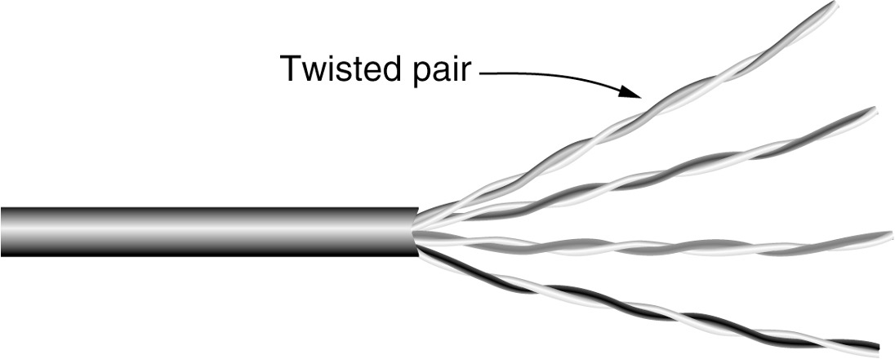
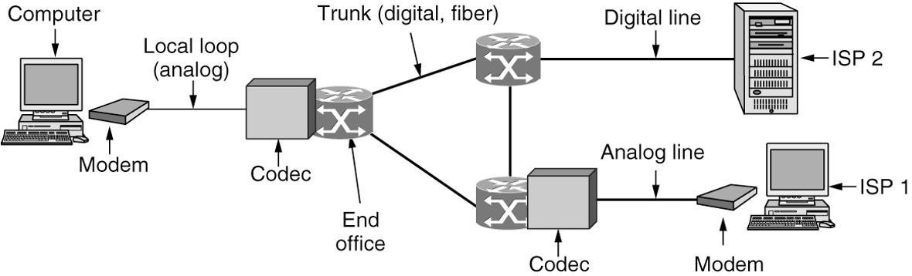
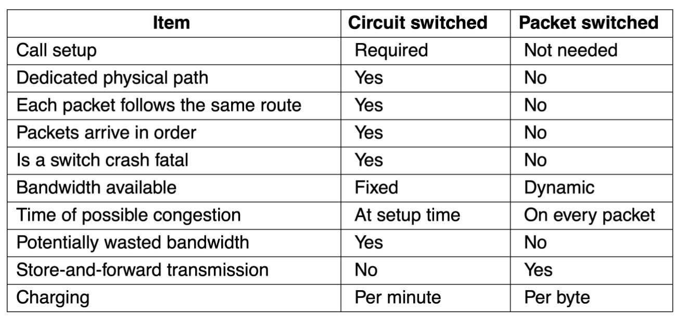
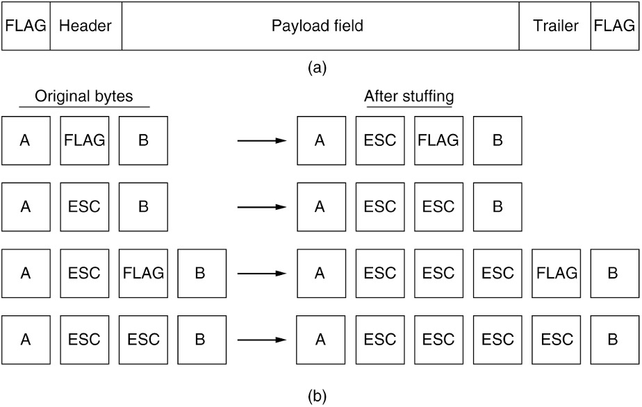

# CheatSheet

==Ch:1;**1**:==**Person to person communication**: Instant messaging, Twitter multi-persion messaging service, Social network applicants, Wiki content is a collaborative Web site the members of community edit.**Electronic Commerce:** Online shopping and financial institution transactions follow client-server model, Online auctions follow peer-to-peer model. **The internet of things**: Ubiquitous computing, IoT (Internet of Things), Power-line networks. ==**<u>2:</u>**== **PANs** (Personal Area Networks) let devices communicate over the range of a person. Bluetooth is a short-range wireless network used to connect components without wires.**LAN:** The configuration on the left represents a wireless 802.11 network. The configuration on the right represents a wired switched Ethernet network.**MAN:** A MAN (metropolitan area network) where both television signals and the Internet are being fed into the centralized cable head-end (or cable modem termination system) for subsequent distribution to people’s homes.**WAN:** This wide area network illustrates how hosts in Perth, Brisbane, and Melbourne can communicate using leased lines. <u>**==3==: ARPANET, NSFNET, Mobile Network Architecture**</u>**A:** The original ARPANET software was split into two parts: subnet and host. The subnet software consisted of the IMP end of the host-IMP connection, the IMP-IMP protocol, and a source IMP to destination IMP protocol designed to improve reliability.**N:** NSFNET was a backbone network designed to be a successor to the ARPANET that would be open to all university research groups, allowing them to communicate without having to contract with the Department of Defense. **<u>==4:== Design goals, Connections and reliability</u>**: **Design goal:** Reliability, Resource allocation, An allocation problem that occurs at every level, Congestion problem, Quality of service reconciles competing demands, Evolvability, Security.; **Connections and Reliability**: Reliability characterizes connection-oriented and connectionless services.**<u>==5==: OSI reference model, TCP/IP reference model</u>**: Three concepts central to the OSI model: Services, Interfaces, Protocols; **critique of the both models**: **OSI**: Bad timing, Competing TCP/IP protocols were already in widespread use; Bad design, Both the model and the protocols are flawed; Bad implementations, Initial implementations were huge, unwieldy, and slow; Bad politics, Widely thought to be the creature of the European telecommunication ministries, the European Community, and later the U.S. Government;**TCP/IP**: Model does not clearly distinguish the concepts of services, interfaces, and protocols; Model is not at all general; Poorly suited to describing any other protocol stack; The link layer is not really a layer at all in the normal sense of the term; Model does not distinguish between the physical and data link layers; Other protocol implementations were distributed free **<u>==6==: Policy, legal and social issues</u>**:**Online speech**: Communications Decency Act protects some platforms from federal criminal prosecution. DMCA takedown notices (after the Digital Millennium Copyright Act) threaten legal action; **Net neutrality**: ISPs should provide equal quality of service to a given type of application traffic, regardless of who is sending that content; No blocking, no throttling, no paid prioritization, transparency; Does not prevent an ISP from prioritizing any traffic; Zero rating: ISP might charge its subscribers according to data usage but grant an exemption for a particular service; **Security**: DDoS (Distributed Denial of Service) attack; Botnets; Spam email; Phishing; **Privacy**: Profiling and tracking users by collecting data about their network behavior over time; Storing cookies in Web browser; Browser fingerprinting; Mobile services location privacy; Disinformation; Ill-considered, misleading, or downright wrong information; Fake news; **Challenges**: How does one define disinformation in the first place?; Can disinformation be reliably detected?; What should a network or platform operator do about it once it is detected.

 

Ch2: **<u>1. Persistent storage, twisted pairs, Coaxial cable, Power lines, Fiber optics, Comparison of fiber optics with copper wire.</u>** : **Persistent Storage:** Consists of magnetic or solid-state storage, Common way to transport data: Write to persistent storage, Physically transport the tape or disks to the destination machine, Read data back again; Cost effective for applications where a high data rate or cost per bit transported is the key factor; Never underestimate the bandwidth of a station wagon full of tapes hurtling down the highway. **Twisted Pairs**: A category 5e twisted pair consists of two insulated wires gently twisted together.  Four such pairs are typically grouped in a plastic sheath to protect the wires and keep them together. **Coaxial cable**: A coaxial cable consists of a stiff copper wire as the core, surrounded by an insulating material. The insulator is encased by a cylindrical conductor, often as a closely woven braided mesh. The outer conductor is covered in a protective plastic sheath. **Power lines**: Using power lines for networking is simple.  In this case, a TV and a receiver are plugged into the wall, which must be done anyway because they need power.  Then they can send and receive movies over the electrical wiring.**Fiber optics**: Allows essentially infinite bandwidth; Must consider costs: For installation over the last mile and to move bits; Uses: {Long-haul transmission in network backbones, High-speed LANs, High-speed Internet access}; Key components: Light source, transmission medium, and detector; Transmission system uses physics; Transmission of light through fiber: {Attenuation of light through glass: {Dependent on the wavelength of the light, Defined as the ratio of input to output signal power}}; Fiber cables: Similar to coax, except without the braid; Two kinds of signaling light sources: LEDs (Light Emitting Diodes), Semiconductor lasers. <u>**Comparison of fiber optics with copper wire**</u>: Fiber advantages over copper: {Handles higher bandwidth, Not affected by power surges, electromagnetic interference, power failures, corrosive chemicals, Thin and lightweight, Do not leak light, Difficult to tap}; Fiber disadvantage: {Less familiar technology that requires specific engineering skills, Fibers damaged easily by being bent too much} **<u>2: Electromagnetic spectrum, Frequency hopping spread spectrum, direct sequence spread spectrum</u>** 

Wireless Transmission: The electromagnetic spectrum: {Modulate wave amplitude, frequency, or phase}; Frequency hopping spread spectrum: {Transmitter hops from frequency to frequency hundreds of times per second}; Direct sequence spread spectrum: {Code sequence spreads data signal over wider frequency band}; Ultra-wideband communication: {Communication sends a series of low-energy rapid pulses, varying their carrier frequencies to communicate information}.**<u>3: Radio transmission, Light transmission</u>**: Radio transmission: {Omnidirectional waves, easy to generate, travel long distances, penetrate buildings}; Microwave transmission: {Directional waves requiring repeaters, do not penetrate buildings}; Infrared transmission{Unguided waves used for short-range communication, relatively directional, cheap, easy to build, do not penetrate solid walls}; Light transmission:{Unguided optical communication}. 4**<u>: Bandwidth, Baseband transmission, Passband transmission, FDM, TDM, CDM, WDM</u>**: **Bandwidth:** Bandwidth is often a limited resource. Solution: {Use more than two signaling levels, by using four voltages we can send 2 bits at once as a single symbol, Design works as long as the signal at the receiver is sufficiently strong to distinguish the four levels, Signal rate change is half the bit rate, so the needed bandwidth has been reduced}. **Multiplexing**: {Frequency Division Multiplexing: FDM (Frequency Division Multiplexing) takes advantage of passband transmission to share a channel. It divides the spectrum into frequency bands, with each user having exclusive possession of some band in which to send a signal. In this diagram, we see three voice-grade telephone channels multiplexed using FDM. Filters limit the usable bandwidth to roughly 3100 Hz per voice-grade channel. The excess bandwidth is called a guard band. It keeps the channels well separated. First, the voice channels are raised in frequency, each by a different amount. Then they can be combined because no two channels now occupy the same portion of the spectrum. Notice that even though there are gaps between the channels thanks to the guard bands, there is some overlap between adjacent channels., Time Division Multiplexing, Code Division Multiplexing, Wavelength Division Multiplexing} Pictures. **<u>5: Structure of the telephone system, Telephone modem, DSL, FTTX, Circuit switching, packet switching</u>**: The public Switched Telephone Network: {Structure of the Telephone System, The Local Loop: Telephone Modems, ADSL, and Fiber}; **Switching** : {Phone system principal parts:{Outside plant (outside switching offices), Inside plant (inside switching offices)}; Two different switching techniques: {Circuit switching: traditional telephone system, Packet switching: voice over IP technology}}. **<u>6: Cellular network concept, 1G, 2G, 3G, 4G, 5G</u>** : Provided analog voice; digital voice{Digital advantages: {Provides capacity gains by allowing voice signals to be digitized and compressed, Improves security by allowing voice and control signals to be encrypted, Deters fraud and eavesdropping, Enables new services such as text messaging}, and both digital voice and data (Internet, email, etc.), 4G technology adds capabilities { Physical layer transmission techniques and IP-based femtocells, 4G is based on packet switching only (no circuit switching)}, 5G being rolled out now: {Supports up to 20 Gbps transmissions and denser deployments, Focus on reducing network latency} respectively. **Common Concepts: Cells**: A geographic region is divided up into **cells,** allow for frequency reuse. At the center of each cell is a base station to which all the telephones in the cell transmit. The base station consists of a computer and transmitter/receiver connected to an antenna. In a small system, all the base stations are connected to a single device called an MSC (Mobile Switching Center) or MTSO (Mobile Telephone Switching Office). In a larger one, several MSCs may be needed, all of which are connected to a second-level MSC, and so on. **<u>7: Broadband Internet access over cable:HFC Networks;  Docsis:Provides information related to modern cable network architectures</u>**. **<u>8 GEO, MEO:Used for navigation systems , LEO</u>**: **Terrestrial Access Networks: Cable, Fiber, and ADSL**: Similarities:{Comparable service and comparable prices, Use fiber in the backbone}; Differences:{Last-mile access technology at the physical and link layers, Bandwidth consistency, Cable subscribers share the capacity of a single node, Maximum speeds, Availability, Security}; **Satellites Versus Terrestrial Networks**: Communication satellites niche markets: {Rapid deployments, Places where the terrestrial infrastructure is poorly developed, When broadcasting is essential, United States has some competing satellite-based Internet providers, Satellite Internet access seeing a growing interest:In-flight Internet access}

Ch3: **<u>1: Services Provided to the Network Layer, Framing (Byte count Flag bytes with byte stuffing, Flag bits with bit stuffing, Physical layer coding violations), Error control, Flow control.</u>**

  

**Error Control**: Ensuring all frames are eventually delivered:{To the network layer at the destination

, In the proper order}; Ensures reliable, connection-oriented service; Requires acknowledgement frames and timers. **Flow control**: Controlling the sending of transmission frames at a faster pace than they can be accepted; Feedback-based flow control: {Receiver sends back information to the sender giving it permission to send more data, Or receiver tells the sender how the receiver is doing}; Rate-based flow control: {Protocol has a built-in mechanism, Mechanism limits the rate at which senders may transmit data, No feedback from the receiver is necessary}.**<u>2: Error-Correcting Codes: (Hamming codes, Binary convolutional codes, Reed-Solomon codes, Low-Density Parity Check codes), Error-Detecting Codes: (Parity, Checksums, Cyclic Redundancy Checks)</u>****<u>3: Three simplex link-layer protocols: (Utopia: No Flow Control or Error Correction, Adding Flow Control: Stop-and-Wait, Adding Error Correction: Sequence Numbers and ARQ).</u>**

**Elementary Data Link Protocols **Assumptions underly the communication model: Three simplex link-layer protocols{Utopia: No Flow Control or Error Correction, Adding Flow Control: Stop-and-Wait, Adding Error Correction: Sequence Numbers and ARQ}<u>**4: Piggybacking, three bidirectional sliding window protocols: (One-bit sliding window, go-back-n, selective repeat)**</u>

Bidirectional transmission: piggybacking {Use the same link for data in both directions, Interleave data and control frames on the same link, Temporarily delay outgoing acknowledgements so they can be hooked onto the next outgoing data frame}; Piggybacking advantages: {A better use of the available channel bandwidth, Lighter processing load at the receiver}; Piggybacking issue{Determining time data link layer waits for a packet to piggyback the acknowledgement}; /* Protocol 1 (utopia) provides for data transmission in one direction only, from sender to receiver. The communication channel is assumed to be error free, and the receiver is assumed to be able to process all the input infinitely fast.
Consequently, the sender just sits in a loop pumping data out onto the line as fast as it can. *//* Protocol 2 (stop-and-wait) also provides for a one-directional flow of data from sender to receiver. The communicaiton channel is once again assumed to be error free, as in protocal 1. However, this time, the receiver has only a finite buffer capacity and a finite processing speed, so the protocol must explicitly prevent the sender from flooding the receiver with data faster than it can be handled. *//* Protocol 3 (par) allows unidirectional data flow over an unreliable channel *//* Protocol 4 (sliding window) is bidirectional and is more robust than protocol 3. *//* Protocol 5 (Go-back-n) allows multiple outstanding frames. The sender may transmit up to MAX_SEQ frames without waiting for an ack. In addition, unlike the previous protocols, the network layer causes a network_layer_ready event when there is a packet to send *//* Protocol 6 (Selective repeat) accepts frames out of order but passes packets to the network layer in order. Associated with each outstanding freme is a timer. When the timer expires, only that frame is retransmitted, not all the outstanding frames, as in protocol 5. */In go-back-n, if a frame in the middle of a long stream is damaged or lost, the receiver just discards all subsequent frames, sending no acknowledgements for the discarded frames. This strategy corresponds to a receive window of size 1. In other words, the data link layer refuses to accept any frame except the next one it must give to the network layer. If the sender’s window fills up before the timer runs out, the pipeline will begin to empty. Eventually, the sender will time out and retransmit all unacknowledged frames in order, starting with the damaged or lost one. This approach can waste a lot of bandwidth if the error rate is high. An alternative strategy, the selective repeat protocol, is to allow the receiver to accept and buffer correct frames received following a damaged or lost one. When it is used, a bad frame that is received is discarded, but any good frames received after it are accepted and buffered. When the sender times out, only the oldest unacknowledged frame is retransmitted. If that frame arrives correctly, the receiver can deliver to the network layer, in sequence, all the frames it has buffered. Selective repeat corresponds to a receiver window larger than 1. This approach can require large amounts of data link layer memory if the window is large.

**<u>5: Packet over SONET, ADSL</u>** **Data Link Protocols in Practice**: {Packet over SONET, ADSL (Asymmetric Digital Subscriber Loop)}

