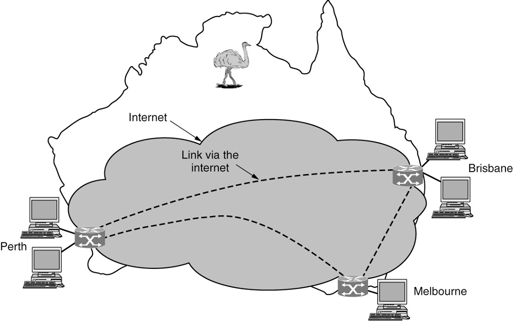
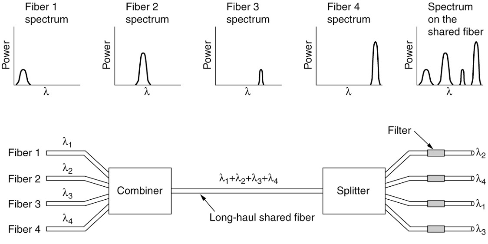
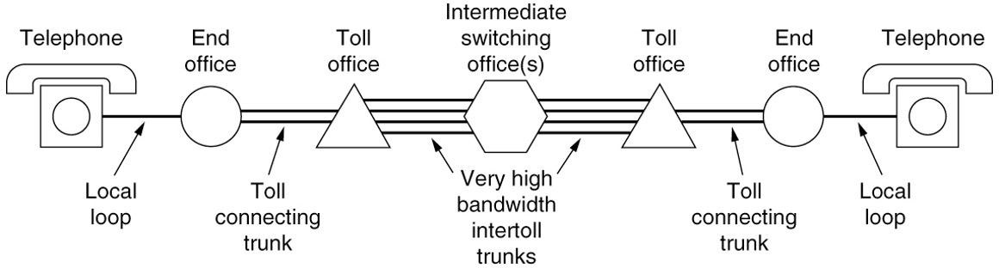

# Topics

## Chapter 1

### 1.1: Person to person communication, Electronic Commerce, The internet of things

#### 1.1.1 **Person to person communication(人和人之间的交流):** 

* Instant messaging

  即时消息

  * Allows two people to type messages at each other in real time 

    允许两个人实时向对方发送信息

* Twitter multi-persion messaging service  

  Twitter多人消息服务

  * Allows people to send short messages to their circle of friends or other followers or the whole word. 

    允许人们向他们的朋友圈或其他追随者或整个世界发送短信

* Social network applicants

  社交网络应用

  * Information flow driven by the relationships that people declare between each other.

    由人们之间声明的关系驱动的信息流

* Wiki content is a collaborative Web site the members of community edit.

  Wiki内容是一个由网站的成员进行社区编辑的协作式网站


#### ==1.1.2 **Electronic Commerce**==

* Online shopping and financial institution transactions follow client-server model

  网上购物和金融机构交易遵循客户-服务器模式

* Online auctions follow peer-to-peer model

  在线拍卖遵循点对点模式

  * Consumers act as buyers and sellers

    消费者既是买家又是卖家

  * Central server holds the database of products for sale

    中央服务器保存待售产品的数据库

| ==Tag== | ==Full name==          | ==Example==                                      |
| ------- | ---------------------- | ------------------------------------------------ |
| B2C     | Bussiness-to-consumer  | Ordering books online                            |
| B2B     | Bussiness-to-business  | Car manufacturer ordering tires from a supplier  |
| G2C     | Government-to-consumer | Government distributing tax forms electronically |
| C2C     | Consumer-to-consumer   | Auctioning second-hand products online           |
| P2P     | Peer-to-peer           | Music or file sharing: Skype                     |

Some forms of e-commerce have acquired little tags based on the fact that "to" and "2" are pronounced the same.


#### 1.1.3 The Internet of things 

* Ubiquitous computing

  无处不在的计算

  * Computing embedded in everyday life

    计算嵌入日常生活

  * Home security systems wired with door and window sensors

    装有门窗传感器的家庭安全系统

  * Sensors folded into a smart home monitor

    可折叠成智能家居监视器的传感器

  * Smart refrigerators

    智能冰箱

* IoT (Internet of Things) 

  IoT(物联网)

  * Sensing and communication take place over the Internet

    传感和通信通过互联网进行

  * Poised to connect every electronic device to the Internet

    准备将所有电子设备连接到互联网

* Power-line networks

  电源网络

  * Send information throughout the house over the electric wires

    通过电线将信息传送到整个房子

  

### 1.3: PAN, LAN, MAN, WAN

#### 1.3.1 PAN


PANs (Personal Area Networks) let devices communicate over the range of a person. Bluetooth is a short-range wireless network used to connect components without wires.

PANs (个人区域网络) 让设备在一个人的范围内进行通信。蓝牙(Bluetooth)是一种短距离无线网络，用于在没有电线的情况下连接组件。


### 1.3.2 LAN


The configuration on the left represents a wireless 802.11 network. The configuration on the right represents a wired switched Ethernet network.

左边的配置表示无线802.11网络。右边的配置代表一个有线交换式以太网.


Why LAN good?

How LAN works?

Two lines is good. 


#### 1.3.3 MAN


A MAN (metropolitan area network) where both television signals and the Internet are being fed into the centralized cable head-end (or cable modem termination system) for subsequent distribution to people’s homes.

城域网一种城域网，电视信号和因特网都被送入集中的电缆头端(或电缆调制解调器终端系统)，以便随后分配到人们的家中.


#### 1.3.4 WAN


This wide area network illustrates how hosts in Perth, Brisbane, and Melbourne can communicate using leased lines.

这个广域网展示了珀斯、布里斯班和墨尔本的主机如何使用租用线路进行通信.




This wide area network illustrates how hosts in Perth, Brisbane, and Melbourne can communicate via the Internet.

这个广域网展示了珀斯、布里斯班和墨尔本的主机如何通过互联网进行通信。

By using Internet connectivity instead of leasing dedicated transmission lines to connect offices, the wide area network (WAN) connections can be made between the offices as virtual links using the underlying capacity of the Internet.

通过使用因特网连接而不是租用专用传输线路来连接办公室，广域网(WAN)连接可以在办公室之间作为虚拟链路使用因特网的基础能力。


This wide area network illustrates how hosts in Perth, Brisbane, and Melbourne can communicate via an ISP.

这个广域网展示了珀斯、布里斯班和墨尔本的主机如何通过ISP进行通信。

By using a network that is operated by a commercial Internet service provider (ISP), the wide area network (WAN) connections can be made between the offices. This type of set-up may help reduce performance degradation issues that may be seen when connecting over the Internet.

通过使用由商业互联网服务提供商(ISP)运营的网络，可以在办公室之间建立广域网(WAN)连接。这种类型的设置可能有助于减少连接互联网时可能出现的性能下降问题。


### 1.4: ARPANET, NSFNET, Mobile Network Architecture

#### 1.4.1 ARPANET


The original ARPANET software was split into two parts: subnet and host. The subnet software consisted of the IMP end of the host-IMP connection, the IMP-IMP protocol, and a source IMP to destination IMP protocol designed to improve reliability.

最初的ARPANET软件被分成两个部分:子网和主机。子网软件由主机-IMP连接的IMP端、IMP-IMP协议和旨在提高可靠性的源IMP到目的IMP协议组成.


Growth of the number of nodes on ARPANET. (a) December 1969. (b) July 1970. (c) March 1971. (d) April 1972. (e) September 1972.


#### 1.4.2 NSFNET


NSFNET was a backbone network designed to be a successor to the ARPANET that would be open to all university research groups, allowing them to communicate without having to contract with the Department of Defense.

NSFNET是一个骨干网络，旨在成为阿帕网的继承者，该网络将向所有大学研究小组开放，允许他们不必与国防部签订合同就可以进行交流。


#### 1.4.3 Mobile Network Architecture


The architecture of the mobile phone network has several parts.

移动电话网络的体系结构由几个部分组成.


When a user moves out of the range of one cellular base station and into the range of another one, the flow of data must be re-routed from the old to the new cell base station.

当用户移动出一个蜂窝基站的范围，进入另一个蜂窝基站的范围时，数据流必须从旧的蜂窝基站重新路由到新的蜂窝基站.

* Packet switching comes from the Internet community

  分组交换起源于Internet社区

  * Connectionless networks

    无连接网络

  * Every packet is routed independently

    每个分组都是独立路由的

  * If some routers go down during a session, no harm will be done as long as the system can dynamically reconfigure itself 

    如果某些路由器在会话期间发生故障，只要系统能够动态地重新配置自己，就不会造成任何损害

* Circuit switching comes from telephone companies

  电路交换来自电话公司

  * Connection-oriented networks

    面向连接的网络

  * Caller must dial the called party’s number and wait for a connection before talking or sending data

    在通话或发送数据之前，主叫方必须拨打被叫号码并等待连接

  * Route maintained until call is terminated

    路由保持，直到呼叫终止

  * Can support quality of service more easily

    能否更容易地支持服务质量


* First-generation mobile phone systems

  第一代移动电话系统

  * Transmitted voice calls as continuously varying (analog) signals

    传输的语音呼叫为连续变化的(模拟)信号

  * AMPS (Advanced Mobile Phone System)

    AMPS(高级移动电话系统)

* Second-generation (2G) mobile phone systems 

  第二代(2G)移动电话系统

  * Transmitted voice calls in digital form to increase capacity, improve security, and offer text messaging

    以数字形式传输语音通话，以增加容量，提高安全性，并提供文本信息

  * GSM (Global System for Mobile communications) 

    全球移动通信系统

* Third generation (3G) offer digital voice and broadband digital data services

  第三代(3G)提供数字语音和宽带数字数据服务

* Spectrum scarcity led to today’s cellular network design

  频谱稀缺导致了今天的蜂窝网络设计


To manage the radio interference between users, the coverage area is divided into cells. 

为管理用户间的无线电干扰，将覆盖区域划分为小区。


* 4G

  * Later 4G known as LTE (Long Term Evolution) technology

    后来的4G被称为LTE(长期演进)技术

  * Offers faster speeds

    提供更快的速度

  * Emerged in the late 2000s

    出现于2000年代末

  * Quickly became the predominant mode of mobile Internet access in the late 2000s

    在2000年代末迅速成为移动互联网访问的主要模式

  * Outpacing competitors like 802.16 (WiMiMax)

    超越802.16 (WiMiMax)等竞争对手

* 5G technologies are promising faster speeds

  5G技术有望实现更快的速度

  * Up to 10 Gbps

    高达10 Gbps

  * Set for large-scale deployment in the early 2020s

    将在本世纪20年代初大规模部署

* Main distinction: frequency spectrum they rely on

  主要区别:它们所依赖的频谱


### 1.5: Design goals, Connections and reliability

#### 1.5.1 Design goals

* Reliability 可靠性

  * Make a network operate correctly even though it is comprised of a collection of components that are themselves unreliable

    使网络正确地运行，即使它是由一组本身不可靠的组件组成的

  * Error detection finds errors in received information

    错误检测发现接收到的信息存在错误

  * Error correction corrects a message by recovering the possibly incorrect bits

    错误纠正通过恢复可能不正确的位来纠正消息

* Find a working path through a network using routing

  使用路由找到通过网络的工作路径

  * Routing allows network to automatically make the decision

    路由允许网络自动做出决策

* Resource allocation 资源分配

  * Scalable designs continue to work well when network gets large

    当网络变得越来越大时，可扩展的设计仍然可以很好地工作

  * Statistical multiplexing: sharing based on the statistics of demand

    统计复用:根据需求的统计进行共享

* An allocation problem that occurs at every level

  每个层次上都存在的分配问题

  * Keeping a fast sender from swamping a slow receiver with data

    避免快速的发送端用数据淹没慢速的接收端

  * Use flow control

    使用流程控制

* Congestion problem

  拥塞问题

  * Occurs when too many computers want to send too much traffic, and the network cannot deliver it all

    当太多计算机想要发送太多流量，而网络无法全部传输时发生

* Quality of service reconciles competing demands

  服务质量协调相互竞争的需求


* Evolvability 可发展性

  * Design issue concerns the evolution of the network

    设计问题涉及网络的演化

  * Over time, networks grow larger and new designs emerge that need to be connected to the existing network

    随着时间的推移，网络变得越来越大，新的设计需要连接到现有的网络

  * Use protocol layering structuring mechanism to support change by dividing the overall problem and hiding implementation details

    通过划分整体问题并隐藏实现细节，使用协议分层结构机制来支持更改

  * Use addressing or naming mechanism to identify the senders and receivers involved in a particular message

    使用寻址或命名机制来识别特定消息中涉及的发送者和接收者

  * Different network technologies often have different limitations

    不同的网络技术通常有不同的局限性

  * Overall topic is called internetworking

    总体主题是“网络互联”

* Security

  * Confidentiality mechanisms defend against eavesdropping on communications

    保密机制可以防止通信被窃听

  * Authentication mechanisms prevent someone from impersonating someone else

    身份验证机制可以防止冒充他人

  * Integrity mechanisms prevent surreptitious changes to messages

    完整性机制可以防止对消息的秘密更改


#### 1.5.2 Connections and Reliability

* Connection-oriented service 

  面向连接的服务

  * Modeled after the telephone system

    模仿电话系统

  * Service user first establishes a connection, uses the connection, and then releases the connection

    服务用户首先建立连接，使用连接，然后释放连接

  * Can conduct a negotiation about the parameters to be used

    可以协商要使用的参数

* Connectionless service

  无连接服务

  * Modeled after the postal system

    模仿邮政系统

  * Packet is a message at the network layer

    包是网络层的消息

  * Store-and-forward switching: intermediate nodes receive a message in full before sending it on to the next node

    存储转发交换:中间节点在将消息发送给下一个节点之前完整地接收消息

  * Cut-through switching: transmission of a message at a node starts before it is completely received by the node

    直通切换(Cut-through switching):在消息被节点完全接收之前，该节点就开始传输消息

  * Datagram service: Unreliable (not acknowledged) connectionless service

    数据报服务:不可靠(未得到确认)的无连接服务

* Reliability characterizes connection-oriented and connectionless services

  可靠性是面向连接和无连接服务的特征

* Connectionless service

  无连接服务

  * Modeled after the postal system

    模仿邮政系统

  * Packet is a message at the network layer

    包是网络层的消息

  * Store-and-forward switching: intermediate nodes receive a message in full before sending it on to the next node

    存储转发交换:中间节点在将消息发送给下一个节点之前完整地接收消息

  * Cut-through switching: transmission of a message at a node starts before it is completely received by the node

    直通切换(Cut-through switching):在消息被节点完全接收之前，该节点就开始传输消息

  * Datagram service: Unreliable (not acknowledged) connectionless service

    数据报服务:不可靠(未得到确认)的无连接服务

* Reliability characterizes connection-oriented and connectionless services

  可靠性是面向连接和无连接服务的特征


Six common connection-oriented and connectionless services.

六种常见的面向连接和无连接服务.


### 1.6: OSI reference model, TCP/IP reference model, critique of the both models

* The OSI Reference Model

  OSI参考模型

* The TCP/IP Reference Model

   TCP/IP参考模型

  * The Link Layer 

    链接层

  * The Internet Layer

    互联网层

  * The Transport Layer

    传输层

  * The Application Layer

    应用层

* A critique of the OSI model and protocols

  OSI模型和协议的评论

* Critique of the TCP/IP reference model and protocols

  TCP/IP参考模型和协议的评论

* The model used in this book

  本书中使用的模型

#### 1.6.1 OSI reference model

* Principles for the seven layers

  这7层的原则

  * Layers created for different abstractions

    为不同的抽象创建层

  * Each layer performs well-defined function

    每一层都执行定义良好的功能

  * Function of layer chosen with definition of international standard protocols in mind

    选择层的功能时考虑到国际标准协议的定义

  * Minimize information flow across interfaces between boundaries

    最小化边界之间的信息流动

  * Number of layers should be optimum

    层数应该是最优的

* Three concepts central to the OSI model:

  OSI模型的三个核心概念

  * Services 服务
  * Interfaces 接口
  * Protocols 协议


The OSI model has seven layers.

OSI模型有7层.


#### 1.6.2 TCP/IP reference model

* The Link Layer

  链接层

  * Lowest layer in the model

    模型的最底层

  * Describes what links must do to meet the needs of this connectionless internet layer

    描述了链路必须做什么才能满足无连接的internet层的需求

* The Internet Layer

  互联网层

  * Permits hosts to inject packets into any network and have them travel independently to the destination

    允许主机向任何网络注入数据包，并让它们独立地到达目的地

  * Defines an official packet format and protocol called IP (Internet Protocol)

    定义了一种称为IP (Internet protocol)的官方数据包格式和协议

  * Defines a companion protocol called ICMP (Internet Control Message Protocol) that helps IP function

    定义了一个名为ICMP (Internet Control Message protocol)的伴生协议，帮助实现IP功能

* The Transport Layer

  传输层

  * The layer above the internet layer in the TCP/IP model

    TCP/IP模型中高于internet层的一层

  * Uses two end-to-end transport protocols

    使用两个端到端传输协议

* TCP (Transmission Control Protocol)

  TCP(传输控制协议)

* UDP (User Datagram Protocol)

  UDP(用户数据报协议)

* The Application Layer

  应用层

  * Contains all the higher-level protocols

    包含所有高级协议


The TCP/IP layers loosely align with the OSI model.

TCP/IP层松散地与OSI模型保持一致.


The relation of IP, TCP, and UDP protocols are illustrated. We will study these.

述了IP、TCP和UDP协议之间的关系。我们会研究这些.


#### 1.6.3 critique of the both models

* Bad timing

  糟糕的时机

  * Competing TCP/IP protocols were already in widespread use

    相互竞争的TCP/IP协议已经被广泛使用

* Bad design

  糟糕的设计

  * Both the model and the protocols are flawed

    模型和协议都有缺陷

* Bad implementations

  糟糕的实现

  * Initial implementations were huge, unwieldy, and slow

    最初的实现是巨大的，笨重的，缓慢的

* Bad politics

  糟糕的政治

  * Widely thought to be the creature of the European telecommunication ministries, the European Community, and later the U.S. Government

    被广泛认为是欧洲电信部门、欧洲共同体以及后来的美国政府的产物


It is essential that the standards be written in the trough in between the two ‘‘elephants.’’ If they are written too early (before the research results are well established), the subject may still be poorly understood; the result is a bad standard. If they are written too late, so many companies may have already made major investments in different ways of doing things that the standards are effectively ignored. If the interval between the two elephants is very short (because everyone is in a hurry to get started), the people developing the standards may get crushed.

重要的是，这些标准应该写在两个“大象”之间的槽中。“如果他们写得太早(在研究结果得到充分确立之前)，这个主题可能仍然不被理解;结果是一个糟糕的标准。如果制定得太晚，那么许多公司可能已经在不同的做事方式上进行了大量投资，而这些标准实际上被忽略了。如果两头大象之间的时间间隔很短(因为每个人都急于开始)，开发标准的人可能会感到崩溃。


* Model does not clearly distinguish the concepts of services, interfaces, and protocols

  Model没有明确区分服务、接口和协议的概念

* Model is not at all general

  Model一点也不通用

  * Poorly suited to describing any other protocol stack

    不适合描述任何其他协议栈

* The link layer is not really a layer at all in the normal sense of the term

  链接层根本不是通常意义上的层

* Model does not distinguish between the physical and data link layers

  Model不区分物理层和数据链路层

* Other protocol implementations were distributed free

  其他协议实现是免费发布的


### 1.8: Policy, legal and social issues

政策、法律和社会问题

* Online speech

  在线演讲

  * Communications Decency Act protects some platforms from federal criminal prosecution

    《通信体面法》保护一些平台免受联邦刑事起诉

  * DMCA takedown notices (after the Digital Millennium Copyright Act) threaten legal action

    DMCA下架通知(在Digital Millennium Copyright Act之后)威胁要采取法律行动

* Net neutrality

  网络中立性

  * ISPs should provide equal quality of service to a given type of application traffic, regardless of who is sending that content

    无论谁发送内容，isp都应该为给定类型的应用流量提供同等质量的服务

  * No blocking, no throttling, no paid prioritization, transparency

    无阻塞，无节流，无付费优先级，透明

  * Does not prevent an ISP from prioritizing any traffic

    不阻止ISP对任何流量进行优先级设置

  * Zero rating: ISP might charge its subscribers according to data usage but grant an exemption for a particular service

    零费率:ISP可能会根据用户的数据使用情况收取费用，但对特定服务给予豁免

* Online speech

  在线演讲

  * Communications Decency Act protects some platforms from federal criminal prosecution

    《通信体面法》保护一些平台免受联邦刑事起诉

  * DMCA takedown notices (after the Digital Millennium Copyright Act) threaten legal action

    DMCA下架通知(在Digital Millennium Copyright Act之后)威胁要采取法律行动

* Security

  安全

  * DDoS (Distributed Denial of Service) attack

    DDoS(分布式拒绝服务)攻击

  * Botnets

    僵尸网络

  * Spam email

    垃圾邮件

  * Phishing

    钓鱼

* Privacy

  隐私

  * Profiling and tracking users by collecting data about their network behavior over time

    通过收集用户一段时间内的网络行为数据来分析和跟踪用户

  * Storing cookies in Web browser

    在浏览器中存储cookie

  * Browser fingerprinting

    浏览器指纹

  * Mobile services location privacy

    移动服务位置隐私

* Disinformation

  造谣

  * Ill-considered, misleading, or downright wrong information

    欠考虑的、误导性的或完全错误的信息

  * Fake news

    假新闻

  * Challenges

    挑战

    * How does one define disinformation in the first place?

      首先如何定义虚假信息?

    * Can disinformation be reliably detected?

      可以可靠地检测虚假信息吗?

    * What should a network or platform operator do about it once it is detected

      一旦检测到它，网络或平台运营商应该做什么


## Chapter 2 The Physical Layer

### 2.1 Persistent storage, twisted pairs, Coaxial cable, Power lines, Fiber optics, Comparison of fiber optics with copper wire

#### 2.1.1 Persistent Storage

* Consists of magnetic or solid-state storage

  由磁性或固态存储器组成

* Common way to transport data

  传输数据的常用方法

  * Write to persistent storage

    写入持久存储

  * Physically transport the tape or disks to the destination machine

    物理地将磁带或磁盘传输到目标机器

  * Read data back again

    再次读取数据

* Cost effective for applications where a high data rate or cost per bit transported is the key factor

  对于高数据速率或每比特传输成本是关键因素的应用程序而言，成本效益是关键

* Never underestimate the bandwidth of a station wagon full of tapes hurtling down the highway

  永远不要低估一辆满载磁带的旅行车在高速公路上飞驰的带宽


#### 2.1.2 **Twisted Pairs**


A category 5e twisted pair consists of two insulated wires gently twisted together.  Four such pairs are typically grouped in a plastic sheath to protect the wires and keep them together.

5e类双绞线由两根绝缘电线轻轻绞合而成。四对这样的电线通常被组合在一个塑料护套中，以保护电线并使它们保持在一起。


#### 2.1.3 Coaxial cable 


A coaxial cable consists of a stiff copper wire as the core, surrounded by an insulating material. The insulator is encased by a cylindrical conductor, often as a closely woven braided mesh. The outer conductor is covered in a protective plastic sheath.

同轴电缆由一根硬铜线作为芯线，周围环绕一层绝缘材料。绝缘体由圆柱形导体包裹，通常是紧密编织的编织网。外导体被一层塑料护套所覆盖。

#### 2.1.4 Power lines 


Using power lines for networking is simple.  In this case, a TV and a receiver are plugged into the wall, which must be done anyway because they need power.  Then they can send and receive movies over the electrical wiring.

使用电力线进行网络连接很简单。在这种情况下，电视和接收器插在墙上，无论如何都必须这样做，因为它们需要电力。然后他们可以通过电线发送和接收电影。


#### 2.1.5 Fiber optics

* Allows essentially infinite bandwidth

  允许无限带宽

* Must consider costs

  必须考虑成本

  * For installation over the last mile and to move bits

    用于安装最后一英里和移动位

* Uses

  * Long-haul transmission in network backbones

    网络骨干网中的长距离传输

  * High-speed LANs

    高速局域网

  * High-speed Internet access

    高速互联网接入

* Key components

  关键部件

  * Light source, transmission medium, and detector

    光源、传输介质和探测器

* Transmission system uses physics

  传输系统使用物理原理


Figure (a) illustrates a light ray inside a silica fiber impinging on the air/silica boundary at different angles. Figure (b) illustrates light trapped by total internal reflection.

图(a)说明了硅光纤内的光线以不同角度撞击空气/硅边界。图(b)说明了被全内反射捕获的光。


* Transmission of light through fiber

  通过光纤传输光

  * Attenuation of light through glass

    光通过玻璃的衰减

    * Dependent on the wavelength of the light 

      依赖于光的波长

    * Defined as the ratio of input to output signal power

      定义为输入输出信号功率之比

* Fiber cables

  光纤

  * Similar to coax, except without the braid

    类似于coax，只是没有辫子

* Two kinds of signaling light sources

  两种信号光源

  * LEDs (Light Emitting Diodes)

    led(发光二极管)

  * Semiconductor lasers

    半导体激光器


Attenuation of light through fiber in the infrared region is measured in units of decibels (dB) per linear kilometer of fiber.

光在红外区域通过光纤的衰减是以每直线千米光纤的分贝(dB)为单位来测量的。


Views of a fiber cable

光纤的外观


A comparison of semiconductor diodes and LEDs as light sources.

半导体二极管和发光二极管作为光源的比较。


#### ==2.1.6 Comparison of fiber optics with copper wire==

* Fiber advantages over copper

  光纤优于铜

  * Handles higher bandwidth

    处理更高的带宽

  * Not affected by power surges, electromagnetic interference, power failures, corrosive chemicals

    不受电涌、电磁干扰、电源故障、腐蚀性化学品影响

  * Thin and lightweight

    轻薄

  * Do not leak light

    不要漏光

  * Difficult to tap

    难以点击

* Fiber disadvantage

  纤维的缺点

  * Less familiar technology that requires specific engineering skills 

    不太熟悉的技术，需要特定的工程技能

  * Fibers damaged easily by being bent too much

    过度弯曲容易损坏纤维


### 2.2: Electromagnetic spectrum, Frequency hopping spread spectrum, direct sequence spread spectrum

Wireless Transmission:

* The electromagnetic spectrum 

  电磁频谱

  * Modulate wave amplitude, frequency, or phase

    调制波的振幅、频率或相位

* Frequency hopping spread spectrum

  跳频扩频

  * Transmitter hops from frequency to frequency hundreds of times per second

    发射机每秒从一个频率跳到另一个频率数百次

* Direct sequence spread spectrum

  直接序列扩频

  * Code sequence spreads data signal over wider frequency band

    码序列将数据信号扩展到更宽的频带

* Ultra-wideband communication

  超宽频通讯

  * Communication sends a series of low-energy rapid pulses, varying their carrier frequencies to communicate information

    通信发送一系列低能量的快速脉冲，改变它们的载波频率来通信信息

  

#### 2.2.1 The Electromagnetic Spectrum 


The electromagnetic spectrum and its uses for communication.

电磁频谱及其通信用途


#### 2.2.2 Direct Sequence Spread Spectrum 


Direct sequence spread spectrum uses a code sequence to spread the data signal over a wider frequency band.

直接序列扩频使用码序列将数据信号扩展到更宽的频带。


### 2.3: Radio transmission, Light transmission

* Radio transmission

  无线电传输

  * Omnidirectional waves, easy to generate, travel long distances, penetrate buildings

    全向波，容易产生，传播距离远，穿透建筑物

* Microwave transmission

  微波传输

  * Directional waves requiring repeaters, do not penetrate buildings

    定向波需要中继器，不能穿透建筑物

* Infrared transmission

  红外传输

  * Unguided waves used for short-range communication, relatively directional, cheap, easy to build, do not penetrate solid walls

    非导波用于短程通信，相对定向，便宜，易于建造，不穿透坚固的墙壁

* Light transmission

  光传输

  * Unguided optical communication

    无制导光通信


#### 2.3.1 Radio transmission


In the VLF, LF, and MF bands, radio waves follow the curvature of the earth. In the HF band, they bounce off the ionosphere.

在VLF、LF和MF波段，无线电波沿着地球的曲率运动。在高频波段，它们在电离层反弹。


#### 2.3.2 Light transmission


Convection currents can interfere with laser communication systems. A bidirectional system with two lasers is pictured here.

对流会干扰激光通信系统。一个双向系统有两个激光器在这里被描绘。


### 2.4: Bandwidth, Baseband transmission, Passband transmission, FDM, TDM, CDM, WDM

### 2.4.1 Bandwidth

* Bandwidth means different things to electrical engineers and to computer scientists. 

  带宽对于电子工程师和计算机科学家来说意味着不同的东西。

* To electrical engineers, (analog) bandwidth is a quantity measured in Hz. The hertz is equivalent to one cycle per second.

  对电气工程师来说，(模拟)带宽是一个以Hz测量的量。赫兹等于每秒一个周期。

* To computer scientists, (digital) bandwidth is the maximum data rate of a channel, a quantity measured in bits/sec. 

  对计算机科学家来说，(数字)带宽是信道的最大数据速率，以比特/秒来衡量。

* That data rate is the end result of using the analog bandwidth of a physical channel for digital transmission, and the two are related

  数据速率是使用物理信道的模拟带宽进行数字传输的最终结果，两者是相关的

  

* Bandwidth is often a limited resource

  带宽通常是一种有限的资源

* Solution

  * Use more than two signaling levels

    使用两个以上的信号级别

  * By using four voltages we can send 2 bits at once as a single symbol

    通过使用四种电压，我们可以一次发送两个比特作为一个符号

  * Design works as long as the signal at the receiver is sufficiently strong to distinguish the four levels

    只要接收器的信号足够强，可以区分这四个等级，设计就可以工作

  * Signal rate change is half the bit rate, so the needed bandwidth has been reduced

    信号速率的变化是比特率的一半，因此所需的带宽也减少了

#### 2.4.2 Baseband transmission


Line codes: (a) Bits, (b) NRZ, (c) NRZI, (d) Manchester, (e) Bipolar or AMI.

线路码:(a)比特，(b) NRZ， (c) NRZI， (d)曼彻斯特，(e)双极或AMI。


#### 2.4.3 Passband Transmission


(a) A binary signal. (b) Amplitude shift keying. (c) Frequency shift keying. (d) Phase shift keying.

(a)二进制信号。(b)幅度键控。(c)频移键控。(d)相移键控。


#### 2.4.4 Multiplexing

复用

* Frequency Division Multiplexing

  频分复用

* Time Division Multiplexing

  时分多路复用

* Code Division Multiplexing

  代码分复用

* Wavelength Division Multiplexing

  波分复用


##### 2.4.4.1 Frequency Division Multiplexing


(a) The original bandwidths. (b) The bandwidths raised in frequency. (c) The multiplexed channel.

(a)原始带宽。(b)频带增加。(c)多路复用信道。


##### 2.4.4.2 Time Division Multiplexing


Time Division Multiplexing (TDM)

时分复用


##### 2.4.4.3 Code Division Multiplexing


(a) Chip sequences for four stations. (b) Signals the sequences represent. (c) Six examples of transmissions. (d) Recovery of station C’s signal.

(a)四个台站的芯片序列。(b)表示序列。(c)六个传输实例。(d)恢复C站的信号。


##### 2.4.4.4 Wavelength Division Multiplexing



Wavelength division multiplexing

波分复用


### 2.5 Structure of the telephone system, Telephone modem, DSL, FTTX, Circuit switching, packet switching

The public Switched Telephone Network

* Structure of the Telephone System

* The Local Loop: Telephone Modems, ADSL, and Fiber
  * Telephone modems


#### 2.5.1 Structure of the telephone system


(a) Fully interconnected network.  (b) Centralized switch.  (c) Two-level hierarchy.

(a)全互联网络。(b)集中式切换。(c)两级等级。



A typical circuit route for a long-distance call

长途电话的典型线路

Telephone System components: 

* Local loops (analog twisted pairs between end offices and local houses and businesses).

  本地环路(末端办公室与本地房屋和企业之间的模拟双绞线)

* Trunks (very high-bandwidth digital fiber-optic links connecting the switching offices).

  中继(连接交换局的高带宽数字光纤链路)。

* Switching offices (where calls are moved from one trunk to another either electrically or optically).

  交换局(将呼叫从一个干线转移到另一个干线，无论是电还是光)。


The local loop: Local Telephone Modems, ADSL, and Fiber

##### 2.5.1.1 Telephone Modems


A device that converts between a stream of digital bits and an analog signal that represents the bits is called a **modem.** 

The use of both analog and digital transmission for a computer-to-computer call. Conversion is done by the modems and codecs.

在数字比特流和表示比特流的模拟信号之间进行转换的设备称为调制解调器。

使用模拟和数字两种传输方式进行计算机对计算机的呼叫。转换由调制解调器和编解码器完成。


##### 2.5.1.2 Digital Subscriber Lines (DSL)


A typical ADSL equipment configuration. 

典型的ADSL设备配置。


##### 2.5.1.3 Fiber To The X (FTTX)


Passive optical network for Fiber To The Home.

无源光网络用于光纤到家庭。


#### 2.5.2 Switching 

* Phone system principal parts

  电话系统主要部件

  * Outside plant (outside switching offices)

    工厂外(交换室外)

  * Inside plant (inside switching offices)

    厂房内(开关室内)

* Two different switching techniques

  两种不同的切换技术

  * Circuit switching: traditional telephone system

    电路交换:传统的电话系统

  * Packet switching: voice over IP technology

    分组交换:voip技术


##### 2.5.2.1 Circuit switching


(a) Circuit switching. (b) Packet switching.

(a)电路切换。(b)分组交换。


##### 2.5.2.2 Packet switching

 

A comparison of circuit-switched and packet-switched networks.

电路交换和分组交换网络的比较。


### 2.6: Cellular network concept, 1G, 2G, 3G, 4G, 5G

#### 2.6.1 Cellular networks

* Mobile phone distinct generations

  手机有不同的世代

* The initial three generations: 1G, 2G, 3G
  
  最初的三代:1G、2G、3G
  
  * Provided **analog** voice, **digital** voice, and **both** digital voice and data (Internet, email, etc.) respectively
  
    提供**模拟**语音，**数字**语音，以及**同时提供**数字语音和数据(互联网，电子邮件等)
  
* 4G technology adds capabilities
  
  4G技术增加了功能

  * Physical layer transmission techniques and IP-based femtocells
  
    物理层传输技术和基于ip的家庭基站
  
  * 4G is based on **packet switching** only (no circuit switching)
  
     4G仅基于**分组交换**(没有电路交换)
  
* 5G being rolled out now
  
  5G正在推出
  
  * Supports up to 20 Gbps transmissions and denser deployments
  
    支持高达20 Gbps的传输和更密集的部署
  
  * Focus on reducing network latency
  
    专注于减少网络延迟


**Common Concepts: Cells**

A geographic region is divided up into **cells,** allow for frequency reuse

一个地理区域被划分为**单元格**，允许频率重用


(a) Frequencies are not reused in adjacent cells. (b) To add more users, smaller cells can be used.

(a)相邻小区不重复使用频率。(b)为了增加更多的用户，可以使用更小的小区。


**Common Concepts: Cells**

**常见概念:单元格**

At the center of each cell is a base station to which all the telephones in the cell transmit. 

在每个小区的中心是一个基站，小区里所有的电话都向它传输。

The base station consists of a computer and transmitter/receiver connected to an antenna. 

基站由一台计算机和连接到天线的发射机/接收机组成。

In a small system, all the base stations are connected to a single device called an **MSC** (**Mobile Switching Center**) or **MTSO** (**Mobile Telephone Switching Office**). 

在一个小型系统中，所有基站都连接到一个叫做**MSC**(**移动交换中心**)或**MTSO**(**移动电话交换办公室**)的设备上。

In a larger one, several MSCs may be needed, all of which are connected to a second-level MSC, and so on. 

在一个更大的系统中，可能需要多个MSC，所有这些MSC都连接到一个二级MSC，以此类推。


**First-Generation (1G) Technology: Analog Voice**

* 1946 push to talk systems

  1946 push to talk系统

* 1960 IMTS (Improved Mobile Telephone System)

  1960年IMTS(改进的移动电话系统)

  * Two frequencies: one for sending, one for receiving

    两个频率:一个用于发送，一个用于接收

* 1983 AMPS (Advanced Mobile Phone System)

   1983 AMPS(高级移动电话系统)

  * Analog mobile phone system

    模拟手机系统

  * Cells are typically 10 to 20 km across

    电池的直径通常为10到20公里

  * Used FDM to separate channels

    使用FDM分离通道


**Call Management**

* Outgoing calls

  呼出电话

  * Phone switched on, number entered, CALL button hit

    手机开机，号码输入，呼叫按钮按下

  * Phone transmits called number and its own identity on the access channel

    手机在接入信道上传输被叫号码和自己的身份

  * Base informs the MSC and MSC looks for a channel for the call

    Base通知MSC, MSC寻找呼叫的通道  MSC(Mobile Switching Center)

* Incoming calls

  来电

  * Idle phones continuously listen to the paging channel to detect messages directed at them

    闲置的电话会持续监听寻呼频道，以侦测发给他们的讯息

  * Packet sent to base station in the current cell as a broadcast on the paging channel

    通过寻呼信道以广播形式发送到当前小区基站的数据包

  * The called phone responds on the access channel

    被呼叫的电话在接入通道上响应

  * Called phone switches to channel and starts ringing sound

    被呼叫的电话切换到频道并开始响起铃声


**Second-Generation (2G) Technology: Digital Voice**

第二代(2G)技术:数字语音

* Digital advantages

  数字优势

  * Provides capacity gains by allowing voice signals to be digitized and compressed

    通过允许语音信号被数字化和压缩来提供容量增益

  * Improves security by allowing voice and control signals to be encrypted

    通过允许语音和控制信号加密来提高安全性

  * Deters fraud and eavesdropping

    阻止欺诈和窃听

  * Enables new services such as text messaging

    启用新的服务，如短信

* Three systems developed

  开发了三个系统

  * D-AMPS (Digital Advanced Mobile Phone System)

    D-AMPS(数字先进移动电话系统)

  * GSM (Global System for Mobile communications)

    GSM(全球移动通信系统)

  * CDMA (Code Division Multiple Access)

    CDMA(码分多址)


**GSM: The Global System for Mobile Communications (1 of 3)**


GSM mobile network architecture.

GSM移动网络体系结构


**Third-Generation (3G) Technology: Digital Voice and Data**


Soft handoff (a) before, (b) during, and (c) after.

软切换(a)前，(b)中，(c)后。


**Fourth-Generation (4G) Technology: Packet Switching**

**第四代(4G)技术:分组交换**

* Also called IMT Advanced

  也叫IMT Advanced

* Based completely on packet-switched technology

  完全基于分组交换技术

* EPC (Evolved Packet Core) allows packet switching

  EPC(演化包核心)允许分组交换

  * Carries both voice and data in IP packets

    在IP包中携带语音和数据

  * Voice over IP (VoIP) network with resources allocated using the statistical multiplexing approaches 

    VoIP (voice over IP)网络，使用统计复用方法进行资源分配

  * The EPC must manage resources in such a way that voice quality remains high in the face of network resources that are shared among many users

     EPC必须以这样一种方式管理资源，即在面对许多用户共享的网络资源时，语音质量仍然很高

    

**Fifth-Generation (5G) Technology**

* Two main factors

  两个主要因素

  * Higher data rates and lower latency than 4G technologies

    比4G技术更高的数据速率和更低的延迟

* Technology used to increase network capacity

  用于增加网络容量的技术

  * Ultra-densification and offloading

    超致密和卸载

  * Increased bandwidth

    增加带宽

  * Increased spectral efficiency through advances in massive MIMO (Multiple-Input Multiple-Output) technology

    通过大规模MIMO(多输入多输出)技术的进步提高频谱效率

* Network slicing feature

  网络切片特性

  * Lets cellular carriers create multiple virtual networks on top of the same shared physical infrastructure

    让蜂窝运营商在相同的共享物理基础设施之上创建多个虚拟网络

  * Can devote network portions to specific customer use cases

    能否将网络部分用于特定的客户用例


### 2.7: Broadband Internet access over cable, Docsis

**Cable Networks**

* Cable networks

  有线网络

  * Will factor heavily into future broadband access networks

    将严重影响未来的宽带接入网络

* Many people nowadays get their television, telephone, and Internet service over cable

  现在许多人通过有线电视、电话和互联网服务

* 2018 DOCSIS standard

  2018年DOCSIS标准

  * Provides information related to modern cable network architectures

    提供与现代电缆网络架构相关的信息


**Broadband Internet Access Over Cable: HFC Networks**

通过有线宽带互联网接入:HFC网络


(a) Hybrid Fiber-Coax cable network.  (b) The fixed phone system.

(a)光纤-同轴电缆混合网络。(b)固定电话系统。


Frequency allocation in a typical cable TV system used for Internet access

用于因特网接入的典型有线电视系统中的频率分配


#### DOCSIS

* DOCSIS (Data Over Cable Service Interface Specification) 3.1 latest version

  DOCSIS(电缆数据服务接口规范)3.1最新版本

  * Introduced Orthogonal Frequency Division Multiplexing (OFDM)

    引入正交频分复用(OFDM)

  * Introduced wider channel bandwidth and higher efficiency

    引入更宽的信道带宽和更高的效率

  * Enabled over 1 Gbps of downstream capacity per home

    每个家庭的下行容量超过1gbps

* Extensions to DOCSIS 3.1

  扩展到DOCSIS 3.1

  * Full Duplex operation (2017) and DOCSIS Low Latency (2018)

    全双工操作(2017)和DOCSIS低延迟(2018)

* Cable Internet subscribers require a DOCSIS cable modem

  有线互联网用户需要DOCSIS电缆调制解调器

* Modem-to-home network interface: Ethernet connection

  调制解调器到家庭网络接口:以太网连接


**Resource Sharing in DOCSIS Networks**


Typical details of the upstream and downstream channels in North America.

北美上游和下游河道的典型细节


### 2.8: GEO, MEO, LEO

**Communication Satellites**


Communication satellites and some of their properties, including altitude above the earth, round-trip delay time, and number of satellites needed for global coverage.

通信卫星及其一些特性，包括离地球的高度、往返延迟时间和全球覆盖所需的卫星数量。

#### 2.8.1 **Geostationary Satellites** 


VSATs using a hub.

使用集线器的VSATs. 小型卫星地面站（Very Small Aperture Terminal）


#### 2.8.2 **Medium-Earth Orbit Satellites**

**中地球轨道卫星**

* MEO (Medium-Earth Orbit) satellites

  * Found at lower altitudes - between the two Van Allen belts

    发现于较低的海拔——两个范艾伦辐射带之间

  * Drift slowly in longitude (6 hours to circle the earth)

    沿经度缓慢漂移(绕地球6小时)

  * Must be tracked as they move through the sky

    当它们在天空中移动时必须被追踪

  * Have a smaller footprint on the ground

    在地面上的足迹更小

  * Require less powerful transmitters to reach them

    不需要太强大的发射器就能找到他们

* Used for navigation systems 

  用于导航系统


#### 2.8.3 **Low-Earth Orbit Satellites** 

低地球轨道卫星


The Iridium satellites form six necklaces around the earth.

铱卫星围绕地球形成六条项链。


(a) Relaying in space. (b) Relaying on the ground.

(a)空间中继。(b)地面转播。


**Terrestrial Access Networks: Cable, Fiber, and ADSL**

* Similarities

  * Comparable service and comparable prices

    同类服务和同类价格

  * Use fiber in the backbone

    在backbone中使用fiber

* Differences

  * Last-mile access technology at the physical and link layers

    物理和链路层的最后一公里访问技术

  * Bandwidth consistency

    带宽一致性

  * Cable subscribers share the capacity of a single node

    电缆用户共享单个节点的容量

  * Maximum speeds

    最大速度

  * Availability

    可用性

  * Security

    安全


**Satellites Versus Terrestrial Networks**

**卫星与地面网络**

* Communication satellites niche markets

  通信卫星利基市场

  * Rapid deployments

    快速部署

  * Places where the terrestrial infrastructure is poorly developed

    地面基础设施欠发达的地方

  * When broadcasting is essential

    当广播很重要的时候

* United States has some competing satellite-based Internet providers

  美国有一些与之竞争的卫星网络提供商

* Satellite Internet access seeing a growing interest

  卫星互联网接入的兴趣越来越大

  * In-flight Internet access

    机上上网


## Chapter 3 

### 3.1 Services Provided to the Network Layer, Framing (Byte count Flag bytes with byte stuffing, Flag bits with bit stuffing, Physical layer coding violations), Error control, Flow control.

**Data Link Layer Design Issues**

数据链路层设计问题 

* Network layer services

  网络层服务

* Framing

  框架

* Error control

  错误控制

* Flow control

  流程控制


Relationship between packets and frames

报文和帧之间的关系

**Data Link Later Functions**

* Providing a well-defined service interface to the network layer.

* Framing sequences of bytes as self-contained segments.

* Detecting and correcting transmission errors.

* Regulating the flow of data so that slow receivers are not swamped by fast senders.


### 3.1.1 Services Provided to The Network Layer


 (a) Virtual communication. (b) Actual communication.

(a)虚拟通信 (b)实际通讯

* Actual services vary from protocol to protocol

  实际的服务因协议而异

* Three possible services

  三种可能的服务

  * Unacknowledged connectionless service

    未经确认的无连接服务

  * Acknowledged connectionless service

    确认无连接服务

  * Acknowledged connection-oriented service

    公认的面向连接的服务


### 3.1.2 Framing (Byte count Flag bytes with byte stuffing, Flag bits with bit stuffing, Physical layer coding violations)

* Framing methods 

  帧方法

  * Byte count 字节计数
  * Flag bytes with byte stuffing 字节填充标志字节
  * Flag bits with bit stuffing 标记位填充
  * Physical layer coding violations 违反物理层编码规则


A byte stream. (a) Without errors. (b) With one error.

字节流. (a)没有错误. (b)有一个错误.


(a) A frame delimited by flag bytes. (b) Four examples of byte sequences before and after byte stuffing.

(a)以标志字节分隔的帧。(b)字节填充前后的四个字节序列示例。


Bit stuffing. (a) The original data. (b) The data as they appear on the line. (c) The data as they are stored in the receiver’s memory after destuffing.

填料.(a)原始数据.(b)直线上显示的数据.(c)解压缩后存储在接收方存储器中的数据.


#### 3.1.3 **Error Control**

* Ensuring all frames are eventually delivered:

  确保最终交付所有帧:

  * To the network layer at the destination

    发送到目标端的网络层

  * In the proper order

    按正确的顺序

* Ensures reliable, connection-oriented service

  确保可靠的、面向连接的服务

* Requires acknowledgement frames and timers

  需要确认帧和定时器


#### 3.1.4 Flow control

* Controlling the sending of transmission frames at a faster pace than they can be accepted

  控制传输帧的发送速度快于它们可以接受的速度

* Feedback-based flow control

  基于反馈的流量控制

  * Receiver sends back information to the sender giving it permission to send more data

    接收方将信息返回给发送方，并允许其发送更多数据

  * Or receiver tells the sender how the receiver is doing

    或者接收者告诉发送者自己在做什么

* Rate-based flow control

  基于速率的流量控制

  * Protocol has a built-in mechanism

    协议有一个内置的机制

  * Mechanism limits the rate at which senders may transmit data

    机制限制了发送端传输数据的速率

  * No feedback from the receiver is necessary

    不需要接收者的反馈


### 3.2 Error-Correcting Codes: (Hamming codes, Binary convolutional codes, Reed-Solomon codes, Low- Density Parity Check codes), Error-Detecting Codes: (Parity, Checksums, Cyclic Redundancy Checks)

**Error Detection and Correction**

* Error-correcting codes 

  纠错编码

  * Referred to as FEC (Forward Error Correction)

    称为FEC(前向纠错)

  * Include enough redundant information to enable the receiver to deduce what the transmitted data must have been

    包含足够的冗余信息，使接收方能够推断出传输的数据必须是什么

* Error-detecting codes

  错误检测码

  * Include only enough redundancy to allow the receiver to deduce that an error has occurred (but not which error) and have it request a retransmission

    只包含足够多的冗余，让接收端推断出发生了错误(但不知道是哪个错误)，并请求重传

* Key consideration is the type of errors likely to occur

  关键要考虑的是可能发生的错误类型


#### 3.2.1 Error-Correcting Codes

* Hamming codes

  汉明码

* Binary convolutional codes

  二进制卷积码

* Reed-Solomon codes

* Low-Density Parity Check codes

  低密度奇偶校验码

##### 3.2.1.1 Hamming Codes


Example of an (11, 7) Hamming code correcting a single-bit error

纠正单个比特错误的(11,7)汉明码示例


##### 3.2.1.2 Binary convolutional codes


The NASA binary convolutional code used in 802.11

802.11中使用的NASA二进制卷积码

The encoder has memory!

编码器有内存!


##### 3.2.1.3 Reed-Solomon codes

* Reed-Solomon codes

  * Linear block codes

    线性分组码

  * Often systematic

    通常是系统化的

  * Codes are based on the fact that every n degree polynomial is uniquely determined by n + 1 points

    代码基于这样一个事实:每个n次多项式都是由n + 1个点唯一确定的


##### 3.2.1.4 LDPC (Low-Density Parity Check) codes

* LDPC (Low-Density Parity Check) codes

  LDPC(低密度奇偶校验)码

  * Linear block codes

    线性分组码

  * Each output bit is formed from only a fraction of the input bits

    每个输出位仅由输入位的一小部分组成

  * Practical for large block sizes

    适用于大数据块

  * Have excellent error-correction abilities that outperform many other codes

    具有优秀的纠错能力，优于许多其他代码


#### 3.2.2 Error-Detecting Code

* Linear, systematic block codes

  * Parity

    奇偶校验

  * Checksums

    校验和

  * Cyclic Redundancy Checks (CRCs)

    循环冗余检查(CRCs)


Interleaving of parity bits to detect a burst error

奇偶校验位的交错以检测突发错误

* The word “checksum” is often used to mean a group of check bits associated with a message, regardless of how the bits are calculated. 

  “校验和”这个词通常用来表示与一条消息相关的一组校验位，无论这些位是如何计算的

* A group of parity bits is one example of a checksum. 

  一组奇偶校验位就是校验和的一个例子。

* Stronger checksums based on a running sum of the data bits of the message. 

  基于消息数据位的运行和的更强的校验和。

* The checksum is usually placed at the end of the message, as the complement of the sum function. 

  校验和通常放在消息的末尾，作为sum函数的补码。

* A third and stronger kind of error-detecting code is in widespread use at the link layer: the CRC (Cyclic Redundancy Check), also known as a polynomial code.

  第三种更强的错误检测码在链路层广泛使用:CRC(循环冗余检查)，也称为多项式码。

* Polynomial codes are based upon treating bit strings as representations of polynomials with coefficients of 0 and 1 only.

  多项式码是基于将位串视为系数仅为0和1的多项式的表示。


### 3.3 Three simplex link-layer protocols: (Utopia: No Flow Control or Error Correction, Adding Flow Control: Stop-and-Wait, Adding Error Correction: Sequence Numbers and ARQ).

**Elementary Data Link Protocols**

* Assumptions underly the communication model

  通信模型下的假设

* Three simplex link-layer protocols

  三个单工链路层协议

  * Utopia: No Flow Control or Error Correction

    乌托邦:没有流量控制或错误纠正

  * Adding Flow Control: Stop-and-Wait

    添加流量控制:停止-等待

  * Adding Error Correction: Sequence Numbers and ARQ

    增加错误纠正:序列号和ARQ


**Initial Simplifying Assumptions** 

**初始化假设**

* Independent processes

  独立进程

  * Physical, data link, and network layers are independent

    物理层、数据链路层和网络层是独立的

  * Communicate by passing messages back and forth

    通过来回传递消息进行沟通

* Unidirectional communication

  单向通信

  * Machines use a reliable, connection-oriented service

    机器使用可靠的、面向连接的服务

* Reliable machines and processes

  可靠的机器和流程

  * Machines do not crash

    机器不会崩溃


Implementation of the physical, data link, and network layers

物理、数据链路和网络层的实现


**Basic Transmission And Receipt** 

```c
#define MAX_PKT 4 /* determines packet size in bytes */
typedef enum {false, true} boolean;  /* boolean type */
typedef unsigned int seq_nr; /* sequence or ack numbers */
typedef struct {
  unsigned char data[MAX_PKT];
} packet;      /* packet definition */ 
typedef enum {
  data, 
  ack,
  nak,
} frame_kind;      /* frame_kind definition */

typedef struct{
  frame_kind kind; /* frames are transported in this layer */
  seq_nr seq; 		 /* sequence number */
  seq_nr ack; 		 /* acknowledgement number */
  packet info; 		 /* the network layer packet */
} frame;

/* wait for an event to happen; return its type in event. */
void wait_for_event_type *event);

/* Fetch a packet from the network layer for transmission on the channel */
void from_network_layer(packet *p);

/* Deliver information from an inbound frame to the network layer. */
void to_network_layer(packet *p);

/* Go get an inbound frame from the physical layer and copy it to r. */
void from_physical_layer(frame *r);

/* Pass the frame to the physical layer for transmission. */
void to_physical_layer(frame *s);

/* Start the clock running and enable the timeout event. */
void start_timer(seq_nr k);

/* Stop the clock and disable the timeout event. */
void stop_timer(seq_nr k);

/* Start an auxiliary timer and enable the ack_timeout event */
void start_ack_timer(void);

/* Stop the auxiliary timer and disable the ack_timeout event. */
void stop_ack_timer(void);

/* Allow the network layer from causing a network_layer_ready events. */
void disable_network_layer(void);

/* Macro inc is expanded in-line: Increment k circularly. */
#define inc(k) if (k < MAX_SEQ) k = k + 1; else k = 0
```


**Simplex Link-Layer Protocols **

**单工链路层协议**

* Utopia: No Flow Control or Error Correction

  乌托邦:没有流量控制或错误纠正

* Adding Flow Control: Stop-and-Wait

  添加流量控制:停止-等待

* Adding Error Correction: Sequence Numbers and ARQ

  增加错误纠正:序列号和ARQ


#### 3.3.1 Utopia: No Flow Control or Error Correction

```c
/* Protocol 1 (utopia) provides for data transmission in one direction only, from sender to receiver. The communication channel is assumed to be error free, and the receiver is assumed to be able to process all the input infinitely fast.
Consequently, the sender just sits in a loop pumping data out onto the line as fast as it can. */

typedef enum {frame_arrival} event_type;
#include "protocol.h"
void sender1(void){
  frame s; /* buffer for an outbound frame */
  packet buffer; /* buffer for an outbound packet */
 	
  while (true) {
    from_network_layer(&buffer);  /* go get something to send */
    s.info = buffer;     /* copy it into s for transmission */
    to_physical_layer(&s);   /* send it on its way */
  } /* tomorrow, and tomorrow, and tomorrow,
  	Creeps in this petty pace from day to day
  	To the last syllable of recorded time;
  	- Macbeth, V, v */
  /*明天，明天，明天，
		以这种微不足道的步伐日复一日地前进
		直到记录时间的最后一个音节;
- Macbeth, V, V */
}

void receiver1(void){
  frame r;
  event_type event;     /* filled in by wait, but not used here */
  
  while (true){
    wait_for_event(&event); /* only possibility is frame_arrival */
    from_physical_layer(&r); /* go get the inbound frame */
    to_network_layer(&r.info); /* pass the data to the network layer */
  }
}
```


#### 3.3.2 Adding Flow Control: Stop-and-Wait

```c
/* Protocol 2 (stop-and-wait) also provides for a one-directional flow of data from sender to receiver. The communicaiton channel is once again assumed to be error free, as in protocal 1. However, this time, the receiver has only a finite buffer capacity and a finite processing speed, so the protocol must explicitly prevent the sender from flooding the receiver with data faster than it can be handled. */

typedef enum {frame_arrival} event_type;
#include "protocol.h"
void sender2(void)
{
  frame s; /* buffer for an outbound frame */
  packet buffer; /* buffer for an outbound packet */
  event_type event; /* frame_arrival is the only possibility */
  
  while (true){
    from_network_layer(&buffer); /* go get something to send */
    s.info = buffer; /* copy it into s for transmission */
    to_physical_layer(&s); /* bye bye litte frame */
    wait_for_event(&event); /* do not proceed until given the go ahead */
    /* 发送方等待事件，这里唯一可能的事件是 frame_arrival，表示发送方收到了接收方的确认帧 */
  }
}

void receiver2(void){
  frame r, s; /* buffers for frames */
  event_type event; /* frame_arrival is the only possibility */
  while (true){
    wait_for_event(&event); /* only possibility is frame_arrival */
    from_physical_layer(&r); /* go get the inbound frame */
    to_network_layer(&r.info); /* pass the data to the network layer */
    to_physical_layer(&s); /* send a dummy frame to awaken sender */
    /* 接收方向物理层发送一个哑帧 s 以唤醒发送方。
    接收方在收到一个帧并将数据传递到网络层后，会立即向发送方发送一个哑帧，即使这个哑帧没有包含任何数据。发送方在收到这个哑帧后将开始发送下一个数据帧。这是一个简单版本的stop-and-wait协议，用于防止发送方以超过接收方处理能力的速度发送数据 
    */
  }
}
```


#### 3.3.3 Adding Error Correction: Sequence Numbers and ARQ)

```c
/* Protocol 3 (par) allows unidirectional data flow over an unreliable channel */
#define MAX_SEQ 1 /* must be 1 for protocol 3 */
typedef enum {
  frame_arrival, cksum_err, timeout
} event_type;
#include "protocol.h"

void sender3(void){
  seq_nr next_frame_to_send;   /* seq number of next outgoing frame */
  frame s;    /* scratch variable */
  packet buffer; /* buffer for an outbound packet */
  event_type event;
  /* 发送方初始化 next_frame_to_send */
  next_frame_to_send = 0; /* initialize outbound sequence numbers */
  from_network_layer(&buffer); /* fetch first packet */
  while (true){
    s.info = buffer; /* construct a frame for transmission */ /* 将数据包 buffer 构建到帧 s 中以进行传输 */
    s.seq = next_frame_to_send; /* insert sequence number in frame */ /* 并插入序列号 */
    to_physical_layer(&s); /* send it on its way */
    start_timer(s.seq); /* if answer takes too long, time out */
    wait_for_event(&event); /* frame_arrival, cksum_err, timeout */
    if (event == frame_arrival){
      from_physical_layer(&s);     /* get the acknowledgement */
      if (s.ack == next_frame_to_send){
        from_network_layer(&buffer); /* get the next one to send */
        inc(next_frame_to_send);  /* invert next_frame_to_send */
      }
    }
  }
}

void receiver3(void){
  seq_nr frame_expected;
  frame r, s;
  event_type event;
  
  frame_expected = 0; /* 接收方初始化 frame_expected */
  while (true){
    wait_for_event(&event); /* possibilities: frame_arrival, cksum_err */
    if (event == frame_arrival){
      /* A valid frame has arrived. */
      from_physical_layer(&r);
      if (r.seq == frame_expected){
        /* This is what we have been waiting for. */
        to_network_layer(&r.info); /* pass the data to the network layer */
        inc(frame_expected); /* next time expect the other sequence nr */
      }
      s.ack = 1 - frame_expected; /* tell which frame is being acked */
      to_physical_layer(&s); /* only the ack field is ues */
    }
  }
}
```


### 3.4 Piggybacking, three bidirectional sliding window protocols: (One-bit sliding window, go-back-n, selective repeat)

**Improving Efficiency**

* Need bidirectional data transmission

  需要双向数据传输

* Link layer efficiency improvement

  链路层效率提升

  * Send multiple frames simultaneously before receiving an acknowledgement

    在收到确认之前同时发送多个帧


#### 3.4.1 Bidirectional Transmission, Multiple Frames in Flight

* Bidirectional transmission: piggybacking

  双向传输:捎带

  * Use the same link for data in both directions

    在两个方向上使用相同的链接

  * Interleave data and control frames on the same link

    在同一个链接上交织数据帧和控制帧

  * Temporarily delay outgoing acknowledgements so they can be hooked onto the next outgoing data frame

    暂时延迟传出的确认，以便它们可以连接到下一个传出的数据帧

* Piggybacking advantages

  利用优势

  * A better use of the available channel bandwidth

    更好地利用可用信道带宽

  * Lighter processing load at the receiver

    较轻的处理负荷

* Piggybacking issue

  捎带问题

  * Determining time data link layer waits for a packet to piggyback the acknowledgement

    确定链路层等待数据包承载确认的时间

* Three bidirectional sliding window protocols

  三个双向滑动窗口协议

  * One-bit sliding window, go-back-n, selective repeat

     1位滑动窗口，回退n，选择性重复

* Consider any instant of time

  考虑任何时刻

  * Sender maintains a set of sequence numbers corresponding to frames it is permitted to send

    发送端维护一组与它允许发送的帧相对应的序列号

  * Frames are said to fall within the sending window

    帧被认为位于发送窗口内

  * Receiver maintains a receiving window corresponding to the set of frames it is permitted to accept

    接收器维护一个与允许接收的帧集合相对应的接收窗口

* Differ among themselves in terms of efficiency, complexity, and buffer requirements

  它们在效率、复杂性和缓存需求方面有所不同


大小为1的滑动窗口，具有3位的序列号。最初(a)。(b)在发送第一帧之后。(c)在接收到第一帧之后。(d)在收到第一次确认后。


#### 3.4.2 One-bit sliding window

Examples: A 1-bit sliding window protocol

```c
/* Protocol 4 (sliding window) is bidirectional and is more robust than protocol 3. */
#define MAX_SEQ 1 /* must be 1 for protocol 4 */
typedef enum {frame_arrival, cksum_err, timeout} event_type;
#include "protocol.h"

void protocol4 (void)
{
  seq_nr next_frame_to_send; /* 0 or 1 only */
  seq_nr frame_expected; /* 0 or 1 only */
  frame r, s; /* scratch variables */
  packet buffer; /* current packet being sent */
  event_type event;
  
  next_frame_to_send = 0; /* next frame on the outbound stream */
  frame_expected = 0; /* number of frame arriving frame expected */
  from_network_layer(&buffer); /* fetch a packet from the network layer */
  s.info = buffer; /* prepare to send the initial frame */
  s.seq = next_frame_to_send; /* insert sequence number into frame */
  s.ack = 1 - frame_expected; /* piggybacked ack */
  to_physical_layer(&s);  /* transmit the frame */
  start_timer(s.seq);  /* start the timer running */
  
  while (true){
    wait_for_event(&event); /* could be: frame_arrival, cksum_err, timeout */
    if (event == frame_arrival) { /* a frame has arrived undamaged */
      from_physical_layer(&r); /* go get it */
      
      if (r.seq == frame_expected){
        /* Handle inbound frame stream. */
        to_network_layer(&r.info); /* pass packet to network layer */
        inc(frame_expected); /* invert sequence number expected next */
      }
      
      if (r.ack == next_frame_to_send) { /* handle outbound frame stream. */
      	from_network_layer(&buffer); /* fetch new packet from network layer */
        inc(next_frame_to_send); /* invert sender's sequence number */
      }
    }
    
    s.info = buffer; /* construct outbound frame */
    s.seq = next_frame_to_send; /* insert sequence number into it */
    s.ack = 1 - frame_expected; /* seq number of last received frame */
    to_physical_layer(&s); /* transmit a frame */
    start_timer(s.seq); /* start the timer running */
  }
}
```


Two scenarios for protocol 4. (a) Normal case. (b) Abnormal case. The notation is (seq, ack,  packet number). An asterisk indicates where a network layer accepts a packet.

协议4有两种场景。a)正常情况。(b)异常情况。符号为(seq, ack, packet number)。星号表示网络层接收分组的位置。

https://www.bilibili.com/video/BV1bP4y1T78P/?spm_id_from=333.337.search-card.all.click&vd_source=73e7d2c4251a7c9000b22d21b70f5635


Pipelining and error recovery. Effect of an error when (a) receiver’s window size is 1 and (b) receiver’s window size is large.

流水线和错误恢复。当(a)接收机窗口大小为1和(b)接收机窗口大小较大时的误差影响。


#### 3.4.3 go-back-n

```c
/* Protocol 5 (Go-back-n) allows multiple outstanding frames. The sender may transmit up to MAX_SEQ frames without waiting for an ack. In addition, unlike the previous protocols, the network layer causes a network_layer_ready event when there is a packet to send */
/*协议5 (Go-back-n)允许多个未完成的帧。发送端可以发送最多MAX_SEQ帧而无需等待ack。此外，与前面的协议不同，网络层在有分组要发送时，会引发network_layer_ready事件。*/
#define MAX_SEQ 7 /* should be 2^n -1 */
typedef enum {
  frame_arrival, 
  cksum_err,
  timeout, network_layer_ready
} event_type;
#include "protocol.h"

static boolean between(seq_nr a, seq_nr b, seq_nr c){
  /* Return true if (a <= b < c circularly; false otherwise. */
  if (((a <= b) && (b < c)) || ((c < a) && (a <= b)) || ((b < c) && (c < a)))
    return(true);
  else
    return (false);
}

static void send_data(seq_nr frame_nr, seq_nr frame_expected, packet buffer[]){
  /* Construct and send a data frame */
  frame s; /* scratch variable */
  
  s.info = buffer[frame_nr];  /* insert packet into frame */
  s.seq = frame_nr;    /* insert sequence number into frame */
  s.ack = (frame_expected + MAX_SEQ) % (MAX_SEQ + 1); /* piggyback ack */
}

void protocol5(void){
  seq_nr next_frame_to_send; /* MAX_SEQ > 1; used for outbound stream */
  seq_nr ack_expected; /* next frame expected on inbound stream */
  frame r; /* scratch variable */
  packet buffer[MAX_SEQ+1]; /* buffers for the outbound stream */
  seq_nr nbuffered; /* # output buffers currently in use */
  seq_nr i; /* used to index into the buffer array */
  event_type event;
  
  enable_network_layer(); /* allow network_layer_ready events */
  ack_expected = 0; /* next frame goint out */
  frame_expected = 0; /* number of frame expected inbound */
  nbuffered = 0; /* initially no packets are buffered */
  
  while (true){
    wait_for_event(&event);    /* four possibilities: see event_type above */
    
    switch(event){
      case network_layer_ready: /* the network layer has a packet to send */
        /* Accept, save, and transmit a new frame. */
        from_network_layer(&buffer[next_frame_to_send]); /* fetch new packet */
        nbuffered = nbuffered + 1; /* expand the sender's window */
        send_data(next_frame_to_send, frame_expected, buffer); /* transmit the frame */
        inc(next_frame_to_send); /* advance sender's upper window edge */
        break;
      case frame_arrival: /* a data or control frame has arrived */
        from_physical_layer(&r); /* get incoming frame from physical layer */
        
        if (r.seq == frame_expected){
          /* Frames are accepted only in order */
          to_network_layer(&r.info);    /* pass packet to network layer */
          inc(frame_expeted); /* advance lower edge of receiver's window */
        }
        /* Ack n implies n-1, n-2, etc, Check for this. */
        while (between(ack_expected, r.ack, next_frame_to_send)){
          /* Handle piggybacked ack. */
          nbuffered = nbuffered - 1; /* one frame fewer buffered */
          stop_timer(ack_expected);  /* frame arrived intact; stop timer */
          inc(ack_expected); /* contract sender's window */
        }
        break;
      case cksum_err: break; /* just ignore bad frames */
      case timeout: /* trouble; retransmit all outstanding frames */
        next_frame_to_send = ack_expected; /* start retransmitting her */
        for (i = 1; i <= nbuffered; i++){
          send_data(next_frame_to_send, frame_expected, buffer); /* resend frame */
          inc(next_frame_to_sedn); /* prepare to send the next one */
        }
    }
    if (nbuffered < MAX_SEQ)
      enable_network_layer();
    else
      disable_network_layer();
  }
}
```

A sliding window protocol using go-back-n.


Simulation of multiple timers in software.  (a) The queued timeouts.  (b) The situation after the first timeout has expired.

软件中多个定时器的模拟。(a)排队超时。(b)第一次超时后的情况。

### 

#### 3.4.4 selective repeat

```c
/* Protocol 6 (Selective repeat) accepts frames out of order but passes packets to the network layer in order. Associated with each outstanding frame is a timer. When the timer expires, only that frame is retransmitted, not all the outstanding frames, as in protocol 5. */
/*协议6(选择性重复)接收乱序的帧，但将分组按顺序传递到网络层。与每个未完成的帧相关联的是一个计时器。当定时器到期时，只重传该帧，而不是协议5中所有未完成的帧。*/
#define MAX_SEQ 7		    /* should be 2^n-1   */
#define NR_BUFS((MAX_SEQ + 1)/2)
typedef enum{
  frame_arraival, 
  cksum_err,
  timeout,
  network_layer_ready,
  ack_timeout
} event_type;

#include "protocol.h"
boolean no_nak = true; /*no nak has been sent yet*/
seq_nr oldest_frame = MAX_SEQ + 1; /*initial value is only for the simulator*/

static boolean between(seq_nr a, seq_nr b, seq_nr c){
  /*Same as between in protocol 5, but shorter and more obscure.*/ 
  return ((a <= b) && (b < c)) || ((c < a) && (a <= b)) || ((b < c) && (c < a)); 
}

static void send frame(frame_kind fk, seq_nr frame_nr, seq_nr frame_expected, packet buffer[]){
  /*Construct and send a data, ack, or nak frame.*/
  frame s; /*scratch var iable*/
  s.kind = fk; /*kind == data, ack, or nak*/
  if (fk == data) {
    s.info = buffer[frame_nr % NR_BUFS];
  }
  s.seq = frame_nr ; /*only meaningful for data frames*/
  s.ack = (frame_expected + MAX_SEQ) % (MAX_SEQ + 1);
  
  if (fk == nak) {
    no nak = false; /*one nak per frame, please*/
  }
  to_physical_layer(&s); /*transmit the frame*/
  if (fk == data) {
    start_timer(frame_nr % NR_BUFS); 
    stop_ack_timer(); /*no need for separate ack frame*/ 
  }
}

void protocol6(void) { 
  seq_nr ack_expected; /*lower edge of sender’s window*/ 
  seq_nr next_frame_to_send; /*upper edge of sender’s window + 1*/ 
  seq_nr frame_expected; /*lower edge of receiver’s window*/ 
  seq_nr too_far; /*upper edge of receiver’s window + 1*/ 
  int i; /*index into buffer pool*/ 
  frame r; /*scratch var iable*/ 
  packet out_buf[NR_BUFS]; /*buffers for the outbound stream*/ 
  packet in_buf[NR_BUFS]; /*buffers for the inbound stream*/ 
  boolean arrived[NR_BUFS]; /*inbound bit map*/ 
  seq_nr nbuffered; /*how many output buffers currently used*/ 
  event_type event; 
  enable_network_layer(); /*initialize*/ 
  ack_expected = 0; /*next ack expected on the inbound stream*/ 
  next_frame_to_send = 0; /*number of next outgoing frame*/ 
  frame_expected = 0; 
  too_far = NR_BUFS; 
  nbuffered = 0; /*initially no packets are buffered*/ 
  for (i = 0; i < NR BUFS; i++) arrived[i] = false; 
  while (true) { 
    wait for ev ent(&event); /*five possibilities: see event type above*/
    switch(event) { 
      case network_layer_ready: /*accept, save , and transmit a new frame*/ 
        nbuffered = nbuffered + 1; /*expand the window*/ 
        from_network_layer(&out_buf[next_frame_to_send % NR_BUFS]); /*fetch new packet*/ 
        send_frame(data, next_frame_to_send, frame_expected, out_buf);/*transmit the frame*/ 
        inc(next_frame_to_send); /*advance upper window edge*/ 
        break; 
      case frame_arrival: /*a data or control frame has arrived*/ 
        from_physical_layer(&r); /*fetch incoming frame from physical layer*/ 
        if (r.kind == data) { 
          /*An undamaged frame has arrived.*/ 
          if ((r.seq != frame_expected) && no_nak) 
            send_frame(nak, 0, frame_expected, out_buf); 
          else start_ack_timer(); 
          if (between(frame_expected,r.seq,too_far) && (arrived[r.seq%NR_BUFS]==false)) { 						/*Frames may be accepted in any order.*/ 
            arrived[r.seq % NR_BUFS] = true; /*mar k buffer as full*/ 
            in_buf[r.seq % NR_BUFS] = r.info; /*inser t data into buffer*/ 
            while (arrived[frame_expected % NR_BUFS]) { 
              /*Pass frames and advance window.*/ 
              to_network_layer(&in_buf[frame_expected % NR_BUFS]); 
              no_nak = true; 
              arrived[frame_expected % NR_BUFS] = false; 
              inc(frame_expected); /*advance lower edge of receiver’s window*/ 
              inc(too_far); /*advance upper edge of receiver’s window*/ 
              start_ack_timer(); /*to see if a separate ack is needed*/ 
            } 
          } 
        } 
        if((r.kind==nak) && between(ack_expected,(r.ack+1)%(MAX SEQ+1),next_frame_to_ send)) send_frame(data, (r.ack+1) % (MAX_SEQ + 1), frame_expected, out_buf); 
        while (between(ack_expected, r.ack, next_frame_to_send)) { 
          nbuffered = nbuffered - 1; /* handle piggybacked ack */ 
          stop_timer(ack_expected % NR_BUFS); /*frame arrived intact*/ 
          inc(ack_expected); /*advance lower edge of sender’s window*/ 
        } break; 
      case cksum_err : 
        if (no_nak) send_frame(nak, 0, frame_expected, out_buf); /*damaged frame*/ 
        break; 
      case timeout: send_frame(data, oldest_frame, frame_expected, out_buf); /*we timed out*/ 
        break; 
      case ack_timeout: 
        send_frame(ack,0,frame_expected, out_buf); /*ack timer expired; send ack*/ 
    } if (nbuffered < NR_BUFS) 
      enable_network_layer(); 
    else 
      disable networ k layer(); 
  } 
}
```

A sliding window protocol using selective repeat.


(a) Initial situation with a window of size 7.  (b) After 7 frames have been sent and received but not acknowledged.  (c) Initial situation with a window size of 4.  (d) After 4 frames have been sent and received but not acknowledged.

(a)窗口大小为7的初始情况。(b)在发送和接收了7帧但没有得到确认之后。(c)窗口大小为4的初始情况。(d)在发送和接收了4帧但没有得到确认后。


### 3.5 Packet over SONET, ADSL

**Data Link Protocols in Practice**

* Packet over SONET
* ADSL (Asymmetric Digital Subscriber Loop)


**Packet over SONET** 


Packet over SONET. (a) A protocol stack. (b) Frame relationships.

数据包通过SONET。(a)协议栈。(b)框架关系.


**PPP (Point-to-Point Protocol) features**

* Separate packets, error detection

  分离数据包，错误检测

* Link Control Protocol (LCP)

  链路控制协议(LCP)

* Network Control Protocol (NCP)

  网络控制协议(NCP)


State diagram for bringing a PPP link up and down

PPP链路的状态图


#### 3.5.2 ADSL


AAL5 frame carrying PPP data

承载PPP数据的AAL5帧


#### 3.5.3 Data Over Cable Service Interface Specification (DOCSIS)


DOCSIS Frame to codeword mapping

DOCSIS框架到码字的映射


## Questions:

1. What is Subnet?

   A subnet (subnetwork) is a logical subdivision of an IP network. It is used to divide a large network into smaller, more manageable pieces to improve network performance and security. The subnet is identified by its subnet mask, which determines which IP addresses are included in that subnet.

   子网（Subnet）是IP网络的逻辑细分。它用于将大型网络划分为更小、更易于管理的片段，以改善网络性能和安全性。子网由子网掩码标识，子网掩码决定了该子网中包含哪些IP地址。

2. What are the differences between large wired LANs vs WAN?

   - **LAN (Local Area Network):** 

     **局域网 (LAN，Local Area Network)：**

     - Covers a small geographic area, like a home, office, or campus. 

       覆盖小的地理区域，如家庭、办公室或校园。

     - Typically high data transfer rates.

       通常有高数据传输速率。

     - Primarily uses Ethernet and Wi-Fi technologies.

       主要使用以太网和Wi-Fi技术。

     - Privately owned and managed.

       私人拥有和管理。

   - **WAN (Wide Area Network):**

     - Covers a large geographic area, potentially global.

       覆盖大的地理区域，可能是全球范围。

     - Lower data transfer rates compared to LANs.

       与局域网相比，数据传输率较低。

     - Uses technologies like MPLS, Frame Relay, and X.25.

       使用技术如MPLS、帧中继和X.25。

     - Can be privately owned or leased.

       可以是私人拥有或租赁

3. What is VPN?

   A Virtual Private Network (VPN) is a technology that creates a secure and encrypted connection over a less secure network, such as the Internet. It allows users to securely access a private network and share data remotely through public networks.

   虚拟专用网络（VPN，Virtual Private Network）是一种创建在不太安全的网络，如互联网上的安全和加密连接的技术。它允许用户通过公共网络安全地访问私有网络，并远程共享数据。

4. How NSFNET works?

   The National Science Foundation Network (NSFNET) was a program of coordinated, evolving projects sponsored by the National Science Foundation (NSF) beginning in 1985 to promote advanced research and education networking in the United States. It played a significant role in the development of the modern internet by connecting various regional networks and was a precursor to the global Internet.

   国家科学基金网络（NSFNET）是国家科学基金会（NSF）从1985年开始赞助的一系列协调、发展中的项目，旨在推动美国的高级研究和教育网络。通过连接各种区域网络，它在现代互联网的发展中发挥了重要作用，并是全球互联网的前身。

5. How do you get network connection at your home?

   Typically, you get a network connection at your home by subscribing to an Internet Service Provider (ISP). The ISP provides the necessary equipment, like a modem and/or router, and establishes a connection either via cable, DSL, fiber-optic, satellite, or cellular networks, depending on the available technology in your area.

   通常，您可以通过订阅互联网服务提供商（ISP）在家中获取网络连接。ISP提供必要的设备，如调制解调器和/或路由器，并通过有线、DSL、光纤、卫星或蜂窝网络建立连接，具体取决于您所在地区的可用技术。


6. Difference between Baseband and Passband Transmission?

   - **Baseband Transmission:**

     **基带传输：**

     - Sends digital signals directly over the medium without modulating them to different frequencies.

       直接在媒介上发送数字信号，不对它们进行调制至不同频率。

     - Typically used in LANs.

       通常用于局域网。

   - **Passband Transmission:**

     **通带传输**

     - Modulates digital or analog signals to higher frequencies suitable for transmission.

       将数字或模拟信号调制至更高的频率以适合传输。

     - Used in situations where the medium is shared, like radio or satellite communication.

       用于媒介共享的情况，如无线电或卫星通信。

7. How FDM works?

   - **FDM (Frequency Division Multiplexing):**

     **频分复用 (FDM)：**

     - Divides the available bandwidth into different frequency bands, each assigned to a different channel.

       将可用带宽划分为不同的频带，每个频带分配给一个不同的信道。

8. How TDM works?

   - **TDM (Time Division Multiplexing):**

     时分复用 (TDM)：

     - Allocates time slots to each channel in a cyclic manner.

       以循环方式为每个信道分配时隙。

9. How CDM works?

   - **CDM (Code Division Multiplexing):**

     **码分复用 (CDM)：**

     - Allocates a unique code to each channel so that multiple channels can be transmitted simultaneously over the same frequency.

       为每个信道分配唯一的代码，以便多个信道可以同时在同一频率上传输。

10. How WDM works?

    - **WDM (Wavelength Division Multiplexing):**

      **波分复用 (WDM)：**

      - Used in fiber-optic communication, where different channels are transmitted at different wavelengths (colors) of light.

        用于光纤通信，其中不同信道以不同波长（颜色）的光传输。

11. Why is Cellular Network called cellular?

    It is called "cellular" because it is made up of many small geographical areas or "cells." Each cell has its own base station allowing for connections within that cell.

    蜂窝网络之所以被称为“蜂窝”，是因为它由许多小的地理区域或“小区”组成。每个小区都有自己的基站，允许在该小区内进行连接。

12. Major differences among 1G, 2G, 3G, 4G, 5G

    - **1G:**

      - Analog transmission.

        模拟传输。

      - Voice-only communication.

        仅支持语音通信。

    - **2G:**

      - Digital transmission.

        数字传输。

      - upports voice and limited data services, like SMS and MMS.

        支持语音和有限的数据服务，如短信和彩信。

    - **3G:**

      - Enhanced data transfer rates.

        增强数据传输率。

      - Supports video calling and mobile internet.

        支持视频通话和移动互联网。

    - **4G:**

      - High-speed data access.

        高速数据访问。

      - Supports all IP-based services.

        支持所有基于IP的服务。

    - **5G:**

      - extremely high data rates and low latency.

        极高的数据传输率和低延迟。

      - Supports a variety of services like IoT, autonomous vehicles, etc.

        支持各种服务，如物联网、自动驾驶汽车等。

13. How satellite transmits data?

    Satellites transmit data using radio waves. Ground stations send signals to the satellite, which then transmits the signals back to the earth to another ground station.

    卫星使用无线电波传输数据。地面站向卫星发送信号，然后卫星将信号传回地球到另一个地面站。


14. Difference between packet and frame?

    - **Packet:**

      **分组：**

      - A packet is a formatted unit of data carried by a packet-switched network.

        分组是由分组交换网络携带的格式化数据单元。

      - It contains the payload and various control information including source and destination addresses.

        它包含载荷和各种控制信息，包括源和目的地地址。

    - **Frame:**

      **帧：**

      - A frame is a data link layer unit of data.

        帧是数据链路层的数据单元。

      - It contains the payload, source and destination MAC addresses, and error-checking information.

        它包含载荷、源和目的地MAC地址和错误检查信息。

15. Error control and flow control

    - **Error Control:**

      **错误控制：**

      - It manages the errors that occur during the transmission of frames.

        它管理在帧传输过程中发生的错误

      - Techniques like ARQ (Automatic Repeat reQuest) are used for error detection and correction.

        使用如ARQ（自动重复请求）这样的技术进行错误检测和校正

    - **Flow Control:**

      **流量控制**

      - It ensures the sender does not overwhelm the receiver by sending too many frames at once.

        它确保发送方不会通过一次发送太多帧来压垮接收方


16. Framing methods

* Byte count

  - How it works:

    - The frame starts with a field that contains the count of bytes in the frame.

      帧开始处有一个字段，包含帧中的字节计数。

    - The receiver uses this count to locate the end of the frame.

      接收者使用这个计数来定位帧的结束位置

  - Pros and Cons:

    - Simple but can be unreliable because if the count is erroneous or lost, it can be tough to locate the next frame.

      简单但可能不可靠，因为如果计数错误或丢失，定位下一帧会变得困难

* Flag bytes with byte stuffing

  - How it works:

    - A special flag byte sequence marks the beginning and end of a frame.

      一个特殊的标志字节序列标记帧的开始和结束

    - If this flag byte sequence appears in the data, it is “stuffed” with an escape byte to differentiate it from the actual flag bytes.

      如果数据中出现这个标志字节序列，它会被“填充”一个转义字节以区别于实际的标志字节

    - The receiver “destuffs” the data, removing the escape bytes and interpreting the flag bytes correctly to delineate the frames.

      接收者对数据进行“去填充”，移除转义字节，并正确解释标志字节来划定帧的边界

  - Pros and Cons:

    - More reliable than byte count but introduces overhead due to stuffing.

      比字节计数法更可靠，但由于填充而导致开销

* Flag bits with bit stuffing

  - How it works:

    - Similar to byte stuffing but operates on bits.

      类似于字节填充法，但操作在位上

    - A special bit pattern marks the beginning and end of the frame.

      一个特殊的位模式标记帧的开始和结束

    - If this pattern appears in the data, a '0' bit is stuffed after the five consecutive '1' bits to avoid confusion.

      如果这个模式出现在数据中，五个连续的‘1’位之后会被填充一个‘0’位，以避免混淆

    - The receiver destuffs the bits, removing any stuffed bits and interpreting the flag bits correctly to delineate the frames.

      接收者去除任何填充位，并正确解释标志位以划定帧的边界

  - Pros and Cons:

    - More flexible compared to byte stuffing as it operates on the bit level, but also introduces overhead due to stuffing.

      与字节填充相比，由于它在位级上操作，更为灵活，但也由于填充而引入了开销

* Physical layer coding violations

  - How it works:

    - This method uses violations of the encoding scheme used at the physical layer to mark the beginning and end of frames.

      该方法使用物理层编码方案中的违规来标记帧的开始和结束

    - For example, in a scheme where voltage levels represent bits, an illegal voltage level not used for either 0 or 1 may be used to indicate frame boundaries.

      例如，在一个电压水平代表位的方案中，一个非法的电压水平（既不用于0也不用于1）可能被用来表示帧边界

  - Pros and Cons:

    - Highly reliable in detecting frame boundaries but requires a more sophisticated physical layer.

      在检测帧边界方面非常可靠，但需要更精密的物理层。


17. Utopia: No Flow Control or Error Correction

* When should we use Utopia?

  Utopia refers to an ideal condition where there is no need for flow control or error correction due to the absence of errors or data loss. It would be used in highly reliable and low-latency networks, but it’s more theoretical than practical, as real-world networks typically require both error control and flow control.

  乌托邦指的是由于缺乏错误或数据丢失而无需流控制或错误校正的理想状态。它会用于高可靠性和低延迟的网络，但它更多的是理论上的，因为现实世界的网络通常需要错误控制和流量控制。


18. Adding Flow Control: Stop-and-Wait

* How it works?

  In the Stop-and-Wait protocol, the sender sends one frame and then waits for an acknowledgment from the receiver before sending the next frame.

  在停-等协议中，发送方发送一个帧，然后等待接收方的确认，然后再发送下一个帧。


19. Adding Error Correction: Sequence Numbers and ARQ

* Why we use sequence number?

  Sequence numbers are used to identify the order of the frames sent, so the receiver can properly reorder them, and detect any missing frames. ARQ is a protocol for automatically repeating frames when errors are detected.

  序列号用于标识发送的帧的顺序，以便接收方可以正确地重新排序它们，并检测任何缺失的帧。ARQ是一种在检测到错误时自动重复帧的协议。


20. How bidirectional transmission works?

    Bidirectional transmission allows data to be sent in both directions, either simultaneously (full-duplex) or alternately (half-duplex).

    双向传输允许数据在两个方向上发送，要么同时（全双工），要么交替（半双工）。


21. What is piggybacking?

    Piggybacking is a technique where the acknowledgment of a received frame and a data frame are sent together to utilize the bandwidth efficiently.

    搭载是一种技术，在这种技术中，接收到的帧的确认和数据帧一起发送，以有效利用带宽。


22. Three bidirectional sliding window protocols

* One-bit sliding window

  等同于停-等

  - What is it:

    - This is the simplest sliding window protocol. The window size is one, meaning that the sender can send only one frame at a time and must then wait for an acknowledgment from the receiver before sending the next frame.

      这是最简单的滑动窗口协议。窗口大小为一，这意味着发送者一次只能发送一个帧，然后必须等待接收者的确认后才能发送下一个帧。

  - How it works:

    - The sender sends a frame and starts a timer, waiting for an acknowledgment.

      发送者发送一个帧并开始计时，等待确认。

    - If the acknowledgment is received before the timer expires, the sender sends the next frame; if not, the sender resends the frame.

      如果在计时器到期前收到确认，则发送者发送下一个帧；如果没有，发送者重新发送该帧

    - This approach is simple but can be inefficient, especially over high-latency links.

      这种方法简单，但在高延迟链路上可能会效率低下

* go-back-n

  - What is it:

    - In this protocol, the sender can send multiple frames before needing an acknowledgment, but it uses a fixed-size window to limit the number of unacknowledged frames.

      在此协议中，发送者在需要确认前可以发送多个帧，但它使用固定大小的窗口来限制未确认帧的数量

  - How it works:

    - The sender maintains a window of frames that can be sent without receiving acknowledgments.

      发送者维持一个可以在收到确认前发送的帧的窗口

    - If a frame is lost or an error occurs, the sender goes back and resends all frames starting from the lost or erroneous frame.

      如果一个帧丢失或出现错误，发送者会返回并从丢失或错误的帧开始重新发送所有帧

    - The receiver only sends acknowledgment for the last correctly received in-order frame and ignores out-of-order frames.

      接收者只为最后正确接收的有序帧发送确认，并忽略乱序帧

    - This is more efficient compared to one-bit sliding window but can still have high overhead if the error rate is high.

      与一位滑动窗口相比，这更加高效，但如果错误率高，仍然可能有很高的开销

  发送方可以在需要确认之前发送多个帧，但如果检测到错误，将重新传输窗口中的所有帧

* selective repeat

  - What is it:

    - This protocol also allows the sender to send multiple frames before receiving acknowledgments, but it allows the receiver to accept frames out of order and buffer them.

      该协议还允许发送者在收到确认前发送多个帧，但它允许接收者接收乱序帧并缓存它们。

  - How it works:

    - The sender maintains a window of frames that can be sent, similar to Go-Back-N.

      与回退N类似，发送者维持一个可以发送的帧的窗口

    - The receiver sends individual acknowledgments for each correctly received frame, even if it's out of order.

      接收者为每个正确接收的帧发送单独的确认，即使它是乱序的

    - If a frame is lost or erroneous, only the specific frame needs to be resent, not all the subsequent frames.

      如果一个帧丢失或有错误，只需要重新发送特定的帧，而不是所有后续的帧

    - This approach is efficient in terms of bandwidth usage, especially in high-latency or high-error-rate environments, as it minimizes the number of retransmissions.

      在高延迟或高错误率的环境中，这种方法在带宽使用方面很高效，因为它将重传次数降到最低

  发送方可以发送多个帧，接收方可以选择性地确认它们，允许发送方仅重新传输未正确接收的帧
